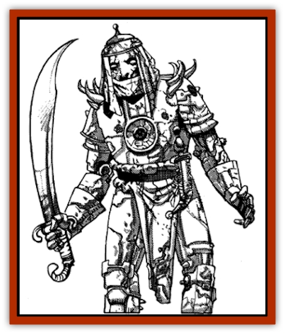

# Copper Automaton

| Statistic | **Copper Automaton** |
| --- | --- |
| **Activity Cycle:** | Any |
| **Alignment:** | Neutral |
| **Armor Class:** | 3 |
| **Climate/Terrain:** | Ruins |
| **Damage/Attack:** | 1-6/1-6 or 2-12/2-12 |
| **Diet:** | None |
| **Frequency:** | Very rare |
| **Hit Dice:** | 6 |
| **Intelligence:** | Low (5-7) |
| **Magic Resistance:** | Nil |
| **Morale:** | Fearless (20) |
| **Movement:** | 9 |
| **No. Appearing:** | 1 (90%) or 3-18 (10%) |
| **No. of Attacks:** | 2 |
| **Organization:** | Solitary |
| **Size:** | M |
| **Special Attacks:** | Heat |
| **Special Defenses:** | Spell immunities |
| **THAC0:** | 15 |
| **Treasure:** | Nil |
| **XP Value:** | 650 |

Copper automatons are magical statues of copper and bronze with hidden weights, levers, and clockwork gears, all of which are held together by enchantments that cause them to move and attack under particular circumstances.

Copper automatons are the results of artifice and skill, and as such, these human figures of copper, iron, and bronze reflect the whims and preferences of their makers. Some are tall and longlegged, others short and stocky, but all share the same blank eyes and corroding surfaces. Their metal plates are sometimes embellished with silver or golden inlays. They are usually sculpted to resemble warriors in armor, but they may just as easily look like nobles, peasants, or even humanoid monsters.

Slow but limber, their movements are regulated by the orders given to them by their creators. Their mechanical limbs respond quickly and powerfully, and their articulation is almost as good as a human's - their fingers can grasp, their waists can bend, and their walk is even, if not as fast as a human's.

**Combat:** Copper automatons attack with their fists, which normally strike twice for 1d6 points of clubbing damage. After a single round of combat, however, their fists glow from internal heat and their stunningly powerful blows now also do burning damage for a total of 2d6 points of damage per strike. Creatures immune to heat continue to suffer only 1d6 from the force of the blows themselves.

Copper automatons are capable of handling weapons, and some powerful creators give their copper automatons magical weaponry to use in combat. These are almost always matched sets of scimitars, daggers, maces or small axes. They may make two attacks per round with these weapons without penalty, though the attacks cannot be split among opponents. They can heat iron weapons to a red-hot glow in two rounds; for the first two rounds their weapons do normal damage, but each round thereafter they add an additional 1d6 damage to each blow.

Copper automatons can only be healed through repair of their metal components and the replenishment of their enchantments. A wizard and a smith working together can heal a copper automaton of 1d8 points of damage per day. If an automaton is ever brought to 0 hp, it cannot be rebuilt, except from scratch.

**Habitat/Society:** Copper automatons are the creations of wizards and artificers and are intricate, clocklike gearworks interwoven with magic spells to create creatures more mobile and less awkward than golems. They are often used as slave labor in smithies, construction projects, and water works, though the magically-armed ones often act as guardians for valuables left in wizards' homes while they travel the world. Their sleepless, untiring, uncomplaining labor can bring wonders into existence in short periods of time or in unlikely places. Palaces in the desert, cleared and carefully tended plots in the jungle, or terraced gardens in the mountains built and tended by copper automatons have all been reported by travelers.

The secret of creating copper automatons is known to only a few, and they are reluctant to share their knowledge. It requires a mage of at least 9th level and a minimum of 10,000 gp to create a copper automaton. The process takes at least two months and involves the use of magma, copper ore, iron gears and lead counterweights, and at least a single diamond as the source of the copper automaton's magical heat channels. In addition to the purely physical framework, magical ingredients are required to weave the needed enchantments around this physical chassis. These additional requirements include *oil of slipperiness* (for the gears) and the blood of a [[Elemental_Fire_Kin|salamander]] or [[Elemental_Fire_Kin|fire snake]] - even when they are available, the price of these ingredients varies from dear to exorbitant, and this expense may double the cost of an automaton for a mage unable to produce or obtain the ingredients himself.

**Ecology:** Copper automatons require no food, no rest, and no external energy source. They are entirely unnatural creatures and have no role in natural ecologies.

The secret of creating copper automatons is said to have been granted to human mages by the efreet, who hoped that they could in time take control of the automatons to establish their own rulership of human lands. The seclusion of copper automatons from most civilized places has negated this plan.

---
## Discovery & Documentation

**Source Publication:** MC13 Al-Qadim Appendix (1992)
**Campaign Setting:** Al-Qadim (Forgotten Realms)
**Author(s):** C. Terry Phillips

### Other Creatures Found in This Source Book
   * [[Ammut|Ammut]]
   * [[Ashira|Ashira]]
   * [[Asuras|Asuras]]
   * [[Black_Cloud_of_Vengeance|Black Cloud of Vengeance]]
   * [[Buraq|Buraq]]
   * [[Camel|Camel]]
   * [[Camel_of_the_Pearl|Camel of the Pearl]]
   * [[Centaur_Desert|Centaur, Desert]]
   * [[Debbi|Debbi]]
   * [[Elephant_Bird|Elephant Bird]]
   * [[Gen|Gen]]
   * [[Genie_Noble_Dao|Genie, Noble Dao]]
   * [[Genie_Noble_Djinni|Genie, Noble Djinni]]
   * [[Genie_Noble_Efreeti|Genie, Noble Efreeti]]
   * [[Genie_Noble_Marid|Genie, Noble Marid]]
   * [[Genie_Tasked_Architect_Builder|Genie, Tasked, Architect/Builder]]
   * [[Genie_Tasked_Artist|Genie, Tasked, Artist]]
   * [[Genie_Tasked_Guardian|Genie, Tasked, Guardian]]
   * [[Genie_Tasked_Herdsman|Genie, Tasked, Herdsman]]
   * [[Genie_Tasked_Slayer|Genie, Tasked, Slayer]]
   * [[Genie_Tasked_Warmonger|Genie, Tasked, Warmonger]]
   * [[Genie_Tasked_Winemaker|Genie, Tasked, Winemaker]]
   * [[Ghost_Mount|Ghost Mount]]
   * [[Ghul|Ghul]]
   * [[Giant_Desert|Giant, Desert]]
   * [[Giant_Jungle|Giant, Jungle]]
   * [[Giant_Reef|Giant, Reef]]
   * [[Giant_Zakhara_General_Information|Giant (Zakhara), General Information]]
   * [[Hama|Hama]]
   * [[Heway|Heway]]
   * [[Living_Idol|Living Idol]]
   * [[Lycanthrope_Werehyena|Lycanthrope, Werehyena]]
   * [[Lycanthrope_Werelion|Lycanthrope, Werelion]]
   * [[Markeen|Markeen]]
   * [[Maskhi|Maskhi]]
   * [[Mason_Wasp_Giant|Mason Wasp, Giant]]
   * [[Nasnas|Nasnas]]
   * [[Pahari|Pahari]]
   * [[Rom|Rom]]
   * [[Sabu_Lord|Sabu Lord]]
   * [[Sakina|Sakina]]
   * [[Serpent_Lord|Serpent Lord]]
   * [[Serpent_Winged|Serpent, Winged]]
   * [[Silat|Silat]]
   * [[Simurgh|Simurgh]]
   * [[Stone_Maiden|Stone Maiden]]
   * [[Vishap|Vishap]]
   * [[Zaratan|Zaratan]]
   * [[Zin|Zin]]
