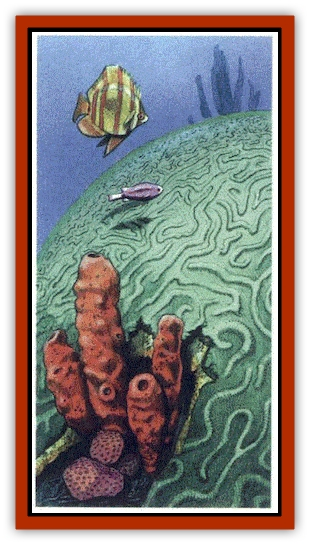

# Coral

| Statistic | **Brain Coral** | **Coral Worm** |
| --- | --- | --- |
| **Activity Cycle:** | Any | Any |
| **Alignment:** | Neutral | Neutral |
| **Armor Class:** | 5 (10 polyp) | 0 (8 polyp) |
| **Climate/Terrain:** | Tropical tidal zone | Deep coastal water |
| **Damage/Attack:** | Nil | 1d4 per HD |
| **Diet:** | Omnivore | Carnivore |
| **Frequency:** | Very rare | Very rare |
| **Hit Dice:** | 3 | 3 to 8 |
| **Intelligence:** | Exceptional (16) | Animal (1) |
| **Magic Resistance:** | Nil | Nil |
| **Morale:** | Nil | Steady (11-12) |
| **Movement:** | Nil | See below |
| **No. Appearing:** | 1 | 10-100 |
| **No. of Attacks:** | 1 | 1 |
| **Organization:** | Solitary | Colony |
| **Size:** | S (2' diameter) | L to H (7' to 20' long) |
| **Special Attacks:** | Psionics, poison | Nil |
| **Special Defenses:** | Psionics | Razor edges, retreat |
| **THAC0:** | Nil | 17 (3-4 HD) / 15 (5-6 HD) / 13 (7-8 HD) |
| **Treasure:** | Incidental | (C) |
| **XP Value:** | 175 | 270 to 2,000 |

Coral is the calcium-based exoskeleton of soft-bodied sea creatures, called polyps, that anchor themselves to the sea floor and filter their food from the sea water with a cluster of tiny tentacles. The coral branches prevent the polyps from being eaten by other sea life, providing a tough outer shell into which the vulnerable polyp can withdraw when threatened.

Common coral generally poses few hazards to the careful, the main dangers being cuts that attract aggressive predators, poison (certain species only), and damage to ships that collide with coral reefs. Coral will form mainly in tropical seas; near shorelines, islands, and submerged volcanoes.

## Brain Coral

  **Psionics Summary**

| Level | Dis/Sci/Dev | Attack/Defense | Score | PSPs |
| --- | --- | --- | --- | --- |
| 3 | 3/3/7 | EW,II/MBk,TS | 18 | 50 |

**Telepathy -** *Sciences:* domination, mind link; *Devotions:* contact, ESP, ego whip, invisibility, id insinuation.

**Psychometabolism -** *Sciences:* nil; *Devotion:* cell adjustment.

**Psychokinesis -** *Science:* telekinesis; *Devotion:* ballistic attack.

Brain coral is convoluted and ridged so that it resembles a human brain. Like its simpler cousins, it is found in warm tidal zones to a depth of 1,000 feet. Usually, it lives in a coral reef or atoll, where the feeding is easier. Brain corals are yellow, brown, or olive in color. If removed from the water, the coral turns bone white.

The calcium exoskeleton is Armor Class 5. This takes damage equal to the total hit points of the polyp before fracturing enough to allow an attacker to get to the Armor Class 10 polyp inside. Slashing and piercing weapons inflict only half damage on the throughout the exoskeleton attack any flesh that comes into contact with the brain coral. These inject a weak neurotoxin; the victim must make a successful saving throw vs. poison at a +4 bonus or be paralyzed for 1d10 rounds.

The brain coral colony is psionic, having the attack mode of *ego whip* and *id insinuation* and defense modes *mind blank* and *thought shield*. It has two or more of the following telepathic powers: *domination*, *mindlink* (animal telepathy only), *contact*, *ESP*, *invisibility*, and possibly the psychometabolic devotion *cell adjustment* as well. The colony has a 25% chance for psychokinetic powers and, if so, has the science *telekinesis* and devotion *ballistic attack*. If a brain coral with *telekinesis* is attacked, it can use the power to move attackers away from the area, or use *ballistic attack* to batter one intruder with underwater debris for 1d6 points of damage per round. A brain coral with *ESP* may attempt to read the minds of any visitors.

## Coral Worm

  The tube of the coral worm ranges from 2 feet to 8 feet in diameter, stands from 2 feet to 20 feet tall, and looks like the precious pink, red-orange, or white variety. The [[Worm|worm]] itself has a long, black, [[Slug_Giant|slug]]like body that exactly fits the diameter of the coral tube.

When prey approaches the coral reef, the worms dart out to their full length to attack the prey. Their mouths are lined with rough, bony plates able to grind coral or bite through a ship hull or armor. Their damage is based on their size, 1d4 per Hit Die, so a 4 HD creature inflicts 4d4 points of damage. If threatened, the coral worm can retreat into its tube, safe from all but the most persistent predator. Coral worms attack most creatures, but some types of lampreys and eels live with them and feed upon the scraps they leave.

The coral worm's tube is covered with razor sharp ridges, 4 to 6 inches high and running several feet. Anyone coming into contact with these suffers 1d10 points of damage. The inside surface of the coral tube is pearly smooth.Coral worms might abandon their protective coral (where they are AC 0) to attack boats or swimmers. They move slowly (MV 3) and are only AC 8 when exposed.The coral tubes have no monetary value, but in a marine environment they are invaluable natural dwellings used by many creatures after the original worm has abandoned them.

---
## Discovery & Documentation

**Source Publication:** Monstrous Compendium, 1997 Annual, Volume 4 (1995)
**Campaign Setting:** Advanced Dungeons & Dragons 2nd Edition
**Author(s):** Jon Pickens

### Other Creatures Found in This Source Book
   * [[Anemone_Giant_Sea|Anemone, Giant Sea]]
   * [[Asperii|Asperii]]
   * [[Bainligor|Bainligor]]
   * [[Beast_of_Chaos|Beast of Chaos]]
   * [[Blindheim|Blindheim]]
   * [[Bloodsipper_Far_Realm|Bloodsipper (Far Realm)]]
   * [[Bulette_Gohlbrorn|Bulette, Gohlbrorn]]
   * [[Child_of_the_Sea|Child of the Sea]]
   * [[Clockwork_Horror|Clockwork Horror]]
   * [[Clockwork_Swordsman|Clockwork Swordsman]]
   * [[Darklore|Darklore]]
   * [[Dharculus|Dharculus]]
   * [[Dolphin_Athas|Dolphin (Athas)]]
   * [[Dragon_Neutral_Moonstone|Dragon, Neutral, Moonstone]]
   * [[Dragon_Prismatic|Dragon, Prismatic]]
   * [[Dream_Stalker|Dream Stalker]]
   * [[Dragon-kin_Albino_Wyrm|Dragon-kin, Albino Wyrm]]
   * [[Echyan|Echyan]]
   * [[Firestar|Firestar]]
   * [[Firetail|Firetail]]
   * [[Fish_Ascallion|Fish, Ascallion]]
   * [[Fish_Deep_Ocean|Fish, Deep Ocean]]
   * [[Fish_Tropical|Fish, Tropical]]
   * [[Fish_Vurgens|Fish, Vurgens]]
   * [[Fogwarden|Fogwarden]]
   * [[Fraal|Fraal]]
   * [[Giant_Crag|Giant, Crag]]
   * [[Gibberling_Brood|Gibberling, Brood]]
   * [[Glutton_Sea|Glutton, Sea]]
   * [[Golden_Ammonite|Golden Ammonite]]
   * [[Golem_Brass_Minotaur|Golem, Brass Minotaur]]
   * [[Golem_Gemstone|Golem, Gemstone]]
   * [[Golem_Maggot|Golem, Maggot]]
   * [[Groundling|Groundling]]
   * [[Hermit_Sea|Hermit, Sea]]
   * [[Hound_of_Law|Hound of Law]]
   * [[Human_Amazon|Human, Amazon]]
   * [[Human_Pygmy|Human, Pygmy]]
   * [[Inquisitor|Inquisitor]]
   * [[Kercpa|Kercpa]]
   * [[Kreel|Kreel]]
   * [[Lycanthrope_Lythari|Lycanthrope, Lythari]]
   * [[Mercurial|Mercurial]]
   * [[Mold_Chromatic|Mold, Chromatic]]
   * [[Mummy_Bog|Mummy, Bog]]
   * [[Neh-thalggu|Neh-thalggu]]
   * [[Nymph_Grain|Nymph, Grain]]
   * [[Nymph_Unseelie|Nymph, Unseelie]]
   * [[Octopus_Octo-Jelly|Octopus, Octo-Jelly]]
   * [[Puddingfish|Puddingfish]]
   * [[Sea_Demon|Sea Demon]]
   * [[Shade|Shade]]
   * [[Shadowrath|Shadowrath]]
   * [[Shark_Athas|Shark (Athas)]]
   * [[Siren_Ravenloft|Siren (Ravenloft)]]
   * [[Skeleton_Variant|Skeleton, Variant]]
   * [[Skyfish|Skyfish]]
   * [[Spectral_Scion|Spectral Scion]]
   * [[Spyder_Fiend|Spyder Fiend]]
   * [[Squid_Squark|Squid, Squark]]
   * [[Tanar'ri_Lesser_Uridezu|Tanar'ri, Lesser, Uridezu]]
   * [[Troll_Mutate|Troll Mutate]]
   * [[Vaati|Vaati]]
   * [[Vampire_Cerebral|Vampire, Cerebral]]
   * [[Varkha|Varkha]]
   * [[Wizshade|Wizshade]]
   * [[Worm_Lukhorn|Worm, Lukhorn]]
   * [[Wyste|Wyste]]
   * [[Yugoloth_Lesser_Gacholoth|Yugoloth, Lesser, Gacholoth]]
   * [[Zombie_Mud|Zombie, Mud]]
