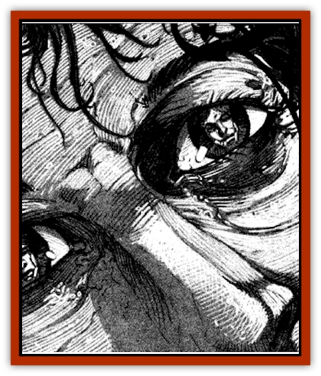

# Corpse Candle

| Statistic | **Corpse Candle** |
| --- | --- |
| **Activity Cycle:** | Any |
| **Alignment:** | Chaotic neutral |
| **Armor Class:** | 4 |
| **Climate/Terrain:** | Ravenloft |
| **Damage/Attack:** | 1-6 |
| **Diet:** | None |
| **Frequency:** | Very rare |
| **Hit Dice:** | 6 |
| **Intelligence:** | Average (8) |
| **Magic Resistance:** | Nil |
| **Morale:** | Elite (13-14) |
| **Movement:** | 12, Fl 24 (B) |
| **No. Appearing:** | 1 |
| **No. of Attacks:** | 1 |
| **Organization:** | Solitary |
| **Size:** | M (6' tall) |
| **Special Attacks:** | See below |
| **Special Defenses:** | Spell immunity, +1 or better weapon to hit |
| **THAC0:** | 15 |
| **Treasure:** | Nil |
| **XP Value:** | 1,400 |

The corpse candle is the undead spirit of a murdered man or woman that coerces the living into bringing its killer to justice. Its name comes from the flamelike light that flickers in the eyes of its corpse while the spirit waits for a champion to avenge it.

Corpse candles are both ethereal and invisible creatures. Those who can see such things describe them as vaporous wisps of mist or fog.

The corpse candle cannot speak and can only communicate its desire to have its killer brought to justice by means of a weak mental suggestion that it employs when it selects a champion.

**Combat:** When a corpse candle is first encountered. it appears as a ghostly flame flickering in the eyes of a murdered man or woman. Anyone looking into the eyes of a body that houses a corpse candle must make a saving throw vs. spell at a -3 penalty. Those making their saving throw simply see the flame dim. A failed roll indicates that the adventurer sees the face of the corpse's killer in its flickering eyes.

The sight of this countenance carries with it a terrific spiritual message. The adventurer will suddenly find himself reliving the last few seconds of the corpse's life. He will experience everything that led to the death, but cannot affect this traumatic chain of events in any way. Those accompanying the adventurer will see him toss and turn in agony, howl in rage, or take other actions dictated by the nature of his hallucination.

When this nightmarish experience has passed, the adventurer will remember vividly all that occurred. The face of the killer will be burned into his mind so that it is visible in any open flame, campfire, torch, or lantern. Even smoke will carry the eerie vision of the murderer. These haunting images, while clear to the champion, will be seen by no one else.

If the champion brings the murderer to justice by either tracking him down and killing him or by seeing him judged for his crime, the corpse candle will be set to rest.

If, however, the champion chooses to ignore the visions for more than 1d4 days, the corpse candle will use its power to *affect normal fires* to harry the champion to action. This ability is similar to the 1st level wizard spell, except that the corpse candle can cause small flames to leap distances of up to 10'. It can also enable flames to take on any shape as long as it does not require greatly increasing the size of the original fire. A small candle flame might take the form of a spider and leap onto a drape or bedsheet, setting it aflame. A large bonfire could take the form of a man and momentarily envelop the champion. The corpse candle can only hold such forms for one round and flames cause only 1d6 points of damage. Such flames may, however, set flammable material alight.

Casting *true seeing* will reveal a ghostly image of the dead person sitting astride the champion's shoulders. A *protection from evil* or *negative plane protection* will force the corpse candle away from the champion for the duration of the spell. During such times, the corpse candle cannot cause the champion to see the killer's face, but can use its ability to *affect normal fires* outside the range of the protective spells. A corpse candle can be directly attacked with magic weapons and will retaliate in such situations by using *burning hands* as if cast by a 6th level spellcaster.

Corpse candles can be driven off permanently with spells such as *dispel magic*, *dismissal*, *banishment*, *holy word*, and *wish*. Also, if at any time the corpse candle's killer should die, even accidentally, the spirit will rest in peace. Corpse candles are immune to *sleep*, *charm*, *hold*, and *death* spells as well as cold-based spells, poison, and paralyzation. They can be turned as 6th level undead, but will return to their champion as soon as possible. If at any time a *speak with dead* spell is used to communicate with a corpse candle, the spirit can only repeat the name of its killer.

**Habitat/Society:** Corpse candles are found only with their earthly remains. Consequently, they can be encountered in places as varied as tombs and public alleyways.

**Ecology:** Corpse candles fill no natural role in the world. They do, however, satisfy an emotional need so great that it defies even the grave.

---
## Discovery & Documentation

**Source Publication:** Ravenloft Appendix III (1991)
**Campaign Setting:** Ravenloft
**Author(s):** Kirk Botulla

### Other Creatures Found in This Source Book
   * [[Akikage|Akikage]]
   * [[Animator_Common|Animator, Common]]
   * [[Animator_Greater|Animator, Greater]]
   * [[Animator_Minor|Animator, Minor]]
   * [[Animator_General_Information|Animator, General Information]]
   * [[Bakhna_Rakhna|Bakhna Rakhna]]
   * [[Baobhan_Sith|Baobhan Sith]]
   * [[Beetle_Scarab|Beetle, Scarab]]
   * [[Boneless|Boneless]]
   * [[Boowray|Boowray]]
   * [[Bruja|Bruja]]
   * [[Carrionette|Carrionette]]
   * [[Carrion_Stalker|Carrion Stalker]]
   * [[Cat_Midnight|Cat, Midnight]]
   * [[Cat_Skeletal|Cat, Skeletal]]
   * [[Cloaker_Resplendent|Cloaker, Resplendent]]
   * [[Cloaker_Shadow|Cloaker, Shadow]]
   * [[Cloaker_Undead|Cloaker, Undead]]
   * [[Death's_Head_Tree|Death's Head Tree]]
   * [[Doppelganger_Ravenloft|Doppelganger (Ravenloft)]]
   * [[Familiar_Pseudo-|Familiar, Pseudo-]]
   * [[Familiar_Undead|Familiar, Undead]]
   * [[Feathered_Serpent|Feathered Serpent]]
   * [[Fenhound|Fenhound]]
   * [[Figurine_Ceramic|Figurine, Ceramic]]
   * [[Figurine_Crystal|Figurine, Crystal]]
   * [[Figurine_Ivory|Figurine, Ivory]]
   * [[Figurine_Obsidian|Figurine, Obsidian]]
   * [[Figurine_Porcelain|Figurine, Porcelain]]
   * [[Figurine_General_Information|Figurine, General Information]]
   * [[Fleas_of_Madness|Fleas of Madness]]
   * [[Furies|Furies]]
   * [[Geist|Geist]]
   * [[Ghost_Animal|Ghost, Animal]]
   * [[Golem_Flesh_Ravenloft|Golem, Flesh (Ravenloft)]]
   * [[Golem_Mist_Ravenloft|Golem, Mist (Ravenloft)]]
   * [[Golem_Wax_Ravenloft|Golem, Wax (Ravenloft)]]
   * [[Gremishka|Gremishka]]
   * [[Hag_Spectral|Hag, Spectral]]
   * [[Head_Hunter|Head Hunter]]
   * [[Hearth_Fiend|Hearth Fiend]]
   * [[Hebi-No-Onna|Hebi-No-Onna]]
   * [[Hound_Phantom|Hound, Phantom]]
   * [[Hound_Skeletal|Hound, Skeletal]]
   * [[Imp_Wishing|Imp, Wishing]]
   * [[Ivy_Crawling|Ivy, Crawling]]
   * [[Jack_Frost|Jack Frost]]
   * [[Jolly_Roger|Jolly Roger]]
   * [[Kizoku|Kizoku]]
   * [[Lashweed|Lashweed]]
   * [[Leech_Magical|Leech, Magical]]
   * [[Leech_Psionic|Leech, Psionic]]
   * [[Lich_Defiler|Lich, Defiler]]
   * [[Lich_Drow|Lich, Drow]]
   * [[Lich_Elemental|Lich, Elemental]]
   * [[Lich_Psionic|Lich, Psionic]]
   * [[Living_Tattoo|Living Tattoo]]
   * [[Lycanthrope_Loup-garou|Lycanthrope, Loup-garou]]
   * [[Lycanthrope_Werejackal|Lycanthrope, Werejackal]]
   * [[Lycanthrope_Werejaguar_Ravenloft|Lycanthrope, Werejaguar (Ravenloft)]]
   * [[Lycanthrope_Wereleopard|Lycanthrope, Wereleopard]]
   * [[Lycanthrope_Wereray|Lycanthrope, Wereray]]
   * [[Mist_Ferryman|Mist Ferryman]]
   * [[Moor_Man|Moor Man]]
   * [[Obedient|Obedient]]
   * [[Odem|Odem]]
   * [[Paka|Paka]]
   * [[Plant_Blood_Rose|Plant, Blood Rose]]
   * [[Plant_Fearweed|Plant, Fearweed]]
   * [[Radiant_Spirit|Radiant Spirit]]
   * [[Recluse|Recluse]]
   * [[Remnant_Aquatic|Remnant, Aquatic]]
   * [[Rushlight|Rushlight]]
   * [[Sea_Spawn_Master|Sea Spawn, Master]]
   * [[Sea_Spawn_Minion|Sea Spawn, Minion]]
   * [[Shadow_Asp|Shadow Asp]]
   * [[Shattered_Brethren|Shattered Brethren]]
   * [[Skeleton_Archer|Skeleton, Archer]]
   * [[Skeleton_Insectoid|Skeleton, Insectoid]]
   * [[Skin_Thief|Skin Thief]]
   * [[Spirit_Psionic|Spirit, Psionic]]
   * [[Strahd_Skeleton|Strahd Skeleton]]
   * [[Strahd_Zombie|Strahd Zombie]]
   * [[Unicorn_Shadow|Unicorn, Shadow]]
   * [[Vampire_Drow|Vampire, Drow]]
   * [[Vampire_Nosferatu|Vampire, Nosferatu]]
   * [[Vampire_Oriental|Vampire, Oriental]]
   * [[Virus_General_Information|Virus, General Information]]
   * [[Virus_I|Virus I]]
   * [[Virus_II|Virus II]]
   * [[Virus_III|Virus III]]
   * [[Vorlog|Vorlog]]
   * [[Will_O'Dawn|Will O'Dawn]]
   * [[Will_O'Deep|Will O'Deep]]
   * [[Will_O'Mist|Will O'Mist]]
   * [[Will_O'Sea|Will O'Sea]]
   * [[Zombie_Cannibal|Zombie, Cannibal]]
   * [[Zombie_Desert|Zombie, Desert]]
   * [[Zombie_Wolf|Zombie Wolf]]
   * [[Zombie_Fog|Zombie Fog]]
