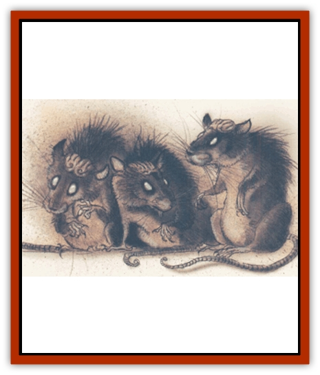

# Cranium Rat

| Statistic | **Cranium Rat** |
| --- | --- |
| **Activity Cycle:** | Darkness |
| **Alignment:** | Neutral evil |
| **Armor Class:** | 6 |
| **Climate/Terrain:** | Outer Planes |
| **Damage/Attack:** | 1d4 |
| **Diet:** | Scavenger |
| **Frequency:** | Uncommon to very rare |
| **Hit Dice:** | 1 |
| **Intelligence:** | Low to supragenius (5-20 |
| **Magic Resistance:** | Varies |
| **Morale:** | Unsteady (7) |
| **Movement:** | 15 |
| **No. Appearing:** | 2d10 |
| **No. of Attacks:** | 1 |
| **Organization:** | Pack |
| **Size:** | T (6&rdquo; long) |
| **Special Attacks:** | See below |
| **Special Defenses:** | See below |
| **THAC0:** | 19 |
| **Treasure:** | None |
| **XP Value:** | 65 |

The following passage is taken from the dreams of Bilfar the Diviner, who believed that secrets fled their sleeping masters every night:

"A small, crawling form itched into the back of my brain, and I dreamed of its words. My dreams had caught the secrets of one called vishkar, and it said:

"*Fear me. Fear my coming. What others know of me is a mask that hides my true might. They think I am vermin, those rats whose brains pulsate with bilious light. They do not know I see through the thousand eyes of my body. My body lives among them, and they do not see me*

"Upon waking I had the image of the cranium rat, commonly seen in the dark corners of pestilent villages, locked into my mind. But my dream was this creature, and yet it was not. Perhaps I will dream it again."

Indeed he did dream it again, but Bilfar hever lived to publish his stolen secrets. A month after he penned these words, he was dead. Perhaps his dresms caught another, darker secret, for his servant found him one morning, bled dry from a hundred tiny wounds.

**Combat:** While dangerous and unpleasant, the cranium [[Rat|rat]] is not an aggressive creature. Like most vermin, it avoids open attacks in favor of flight or ambushes. Indeed, in the latter action the cranium rat shows a cunning skill.

Cranium rats usually move in packs of ten or more. They hide in garbage or the crack of a wall until a victim ventures close and then swarm out and strike, but even then they won't fight for long. If the victim cannot be slain or crippled in a just a few rounds, they break off and scatter in all directions, making pursuit almost impossible. Still, these actions are no different than those of most other vermin, and they are not what make the cranium rat truly dangerous. It is the slight mental prowess of these creatures that makes them truly menacing.

Individually, these creatures are little more than clever vermin, but cranium rats are seldom encountered singly. They're many creatures and one creature all at once, as they possess a type of group mind. A cranium rat is automatically in telepathic contact with every other such creature within 10 feet, which allows them to share not just thoughts, but also brain capacity - every five rats in contact generate 1 point of Intelligence. Thus, one to four rats have no more than animal intelligence (1 point). Add another rat and the group becomes semi-intelligent (2 points). Fifty rats in a single area have the intelligence of an average person (10), while 100 rats in close quarters would be frightening (20 Intelligence)! Theoretically there is no upper limit to the group mind, but no packs have been found with an Intelligence higher than 20 or so. Perhaps with overpopulation comes metaphysical insight, such that these creatures ascend to a higher level of existence. Or perhaps overpopulation brings about a sudden decrease in their numbers.

| Intelligence | Ability |
| --- | --- |
| 1-6 | Standard |
| 7 | 1 spell level of wizard spells |
| 8 | 2 spell levels of wizard spells |
| 9 | Mind blast, 1/3 rounds |
| 10 | 3 spell levels of wizard spells |
| 11 | 4 spell levels of wizard spells |
| 12 | Mind blast, 1/2 rounds |
| 13 | 5 spell levels of wizard spells |
| 14 | 6 spell levels of wizard spells |
| 15 | Mind blast, every round |
| 16 | Immune to gases |
| 17 | Immune to cold |
| 18 | 10% magic resistance |
| 19 | 40% magic resistance |
| 20 | 70% magic resistance |

The group mind also confers several defensive advantages upon the creatures. First, when calculating damage from area-affecting spells, treat the Hit Dice of the communal creature as a pool. For example, casting an 8-HD firesball at a horde of 30 rats destroys just eight of them if the saving throw is failed. If the save is successful, only four (half damage) rats are destroyed. In other words, ignore the individual hit points of the rats for area effects. Second, the rats save as if they are a creature of as many Hit Dice as their Intelligence. In the example above, 30 rats have a 6 Intelligence, so the horde saves as a 6-HD creature.

The communal nature of their Intelligence is also the cranium rats' weakness. When members of a pack are killed or scattered, the Intelligence of the pack immediately drops, and the pack loses any special powers attributable to the communal mind. The communal mind, however, is highly resistant to mental attacks. A pack with an Intelligence of 5 or higher is immune to *sleep* spells (by virtue of its effective Hit Dice). The pack acts quickly to break its telepathic link with rats that have fallen under another creature's control. Consequently, spells such as *suggestion* and *charm monster* affect but a single rat (although the rat gains the benefit of the pack's saving throw).

**Habitat/Society:** So continues Bilfar's notes:

"The vishkar's secrets flee it at night, arriving piecemeal for my studies. Where they come from I cannot tell - there are too many images of too many places - but in all of these them is a common thread. It is a pulsing green vein that is the cord to a master who steals secrets from others. I am forced to guess that the vishkar is an agent of Ilsensine, the great god-brain of the illithids. Vishkar is the eyes and ears of its lord, gathering in all it sees and hears to please that ravenous power. A thousand eyes gather a thousand scenes all at once.

"Curious, I inquired with travelers and caravan masters about the extent of the cranium rat. I myself have seen them in Sigil, and I am told they are not uncommon in the Lower Planes.

"I have seen myself in my own dreams, asking and re-asking these questions. There are also dreams of packs searching me out. Are these the dreams of my mind, or secrets I have captured? Even my philosophies fail me here, but I think precautions are necessary."

**Ecology:** Cranium rats subsist on a diet only slightly more carnivorous than the normal rat. The extent and purpose of their powers are held closely secret, less Ilsensine's instruments be exposed. Those who discover the true purpose of the cranium rats are under sentence of swift and terrible death.

---
## Discovery & Documentation

**Source Publication:** Planescape Campaign Setting (1994)
**Campaign Setting:** Planescape
**Author(s):** David Cook

### Other Creatures Found in This Source Book
   * [[Aleax|Aleax]]
   * [[Astral_Searcher|Astral Searcher]]
   * [[Barghest|Barghest]]
   * [[Bariaur|Bariaur]]
   * [[Dabus|Dabus]]
   * [[Magman|Magman]]
   * [[Minion_of_Set|Minion of Set]]
   * [[Modron|Modron]]
   * [[Nic'Epona|Nic'Epona]]
   * [[Spirit_of_the_Air|Spirit of the Air]]
   * [[Vortex|Vortex]]
   * [[Yugoloth_Lesser_Marraenoloth|Yugoloth, Lesser, Marraenoloth]]
