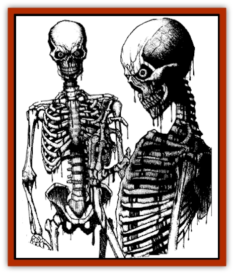

# Crimson Bones

| Statistic | **Crimson Bones** |
| --- | --- |
| **Activity Cycle:** | Night |
| **Alignment:** | Chaotic evil |
| **Armor Class:** | 8 |
| **Climate/Terrain:** | The Shadow Rift |
| **Damage/Attack:** | 1d4 |
| **Diet:** | None |
| **Frequency:** | Uncommon |
| **Hit Dice:** | 1+3 |
| **Intelligence:** | Non- (0) |
| **Magic Resistance:** | Nil |
| **Morale:** | Fearless (20) |
| **Movement:** | 12 |
| **No. Appearing:** | 2d6 |
| **No. of Attacks:** | 1 |
| **Organization:** | Pack |
| **Size:** | M (6' tall) |
| **Special Attacks:** | Blood poisoning |
| **Special Defenses:** | Takes only half-damage from edged weapons |
| **THAC0:** | 19 |
| **Treasure:** | Nil |
| **XP Value:** | 270 |

These gruesome undead monsters are created when a human being (or similar demihuman) is flayed alive by an evil [[Arak_General_Information|Arak]]. Usually, they are created by the ranks of the [[Arak_Powrie|powrie]] and [[Arak_Teg|teg]]. Crimson bones are very much like the common animated [[Skeleton|skeletons]] so often encountered in the Demiplane of Dread. The major difference between the crimson bones and a traditional skeleton, however, is that these unholy creatures constantly drip the rich, dark blood that flowed through their veins in life. Also, crimson bones retain the eyes of living men, not the empty sockets of animated skeletons.

Crimson bones cannot speak or even understand the words of others. They have no intelligence, existing only to kill in wild frenzies of blood and death. Even evil priests cannot master these chaotic undead. Only the [[Changeling_Kin|sithkin]] and the use of certain magical spells, like *control undead*, can direct the actions of these creatures.

**Combat:** Crimson bones attack with speed and agility. While they are too mindless to attack with weapons, their bony fingers can rend flesh as easily a dagger might. Thus, in melee combat they inflict 1d4 points of damage per attack.

Like other undead skeletons, crimson bones are less vulnerable to damage from piercing and slashing weapons. Only bludgeoning attacks have their full effect upon these creatures; all other weapons inflict only half damage.

Whenever a crimson bones is hit with a melee weapon, blood splashes from the creature. An attacker has a 5% chance per point of damage inflicted of being struck by this spray. If this happens, the attacker must make a successful saving throw vs. poison or suffer from advanced blood poisoning. From that point on, he or she suffers one point of damage per round until he or she dies. This tainted blood can be affected by spells like *neutralize poison* and *slow poison*. Once a person's blood has been poisoned, additional exposure has no effect.

Crimson bones have no fear and are never called upon to make morale checks. Like all mindless undead, they are immune to life- and mind-affecting spells like *charm*, *sleep*, or *hold*. By the same token, poisons and disease do not affect these unliving monsters. Crimson bones can be turned as skeletons and suffer 1d4 points of damage if splashed with holy water or touched with a holy symbol.

**Habitat/Society:** These mindless creatures focus only on killing the living and flaying the flesh from their bones. Their only memories center on their terrible deaths and the evil Arak who killed them. Because of this, they attack teg or powrie in preference to other creatures.

Crimson bones move about in packs, hunting the living and seeking only to kill. They are unthinking predators, however, and can be trapped, avoided, or otherwise outsmarted without much difficulty by alert would-be victims.

**Ecology:** These creatures are the risen skeletons of men and women who have been flayed alive by the evil Arak of the Shadow Rift. They are not created purposely, rising spontaneously from the dead filled with hatred of the living and a lust for vengeance.

---
## Discovery & Documentation

**Source Publication:** The Shadow Rift (1998)
**Campaign Setting:** Ravenloft
**Author(s):** William W. Connors, John D. Rateliff, Cindi Rice

### Other Creatures Found in This Source Book
   * [[Arak_General_Information|Arak, General Information]]
   * [[Arak_Alven|Arak, Alven]]
   * [[Arak_Brag|Arak, Brag]]
   * [[Arak_Fir|Arak, Fir]]
   * [[Arak_Muryan|Arak, Muryan]]
   * [[Arak_Portune|Arak, Portune]]
   * [[Arak_Powrie|Arak, Powrie]]
   * [[Arak_Shee|Arak, Shee]]
   * [[Arak_Sith|Arak, Sith]]
   * [[Arak_Teg|Arak, Teg]]
   * [[Avanc|Avanc]]
   * [[Changeling_Kin|Changeling (Kin)]]
   * [[Grim|Grim]]
   * [[Saugh_Dearg-Due|Saugh, Dearg-Due]]
   * [[Saugh_Gossamer|Saugh, Gossamer]]
   * [[Treant_Evil_Blackroot|Treant, Evil (Blackroot)]]
