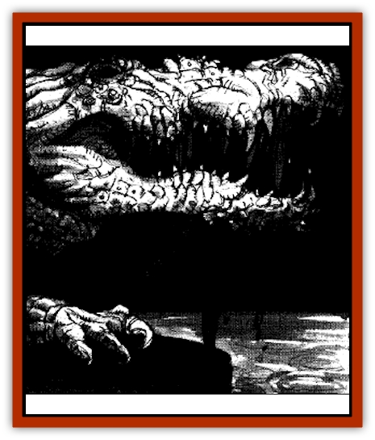

# Crocodile - Albino

| Statistic | **Crocodile, Albino** |
| --- | --- |
| **Activity Cycle:** | Any |
| **Alignment:** | Neutral |
| **Armor Class:** | 5 |
| **Climate/Terrain:** | Sewers |
| **Damage/Attack:** | 2d4/1d6 |
| **Diet:** | Carnivore |
| **Frequency:** | Common |
| **Hit Dice:** | 2+3 |
| **Intelligence:** | Low (5-7) |
| **Magic Resistance:** | See below |
| **Morale:** | Steady (11) |
| **Movement:** | 9, Swim 12 |
| **No. Appearing:** | 1 (10% chance 2d4+1) |
| **No. of Attacks:** | 2 |
| **Organization:** | Solitary (pack) |
| **Size:** | M (4-5' diameter) |
| **Special Attacks:** | Attack with surprise, trip |
| **Special Defenses:** | See below |
| **THAC0:** | 17 |
| **Treasure:** | Nil |
| **XP Value:** | 420 |

Miniature albino [[Crocodile|crocodiles]] are descended from the pets of the master wizard who presided over the school decades ago. After their master was slain, the crocodiles quickly escaped into the sewer. The necromancer made token attempts to hunt them down and slay them out of malice, but he met with little success, and the creatures have thrived over the years. The pollution from the necromancer's experiments has altered the crocodiles subtly, giving them a special resistance to magic.

**Combat:** Albino crocodiles are surprisingly ferocious, and they are nearly equal in strength to the full-sized crocodiles of the outer world. They are notoriously unpredictable and sly, usually finding a way to ambush their prey. In such situations, victims suffer a -3 penalty to surprise rolls. The albino crocodiles have two main attacks, a bite inflicting 2d4 hp damage and a tail slap that causes 1d6 hp damage. Since the latter attack is usually at leg-level for most humanoid opponents, any successful strike against such a foe forces the victim to make a save vs. paralyzation or be tripped and lose all actions for the remainder of the round. The albino crocodile's main power is a total immunity to magic, gained from generations of constant exposure to the magical waste of the sewers. The only spells that can harm them are those that create effects that are not themselves maintained by magic. For example, a *wall of thorns* can harm an albino crocodile, but not a *magic missile* spell. If a *wall of stone* falls on one of these creatures, it suffers harm, but the same monster could walk right through a *wall of force* or a *prismatic sphere* as if those barriers did not exist. While the crocodiles are not very intelligent, they do know that two-legs who cast light from their hands are easy prey, so spellcasters are often targeted by these creatures.

**Habitat/Society:** Albino crocodiles are typically loners, but they sometimes congregate in groups of 3-9 when the pickings are especially good. Ironically, this is when it is safest to encounter them, for they do not attack unless hungry or threatened. When not hunting, albino crocodiles tend to stay near the bottom of a water-filled channel, waiting for new prey or digesting the last.

**Ecology:** Albino crocodiles subsist mainly on rats and other small animals, attacking humans only when very hungry or when attacked.

---
## Discovery & Documentation

**Source Publication:** Dragon238 (1997)
**Campaign Setting:** Dragon Magazine
**Author(s):** John Baichtal, Brian Walton, Tom Baxa

### Other Creatures Found in This Source Book
   * [[Cat_Water|Cat, Water]]
   * [[Lich's_Blood|Lich's Blood]]
   * [[Moth_Plague|Moth, Plague]]
   * [[Mummy_Ice|Mummy, Ice]]
