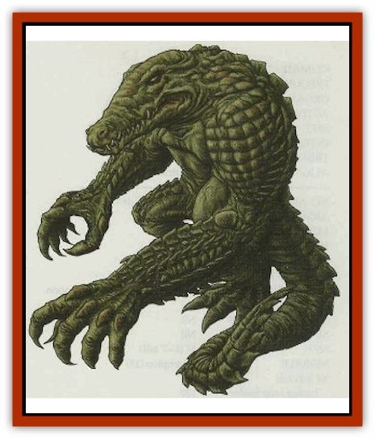

# Crocodilian

| Statistic | **Brute** | **Master** |
| --- | --- | --- |
| **Activity Cycle:** | Any | Any |
| **Alignment:** | Neutral | Chaotic evil |
| **Armor Class:** | 5 | 5 |
| **Climate/Terrain:** | River beds | Temples, cities |
| **Damage/Attack:** | 2-8/1-12 or by weapon | 2-8 or by weapon |
| **Diet:** | Carnivore | Carnivore |
| **Frequency:** | Very rare | Very rare |
| **Hit Dice:** | 5 | 3+2 |
| **Intelligence:** | Low (5-7) | Very (11-12) |
| **Magic Resistance:** | Nil | Nil |
| **Morale:** | Elite (14) | Elite (14) |
| **Movement:** | 9, swim 12 | 9, swim 12 |
| **No. Appearing:** | 1 or 2-7 | 1 or 2-7 |
| **No. of Attacks:** | 2 | 1 |
| **Organization:** | Solitary or tribe | Solitary or tribe |
| **Size:** | L (8' tall) | M (6-7' tall) |
| **Special Attacks:** | Nil | Spell casting |
| **Special Defenses:** | Nil | Spell casting |
| **THAC0:** | 15 | 17 |
| **Treasure:** | D | K |
| **XP Value:** | 175 | 270 / High priest: 420 |

Crocodilians (see also: [[Lizard_Man|Lizard Man]]) are much like [[Agrutha|agrutha]] except they are larger and even more ferocious. Full-grown crocodilians can reach up to 15 feet in length from nose to tail tip.

**Combat:** Crocodilians fight with long jaws and sledgehammer tails. Some use weapons, but these are always taken from or traded with others, as their natural weaponry is formidable. If they wield weapons, they are usually large - two-handed swords, halberds, or battle-axes. A crocodilian with weapon in hand can bite or tail strike in the same round, but not both. Brute Crocodilians have Strengths of 18/76-18/00. A few (10%) have Strength 19.

**Habitat/Society:** Crocodilians are more solitary than their alligator brethren. While agrutha live in groups, Crocodilians tend to stay away from each other. If they meet, they are likely to fight for dominance. Crocodilians sometimes build mud-and-straw huts but are just as likely to live in the water with whatever regular [[Crocodile|crocodiles]] are in the area. They hunt wherever other crocodiles might be found.

Crocodilians congregate in small tribes if near a large number of crocodiles, the hunting is good, or a strong leader appears. Such Crocodilians live in a small hut village, abandoned buildings near the water, or underwater caverns. There is a 50% chance that 1-4 giant crocodiles live near them, too.

Though short-tempered and frightening in battle, they are more likely to talk with humans and demihumans than agrutha are (unless, of course, they are very hungry). While not terribly bright, Crocodilians consider themselves the equal of other sentient races and might exchange goods or information.

Crocodilians are highly territorial, though, and it is not a good idea to invade their hunting grounds without their consent.

**Ecology:** Brute crocodilians have little to fear from others. They eat meat and are big enough to take down much any prey they desire. Crocodilian females ly eggs once a year during the wet season.

**Master Crocodilians**

  The masters (as they refer to themselves) are smaller, evil versions of Crocodilians. They take malicious glee in killing and eating humans. They fill their days and nights with mirth borne of vile acts, laughing incessantly with guttural chuckles. The masters retain their crocodilian jaws, but their tails are shorter (oniy 2-3 feet long) and cause no damage. Masters typically fight with weapons and make up for their small size with spellcasting ability. They are all at least 5th-level priests of Set, Anubis, or another evil deity.

Masters typically set themselves up in the sewers or a hidden temple in a large city where they can hatch their loathsome plans. While solitary by nature, they sometimes congregate in small sects. If there are five or more masters together, one of them is a high priest who has been granted 7th-level spellcasting ability and the physical size and combat ability of a brute. Brute Crocodilians do not like the masters, but the latter have a knack for manipulating the brutes. Master Crocodilians enjoy the company of [[Mummy|mummies]], [[Jackalwere|jackalweres]], and [[Naga|spirit nagas]]. They often have a pit of normal or giant crocodiles in the depths of their lairs for sacrificing victims.

Master Crocodilians are scholars of history, religion, and evil magic. On the other hand, they never learn the spoken languages of warm-blooded sentients. To their ears, human speech is nothing more than the bleating of sheep.

---
## Discovery & Documentation

**Source Publication:** Dragon268 (2000)
**Campaign Setting:** Dragon Magazine
**Author(s):** Michael Kuciak, Pete Venters

### Other Creatures Found in This Source Book
   * [[Agrutha|Agrutha]]
   * [[Geckonid|Geckonid]]
   * [[Varanid|Varanid]]
