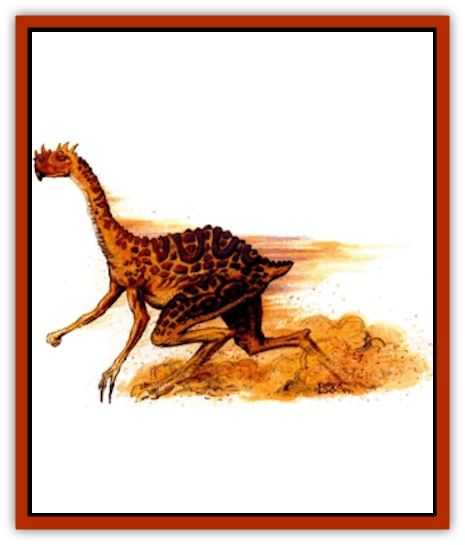

# Crodlu

| Statistic | **Heavy** | **Normal** |
| --- | --- | --- |
| **Activity Cycle:** | Day | Day |
| **Alignment:** | Neutral | Neutral |
| **Armor Class:** | 4 | 4 |
| **Climate/Terrain:** | Sandy wastes, stony barrens | Desert, scrub plains |
| **Damage/Attack:** | 1d6/1d6/1d10/1d8/1d8 | 1d4/1d4/1d8/1d6/1d6 |
| **Diet:** | Herbivore | Herbivore |
| **Frequency:** | Rare | Common |
| **Hit Dice:** | 6+6 | 4+4 |
| **Intelligence:** | Animal (1) | Animal (1) |
| **Magic Resistance:** | Nil | Nil |
| **Morale:** | Steady (11) | Steady (11) |
| **Movement:** | 18 | 24 |
| **No. Appearing:** | 1-6 (1d6) | 5-30 (5d6) |
| **No. of Attacks:** | 5 | 5 |
| **Organization:** | Herd | Herd |
| **Size:** | L (12'+ tall) | L (10'+ tall) |
| **Special Attacks:** | Ram | Grapple |
| **Special Defenses:** | Nil | Nil |
| **THAC0:** | 13 | 15 |
| **Treasure:** | Nil | Nil |
| **XP Value:** | 2,000 | 420 |

Crodlu are large reptiles that roam the deserts and scrublands of Athas in herds. Easily domesticated, they are widely used for transportation or as beasts of burden, particularly by merchant houses.

Crodlu resemble large [[Bird_Toril|ostriches]], but their forearms end in wicked claws and their tough, scaly hides are yellow to red, with other colors along their sides and belly. They have poor eyesight and an excellent sense of smell. They can run at high speed for long periods of time.

**Combat:** Crodlu attack with their hind legs (1d6 points of damage each), their forearms (1d4 points of damage each), and bite (1d8 points of damage, 1d4 for chicks). If both forearms hit, the crodlu has grappled its opponent, allowing an automatic bite that causes double damage.

**Habitat/Society:** A crodlu herd averages 30 members. The herd leader is a male with 6 HD and AC 3. Crodlu chicks can be trained as mounts. Captured adults, except leaders, have a 10% chance of being trained.

**Ecology:** Each female lays one egg each year. The chicks are able to run and fight within minutes. Crodlu eat anything.

## Heavy Crodlu

Heavy crodlu are a specially bred type of crodlu with better scales for protection of their upper body and head. They have sharp claws on their forearms that may be filed to a point or may be augmented with glass or metal blades.

**Combat:** A heavy crodlu attacks with hind claws (1d8 points of damage each), the forearms (1d6 points of damage each), and bite (1d10 points of damage). It can use its ramming attack if it is alone or carrying a rider, but it needs 60 feet of clear space between itself and its target. The ramming inflicts 3-24 (3d8) points of damage. If it misses, the crodlu runs for its full movement or until it hits something. If it hits an immovable object, the crodlu receives 1-10 (1d10) points of damage from its own momentum.

A heavy crodlu often has forearm blades and body armor. Blade attacks cause 2-7 points of damage. Cloth armor (AC 3) costs 20 cp, partial leather (AC 2) costs 55 cp (30 pounds), and full leather (AC 1) costs 130 cp (100 pounds).

**Habitat/Society:** Heavy crodlu live in pens or as part of a caravan or war party. In battle, heavy crodlu must be kept away from regular crodlu or they might attack each other.

**Ecology:** Domesticated heavy crodlu breed as their owners allow. Wild specimens crossbreed with their herds, producing smaller offspring that, after a few generations, cannot be told apart from the standard crodlu.

Both crodlu are affected by any load they are carrying and do not move if loaded beyond their limits, as indicated in the table below.

| Burden | CrodluWeight | Movement | HeavyCrodluWeight | Movement |
| --- | --- | --- | --- | --- |
| Light | 0-90 | 24 | 0-240 | 18 |
| Medium | 91-180 | 18 | 241-360 | 12 |
| Heavy | 181-270 | 12 | 361-450 | 8 |
| Very heavy | 271-360 | 6 | 451-600 | 6 |

---
## Discovery & Documentation

**Source Publication:** Dark Sun Appendix II - Terrors Beyond Tyr (1991)
**Campaign Setting:** Dark Sun
**Author(s):** Jim Atkiss, Steve Brown, Timothy B. Brown, Andrew P. Morris, Bruce Nesmith, Wes Nicholson, Bill Slavicsek

### Other Creatures Found in This Source Book
   * [[Aarakocra_Athas|Aarakocra (Athas)]]
   * [[Animal_Domestic_Athas_II|Animal, Domestic (Athas) II]]
   * [[Aviarag|Aviarag]]
   * [[Baazrag|Baazrag]]
   * [[Baazrag_Boneclaw|Baazrag, Boneclaw]]
   * [[Bloodgrass|Bloodgrass]]
   * [[Cactus_Hunting|Cactus, Hunting]]
   * [[Cactus_Rock|Cactus, Rock]]
   * [[Cilops|Cilops]]
   * [[Dagorran|Dagorran]]
   * [[Dhaot|Dhaot]]
   * [[Drake_Lesser_Athas_General_Information|Drake, Lesser (Athas), General Information]]
   * [[Drake_Lesser_Athas_Magma|Drake, Lesser (Athas), Magma]]
   * [[Drake_Lesser_Athas_Rain|Drake, Lesser (Athas), Rain]]
   * [[Drake_Lesser_Athas_Silt|Drake, Lesser (Athas), Silt]]
   * [[Drake_Lesser_Athas_Sun|Drake, Lesser (Athas), Sun]]
   * [[Dray|Dray]]
   * [[Drik|Drik]]
   * [[Dune_Reaper|Dune Reaper]]
   * [[Dwarf_Athas|Dwarf (Athas)]]
   * [[Elemental_Beast_Athas_Air|Elemental Beast (Athas), Air]]
   * [[Elemental_Beast_Athas_Earth|Elemental Beast (Athas), Earth]]
   * [[Elemental_Beast_Athas_Fire|Elemental Beast (Athas), Fire]]
   * [[Elemental_Beast_Athas_Water|Elemental Beast (Athas), Water]]
   * [[Elf_Athas|Elf (Athas)]]
   * [[Fael|Fael]]
   * [[Feylaar|Feylaar]]
   * [[Fordorran|Fordorran]]
   * [[Giant_Half-giant|Giant, Half-giant]]
   * [[Giant_Shadow|Giant, Shadow]]
   * [[Golem_Athas_Magma|Golem (Athas), Magma]]
   * [[Golem_Athas_Salt|Golem (Athas), Salt]]
   * [[Golem_Athas_General_Information|Golem (Athas), General Information]]
   * [[Gorak|Gorak]]
   * [[Halfling_Athas|Halfling (Athas)]]
   * [[Human_Athas|Human (Athas)]]
   * [[Jhakar|Jhakar]]
   * [[Kaisharga|Kaisharga]]
   * [[Kes'trekel|Kes'trekel]]
   * [[Klar|Klar]]
   * [[Krag|Krag]]
   * [[Kragling|Kragling]]
   * [[Lirr|Lirr]]
   * [[Mastyrial|Mastyrial]]
   * [[Meorty|Meorty]]
   * [[Mul|Mul]]
   * [[Nikaal|Nikaal]]
   * [[Paraelemental_Beast_General_Information|Paraelemental Beast, General Information]]
   * [[Paraelemental_Beast_Magma|Paraelemental Beast, Magma]]
   * [[Paraelemental_Beast_Rain|Paraelemental Beast, Rain]]
   * [[Paraelemental_Beast_Silt|Paraelemental Beast, Silt]]
   * [[Paraelemental_Beast_Sun|Paraelemental Beast, Sun]]
   * [[Pakubrazi|Pakubrazi]]
   * [[Psionocus|Psionocus]]
   * [[Psurlon|Psurlon]]
   * [[Raaig|Raaig]]
   * [[Retriever_Obsidian|Retriever, Obsidian]]
   * [[Ruktoi|Ruktoi]]
   * [[Ruvoka_Athas|Ruvoka (Athas)]]
   * [[Sand_Howler|Sand Howler]]
   * [[Scorpion_Athas|Scorpion (Athas)]]
   * [[Seed_Brain|Seed, Brain]]
   * [[Silt_Horror_Black|Silt Horror, Black]]
   * [[Silt_Horror_Magma|Silt Horror, Magma]]
   * [[Silt_Horror_Red|Silt Horror, Red]]
   * [[Silt_Spawn|Silt Spawn]]
   * [[Slig|Slig]]
   * [[Spider_Athas|Spider (Athas)]]
   * [[Spinewyrm|Spinewyrm]]
   * [[Ssurran|Ssurran]]
   * [[Stalking_Horror|Stalking Horror]]
   * [[Tarek|Tarek]]
   * [[Tari|Tari]]
   * [[Thri-kreen|Thri-kreen]]
   * [[T'liz|T'liz]]
   * [[Tohr-kreen_II|Tohr-kreen II]]
   * [[Tohr-kreen_III|Tohr-kreen III]]
   * [[Trin|Trin]]
   * [[Tul'k|Tul'k]]
   * [[Undead_Athas_General_Information|Undead (Athas), General Information]]
   * [[Wraith_Athas|Wraith (Athas)]]
   * [[Xerichou|Xerichou]]
   * [[Zombie_Thinking|Zombie, Thinking]]
