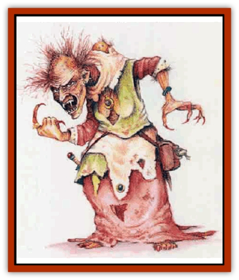

# Crone of Chaos

| Statistic | **Crone of Chaos** |
| --- | --- |
| **Activity Cycle:** | Night |
| **Alignment:** | Chaotic evil |
| **Armor Class:** | 7 |
| **Climate/Terrain:** | Any land |
| **Damage/Attack:** | 1d6 (claw)/1d6 (claw) |
| **Diet:** | Carnivore |
| **Frequency:** | Very rare |
| **Hit Dice:** | 6 |
| **Intelligence:** | High (13-14) |
| **Magic Resistance:** | Nil |
| **Morale:** | Steady (12) |
| **Movement:** | 12 |
| **No. Appearing:** | 1 |
| **No. of Attacks:** | 2 |
| **Organization:** | Solitary |
| **Size:** | M (5' tall) |
| **Special Attacks:** | Animal control, magical daggers; see below |
| **Special Defenses:** | Nil |
| **THAC0:** | 15 |
| **Treasure:** | M (Z) |
| **XP Value:** | 650 |

A crone of chaos is a very intelligent, evil-natured creature who uses deception to cause pain and suffering. A relative of [[Hag|hags]], she is always female. Unless she is taken by surprise, the crone is always veiled by illusion, assuming the guise of a beautiful maiden.

In her true form, a crone has wrinkled, leathery skin; sparse, wiry hair; long, crooked arms; sharp tartar-encrusted fangs; and large hands with clawlike fingers. Dried blood of past victims is caked beneath her sharp nails. Her hair often stands on end or at strange angles. The odor of the creature is foul, for she despises contact with water and therefore never bathes.

The crone speaks Common. She may also speak any language befitting the form she most often assumes.

**Combat:** A crone has unusually keen hearing and eyesight, and gains a +1 bonus to her surprise roll.

She has several magical abilities. These are natural powers (although they can be revealed by a *detect magic* and countered by *dispel magic*). The most important power is an *illusion* that enables the crone to look human or demihuman. A crone usually disguises herself as a beguiling young woman. In this form she uses two magical powers to attack: *animal control* and *daggers of sorcery* (see below).

The crone can make just one magical attack per round. Both attacks have a range of 240 yards. She can maintain her *illusion* while employing her magical attacks. The crone fights in her true form only if surprised, or if her other attacks have failed to defeat her foes. At such times, she attacks twice, raking her victim's flesh with her clawlike nails.

<ul><li>*Animal Control:* The crone can control 1d6 normal or giant animals automatically (no saving throw). Exceptionally intelligent animals receive saving throws vs. spells, while those with special loyalties (a paladin's warhorse or a wizard's familiar) or of a magical nature (a shapechanged druid) are unaffected.</li><li>*Daggers of Sorcery:* This attack creates 1d6 ghostly white daggers that appear in midair and attack. Each dagger attacks a different target and fights until either the dagger is destroyed or the victim is killed. The crone controls the movement of the daggers and can make each one follow the target as it moves. The daggers can be attacked as if they were living creatures (AC 2; HD 1; hp 1; #AT 1; Dmg 1d4). Any hit on a dagger destroys it. As each dagger is destroyed, all characters who fought that dagger must make a saving throw vs. spells. Those failing their saving throw become dizzy and weak for 6 rounds (-2 to attack rolls and saving throws); these penalties are not cumulative. Those who make successful saving throws are unaffected. </li></ul>**Habitat/Society:** A crone of chaos normally lives alone in a dark forest or desolate wilderness, often in a cave. She may be found in any climate, from the steaming tropics to the cold fringes of arctic tundra.

She lives alone, avoiding the company of humans and even other crones. She may enjoy the company of some partially tamed animals, however.

**Ecology:** A crone of chaos can mate with most humanoid species, but she prefers humans. She uses *illusion* to ensnare her victim. Once he has served his purpose, she kills him and feasts on his corpse.

Crones abandon their female offspring and devour males. No one knows whether a male crone-child could survive otherwise; none has ever been seen.

To the kind folk who adopt an abandoned crone-child, the infant appears to be member of the father's species. However, she later seems to age rapidly; by late adolescence her skin is wrinkled and discolored, her joints gnarled, and her hair thin. Simultaneously, she develops the magical powers of a crone of chaos, which help hide the truth of her changing nature.

In time, the young crone will be overwhelmed with contempt for the race with which she lives; or, as the years pass, her alien nature may be suspected. In any case, she soon forsakes the company of those who reared her and adopts the life of a hermit, embracing the wicked ways of a crone of chaos.

Is the change inevitable? Sages disagree. Perhaps crones are not forced into wickedness; perhaps benign crones secretly live in human society. If the latter is true, though, no evidence has been discovered to support it. With an average life span of three centuries, crones could scarcely go so long unnoticed.

---
## Discovery & Documentation

**Source Publication:** Mystara Appendix (1994)
**Campaign Setting:** Mystara
**Author(s):** John Nephew, Teeuwynn Woodruff, John Terra, Skip Williams

### Other Creatures Found in This Source Book
   * [[Actaeon|Actaeon]]
   * [[Agarat|Agarat]]
   * [[Ash_Crawler|Ash Crawler]]
   * [[Baldandar|Baldandar]]
   * [[Bargda|Bargda]]
   * [[Bhut|Bhut]]
   * [[Bird_Mystara|Bird (Mystara)]]
   * [[Blackball|Blackball]]
   * [[Choker|Choker]]
   * [[Coltpixie|Coltpixie]]
   * [[Darkhood|Darkhood]]
   * [[Darkwing|Darkwing]]
   * [[Decapus|Decapus]]
   * [[Deep_Glaurant|Deep Glaurant]]
   * [[Diabolus|Diabolus]]
   * [[Dimensional_Warper|Dimensional Warper]]
   * [[Dragon_Mystara_Crystalline|Dragon (Mystara), Crystalline]]
   * [[Dragon_Mystara_Jade|Dragon (Mystara), Jade]]
   * [[Dragon_Mystara_Onyx|Dragon (Mystara), Onyx]]
   * [[Dragon_Mystara_Ruby|Dragon (Mystara), Ruby]]
   * [[Drake_Mystara|Drake (Mystara)]]
   * [[Dragonfly|Dragonfly]]
   * [[Dusanu|Dusanu]]
   * [[Elemental_of_Chaos_Air_Earth|Elemental of Chaos, Air/Earth]]
   * [[Elemental_of_Chaos_Fire_Water|Elemental of Chaos, Fire/Water]]
   * [[Elemental_of_Law_Air_Earth|Elemental of Law, Air/Earth]]
   * [[Elemental_of_Law_Fire_Water|Elemental of Law, Fire/Water]]
   * [[Familiar_Mystara|Familiar (Mystara)]]
   * [[Frost_Salamander|Frost Salamander]]
   * [[Fundamental_Air_Earth|Fundamental, Air/Earth]]
   * [[Fundamental_Fire_Water|Fundamental, Fire/Water]]
   * [[Gargantua_Mystara|Gargantua (Mystara)]]
   * [[Geonid|Geonid]]
   * [[Ghostly_Horde|Ghostly Horde]]
   * [[Giant_Athach|Giant, Athach]]
   * [[Giant_Hephaeston|Giant, Hephaeston]]
   * [[Golem_Drolem|Golem, Drolem]]
   * [[Golem_Mystara_I|Golem (Mystara) I]]
   * [[Golem_Mystara_II|Golem (Mystara) II]]
   * [[Golem_Mystara_III|Golem (Mystara) III]]
   * [[Gray_Philosopher|Gray Philosopher]]
   * [[Guardian_Warrior|Guardian Warrior]]
   * [[Gyerian|Gyerian]]
   * [[Herex|Herex]]
   * [[Hivebrood|Hivebrood]]
   * [[Horde|Horde]]
   * [[Hsiao|Hsiao]]
   * [[Huptzeen|Huptzeen]]
   * [[Hutaakan|Hutaakan]]
   * [[Imp_Mystara|Imp (Mystara)]]
   * [[Jellyfish_Giant_Mystara|Jellyfish, Giant (Mystara)]]
   * [[Kna|Kna]]
   * [[Kopru|Kopru]]
   * [[Lizard_Mystara|Lizard (Mystara)]]
   * [[Lizard-kin_Mystara|Lizard-kin (Mystara)]]
   * [[Lupin|Lupin]]
   * [[Lycanthrope_Werejaguar_Mystara|Lycanthrope, Werejaguar (Mystara)]]
   * [[Lycanthrope_Wereswine|Lycanthrope, Wereswine]]
   * [[Magen|Magen]]
   * [[Manikin|Manikin]]
   * [[Mek|Mek]]
   * [[Mujina|Mujina]]
   * [[Nagpa|Nagpa]]
   * [[Neh-thalggu|Neh-thalggu]]
   * [[Nightshade_Mystara|Nightshade (Mystara)]]
   * [[Nuckalavee|Nuckalavee]]
   * [[Pegataur|Pegataur]]
   * [[Phanaton|Phanaton]]
   * [[Plant_Dangerous_Mystara|Plant, Dangerous (Mystara)]]
   * [[Plasm|Plasm]]
   * [[Rakasta|Rakasta]]
   * [[Rock_Man|Rock Man]]
   * [[Sabreclaw|Sabreclaw]]
   * [[Sacrol|Sacrol]]
   * [[Scamille|Scamille]]
   * [[Shapeshifter|Shapeshifter]]
   * [[Shargugh|Shargugh]]
   * [[Shark-kin|Shark-kin]]
   * [[Sollux|Sollux]]
   * [[Spectral_Death|Spectral Death]]
   * [[Spectral_Hound|Spectral Hound]]
   * [[Spider-kin|Spider-kin]]
   * [[Spirit_Mystara|Spirit (Mystara)]]
   * [[Statue_Living|Statue, Living]]
   * [[Surtaki|Surtaki]]
   * [[Tabi|Tabi]]
   * [[Thoul|Thoul]]
   * [[Thunderhead|Thunderhead]]
   * [[Tiger_Ebon|Tiger, Ebon]]
   * [[Topi|Topi]]
   * [[Tortle|Tortle]]
   * [[Vampire_Velya|Vampire, Velya]]
   * [[White_Fang|White Fang]]
   * [[Worm_Mystara|Worm (Mystara)]]
   * [[Wyrd|Wyrd]]
   * [[Yowler|Yowler]]
   * [[Zombie_Lightning|Zombie, Lightning]]
