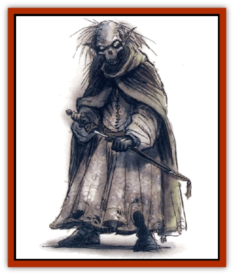

# Crypt Servant

| Statistic | **Crypt Servant** |
| --- | --- |
| **Activity Cycle:** | Any |
| **Alignment:** | Lawful neutral |
| **Armor Class:** | 5 |
| **Climate/Terrain:** | Tombs |
| **Damage/Attack:** | 1-4/1-4 or by weapon |
| **Diet:** | None |
| **Frequency:** | Rare |
| **Hit Dice:** | 6 |
| **Intelligence:** | Low (5-7) |
| **Magic Resistance:** | Nil |
| **Morale:** | Fearless (20) |
| **Movement:** | 12 |
| **No. Appearing:** | 1-20 |
| **No. of Attacks:** | 2 |
| **Organization:** | Solitary or staff |
| **Size:** | M (4-7' tall) |
| **Special Attacks:** | Nil |
| **Special Defenses:** | Spell immunities, immune to piercing weapons |
| **THAC0:** | 15 |
| **Treasure:** | See below |
| **XP Value:** | 650 |

From the Ruined Kingdoms of Nog and Kadar came rumors, and finally proof, of this special form of undead created to serve their masters for an eternity. Since the method for creating them was uncovered, crypt servants have been created for more modern tombs as well.

Crypt servants appear as corpses, usually desiccated, and usually human, though [[Elf|elves]], [[Dwarf|dwarves]], and other races are not unknown. They are usually dressed in the livery of their master, the person buried in the tomb they serve. Many, especially those more recently created, bear mamluk tattoos.

Crypt servants speak the language of their master in dry, slithery voices.

**Combat:** Though created to serve their master in all ways after death, crypt servants are usually encountered while defending their master's tomb and possessions from desecration. A solitary crypt servant or the crypt servant nearest the tomb's entrance acts as a guard. Intruders are challenged verbally by the guard; most require a certain verbal command or a visible sign of the family of their master. Intruders who do not respond properly are attacked.

Intruders who make it past a guardian crypt servant will not be challenged by other crypt servants unless they disturb the master's possessions. Anyone who disturbs the body of the master is attacked regardless of any commands or signs they offer to deter the crypt servants.

Crypt servants who engage in combat call to other crypt servants in the tomb. Despite the quiet nature of the creature's voice, all the crypt servants in a tomb respond in 1d6 rounds. Many crypt servants are provided with weapons of some sort; they attack with their fists if they are not. They attack in a mindless fury, concentrating on the last person to cause a disturbance to their master or their master's possessions.

Like other undead, crypt servants are immune to *charm*, *hold*, and *sleep* spells.

**Habitat/Society:** Though it is possible to create a crypt servant from any dead body, volunteers are usually preferred; many ancient crypt servants actually volunteered for their posts, wishing to serve their masters in death as in life. Mamluks sometimes volunteer in modern times.

Crypt servants care for their deceased master and all the rooms and possessions in the tomb. Small tombs have only one crypt servant, while grand tombs of wealthy and powerful individuals may have several. Crypt servants clean and repair the tombs, polish valuables, light candles, and guard the tomb from intruders. At first, they are fervent in their need to serve, but as years - and centuries - pass, they take longer breaks between activity, sometimes standing motionless for days or even years before becoming active again.

Because of their similar purpose and method of creation, crypt servants are sometimes associated with the [[Crypt_Thing|crypt thing]]. The spells to create each are similar and probably have the same roots. If the crypt thing is available for the DM's campaign, one may be found as the leader of a group of crypt servants.

**Ecology:** A crypt servant has no proper ecological niche. It neither adds to or detracts from its environment, except to occasionally eliminate intruders and other vermin.

---
## Discovery & Documentation

**Source Publication:** City of Delights (1993)
**Campaign Setting:** Al-Qadim (Forgotten Realms)
**Author(s):** tom Prusa, Tim Beach, Steve Kurtz

### Other Creatures Found in This Source Book
   * [[Afanc|Afanc]]
   * [[Al-Jahar|Al-Jahar]]
   * [[Bird_Talking|Bird, Talking]]
   * [[Cat_Winged|Cat, Winged]]
   * [[Elemental_Vermin|Elemental Vermin]]
   * [[Genie_Tasked_Harim_Servant|Genie, Tasked, Harim Servant]]
   * [[Ogre_Zakhara|Ogre (Zakhara)]]
   * [[Opinicus|Opinicus]]
   * [[Parasite|Parasite]]
   * [[Pasari-Niml|Pasari-Niml]]
   * [[Sirine|Sirine]]
   * [[Tatalla|Tatalla]]
   * [[Tree_Singing|Tree, Singing]]
