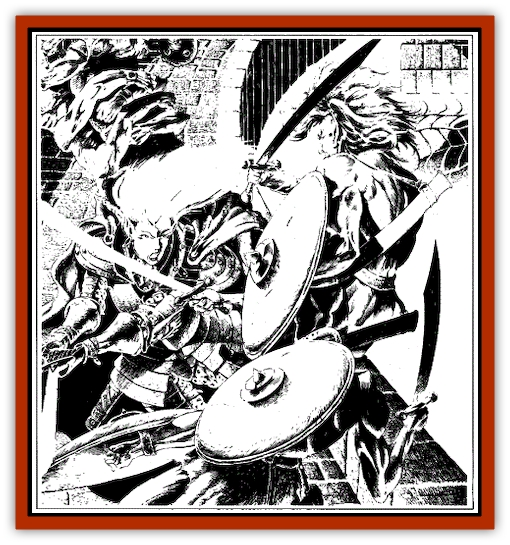
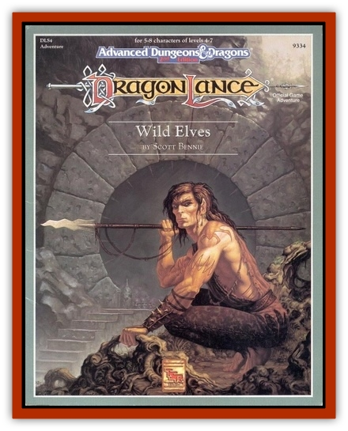

# Curotai

| Statistic | **Curotai** |
| --- | --- |
| **Activity Cycle:** | Nocturnal |
| **Alignment:** | Chaotic evil |
| **Armor Class:** | 6 |
| **Climate/Terrain:** | Subterranean caverns |
| **Damage/Attack:** | By weapon type +3 strength bonus |
| **Diet:** | Carnivore |
| **Frequency:** | Rare |
| **Hit Dice:** | 6+6 |
| **Intelligence:** | Average (8-10) |
| **Magic Resistance:** | Nil |
| **Morale:** | Steady (12) |
| **Movement:** | 12 |
| **No. Appearing:** | 1 |
| **No. of Attacks:** | 4 |
| **Organization:** | Family |
| **Size:** | L (9' tall) |
| **Special Attacks:** | Nil |
| **Special Defenses:** | Parrying |
| **THAC0:** | 13 |
| **Treasure:** | Nil |
| **XP Value:** | 2,000 |

When [[Handmaiden_of_Takhisis|Jiathuli, Handmaiden of Takhisis]], first ensnared the [[Elf_Wild_Kagonesti|Kagonesti]] in her web, she decided  to change them into her own image. Just as she  changed drow that displeased her into [[Elf_Drow|driders]], she transformed Kagonesti into abominations,  six-armed giants disposed toward evil and servitude. She named them the curotai (drow for “guardians of an important person”). Curotai resemble normal Kagonesti, except that they have three torsos, stacked on top of each other. Each torso has two arms, typically armed with a weapon and a shield

**Combat:** Curotai have 18/01 strength. They can attack with their six arms with a dramatic effect in melee. Twice per melee round, they may block an attack that would otherwise strike them; this includes missile attacks, such as arrows, flaming oil, etc. Thus they nullify two successful attacks against them per melee round. They are weapon specialist fighters, hence their multiple attacks.

**Habitat/Society:** Curotai are slaves. They have a fanatical loyalty to Jiathuli and do anything she says. They do not attack drow or spiders, but they automatically attack anything else.

Curotai are held in captivity by the *willstone* of Jiathuli; if this stone is wrested from Jiathuli or  destroyed, the curotai will revert to normal Kagonesti.

**Ecology:** Curotai have acquired a spider's dietary habits, existing on meat, preferably live.

---
## Discovery & Documentation

**Source Publication:** Wild Elves (1991)
**Campaign Setting:** Dragonlance
**Author(s):** Scott Bennie

### Other Creatures Found in This Source Book
   * [[Dragon_Spider|Dragon, Spider]]
   * [[Handmaiden_of_Takhisis|Handmaiden of Takhisis]]
   * [[Ice_Vampire|Ice Vampire]]
   * [[Spider_Horse|Spider Horse]]
   * [[Weapon_Living|Weapon, Living]]
