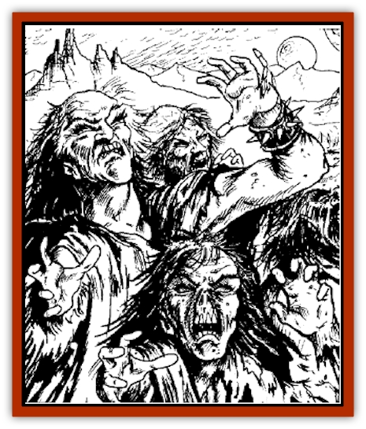

# Cursed Dead - Hungry Body

| Statistic | **Cursed Dead/Hungry Body** |
| --- | --- |
| **Activity Cycle:** | Any |
| **Alignment:** | Neutral Good (Chaotic Evil) |
| **Armor Class:** | 8 |
| **Climate/Terrain:** | Black Waters Oasis |
| **Damage/Attack:** | 1d4 or by weapon |
| **Diet:** | None |
| **Frequency:** | Common |
| **Hit Dice:** | 1 |
| **Intelligence:** | Average (10) |
| **Magic Resistance:** | Nil |
| **Morale:** | Special |
| **Movement:** | 8 |
| **No. Appearing:** | 100-1,000 |
| **No. of Attacks:** | 1 |
| **Organization:** | None |
| **Size:** | M |
| **Special Attacks:** | Nil |
| **Special Defenses:** | Nil |
| **THAC0:** | 18 |
| **Treasure:** | Nil |
| **XP Value:** | 70 |

The curse of the Black Waters reduces its victims to undead slaves of the oasis. These undead are either cursed dead or hungry bodies, each of which is discussed in more detail below.

Both types of undead must remain within a mile of the Black Waters Oasis. They are cursed to always appear before anyone coming to the oasis, either to warn them away or to lure them to their doom.

## Cursed Dead

These creatures resemble [[Skeleton|skeletons]], although they still have human eyes. They are clothed in tatters and rarely have any weapons to speak of. They are pitiful victims of the curse of Black Waters, tormented by a neverending thirst that cannot be quenched. They often drink from the oasis, desperate to soothe their parched throats.

If the cursed dead are the first to see characters coming to the oasis, they will do whatever they can to shoo them away. The cursed dead do not wish others to fall prey to the curse. They are not violent and will do nothing to stop those who attack them, for once their physical forms have been destroyed they may lie in peace. Though the cursed dead can speak, it causes them intense physical pain that may last for hours. They only speak when they absolutely must, keeping to short sentences.

The cursed dead are immediately aware if anyone with the *black waters scroll* enters the oasis and will do what they can to guide such characters to Phabum. They will let anyone who does not have the *black waters scroll* leave the oasis without incident. If characters try to leave with the scroll, the cursed dead will do what they can, short of killing the characters, to keep the scroll. It is, after all, their only hope of salvation.

**Combat:** Cursed dead do not fight unless they are forced to. Their bony claws cause 1d4 points of damage.

**Habitat/Society:** The cursed dead must stay within one mile of the Black Waters Oasis; they have no society to speak of.

**Ecology:** Cursed dead warn of the dangers of the Black Waters Oasis, but have no real role in nature.

## Hungry Body

Hungry bodies are bloated [[Zombie|zombies]]; their decaying flesh stinks of the grave. But their eyes prove them something other than typical zombies. their eye sockets blaze with black flames. Hungry bodies are normally clothed in tattered rags and carry a variety of weapons.

Hungry bodies desire more than anything else to become powerful undead. They believe that they can accomplish this by luring others to their end at the Black Waters Oasis and make every effort to do this. Unfortunately, they are terribly misguided: They can never rise above their current level and their agony will never end.

**Combat:** The hungry bodies despise the living and will do anything within their power to destroy them. They typically attack in packs of 5 to 10, wielding whatever motley weapons they find lying about the oasis. They never use armor as their clumsy fingers cannot lace or fasten it. They often set up strategic ambushes for unfortunate travelers near the oasis. Packs of hungry bodies often travel their allotted mile from the oasis seeking victims.

**Habitat/Society:** As cursed dead, above.

**Ecology:** The hungry bodies have no role in nature.

---
## Discovery & Documentation

**Source Publication:** DSM1 Black Flames (1993)
**Campaign Setting:** Dark Sun
**Author(s):** Sam Witt

### Other Creatures Found in This Source Book
   * [[Racked_Spirit|Racked Spirit]]
