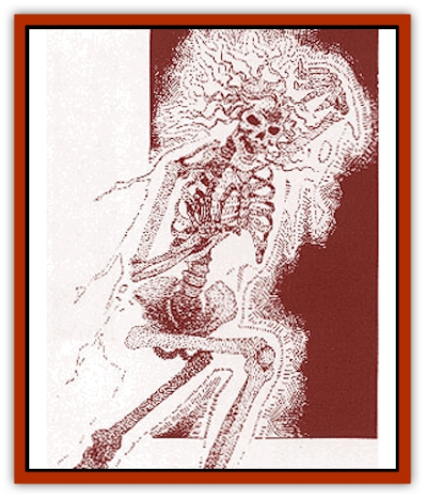

# Cursed One

| Statistic | **Cursed One** |
| --- | --- |
| **Activity Cycle:** | Night |
| **Alignment:** | Chaotic neutral |
| **Armor Class:** | 2 |
| **Climate/Terrain:** | Any |
| **Damage/Attack:** | 1d8 |
| **Diet:** | <i>Cinnabryl</i> |
| **Frequency:** | Rare |
| **Hit Dice:** | 6 |
| **Intelligence:** | Low (5-7) |
| **Magic Resistance:** | 25% |
| **Morale:** | Champion (15-16) |
| **Movement:** | 15, Fl 15 |
| **No. Appearing:** | 1d4 |
| **No. of Attacks:** | 1 |
| **Organization:** | Solitary |
| **Size:** | M (4-7' tall) |
| **Special Attacks:** | Depletes cinnabryl |
| **Special Defenses:** | Hit only by magical weapons |
| **THAC0:** | 15 |
| **Treasure:** | Nil |
| **XP Value:** | 3,000 |

The onset of the Red Curse always causes the loss of ability score points, and in some cases, *cinnabryl* cannot be found in time to stop this loss after the first point. When any of a person's ability scores is lowered to 0, that person dies. If special measures are not taken, that person will rise again as a cursed one. Cursed ones always seek out the substance that could have saved their lives: *cinnabryl*.

A cursed one appears insubstantial - a faint, reddish, [[Skeleton|skeletal]] silhouette within a translucent red specter. The creature's eyes are gaping pools of darkness, while its body gives off a faint red glow, making it appear more evil than it actually is.

*The Red Curse:* Though cursed ones never acquire Legacies, they must constantly search for *cinnabryl*, which can temporarily relieve their pain.

**Combat:** Only magical weapons can effectively strike a cursed one. These undead creatures can detect both *cinnabryl* and *red steel* within 10 yards. Though they hunt *cinnabryl*, they are visibly frightened of *red steel*. Only *red steel* can permanently kill a cursed one. A cursed one destroyed by anything other than a *red steel* weapon reforms after 24 hours.

When it detects *cinnabryl*, a cursed one rushes forward to attack. A cursed one can absorb *cinnabryl* by simply assaulting someone wearing it and overlapping the body of the target with its own insubstantial essence. This requires a normal attack roll against the victim's AC (with no armor adjustments). A cursed one cannot drain *cinnabryl* from a person wearing *red steel* armor.

If a cursed one's attack is successful, simultaneous hot and cold sensations flood the victim's body, sapping 1d8 hit points. In addition, a successful attack allows the undead creature to deplete some of the victim's *cinnabryl*, one ounce (one week's worth) for each successful hit. If the victim has less than one ounce left, the victim suffers an appropriate number of days of the Time of Loss and Change. (If the cursed one hits a character with only a two-day's supply of *cinnabryl*, the victim suffers five days worth of the Time of Loss and Change). A cursed one stops only when no *cinnabryl* is left nearby.

Cursed ones are immune to *sleep*, *charm*, *and* hold spells, all Legacies, and all mind-affecting attacks.

**Habitat/Society:** A cursed one leads a lonely existence, suffering constant pain that can be relieved only for a few fleeting moments by *cinnabryl*.

These undead creatures are not confined to their place of origin, but roam free. They wander mostly at night but can move around in darkened areas by day. In sunlight, cursed ones are completely powerless and immobile; however, sunlight also makes them invisible. If the sun's rays touch them, cursed ones freeze in place until the sun sets. A cursed one generally travels as far as possible from the area of its demise to escape painful memories.

Besides feeding *cinnabryl* to a cursed one, a temporary and rather foolish option, nothing can be done to help the creature. To prevent the rise of a cursed one, one ounce of *cinnabryl* must be buried with the remains of anyone who dies from the attribute point loss brought on by the Red Curse.

Cursed ones are also sometimes created by the touch of an Inheritor lich. Perhaps due to their link to the Red Curse, cursed ones cannot harm Inheritor liches in any way.

**Ecology:** Unlike other undead, cursed ones do have some effect on the ecology. They uselessly deplete *cinnabryl*, keeping it from those who could be helped by it.

---
## Discovery & Documentation

**Source Publication:** Monstrous Compendium Savage Coast Appendix (Online Exclusive) (1995)
**Campaign Setting:** Mystara
**Author(s):** Loren L Coleman, Ted James, Thomas Zuvich, Cindi M. Rice

### Other Creatures Found in This Source Book
   * [[Aranea_Savage_Coast|Aranea (Savage Coast)]]
   * [[Arashaeem|Arashaeem]]
   * [[Batracine|Batracine]]
   * [[Cat_Marine|Cat, Marine]]
   * [[Cinnavixen|Cinnavixen]]
   * [[Clockwork_Swordsman|Clockwork Swordsman]]
   * [[Critter_Temple|Critter, Temple]]
   * [[Deathmare|Deathmare]]
   * [[Dragon_Savage_Coast_Crimson|Dragon (Savage Coast), Crimson]]
   * [[Dragon_Savage_Coast_Red_Hawk|Dragon (Savage Coast), Red Hawk]]
   * [[Echyan|Echyan]]
   * [[Ee'aar|Ee'aar]]
   * [[Enduk|Enduk]]
   * [[Fachan_Savage_Coast|Fachan (Savage Coast)]]
   * [[Feliquine|Feliquine]]
   * [[Fiend_Narvaezan|Fiend, Narvaezan]]
   * [[Frelôn|Frelôn]]
   * [[Ghriest|Ghriest]]
   * [[Glutton_Sea|Glutton, Sea]]
   * [[Goatman|Goatman]]
   * [[Golem_Naâruk|Golem, Naâruk]]
   * [[Golem_Savage_Coast|Golem (Savage Coast)]]
   * [[Grudgling|Grudgling]]
   * [[Heraldic_Servant_I|Heraldic Servant I]]
   * [[Heraldic_Servant_II|Heraldic Servant II]]
   * [[Heraldic_Servant_III|Heraldic Servant III]]
   * [[Heraldic_Servant_IV|Heraldic Servant IV]]
   * [[Heraldic_Servant_V|Heraldic Servant V]]
   * [[Heraldic_Servant_General_Information|Heraldic Servant, General Information]]
   * [[Hermit_Sea|Hermit, Sea]]
   * [[Jorri|Jorri]]
   * [[Juhrion|Juhrion]]
   * [[Kla'a-tah|Kla'a-tah]]
   * [[Leech_Legacy|Leech, Legacy]]
   * [[Lich_Inheritor|Lich, Inheritor]]
   * [[Lizard_Kin_Savage_Coast|Lizard Kin (Savage Coast)]]
   * [[Lupasus|Lupasus]]
   * [[Lupin|Lupin]]
   * [[Lyra_Bird_Saragón|Lyra Bird, Saragón]]
   * [[Malfera|Malfera]]
   * [[Manscorpion_Nimmurian|Manscorpion, Nimmurian]]
   * [[Mythuínn_Folk|Mythuínn Folk]]
   * [[Neshezu|Neshezu]]
   * [[Nikt'oo|Nikt'oo]]
   * [[Nosferatu|Nosferatu]]
   * [[Omm-wa|Omm-wa]]
   * [[Omshirim|Omshirim]]
   * [[Parasite_Savage_Coast|Parasite (Savage Coast)]]
   * [[Phanaton|Phanaton]]
   * [[Plant_Savage_Coast|Plant (Savage Coast)]]
   * [[Pudding_Vermilion|Pudding, Vermilion]]
   * [[Rakasta|Rakasta]]
   * [[Ray_Forest|Ray, Forest]]
   * [[Shedu_Greater_Savage_Coast|Shedu, Greater (Savage Coast)]]
   * [[Shimmerfish|Shimmerfish]]
   * [[Skinwing|Skinwing]]
   * [[Spawn_of_Nimmur|Spawn of Nimmur]]
   * [[Spider-spy|Spider-spy]]
   * [[Spirit_Heroic|Spirit, Heroic]]
   * [[Spirit_Walleran|Spirit, Walleran]]
   * [[Succulus|Succulus]]
   * [[Swampmare|Swampmare]]
   * [[Symbiont_Shadow|Symbiont, Shadow]]
   * [[Tortle|Tortle]]
   * [[Troll_Legacy|Troll, Legacy]]
   * [[Trosip|Trosip]]
   * [[Tyminid|Tyminid]]
   * [[Utukku|Utukku]]
   * [[Voat|Voat]]
   * [[Voat_Herathian|Voat, Herathian]]
   * [[Vulturehound|Vulturehound]]
   * [[Wallara|Wallara]]
   * [[Wurmling|Wurmling]]
   * [[Wynzet|Wynzet]]
   * [[Yeshom|Yeshom]]
   * [[Zombie_Red|Zombie, Red]]
