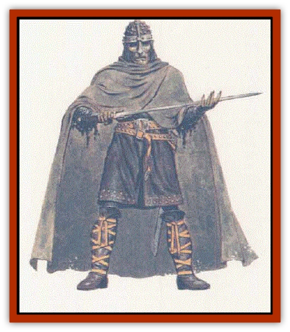

# Curst

| Statistic | **Curst** |
| --- | --- |
| **Activity Cycle:** | Night |
| **Alignment:** | Chaotic neutral |
| **Armor Class:** | 7 (or by armor) |
| **Climate/Terrain:** | Subterranean |
| **Damage/Attack:** | 1d4 or by weapon |
| **Diet:** | None |
| **Frequency:** | Rare |
| **Hit Dice:** | As level |
| **Intelligence:** | See below |
| **Magic Resistance:** | 85% |
| **Morale:** | Average (10) |
| **Movement:** | 12 |
| **No. Appearing:** | 2-11 |
| **No. of Attacks:** | 1 or as per level |
| **Organization:** | Solitary |
| **Size:** | M (58-68) |
| **Special Attacks:** | Rot grubs (15%) |
| **Special Defenses:** | Spell immunities; immune to fire, cold, energy drain |
| **THAC0:** | As per level |
| **Treasure:** | Nil |
| **XP Value:** | Varies |

Curst are undead humans, trapped by an evil curse that will not let them die. They are created by a rare process: The victim's skin pales to an unearthly white pallor, and his or her eyes turn black while the iris color deepens, becoming small pools of glinting dark color. Curst lose their sense of smell, often lose Intelligence, and develop erratic behaviour as their alignment changes to chaotic neutral. Curst favor leather armor, cloaks with hoods, and boots. Their garb is nearly always dark in color, though some still keep the original clothing they wore when alive.

A curst has 90-foot infravision as well as normal vision and prefers darkness to light. Curst tend toward silence, and do not age once they become undead.

**Combat:** The curst retain any ability bonuses and nonmagical skills they possessed in their previous lives; for example, fighters still retain their levels and enhanced Strength scores (e.g. 18/00), thieves keep their rogue abilities, and all keep their nonweapon profiaencies; however, any spellcasting abilities are lost.

Curst are immune to mind-related spells such as *charm*, *ESP*, *hold*, and *sleep*, and have 85% magic resistance. They are unaffected by cold- or fire-based attacks of any sort, and energy draining attacks are similarly ineffective. Though they are technically undead, they cannot be turned by priests or paladins, and holy water has no special effect on them.

Curst can be struck by any weapon. They can use any weapon allowed by their former character class, and will seize better weapons than their own when available. An unarmed curst attacks by kicking, biting, and clawing savagely for 1d4 points of damage per round.

If reduced to 0 hit points, curst are not slain. They fall to the ground, paralyzed, and lie there until they are whole again. Curst regenerate 1 hit point per day, and are able to regrow lost limbs and organs; if decapitated, the curst's body will disintegrate into dust, and the new body regenerates from the head (this process takes twice as many days as the curst has hit points), which remains paralyzed until the body is reformed. Curst can be healed by *cure* magics. If a *remove curse* spell is cast upon a curst, the creature is destroyed.

[[Rot_Grub|Rot grubs]] infect 15% of all curst; these have 1-6 fewer hit points but are otherwise unimpaired. The grubs will be seeking a better host.

**Habitat/Society:** Curst are in no way controlled by their creators, and seldom serve them except to attain the mercy of death by means of a *remove curse* spell. Often, coming to know their cruel doom, curst attack their creators, hoping they will be destroyed in self-defense. Once destroyed, curst cannot be resurrected or animated to become other forms of undead, since their bodies crumble into dust.

In the process of becoming curst, humans lose their sense of smell, any magical abilities, and often their minds (but not their cunning); only 11% of the curst retain their full, former ability score, while most have a lowered Intelligence of 8. In addition, there is a 5% chance per turn (noncumulative) that a curst will act irrationally - breaking off a fight to sing, skip and dance, draw with a finger on a nearby wall, stare intently at something, etc. - for 1-6 rounds; during this time, nothing can distract the curst, even attacks, except the casting of a *remove curse*, which elicit a smile and a whispery thanks from the curst as it collapses rapidly into dust.

**Ecology:** Curst eat nothing and are prey to none. The dust that remains after their disruption is being studied by wizards and alchemists for potential uses.

Curst are created by the *bestow curse* spell (the reverse of the *remove curse* spell), and within four rounds adding a properly worded *wish* spell. Creating them is an evil act.

About 2% of curst are humanoid.

---
## Discovery & Documentation

**Source Publication:** City of Splendors (1994)
**Campaign Setting:** Forgotten Realms
**Author(s):** Ed Greenwood, Elain Cunningham

### Other Creatures Found in This Source Book
   * [[Doppelganger_Greater|Doppelganger, Greater]]
   * [[Duhlarkin|Duhlarkin]]
   * [[Gulguthhydra|Gulguthhydra]]
   * [[Hakeashar|Hakeashar]]
   * [[Leucrotta_Greater|Leucrotta, Greater]]
   * [[Lycanthrope_Wereshark|Lycanthrope, Wereshark]]
   * [[Nyth|Nyth]]
   * [[Ooze_Slime_Jelly_Ghaunadan|Ooze/Slime/Jelly, Ghaunadan]]
   * [[Palimpsest|Palimpsest]]
   * [[Peltast|Peltast]]
   * [[Raggamoffyn|Raggamoffyn]]
   * [[Shadowrath|Shadowrath]]
   * [[Snake_Sewerm|Snake, Sewerm]]
   * [[Watchspider|Watchspider]]
