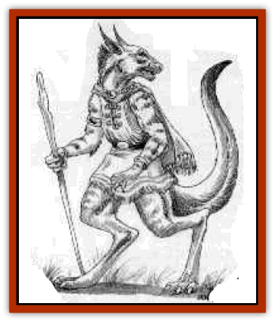

# Daegandal

| Statistic | **Daegandal** |
| --- | --- |
| **Activity Cycle:** | Any |
| **Alignment:** | Neutral |
| **Armor Class:** | 4 |
| **Climate/Terrain:** | Any wilderness |
| **Damage/Attack:** | 1d4+1/1d4+1/2d4-1/2d4-1 |
| **Diet:** | Herbivore |
| **Frequency:** | Mythical |
| **Hit Dice:** | 7 |
| **Intelligence:** | Genius (17-18) |
| **Magic Resistance:** | 25% |
| **Morale:** | Elite (13) |
| **Movement:** | 9, Jp 18 |
| **No. Appearing:** | Unknown |
| **No. of Attacks:** | 4 |
| **Organization:** | Solitary |
| **Size:** | M (4-6' tall) |
| **Special Attacks:** | Spells |
| **Special Defenses:** | Regeneration |
| **THAC0:** | 13 |
| **Treasure:** | R&times;2,S&times;2,T |
| **XP Value:** | 4,270 |

The daegandal (DAY-gan-doll) is thought to be the brightest and wisest auf the [[Garradalaigh_General_Information|garradalaighs]]. It has large muscular back legs on which it hops around quickly, covering considerable distances. Its smaller front legs end in hand-like claws. Its face stretches outward, like the visage of a [[Gnoll|gnoll]], and its ears are long and pointed. The creature's shiny pelt is colored with various shades of brown; the long, muscular tail is slightly darker.

It favors grassy plains and open land, where it can hop for great distances without dodging trees, rocks, and other obstacles. However, it can be found in lightly-wooded groves and on low, sloping hill sides.

The creature enjoys being thought of as a mythical beast - that appeals to its sence of irony.

It is reputed to speak elvish, halfling, and a smattering of human tongues. It is able to read may elf, [[Halfling|halfling]], and human writings when it comes across them and considers itself a scholar and historian.

The daegandal has a quick mind vor magic and can cast any of the following spells at will, each once per day and as if cast by an 8th-level wizard: *know Cerilian origin*, *spook*, *taunt*, *wall of fog*, *fog cloud*, *Ruornil's tracks*, *Erik's quills*, *solid fog*. In addition, three times per day it can *jump*, as per the wizard spell, to drastically augment its own leaping ability. A wizard who is a companion of the daegandal likewise can enjoy the use of the *jump* spell three times a day without memorizing it, Further, the daegandal can cast spells from scrolls as an 8th-level wizard.

**Combat:** This creature is loathe to get into physical combat with its foes, since it is not immune to normal weapons and its Armor Class is relatively high (compared to those of other garradalaighs). When forced or coerced into a struggle, it first attempts to use its magical abilities - melee is a last resort, When faced with a closed fight, the daegandal rests on  its long tail and lashes out with its claws (which inflict 1d4+1 points of damage each) and its feet (2d4-1 points each). When obviously losing a fight, it will attampt to bound away to safety, letting its regeneration ability heal any wounds. The daegandal can regenerate 3 hit points every round.

**Habitat/Society:** The daegandal spends most of its time alone. Isolated in quiet groves, it spends hours poring over old tomes and scrolls. The daegandal is supposedly the garradalaigh most prone to seek the company of spellcasters. According to legend, it haunts the Rjurik lands bordering the Tael Firth.

**Ecology:** This garradalaigh does not prey on other animals. It is herbivorous, eating broad-leaved plants, chice roots, and new grass.

---
## Discovery & Documentation

**Source Publication:** Book of Magecraft (1994)
**Campaign Setting:** Birthright
**Author(s):** Carrie A. Bebris, Anne Brown, Jean Rabe, Steven Schend, Ed Stark

### Other Creatures Found in This Source Book
   * [[Audreeana|Audreeana]]
   * [[Breiryn|Breiryn]]
   * [[Cabhaigh|Cabhaigh]]
   * [[Garigal|Garigal]]
   * [[Garradalaigh_General_Information|Garradalaigh, General Information]]
   * [[Rhoeghn|Rhoeghn]]
   * [[Siddwynd|Siddwynd]]
   * [[Tualleiaght|Tualleiaght]]
