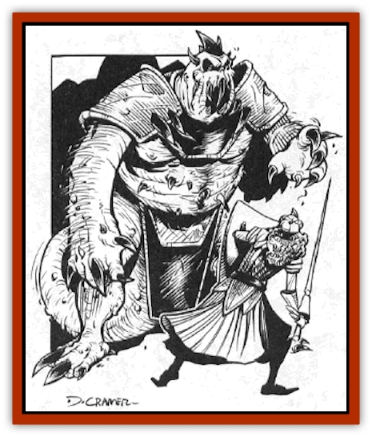
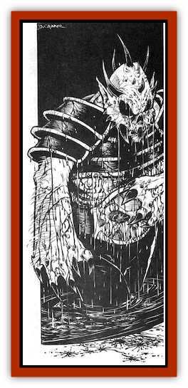

# Daemonlord

| Statistic | **Daemonlord** |
| --- | --- |
| **Activity Cycle:** | Any |
| **Alignment:** | Chaotic evil |
| **Armor Class:** | -2 |
| **Climate/Terrain:** | Abyss (Krynn) |
| **Damage/Attack:** | 1d10/1d10/3d10 |
| **Diet:** | Carnivore |
| **Frequency:** | Very rare |
| **Hit Dice:** | 15 |
| **Intelligence:** | Genius (18) |
| **Magic Resistance:** | 50% |
| **Morale:** | Fearless (20) |
| **Movement:** | 12, Fl 30 (B) |
| **No. Appearing:** | 1 |
| **No. of Attacks:** | 3 |
| **Organization:** | Solitary |
| **Size:** | L (12' tall) |
| **Special Attacks:** | Paralyze with gaze, deafen with roar, lightning 6/day |
| **Special Defenses:** | +2 or better weapons needed to hit, invulnerable to any creature except those witnessing its creation |
| **THAC0:** | 5 |
| **Treasure:** | W |
| **XP Value:** | 21,000 |

The Daemonlord is a being of pure chaos summoned from the depths of the Abyss and unleashed upon Krynn to increase the suffering of the helpless world. It is drawn from its own plane by an Evil ritual requiring the blood sacrifice of unwilling victims and the active participation - and subsequent demise - of at least a half dozen daemon warriors.

**Combat:** In battle, the Daemonlord gleefully employs all of its power to smash its enemies. Since it relishes pain, it makes a point in a given battle of attacking those foes who have not yet been wounded. Only when all of its victims have been smashed and battered does it begin finishing them off. It often enjoys toying with victims, and it frequently summons or creates creatures for the pleasure it derives from watching these minions battle.

Striking with its two clawed hands, the Daemonlord can administer crushing blows to either side or to the front. Its arms are long and supple, so it can strike at victims up to 10 feet away. The fanged maw of the monster is its most horrible weapon. It rends and bites savagely, ripping out pieces of flesh whenever it can do so.

On a round when the creture does not bite, it utters its horrible roar. The bellow of the Daemonlord is an unearthly sound that violently assaults the senses of those in a cone-shaped area 100 feet long, with a 5-foot-wide base that expands to 50 feet at its farthest point. Heroes within that area of effect can make saving throws vs. breath weapons; failure means that they have been deafened for 2d6 turns. Heroes more than 50 feet away from the Daemonlord gain a +2 benefit to their saving throws.

If the monster neither bites nor roars during a given round, it tries to transfix a victim by means of his horrifying gaze. A hero who meets the gaze of the monster must make a saving throw vs. spell. Failure means that the victim is paralyzed for 2d6 rounds. It can also hurl lightning bolts six times per day (12d6 damage each).

**Habitat/Society:** The Daemonlord exists only for the pleasure of killing and destroying. It relishes the slow deaths of as many victims as it can claim, though it kills quickly and efficiently when necessary. It delights in defraying great works of civilization, and devotes time and energy in the creation of new means of destruction.

**Ecology:** The Daemonlord can call upon the presence of pollution, rendering smoke and other noxious gases into a great skyship - the Chaos Cloud. From this lofty craft, it roams the world at will, raining death and destruction on whatever hapless victims fall beneath its dire shadow.

With its ability to summon other beings of Chaos, the Daemonlord can send agents in many directions to work its foul will. Once per turn, it can bring into existence 3d8 [[Sand_Spawn|sand spawn]], 3d6 [[Cedar_Spawn|cedar spawn]], or 4d10 [[Scavenger_Spawn|scavenger spawn]]. These minions can only be summoned, however, if the appropriate raw materials are present - sand, forest, or corpses, respectively.

The Daemonlord can perform this summoning either by bringing the Chaos creatures into being in his direct vicinity (within 300 feet), or by launching a Chaos meteor. These flaming projectiles can fly up to five giles before impacting. The round after the meteor impacts, the summoned Chaos creatures emerge from the fiery explosion.

---
## Discovery & Documentation

**Source Publication:** Chaos Spawn (1999)
**Campaign Setting:** Dragonlance
**Author(s):** Douglas Niles

### Other Creatures Found in This Source Book
   * [[Cedar_Spawn|Cedar Spawn]]
   * [[Sand_Spawn|Sand Spawn]]
   * [[Scavenger_Spawn|Scavenger Spawn]]
