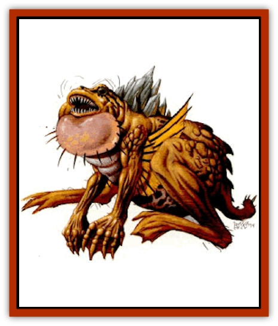

# Dagorran

| Statistic | **Dagorran** |
| --- | --- |
| **Activity Cycle:** | Any (night) |
| **Alignment:** | Neutral |
| **Armor Class:** | 7 |
| **Climate/Terrain:** | Wastelands, tablelands |
| **Damage/Attack:** | 2d6 (bite) |
| **Diet:** | Omnivore |
| **Frequency:** | Rare (common) |
| **Hit Dice:** | 4 |
| **Intelligence:** | Semi- (2-4) |
| **Magic Resistance:** | Nil |
| **Morale:** | Steady (11) |
| **Movement:** | Jp 9 |
| **No. Appearing:** | 2-8 (2d4) |
| **No. of Attacks:** | 1 |
| **Organization:** | Pack |
| **Size:** | M (4-6' long) |
| **Special Attacks:** | Psionics |
| **Special Defenses:** | Nil |
| **THAC0:** | 17 |
| **Treasure:** | Nil |
| **XP Value:** | 1,400 |

**Psionics Summary**

| Level | Dis/Sci/Dev | Attack/Defense | Score | PSPs |
| --- | --- | --- | --- | --- |
| 4 | 1/1/3 | -/MBk | 7 | 20 |

**Psychokinesis -** *Science:* detonate; *Devotions:* ballistic attack, control body, inertial barrier.

A dagorran is a [[Frog|frog]]like beast with golden-hued skin, green eyes, and a green crystalline growth between its shoulders. The skin is valued for its protective qualities by warriors as armor, and by wizards as a material component for casting protective spells. The green crystalline growth is the source of these creatures' psionic and tracking abilities and is valued by defilers and preservers for several mind-affecting potions. It has large razorsharp teeth that it uses in hunting and eating its prey. Its large, muscular legs are used for jumping, running, and walking. The dominant dagorran or leader has a larger crystalline growth.

A dagorran doesn't communicate in any audible manner, but uses its psionic abilities to convey limited thoughts and ideas. It occasionally emits a deep, guttural croaking noise but these sounds have no meaning to the dagorran.

**Combat:** Dagorrans hunt in packs and track prey by using their innate psionic sensitivity to pick up and follow the psionic signature of most intelligent and psionic creatures. Such imprints can be picked up even if they are several days old. These creatures usually launch their attack with their detonate psionic science. The attack is aimed at the ground near a victim, injuring and often killing their prey with the shrapnel from the explosion. If the target survives the detonation, the dagorrans leap past their target, attacking with their bite in mid air. Such attacks are made as if the creatures were charging and add +2 to any damage inflicted from the attack. However, opponents receive a -2 initiative modifier because of the recklessness of the attack (see *Player's Handbook*, page 96). After a successful hit the dagorrans are in melee and can only make further charging attacks by breaking combat. The dagorrans are subject to penalty attacks by their opponent as if they were fleeing.

While the pack attacks, the lead dagorran tries to seize control of the victim using the control body devotion. If there is more than one opponent, the leader picks the one with the fewest psionic strength points remaining. PSP levels are sensed innately because of the beasts psionic sensitivity. If combat is going poorly, survivors disengage combat and use their ballistic attack ability.

The dagorrans have an ancient hatred of [[Thri-kreen|thri-kreen]]. If a thri-kreen is among the opponents, all attacks are directed at it and if more than one is present, the individual with the fewest PSPs is targeted.

**Habitat/Society:** The dagorran is a social creature that lives and hunts in packs. The hierarchy within the pack is strict and the strongest dagorran is the leader. When a dagorran wishes to vie for the position of leader, he approaches the leader and initiates a dance that involves the two contestants circling one another, which signals a challenge. The pack forms a circle around the combatants and a battle to the death ensues. The victor becomes the lead dagorran while the loser becomes a meal for the rest of the pack. If the challenger is the winner and new leader, the crystalline growth on its back expands to the larger size typical of the lead dagorran in 5 to 10 days.

While packs of dagorrans can be encountered at any time, they prefer to sleep during the hot daylight hours and hunt during the cooler evening and night hours. If the pack has recently fed, they bury themselves in the sand during the day with just their bulging eyes and nostrils emerging from the earth. They generally sleep throughout the day unless an unknowing creature intrudes upon them. If an intruder approaches, the leader signals an attack using its psionic communication ability.

**Ecology:** Dagorrans were once common on Athas, but their value as components for potions and spells, their leatherlike hide, and that thri-kreen consider dagorran flesh a delicacy, have caused them to reach near extinction. They are still common in the deserts near Draj and are often used as trackers by Drajian guards because of their sensitivity to psionics. They are also sought by nobles and the patriarchs and matriarchs of the merchant houses to help keep their gardens free of rodents and other small animals.

---
## Discovery & Documentation

**Source Publication:** Dark Sun Appendix II - Terrors Beyond Tyr (1991)
**Campaign Setting:** Dark Sun
**Author(s):** Jim Atkiss, Steve Brown, Timothy B. Brown, Andrew P. Morris, Bruce Nesmith, Wes Nicholson, Bill Slavicsek

### Other Creatures Found in This Source Book
   * [[Aarakocra_Athas|Aarakocra (Athas)]]
   * [[Animal_Domestic_Athas_II|Animal, Domestic (Athas) II]]
   * [[Aviarag|Aviarag]]
   * [[Baazrag|Baazrag]]
   * [[Baazrag_Boneclaw|Baazrag, Boneclaw]]
   * [[Bloodgrass|Bloodgrass]]
   * [[Cactus_Hunting|Cactus, Hunting]]
   * [[Cactus_Rock|Cactus, Rock]]
   * [[Cilops|Cilops]]
   * [[Crodlu|Crodlu]]
   * [[Dhaot|Dhaot]]
   * [[Drake_Lesser_Athas_General_Information|Drake, Lesser (Athas), General Information]]
   * [[Drake_Lesser_Athas_Magma|Drake, Lesser (Athas), Magma]]
   * [[Drake_Lesser_Athas_Rain|Drake, Lesser (Athas), Rain]]
   * [[Drake_Lesser_Athas_Silt|Drake, Lesser (Athas), Silt]]
   * [[Drake_Lesser_Athas_Sun|Drake, Lesser (Athas), Sun]]
   * [[Dray|Dray]]
   * [[Drik|Drik]]
   * [[Dune_Reaper|Dune Reaper]]
   * [[Dwarf_Athas|Dwarf (Athas)]]
   * [[Elemental_Beast_Athas_Air|Elemental Beast (Athas), Air]]
   * [[Elemental_Beast_Athas_Earth|Elemental Beast (Athas), Earth]]
   * [[Elemental_Beast_Athas_Fire|Elemental Beast (Athas), Fire]]
   * [[Elemental_Beast_Athas_Water|Elemental Beast (Athas), Water]]
   * [[Elf_Athas|Elf (Athas)]]
   * [[Fael|Fael]]
   * [[Feylaar|Feylaar]]
   * [[Fordorran|Fordorran]]
   * [[Giant_Half-giant|Giant, Half-giant]]
   * [[Giant_Shadow|Giant, Shadow]]
   * [[Golem_Athas_Magma|Golem (Athas), Magma]]
   * [[Golem_Athas_Salt|Golem (Athas), Salt]]
   * [[Golem_Athas_General_Information|Golem (Athas), General Information]]
   * [[Gorak|Gorak]]
   * [[Halfling_Athas|Halfling (Athas)]]
   * [[Human_Athas|Human (Athas)]]
   * [[Jhakar|Jhakar]]
   * [[Kaisharga|Kaisharga]]
   * [[Kes'trekel|Kes'trekel]]
   * [[Klar|Klar]]
   * [[Krag|Krag]]
   * [[Kragling|Kragling]]
   * [[Lirr|Lirr]]
   * [[Mastyrial|Mastyrial]]
   * [[Meorty|Meorty]]
   * [[Mul|Mul]]
   * [[Nikaal|Nikaal]]
   * [[Paraelemental_Beast_General_Information|Paraelemental Beast, General Information]]
   * [[Paraelemental_Beast_Magma|Paraelemental Beast, Magma]]
   * [[Paraelemental_Beast_Rain|Paraelemental Beast, Rain]]
   * [[Paraelemental_Beast_Silt|Paraelemental Beast, Silt]]
   * [[Paraelemental_Beast_Sun|Paraelemental Beast, Sun]]
   * [[Pakubrazi|Pakubrazi]]
   * [[Psionocus|Psionocus]]
   * [[Psurlon|Psurlon]]
   * [[Raaig|Raaig]]
   * [[Retriever_Obsidian|Retriever, Obsidian]]
   * [[Ruktoi|Ruktoi]]
   * [[Ruvoka_Athas|Ruvoka (Athas)]]
   * [[Sand_Howler|Sand Howler]]
   * [[Scorpion_Athas|Scorpion (Athas)]]
   * [[Seed_Brain|Seed, Brain]]
   * [[Silt_Horror_Black|Silt Horror, Black]]
   * [[Silt_Horror_Magma|Silt Horror, Magma]]
   * [[Silt_Horror_Red|Silt Horror, Red]]
   * [[Silt_Spawn|Silt Spawn]]
   * [[Slig|Slig]]
   * [[Spider_Athas|Spider (Athas)]]
   * [[Spinewyrm|Spinewyrm]]
   * [[Ssurran|Ssurran]]
   * [[Stalking_Horror|Stalking Horror]]
   * [[Tarek|Tarek]]
   * [[Tari|Tari]]
   * [[Thri-kreen|Thri-kreen]]
   * [[T'liz|T'liz]]
   * [[Tohr-kreen_II|Tohr-kreen II]]
   * [[Tohr-kreen_III|Tohr-kreen III]]
   * [[Trin|Trin]]
   * [[Tul'k|Tul'k]]
   * [[Undead_Athas_General_Information|Undead (Athas), General Information]]
   * [[Wraith_Athas|Wraith (Athas)]]
   * [[Xerichou|Xerichou]]
   * [[Zombie_Thinking|Zombie, Thinking]]
