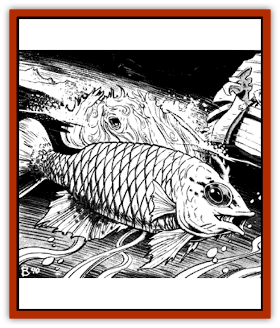

# Damselfish - Giant

| Statistic | **Damselfish, Giant** |
| --- | --- |
| **Activity Cycle:** | Night |
| **Alignment:** | Neutral |
| **Armor Class:** | 5 |
| **Climate/Terrain:** | Tropical and temperate/saltwater oceans |
| **Damage/Attack:** | 1-4/1-4 |
| **Diet:** | Carnivore |
| **Frequency:** | Uncommon |
| **Hit Dice:** | 2+4 |
| **Intelligence:** | Animal (1) |
| **Magic Resistance:** | Nil |
| **Morale:** | Steady (11) |
| **Movement:** | SW 18 (lunge 30) |
| **No. Appearing:** | 1-2 |
| **No. of Attacks:** | 2 |
| **Organization:** | Solitary |
| **Size:** | L (7½') |
| **Special Attacks:** | Stunning ram |
| **Special Defenses:** | Nil |
| **THAC0:** | 17 |
| **Treasure:** | Nil |
| **XP Value:** | 120 |

This [[Fish|fish]] has a bony head and a slim, dull, dun-colored body. A specially modified dorsal fin trails a streamer that vaguely resembles a humanlike female. The streamer can be folded down tightly against the body, leaving a ridge that the fish uses in swimming.

Nocturnal by nature, this fish rises to the surface at night to hunt. It deploys its dorsal fin and floats with its head down and tail relaxed. Upon hearing the approach of potential prey along a shore or in a boat, it wiggles its body and flutters its dorsal fin in such a way as to mislead a viewer into thinking that a woman, either human or [[Elf|elf]], is drowning. (The DM should secretly roll intelligence checks on 1d20 for the characters if anybody becomes suspicious. Any character who fails his check is deceived by the ploy.)

Once a victim swims within 10-15', the giant damselfish lets its "lady" sink convulsively into the water. It then folds back the dorsal fin and lunges at its victim with its head. If the ram is successful, 1-4 hp damage are done to the victim. The fish then makes a second attack roll (at +2 to hit) in the same round to do 1-4 hp biting damage. It will subsequently circle and ram whenever it sees a chance. Should the fish miss its lunge, it cannot bite. A natural roll of 20 on a ram indicates the victim is stunned for 1-3 rounds, during which time the fish will automatically hit with its ram-and-bite routine twice per round (for a total of 4-16 hp damage per round, with no further chance of stunning until the victim recovers).

These fish can be found in any warm, shallow ocean. They are fiercely territorial, each staking out an area of one square mile near a shipping lane and staying with it until prey no longer passes by. They come together only to mate; the male then leaves while the female carries the fertilized eggs in her body until they hatch. She then gives birth to up to 25 young that swim rapidly away to avoid being eaten by their parent. Young giant damselfish seem to gain their taste for human and demihuman flesh at adulthood, which is when the "damsel" fin is fully developed and the "fishing" instinct appears. (Sages speculate that an Arch-Mage or higher power was involved in their creation.) Adult giant damselfish are also highly aggressive and try to eat any creature that comes near them. While this ploy usually ensures a hearty meal of other fish, it?s usually a disaster if the other creature is a [[Shark|shark]].

Damselfish do not collect treasure, though an occasional valuable item may be found in the stomach of a dead fish. Nor are these fish edible, being exceedingly tough and possessing a very strong taste. The one reason they are occasionally sought after is for their dorsal streamers, which can be used as a component in certain illusion/phantasm spells (any that use the fleece needed by a *phantasmal force* spell).

---
## Discovery & Documentation

**Source Publication:** Dragon165 (1991)
**Campaign Setting:** Dragon Magazine
**Author(s):** 

### Other Creatures Found in This Source Book
   * [[Archerfish_Giant|Archerfish, Giant]]
