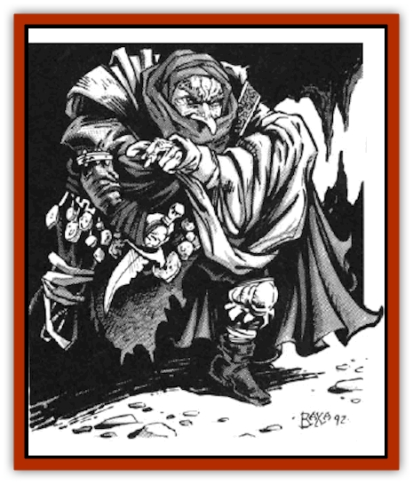

# Dark Creeper

| Statistic | **Dark Creeper** |
| --- | --- |
| **Activity Cycle:** | Night |
| **Alignment:** | Chaotic neutral |
| **Armor Class:** | 2 (10 see below) |
| **Climate/Terrain:** | Temperate/Forest, mountain, subterranean |
| **Damage/Attack:** | 1-4 or by weapon |
| **Diet:** | Scavenger |
| **Frequency:** | Rare |
| **Hit Dice:** | 1+1 |
| **Intelligence:** | Average (8-10) |
| **Magic Resistance:** | Nil |
| **Morale:** | Steady (12) |
| **Movement:** | 9 |
| **No. Appearing:** | 1-3 |
| **No. of Attacks:** | 1 |
| **Organization:** | Solitary or clan |
| **Size:** | S (4' tall) |
| **Special Attacks:** | See below |
| **Special Defenses:** | See below |
| **THAC0:** | 19 |
| **Treasure:** | See below |
| **XP Value:** | 120 |

Dark creepers care nothing for their appearance; although difficult to detect by sight, they can sometime be detected by the odor of their unwashed bodies and clothing. It is rumor that they never remove clothing. Instead they add on new layers of clothing as the layers beneath molder away.

**Combat:** A dark creeper has the abilities of a 4th level thief and is well-practiced in moving silently and hiding in shadows. The average dark creeper will have the following thieving statistics: PP 15; OL 10; FT 5; MS 70; HS 65; DN 15; CW 60; RL 0.

Dark creepers have the innate ability to *create darkness* three times per day, which they will always use when encountered by a party using any physical illumination. This power extinguishes all nonmagical sources of light within 50'; these surces cannot then be relighted for 1 hour. Magical sources have a 50% chance of being extinguished for 1 hour, and infravision becomes useless. The darkness can be negated, however, by the subsequent use of such spells as *light* and *continual light*.

Dark creepers suffer no penalty when fighting in the dark but are more vulnerable when attacked in normal illumination (AC10). Consequently, a dark creeper will always seek to *create darkness* in a combat situation, using its power repeatedly until expended. Once darkness is achieved, the dark creeper will move into the party to steal or destroy sources of illumination. Its second priority is magic, the more powerful and portable the better. Daggers, rings, and jewelry are particular favorites. Its innate *detect magic* ability (15' range) allows it to efficiently find such items, and it will attempt to take them in the quickest and easiest way, as many a four-fingered adventurer can attest. A dark creeper will always fight to the death or flee, understanding neither surrender nor negotiation.

Because of its constant pursuit of small magical items, a dark creeper will often be found with such treasure. Generally 25% of its accumulated hoard is hidden in the dark folds and copious pockets of its filthy and rotting clothing. There is a 15% chance that this will include a magical dagger, a 40% chance of 1-4 gems or 1-2 items of jewelry, and a 5% chance of a magical ring. Lair treason will generally be four times that carried, plus 1-100 platinum pieces and 5-500 gold pieces for each creeper in the lair.

When killed, the dark creeper spontaneously explodes in a flash of while-hot flame, blinding all creatures facing it within 10' for 1-6 turns unless a saving throw is made vs. magic. The dark creepers remains and all nonmetallic and nonmagical items burn to ash. Metal has an 80% chance of surviving undamaged, while magical items, metal or otherwise, must save vs. magical fire or lose their dweomer. This self-immolation necessitates a morale check for each remaining dark creeper. Failure causes a dark creeper to flee for its life. Illusionary or other simulated death-fires may be similarly effective against those dark crepers which fail to save against the illusion.

**Habitat/Society:** Little is known of the habits and social organization of the dark creepers. Their language is incomprehensible to linguists. They live in villages of 20 to 80, deep underground and shrouded in constant darkness. It is not uncommon for the approaches to the villages to be littered with traps, pits, and deadfalls. The villages are generally centered around a pit or crude stairway that leads to lower levels of the subterranean caverns in which they dwell, and can be used as a means of rapid escape. Because the village is cloaked in darkness, this pit presents a significant danger to reckless adventurers who charge into the village. Small magical items have been found among the rim of the pit or hole, leading some to believe that the dark craters use their innate detect magic ability to place and locate path markers.

**Ecology:** It is difficult to imagine what the creepers eat. Some believe that they subsist on minerals (sulphur, oil, or potassium). Others believe that they subsist on stolen magic, suggesting that magical items gradually lose their dweomer when in the possession of the dark creepers.

**Dark Stalkers**

  These are the ruling elite of the dark creepers. They are man-sized and almost always encountered with 25 or more dark creepers. [[Dark_Stalker|Dark stalkers]] are feared and obeyed by dark creepers and often direct the attacks of dark creepers during a large-scale battle.

---
## Discovery & Documentation

**Source Publication:** MC14 Fiend Folio Appendix (1992)
**Campaign Setting:** Fiends Folio
**Author(s):** Don Bingle, John Terra, Wes Nicholson, Tim Beach, Steve Hardinger, Kris Hardinger, Rob Nicholls, Greg Swedberg, Al Boyce, Vince Garcia, Norm Ritchie

### Other Creatures Found in This Source Book
   * [[Aballin|Aballin]]
   * [[Achaierai|Achaierai]]
   * [[Adherer|Adherer]]
   * [[Algoid|Algoid]]
   * [[Al-Mi'raj|Al-Mi'raj]]
   * [[Apparition|Apparition]]
   * [[Caterwaul|Caterwaul]]
   * [[Coffer_Corpse|Coffer Corpse]]
   * [[Crabman|Crabman]]
   * [[Dark_Stalker|Dark Stalker]]
   * [[Darter|Darter]]
   * [[Denzelian|Denzelian]]
   * [[Dune_Stalker|Dune Stalker]]
   * [[Dwarf_Urdunnir|Dwarf, Urdunnir]]
   * [[Falcon_Fire|Falcon, Fire]]
   * [[Faux_Faerie|Faux Faerie]]
   * [[Flawder|Flawder]]
   * [[Fyrefly|Fyrefly]]
   * [[Gambado|Gambado]]
   * [[Garbug|Garbug]]
   * [[Giant_Fhoimorien|Giant, Fhoimorien]]
   * [[Gibberling|Gibberling]]
   * [[Gorbel|Gorbel]]
   * [[Grimlock|Grimlock]]
   * [[Hellcat|Hellcat]]
   * [[Ice_Lizard|Ice Lizard]]
   * [[Iron_Cobra|Iron Cobra]]
   * [[Khargra|Khargra]]
   * [[Mantari|Mantari]]
   * [[Penanggalan|Penanggalan]]
   * [[Pernicon|Pernicon]]
   * [[Phantom_Stalker|Phantom Stalker]]
   * [[Retriever|Retriever]]
   * [[Ruve|Ruve]]
   * [[Scathe|Scathe]]
   * [[Sheet_Ghoul_Sheet_Phantom|Sheet Ghoul/Sheet Phantom]]
   * [[Shocker|Shocker]]
   * [[Spanner|Spanner]]
   * [[Stwinger|Stwinger]]
   * [[Sussurus|Sussurus]]
   * [[Symbiotic_Jelly|Symbiotic Jelly]]
   * [[Terithran|Terithran]]
   * [[Thunder_Children|Thunder Children]]
   * [[Troll_Ice|Troll, Ice]]
   * [[Tween|Tween]]
   * [[Umpleby|Umpleby]]
   * [[Volt|Volt]]
   * [[Xill|Xill]]
   * [[Xvart|Xvart]]
   * [[Zygraat|Zygraat]]
