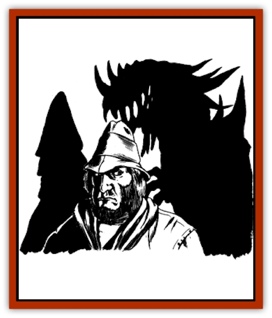
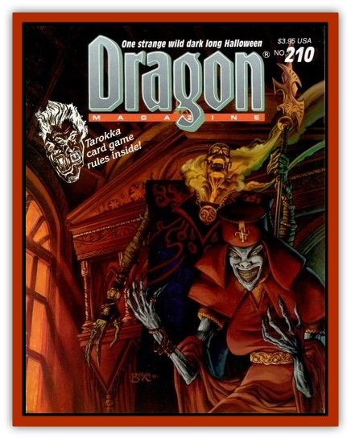

# Dark Lord

| Statistic | **Dark Lord** |
| --- | --- |
| **Activity Cycle:** | N/A |
| **Alignment:** | Chaotic evil |
| **Armor Class:** | -2 |
| **Climate/Terrain:** | Any, often subterranean |
| **Damage/Attack:** | 1d12 each |
| **Diet:** | Carnivore |
| **Frequency:** | Very rare |
| **Hit Dice:** | 13+ |
| **Intelligence:** | Exceptional to godlike (15-21+) |
| **Magic Resistance:** | 50% |
| **Morale:** | Fearless (19-20) |
| **Movement:** | 12 |
| **No. Appearing:** | 1 |
| **No. of Attacks:** | 2 |
| **Organization:** | Solitary |
| **Size:** | M |
| **Special Attacks:** | Energy drain, aging |
| **Special Defenses:** | See below |
| **THAC0:** | See below |
| **Treasure:** | H |
| **XP Value:** | HD 13: 17,000 / HD 14: 18,000 / HD 15: 19,000 / etc. |

A dark lord is an extremely high level, chaotic evil NPC who was slain by a *sphere of annihilation* and has managed to return to the world as one of the undead. In essence, when the dark lord was killed, it was sucked into another dimension. The creature joined the ranks of the undead and has struggled its way back across the dimensions with one goal in mind: revenge on the living. In so doing, the dark lord has gained a number of powers dealing with other dimensions, gravity, and the space-time continuum.

A dark lord looks like the shadows of a person - but looks are deceiving. The monster is actually composed of material from the Negative Material Plane.

**Combat:** Any character who comes within 200' of a dark lord is slowed due to the effects of heavy gravity (no save allowed). On each successful hit, a dark lord not only causes 1-12 points of damage, but drains one energy level if a save vs. death is failed. It also ages its victim 10d4 years if a saving throw vs. spells is failed. Both the energy drain and aging apply to each of the dark lord's physical attacks. Thus, an unlucky character might lose two levels and age 80 years in one round.

In addition to its physical attacks, a dark lord can cast one spell per round. Consider the spell to be an innate power without the usual spell-casting requirements (e.g. no somatic gestures, incantations, or special components are needed). The dark lord has only nine spells that can be cast, but they are extremely powerful ones: *disintegrate*, *duo-dimension*, *alter reality*, *reverse gravity*, *maze*, *astral spell*, *gate*, *imprisonment*, and *time stop*.

The THAC0 of a dark lord depends on its level: 13th-14th = 7; 15th + = 5.

A cleric of level 9-13 can turn a dark lord on a roll of 20. A cleric of level 14+ can turn a dark lord on a roll of 19-20.

A dark lord can be hit only by magical weapons with a +2 or greater bonus. The following spells, or attack forms, have no effect on dark lords: *charm*, *sleep*, *enfeeblement*, *hold*, *cold*, *electricity*, *teleportation*, *polymorph*, *fear*, *magnetism*, *insanity*, *slow*, *disintegrate*, *maze*, *imprisonment*, gravity, time, paralysis, or death (including poison). Holy water will do only half normal damage on a dark lord. A *raise dead* spell will destroy a dark lord, but it is allowed a saving throw versus spells.

**Note:** Dark lords are even more powerful than [[Lich|liches]] and should be used cautiously by the DM.

**Habitat/Society:** Dark lords are strictly solitary and thus have no society. They prefer to inhabit lonely, forlorn places, especially ones that were once the abode of great evil. Graveyards, ruins, battlefields, isolated caverns, and wild wastelands are their preferred dwelling places. Sunlight does not harm dark lords, but they will stick to darkness or shadow if at all possible, making them harder to notice, and better fitting their mood and temperament.

---
## Discovery & Documentation

**Source Publication:** Dragon210 (1994)
**Campaign Setting:** Dragon Magazine
**Author(s):** Tom Moldvay, Jim Holloway

### Other Creatures Found in This Source Book
   * [[Charuntes|Charuntes]]
