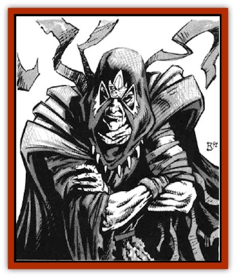

# Dark Stalker

| Statistic | **Dark Stalker** |
| --- | --- |
| **Activity Cycle:** | Night |
| **Alignment:** | Chaotic neutral |
| **Armor Class:** | 2 (10 see below) |
| **Climate/Terrain:** | Temperate/subterranean |
| **Damage/Attack:** | 1-6 (Weapon) |
| **Diet:** | Scavenger |
| **Frequency:** | Very rare |
| **Hit Dice:** | 2+1 |
| **Intelligence:** | Average (8-10) |
| **Magic Resistance:** | Nil |
| **Morale:** | Steady (12) |
| **Movement:** | 9 |
| **No. Appearing:** | 1 |
| **No. of Attacks:** | 1 |
| **Organization:** | Leader (See below) |
| **Size:** | M (6' tall) |
| **Special Attacks:** | See below |
| **Special Defenses:** | See below |
| **THAC0:** | 19 |
| **Treasure:** | See below |
| **XP Value:** | 175 |

Dark stalkers are the rarely-seen leaders of the [[Dark_Creeper|dark creepers]]. They direct the movements and actions of their diminutive cousins, who obey them unerringly and without hesitation.

Dark stalkers are instantly noticeable in a group of dark creepers, as they are man-sized and stand head and shoulders above their underlings. Pale and gaunt, with long, angular features, they dress primarily in dark hoods, capes, shirts and leggings, with ill-fitting and presumably stolen boots.

**Combat:** Dark stalkers prefer short swords, generally dipped in dark liquid to prevent any glint of reflected light. There is a 10% chance that the substance adhering to a dark stalker's sword will be poisonous or infectious. If such is the case and a saving throw against poison is unsuccessful, the poison or infection will do 14 hit points of additional damage, plus 1-4 additional points each round thereafter until slowed or cured.

Dark stalkers have the same *create darkness* ability as dark creepers, plus the ability to create a *wall of fog* twice per day. When confronted with a combat situation, they will use their *wall of fog* to complement the darkness being generated by their minions, but will usually reserve their second *wall of fog* and their own *create darkness* abilities for escape in the event of imminent defeat. They are, of course, not hindered by the darkness or the fog. They fight primarily through the dark creepers under their control, directing movements and attacks by uttering guttural snarls in their incomprehensible language. They show no compassion for the forces they command in battle, often directing entire segments of the dark creepers into suicide attacks, or sacrificing the whole number they direct in order to effect their own escape. If forced to fight, they will first attempt to escape by use of their *create darkness* and *wall of fog* abilities, as they too are only AC 10 if attacked in normal illumination. If unsuccessful, they will wield their short sword, which has a 25% chance of being magical. All of their treasure is carried on their person, with there being a 12% chance of 2-5 gems or 1-2 items of jewelry and a 7% chance of a magical ring on any individual. Chance of treasure recovery are lessened, however, by the fact that, upon death, dark stalkers explode in a blinding flash equal to, and with the same effect on carried items as, a 3 Hit Dice fireball. Of course. both PCs and NPCs within the area of effect of the fireball may sustain normal damage from it, and flammable objects may also be set alight by the effect of the flash. Some dark creepers have been seen to flee from battle to escape this effect should it be apparent that their leader is mortally wounded.

**Habitat/Society:** Stalkers will very rarely be encountered on their own. There is generally one dark stalker to every 25 dark creepers and each dark creeper village will contain at least one stalker ruler. Stalkers have never been seen to work or do any sort of manual labor. Instead, they stand impassively, directing the activities of dark creepers, while other creepers attend to their needs. The stalkers appear to be ruthless and vicious masters. Dark creepers have been seen to offer up their magical items to a dark stalker. Whether this is done as a matter of worshipful obeisance, or is an outright bribe, is unclear.

**Ecology:** Less is known of the ecology of dark stalkers than is known of dark creepers. Some believe that the dark stalkers are merely a superior strain of dark creepers who lead and control the others by birthright, much as a queen bee is similar to the worker bees and controls their activities.

All dark stalkers encountered to date have been adult males so far as is known. Perhaps the females and young are secreted in safe areas yet deeper underground. Or perhaps dark stalkers are biological or magical transformations of dark creepers, created when the current dark stalker leader of a clan of dark creepers expires, with such transformation triggered by the light and heat signal of the dark stalker's death scene.

**Dark Creeper**

  This creature has similar, though somewhat lesser, powers than a dark stalker and appears to regard the stalkers as leaders or masters. Around 25 of these will generally be found for each dark stalker.

---
## Discovery & Documentation

**Source Publication:** MC14 Fiend Folio Appendix (1992)
**Campaign Setting:** Fiends Folio
**Author(s):** Don Bingle, John Terra, Wes Nicholson, Tim Beach, Steve Hardinger, Kris Hardinger, Rob Nicholls, Greg Swedberg, Al Boyce, Vince Garcia, Norm Ritchie

### Other Creatures Found in This Source Book
   * [[Aballin|Aballin]]
   * [[Achaierai|Achaierai]]
   * [[Adherer|Adherer]]
   * [[Algoid|Algoid]]
   * [[Al-Mi'raj|Al-Mi'raj]]
   * [[Apparition|Apparition]]
   * [[Caterwaul|Caterwaul]]
   * [[Coffer_Corpse|Coffer Corpse]]
   * [[Crabman|Crabman]]
   * [[Dark_Creeper|Dark Creeper]]
   * [[Darter|Darter]]
   * [[Denzelian|Denzelian]]
   * [[Dune_Stalker|Dune Stalker]]
   * [[Dwarf_Urdunnir|Dwarf, Urdunnir]]
   * [[Falcon_Fire|Falcon, Fire]]
   * [[Faux_Faerie|Faux Faerie]]
   * [[Flawder|Flawder]]
   * [[Fyrefly|Fyrefly]]
   * [[Gambado|Gambado]]
   * [[Garbug|Garbug]]
   * [[Giant_Fhoimorien|Giant, Fhoimorien]]
   * [[Gibberling|Gibberling]]
   * [[Gorbel|Gorbel]]
   * [[Grimlock|Grimlock]]
   * [[Hellcat|Hellcat]]
   * [[Ice_Lizard|Ice Lizard]]
   * [[Iron_Cobra|Iron Cobra]]
   * [[Khargra|Khargra]]
   * [[Mantari|Mantari]]
   * [[Penanggalan|Penanggalan]]
   * [[Pernicon|Pernicon]]
   * [[Phantom_Stalker|Phantom Stalker]]
   * [[Retriever|Retriever]]
   * [[Ruve|Ruve]]
   * [[Scathe|Scathe]]
   * [[Sheet_Ghoul_Sheet_Phantom|Sheet Ghoul/Sheet Phantom]]
   * [[Shocker|Shocker]]
   * [[Spanner|Spanner]]
   * [[Stwinger|Stwinger]]
   * [[Sussurus|Sussurus]]
   * [[Symbiotic_Jelly|Symbiotic Jelly]]
   * [[Terithran|Terithran]]
   * [[Thunder_Children|Thunder Children]]
   * [[Troll_Ice|Troll, Ice]]
   * [[Tween|Tween]]
   * [[Umpleby|Umpleby]]
   * [[Volt|Volt]]
   * [[Xill|Xill]]
   * [[Xvart|Xvart]]
   * [[Zygraat|Zygraat]]
