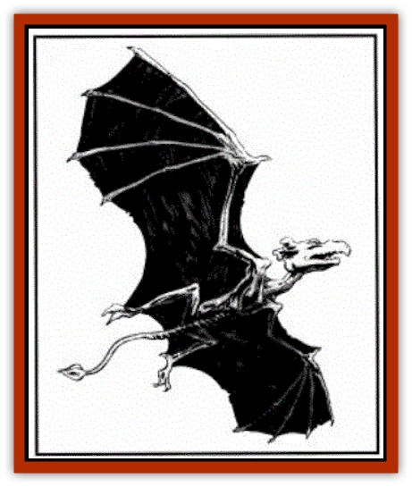

# Darkenbeast

| Statistic | **Darkenbeast** |
| --- | --- |
| **Activity Cycle:** | Night |
| **Alignment:** | Neutral |
| **Armor Class:** | 4 |
| **Climate/Terrain:** | Any |
| **Damage/Attack:** | 1-4/1-4/3-12 |
| **Diet:** | Carnivore |
| **Frequency:** | Very rare |
| **Hit Dice:** | 5+5 |
| **Intelligence:** | Semi- (2-4) |
| **Magic Resistance:** | 25% |
| **Morale:** | Steady (11-12) |
| **Movement:** | 18 |
| **No. Appearing:** | See below |
| **No. of Attacks:** | 1 or 3 |
| **Organization:** | Pack |
| **Size:** | M (4-5') |
| **Special Attacks:** | Rear claws 1-4/1-4 |
| **Special Defenses:** | Immune to mind control |
| **THAC0:** | 19 |
| **Treasure:** | Nil |
| **XP Value:** | 975 |

The darkenbeast, also known as the death horror, is a normal animal that has been magically transformed into a savage beast under the control of the mage responsible for its transformation.

The darkenbeast resembles a cross between a miniature [[Wyvern|wyvern]] and a pterodactyl. It has a black, reptilian hide, fangs and claws, and dimly glowing red eyes. The darkenbeast measures three to four feet long and has a wingspan of six feet.

**Combat:** The darkenbeast attacks with either its fangs or a combination of fangs and claws. The bite inflicts 3d4 points of damage while each claw causes 1d4 points.

Darkenbeasts suffer a -1 penalty to their attack rolls when exposed to bright light.

These creatures operate under the telepathic direction of the mage who created them and thus do not check for morale. They are immune to mind- or monster-comtrolling spells. They cannot be summoned by another wizard. However, if a darkenbeast is ordered to attack its normal master (for example, a dog's owner), the beast resists the order if it rolls a successful saving throw vs. spell. In this case, the creature remains as a darkenbeast but it again acts as its normal self and obeys its true master.

**Habitat/Society:** The darkenbeast is a magical creation with a limited existence. A mage casts the *darkenbeast* spell on one or more normal animals, usually domestic or local animals, such as sheep and [[Dog|dogs]]. Only animals of 2 Hit Dice or less are affected.

The affected animals are transformed into darkenbeasts within three rounds. The spell can be cast only in the absence of sunlight (i.e., at night or indoors). The transformation lasts until they are exposed to daylight; at that time any living or dead darkenbeasts revert to their natural form.

Darkenbeasts automatically obey the telepathic commands of their creator, thus they do not need to be trained or controlled by means such as leashes, verbal commands, or gestures. The mage can give the darkenbeasts limited orders based on mental images. The darkenbeasts then hunt down or pursue the quarry portrayed in those images. The darkenbeasts carry out this task until the task is accomplished, the darkenbeasts are slain, or daylight breaks the spell.

Regardless of the nature of the original animals used, all darkenbeasts are carnivorous. Because the spell uses local animals, the mage gains several advantages over using other, permanent beasts. He can replace his creations as needed; because of the daylight reversion, darkenbeasts leave little trace of their existence; adventurers who slay the monsters face the wrath of the livestock's proper owners when they discover their animals dead.

**Ecology:** Darkenbeasts are useful when a mage needs allies or distractions to use against a foe. Mages dwelling in subterranean regions away from daylight may keep a permanent pack of darkenbeasts as guard animals.

Mages who dwell in subterranean regions (such as Undermountain or the vast Underdark) can keep a permanent pack of darkenbeasts on hand as guards of important areas or treasure, or as winged assassins. Drow mages have been known to make use of darkenbeasts against their traditional enemies: dwarves, svirfneblin, and even surface elves when the dark elves mount nighttime raids against their above-ground cousins.

<h3>Create Darkenbeast</h3>  
| 5th-level Wizard Spell |
| --- |
| Sphere: Alteration |
| Range: Touch |
| Components: V, S, M |
| Duration: Permanent |
| Casting Time: 1 hour |
| Area of Effect: Special |
| Saving Throw: None |

This spell enables a mage to transform one or more [[Mammal|mammals]] into darkenbeasts. The animals to be transformed must all be within a 20-foot-diameter circle. The spell automatically affects ordinary, nonmagical mammals of animal or semi-intelligence. Animals with an Intelligence of 5 or more get a saving throw to resist the spell. Only animals of 2 Hit Dice or less are affected by this spell. Humans, humanoids, and demihumans are immune. The mage can transform one animal for each level of experience.

The spell can be cast only in darkness (i.e., night, inside, or underground) and its effects last until daylight strikes the darkenbeast. At that time, the creature automatically reverts to its true form. Slain darkenbeasts also revert at this time. The spell *sun ray* or the magic of a sun sword breaks the spell, but *continual light* and *light* spells have no effect.

The material component is dried wyvern's blood

---
## Discovery & Documentation

**Source Publication:** MC3 Volume III Forgotten Realms Appendix I (1989)
**Campaign Setting:** Forgotten Realms
**Author(s):** William Connors, David Martin, Rick Swan, Gary Thomas

### Other Creatures Found in This Source Book
   * [[Asperii|Asperii]]
   * [[Belabra|Belabra]]
   * [[Berbalang|Berbalang]]
   * [[Bhaergala|Bhaergala]]
   * [[Bichir|Bichir]]
   * [[Bunyip|Bunyip]]
   * [[Burbur|Burbur]]
   * [[Cloaker|Cloaker]]
   * [[Crawling_Claw|Crawling Claw]]
   * [[Dracolich|Dracolich]]
   * [[Dragon_Oriental_Carp_Yu_Lung|Dragon, Oriental, Carp (Yu Lung)]]
   * [[Dragon_Oriental_Celestial_T'ien_Lung|Dragon, Oriental, Celestial (T'ien Lung)]]
   * [[Dragon_Oriental_Coiled_Pan_Lung|Dragon, Oriental, Coiled (Pan Lung)]]
   * [[Dragon_Oriental_Earth_Li_Lung|Dragon, Oriental, Earth (Li Lung)]]
   * [[Dragon_Oriental_Lung_General_Information|Dragon, Oriental (Lung), General Information]]
   * [[Dragon_Oriental_River_Chiang_Lung|Dragon, Oriental, River (Chiang Lung)]]
   * [[Dragon_Oriental_Sea_Lung_Wang|Dragon, Oriental, Sea (Lung Wang)]]
   * [[Dragon_Oriental_Spirit_Shen_Lung|Dragon, Oriental, Spirit (Shen Lung)]]
   * [[Dragon_Oriental_Typhoon_Tun_Mi_Lung|Dragon, Oriental, Typhoon (Tun Mi Lung)]]
   * [[Dragonet_Faerie_Dragon|Dragonet, Faerie Dragon]]
   * [[Firenewt|Firenewt]]
   * [[Firestar|Firestar]]
   * [[Fish_Ascallion|Fish, Ascallion]]
   * [[Fish_Vurgens|Fish, Vurgens]]
   * [[Meazel|Meazel]]
   * [[Medusa_Maedar|Medusa, Maedar]]
   * [[Mist_Crimson_Death|Mist, Crimson Death]]
   * [[Revenant|Revenant]]
   * [[Rhaumbusun|Rhaumbusun]]
   * [[Strider_Giant|Strider, Giant]]
   * [[Thessalmonster|Thessalmonster]]
   * [[Web_Living|Web, Living]]
   * [[Wemic|Wemic]]
