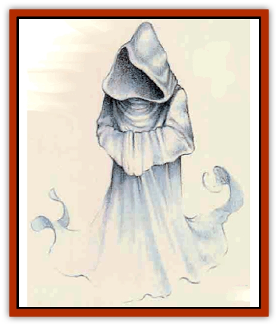

# Darkhood

| Statistic | **Darkhood** |
| --- | --- |
| **Activity Cycle:** | Night |
| **Alignment:** | Neutral evil |
| **Armor Class:** | -2 |
| **Climate/Terrain:** | Subterranean |
| **Damage/Attack:** | 1d4 (touch) |
| **Diet:** | Fear |
| **Frequency:** | Very rare |
| **Hit Dice:** | 13 |
| **Intelligence:** | High (14) |
| **Magic Resistance:** | Nil |
| **Morale:** | Fearless (20) |
| **Movement:** | 24 (see below) |
| **No. Appearing:** | 1d2 |
| **No. of Attacks:** | 1 |
| **Organization:** | Solitary |
| **Size:** | M (6' tall) |
| **Special Attacks:** | Fear, pursuit |
| **Special Defenses:** | +2 or better weapon to hit; immunities (see below) |
| **THAC0:** | 7 |
| **Treasure:** | (W) |
| **XP Value:** | 5,000 |

The darkhood (also called a *rorphyr*) is a spectral undead creature that thrives on fear. Although the creature seldom causes much physical harm to its fleeing victims, it often leaves a party of adventurers scattered, weakened, and vulnerable to attack by other monsters.

The darkhood appears as a translucent gray figure wearing a cowled robe, with its face completely shrouded in shadow. It does not speak, though many scholars suspect it understands several human and demihuman languages.

**Combat:** Within its domain of abandoned ruins or shadowed lands, a darkhood glides insubstantially, and can even travel through solid objects to stalk its prey.

The darkhood draws fey visions from the dark depths of its victims' imaginaions. Those who are the most intelligent have the most fertile minds and thus are the most susceptible to the darkhood's attack.

All who see a darkhood must make a *reversed* ability check by rolling *higher* than their Intelligence on 1d20. Characters who have recently suffered particularly harrowing experiences may receive a penalty of from 1 to 3 from their die roll (at the discretion of the DM).

To those who pass the reversed Intelligence check, the shadowy void beneath the creature's cowl rqmains empty. To those who fail, the cowl fills with hideous visions from their own nightmares. Characters experiencing a hideous vision flee in terror from the darkhood, running maniacally at top speed for 1d4+2 rounds, changing direction every round at random.

Running from a darkhood is exhausting. Fleeing characters must make a saving throw vs. spell each round of flight or temporarily lose 1d3 points of Constitution, plus any hit points that may result from a Constitution bonus being lowered. Any character whose Constitution drops below 3 will fall unconscious until it rises to 3 or more. Lost Constitution is regained at a rate of 1 point per turn.

The darkhood ignores unconscious victims, and gives up its "attacks" once all of its victims have collapsed, recovered from the fear, or left its territory. The creature, sated from the hunt, then returns to its lair.

A character who has once experienced fear from a darkhood and has recovered from it is immune to future attacks from that aeature for the next 24 hours.

In melee, the darkhood attacks with a chilling touch that inflicts 1d4 points of damage and fiUs the victim with an overwhelming terror which has the same effect as a vision seen in the creature's hooded "face" (a saving throw vs. spell applies).

A darkhood can be hit only by magical weapons of 1-2 enchannnent or better, and (like other undead) is immune to spells such as *sleep*, *charm*, *hold*, and to cold and poison.

A darkhood is turned as a vampire.

**Habitat/Society:** Each darkhood has a particular territory - typically a small area in a crypt, dungeon, or abandonened village. The darkhood cannot leave its territory. Within those confines, however, it enjoys complete freedom of movement. Unimpeded by solid objects, it often appears unexpectedly, emerging from a wall, floor, or ceiling.

The darkhood pursues encountered creatures until they drop, often overtaking them by moving unseen through the walls so as to suddenly appear in front of them. In this way, the darkhood keeps fleeing victims herded within its territory until the collapse from fear and it can feed.

**Ecology:** Darkhoods are lonely creatures. Only rarely is more than one encountered, and never more than two haunt the same territory. Legends say that darkhoods are the restless life forces of those who died in a state of extreme terror, especially  terror of death itself. To maintain its connection to its territory, the darkhood feeds on the terror of other sapient beings, thus replenishing its own energies. No one has yet found a way to communicate with or adequately study a darkhood, and so the truth behind the legends remains unsubstantiated.

Occasionally, the tie of a darkhood to an area is so strong that it cannot be dismissed, dispelled, or dispersed through magical combat. If vanquished in combat, the darkhood later re-forms and returns to its territory. In many of these cases there is a special reason for the darkhood's haunting. If this can be discovered, and certain actions taken, the darkhood can be put to rest permanently.

---
## Discovery & Documentation

**Source Publication:** Mystara Appendix (1994)
**Campaign Setting:** Mystara
**Author(s):** John Nephew, Teeuwynn Woodruff, John Terra, Skip Williams

### Other Creatures Found in This Source Book
   * [[Actaeon|Actaeon]]
   * [[Agarat|Agarat]]
   * [[Ash_Crawler|Ash Crawler]]
   * [[Baldandar|Baldandar]]
   * [[Bargda|Bargda]]
   * [[Bhut|Bhut]]
   * [[Bird_Mystara|Bird (Mystara)]]
   * [[Blackball|Blackball]]
   * [[Choker|Choker]]
   * [[Coltpixie|Coltpixie]]
   * [[Crone_of_Chaos|Crone of Chaos]]
   * [[Darkwing|Darkwing]]
   * [[Decapus|Decapus]]
   * [[Deep_Glaurant|Deep Glaurant]]
   * [[Diabolus|Diabolus]]
   * [[Dimensional_Warper|Dimensional Warper]]
   * [[Dragon_Mystara_Crystalline|Dragon (Mystara), Crystalline]]
   * [[Dragon_Mystara_Jade|Dragon (Mystara), Jade]]
   * [[Dragon_Mystara_Onyx|Dragon (Mystara), Onyx]]
   * [[Dragon_Mystara_Ruby|Dragon (Mystara), Ruby]]
   * [[Drake_Mystara|Drake (Mystara)]]
   * [[Dragonfly|Dragonfly]]
   * [[Dusanu|Dusanu]]
   * [[Elemental_of_Chaos_Air_Earth|Elemental of Chaos, Air/Earth]]
   * [[Elemental_of_Chaos_Fire_Water|Elemental of Chaos, Fire/Water]]
   * [[Elemental_of_Law_Air_Earth|Elemental of Law, Air/Earth]]
   * [[Elemental_of_Law_Fire_Water|Elemental of Law, Fire/Water]]
   * [[Familiar_Mystara|Familiar (Mystara)]]
   * [[Frost_Salamander|Frost Salamander]]
   * [[Fundamental_Air_Earth|Fundamental, Air/Earth]]
   * [[Fundamental_Fire_Water|Fundamental, Fire/Water]]
   * [[Gargantua_Mystara|Gargantua (Mystara)]]
   * [[Geonid|Geonid]]
   * [[Ghostly_Horde|Ghostly Horde]]
   * [[Giant_Athach|Giant, Athach]]
   * [[Giant_Hephaeston|Giant, Hephaeston]]
   * [[Golem_Drolem|Golem, Drolem]]
   * [[Golem_Mystara_I|Golem (Mystara) I]]
   * [[Golem_Mystara_II|Golem (Mystara) II]]
   * [[Golem_Mystara_III|Golem (Mystara) III]]
   * [[Gray_Philosopher|Gray Philosopher]]
   * [[Guardian_Warrior|Guardian Warrior]]
   * [[Gyerian|Gyerian]]
   * [[Herex|Herex]]
   * [[Hivebrood|Hivebrood]]
   * [[Horde|Horde]]
   * [[Hsiao|Hsiao]]
   * [[Huptzeen|Huptzeen]]
   * [[Hutaakan|Hutaakan]]
   * [[Imp_Mystara|Imp (Mystara)]]
   * [[Jellyfish_Giant_Mystara|Jellyfish, Giant (Mystara)]]
   * [[Kna|Kna]]
   * [[Kopru|Kopru]]
   * [[Lizard_Mystara|Lizard (Mystara)]]
   * [[Lizard-kin_Mystara|Lizard-kin (Mystara)]]
   * [[Lupin|Lupin]]
   * [[Lycanthrope_Werejaguar_Mystara|Lycanthrope, Werejaguar (Mystara)]]
   * [[Lycanthrope_Wereswine|Lycanthrope, Wereswine]]
   * [[Magen|Magen]]
   * [[Manikin|Manikin]]
   * [[Mek|Mek]]
   * [[Mujina|Mujina]]
   * [[Nagpa|Nagpa]]
   * [[Neh-thalggu|Neh-thalggu]]
   * [[Nightshade_Mystara|Nightshade (Mystara)]]
   * [[Nuckalavee|Nuckalavee]]
   * [[Pegataur|Pegataur]]
   * [[Phanaton|Phanaton]]
   * [[Plant_Dangerous_Mystara|Plant, Dangerous (Mystara)]]
   * [[Plasm|Plasm]]
   * [[Rakasta|Rakasta]]
   * [[Rock_Man|Rock Man]]
   * [[Sabreclaw|Sabreclaw]]
   * [[Sacrol|Sacrol]]
   * [[Scamille|Scamille]]
   * [[Shapeshifter|Shapeshifter]]
   * [[Shargugh|Shargugh]]
   * [[Shark-kin|Shark-kin]]
   * [[Sollux|Sollux]]
   * [[Spectral_Death|Spectral Death]]
   * [[Spectral_Hound|Spectral Hound]]
   * [[Spider-kin|Spider-kin]]
   * [[Spirit_Mystara|Spirit (Mystara)]]
   * [[Statue_Living|Statue, Living]]
   * [[Surtaki|Surtaki]]
   * [[Tabi|Tabi]]
   * [[Thoul|Thoul]]
   * [[Thunderhead|Thunderhead]]
   * [[Tiger_Ebon|Tiger, Ebon]]
   * [[Topi|Topi]]
   * [[Tortle|Tortle]]
   * [[Vampire_Velya|Vampire, Velya]]
   * [[White_Fang|White Fang]]
   * [[Worm_Mystara|Worm (Mystara)]]
   * [[Wyrd|Wyrd]]
   * [[Yowler|Yowler]]
   * [[Zombie_Lightning|Zombie, Lightning]]
