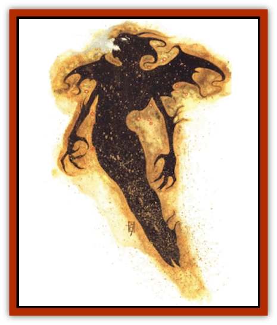

# Darklight

| Statistic | **Darklight** |
| --- | --- |
| **Activity Cycle:** | Any |
| **Alignment:** | Any evil |
| **Armor Class:** | 0 |
| **Climate/Terrain:** | Quasiplane of Radiance (any) |
| **Damage/Attack:** | 1d4/1d4 |
| **Diet:** | Life energy |
| **Frequency:** | Very rare |
| **Hit Dice:** | 6+6 (but see below) |
| **Intelligence:** | Very (11-12) |
| **Magic Resistance:** | Nil |
| **Morale:** | Champion (15-16) |
| **Movement:** | Fl 12 (C) |
| **No. Appearing:** | 1 |
| **No. of Attacks:** | 2 |
| **Organization:** | Solitary |
| **Size:** | M (6' tall) |
| **Special Attacks:** | Level drain, eye blast |
| **Special Defenses:** | Struck only by +1 weapons, invisibility, immunities |
| **THAC0:** | 13 (but see below) |
| **Treasure:** | Nil |
| **XP Value:** | 7,000 |

When a mortal spirit leaves its body upon death, it usually becomes a petitioner on the Outer Plane that most closely matches its alignment or devotion. But sometimes - particularly when the spirit's torn away in sudden and horrible violence - it loses its way en route to its final rest. Drawn inexorably toward the insatiable maw of the Negative Energy Plane, the spirit instead becomes an undead entity like a [[Spectre|spectre]], a [[Wraith|wraith]], or other horror. And even if it later returns to the Prime Material Plane, it retains its connection to the Negative Energy Plane, forever tethered like a slave on a chain or a hound on a leash.

However, the Inner Planes hold certains spots known as "leaks" - places where the energy or matter of one plane seeps onto another. When such a rift occurs on the Negative Energy Plane, spirits frequently try to flee through it in the hopes of giving the laugh to their all-consuming prison. 'Course, they almost always fail. Most or the time, these would-be escapees're drawn back by the negative energy. It's what powers them, after all.

If the leak leads to the Quasielemental Plane of Radiance, though, any spirits that manage to slip through are able to stay. Apparently, their link to the Negative Energy Plane is somehow negated or thwarted by the nature of Radiance. The  brilliantly illuminated quasiplane doesn't cause the negative energy itself to dissipate - the spirits're still infused with its dark force, still able to move about freely despite being dead (or, really, undead) - but it does alter them. Radiance adopts these wayward phantoms, making them its own. Yet still they retain the darkness in their hearts - and their thirst for life.

A darklight is an animate, undead apparition on the Quasielemental Plane of Radiance with a link to the place just as strong as the connection a standard wraith might have to the Negative Energy Plane. That is, in many ways of looking at it, the darklight can exist on Radiance and one other plane (the Ethereal, the Prime, or any of the Inner Planed at the same time.

Canny planewalkers can recognize a darklight without too much trouble. It looks like a man-shaped specter of blackness with bright, shining eyes of everchanging colors, and its whole form is surrounded by a nimbus of multicolored light.

As an intelligent creature, a darklight can speak planar common and any other languages it knew from its mortal life.

**Combat:** Most berks're surprised to discover the many, many ways that a darklight can rob them of their lives. Before now, little'd been recorded about these creatures, meaning that scholars and explorers had to learn the dark the hard way. Few survived the initial lesson.

First and foremost, a darklight retains the ability to steal the life force of others, just like all undead with ties to the Negative Energy Plane. The creature's cold, soul-numbing touch drains two levels from its victims. But since its link with the Negative Plane has been altered, the darklight absorbs the energy directly into itself, thus gaining Hit Dice in direct proportion to the levels ingested. Statistics associated with Hit Dice, including hit points and THAC0, also improve. These enhancements fade after 1d4 hours, or sooner if the victim somehow regains his lost levels (through a *restoration* spell or similar magic).

A darklight can also become invisible once per day. Though it might fade from sight in order to avoid trouble or escape from an enemy, the creature enjoys using *invisibility* to gain surprise on an unsuspecting foe. That makes it easier to rend the poor sod to bits with its claws, which are made of both darkness and light and cause 1d4 points of damage each. As a creature of Radiance, a darklight can also direct blasts of light and color from its eyes. Depending on its need, the undead monster can use the blasts in several different ways:

<ul><li>Once every three rounds, they can blind a foe permanently if the sod fails a saving throw vs. paralyzation.</li><li>Three times per day, they can duplicate the effects of a *color spray*.</li><li>Once per day, they can become a much more potent *prismatic spray*.</li><li>Once per day, they can form a *prismatic wall*.</li></ul>Any time that the darklight's not shooting out these blasts, its everchanging eyes scintillate with a *hypnotic pattern*.

With all these formidable powers, a body wouldn't think that a darklight'd need much in the way of defensive abilities. Maybe not, but it's got 'em just the same. The creature can be struck only by weapons of +1 or greater enchantment. It's immune to the effects of paralysis, petrification, poison, *charm*, *hold*, *sleep*, and magic that's based on cold, light, or darkness (the thing can always see, regardless of light conditions). Finally. a darklight has the uncanny ability to move right through *walls of force* as if they didn't exist.

**Habitat/Society:** Darklights rarely interact with other creatures or even others or their own kind, insisting upon a solitary existence. However, they make an exception for the Radiance-dwelling creatures known as incandescents or [[Scile|scile]] - tiny beings of light that literally eat the colors of the plane. Some scile hunger for the colors of things not native to Radiance, however, and a darklight may form a symbiotic relationship with them.

In these cases, the scile center their cloud around their new ally, using their power in conjunction with that of the undead creature to attack outsiders found on the plane (and never each other). Darklights who form these relationships learn to detect sods who've already been rendered transparent by the scile; thus, they'd not hindered by their victims' odd condition.

**Ecology:** Other than its occasional strange alliance with the scile, the darklight serves no real function in the ecology of the Quasiplane of Radiance. It preys only upon non-natives.

Off the plane, though, darklights are vicious predators that attack any living beings, feeding of their victims' life forces. They prefer to sap the vitality of thinking creatures, but this simply may be a facet of their evil nature (as opposed to true biological need).

Chant is that certain spells have been developed that can summon a darklight from Radiance to any "connected" plane (the Ethereal, the Prime, or any of the other Inner Planes). While this is probably true, one thing is certain - a summoned darklight remains on the new plane. There seems to be no way to force the monster to go back.

---
## Discovery & Documentation

**Source Publication:** Planescape III (1996)
**Campaign Setting:** Planescape
**Author(s):** Monte Cook

### Other Creatures Found in This Source Book
   * [[Animental|Animental]]
   * [[Archomental_Evil|Archomental, Evil]]
   * [[Archomental_Good|Archomental, Good]]
   * [[Belker|Belker]]
   * [[Bzastra|Bzastra]]
   * [[Chososion|Chososion]]
   * [[Devete|Devete]]
   * [[Devourer_Planescape|Devourer (Planescape)]]
   * [[Dharum_Suhn|Dharum Suhn]]
   * [[Egarus|Egarus]]
   * [[Elemental_Athas_Lesser_Air_Earth|Elemental (Athas), Lesser, Air/Earth]]
   * [[Elemental_Athas_Lesser_Fire_Water|Elemental (Athas), Lesser, Fire/Water]]
   * [[Elemental_Fire_Kin_Salamander_II|Elemental, Fire Kin, Salamander II]]
   * [[Entrope|Entrope]]
   * [[Facet|Facet]]
   * [[Frost_Salamander|Frost Salamander]]
   * [[Fundamental_Air_Earth|Fundamental, Air/Earth]]
   * [[Fundamental_Fire_Water|Fundamental, Fire/Water]]
   * [[Fundamental_All_Elements|Fundamental, All Elements]]
   * [[Garmorm|Garmorm]]
   * [[Homunculus_Elemental|Homunculus, Elemental]]
   * [[Immoth|Immoth]]
   * [[Khargra|Khargra]]
   * [[Klyndes|Klyndes]]
   * [[Magran|Magran]]
   * [[Menglis|Menglis]]
   * [[Nathri|Nathri]]
   * [[Ooze_Sprite|Ooze Sprite]]
   * [[Paraelemental|Paraelemental]]
   * [[Phirblas|Phirblas]]
   * [[Psurlon|Psurlon]]
   * [[Quasielemental_Negative|Quasielemental, Negative]]
   * [[Quasielemental_Positive|Quasielemental, Positive]]
   * [[Rast|Rast]]
   * [[Ravid|Ravid]]
   * [[Ruvoka|Ruvoka]]
   * [[Scile|Scile]]
   * [[Shad|Shad]]
   * [[Shocker|Shocker]]
   * [[Sislan|Sislan]]
   * [[Suisseen|Suisseen]]
   * [[Terithran|Terithran]]
   * [[Thoqqua|Thoqqua]]
   * [[Trilloch|Trilloch]]
   * [[Tsnng|Tsnng]]
   * [[Ungulosin|Ungulosin]]
   * [[Vacuous|Vacuous]]
   * [[Wavefire|Wavefire]]
   * [[Xag-Ya_Xeg-Yi|Xag-Ya/Xeg-Yi]]
   * [[Xill|Xill]]
