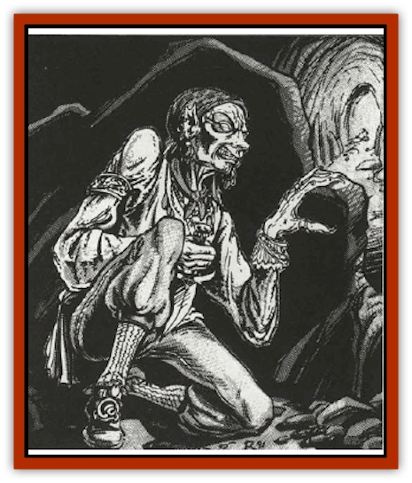

# Darkling

| Statistic | **Darkling** |
| --- | --- |
| **Activity Cycle:** | Any |
| **Alignment:** | Chaotic evil |
| **Armor Class:** | 8 (10) |
| **Climate/Terrain:** | Any land |
| **Damage/Attack:** | 1d4 (or by weapon) |
| **Diet:** | Omnivore |
| **Frequency:** | Very rare |
| **Hit Dice:** | 2 |
| **Intelligence:** | Very (11-12) |
| **Magic Resistance:** | Nil |
| **Morale:** | Average (9) |
| **Movement:** | 12 |
| **No. Appearing:** | 1 |
| **No. of Attacks:** | 1 |
| **Organization:** | Solitary |
| **Size:** | M (6') |
| **Special Attacks:** | See below |
| **Special Defenses:** | See below |
| **THAC0:** | 19 |
| **Treasure:** | J,K,M (A) |
| **XP Value:** | 420 |

The darkling is a member of the [[Human_Vistana|Vistani]] (see the Ravenloft� Boxed Set) who has been cast out from his people. No longer tied to the fabric of the demiplane in the same way that he once was, the darkling becomes more and more evil with the passing of time. In the end, he or she is utterly corrupted by the gloom of the surrounding land.

Darklings look much like their distanced Vistani cousins, save that their skin tends to be even darker and they are almost uniformly gaunt. Their features are sunken and worn, making them look as if they had been far too long without nourishment. They dress much like other Vistani, save that they lose their taste for bright colors and tend to wear drab earth tones.

Darklings want as little to do with true Vistani as possible, but often prey on normal men and their societies. They speak the common tongue of men and are generally familiar with a handful (3 to 6) other languages or dialects.

**Combat:** The darkling still clings to a portion of the power that was once his. As such, he is a dangerous and clever opponent. Perhaps the most important of his abilities is that of *foreseeing*, Because the darkling has an innate sense of what his enemies are about to do, he is never surprised and makes all saving throws automatically. In addition, the darkling imposes a -2 penalty on all opponents' surprise rolls. For this reason, the darkling often strikes from ambush.

In melee combat, the darkling will generally rely on light arms like daggers and short swords, doing damage according to the weapon employed. The use of lethal poisons on bladed weapons is a darkling trademark, however, so those who suffer even a minor scratch from a darkling blade may be in deadly peril. The toxin created by a darkling is similar to type E poisons (injected, immediate, death/20) and they will share the secrets of its creation with no one. It is rumored that even the Vistani cannot duplicate the poisons of their distanced kin.

If a darkling attains surprise when it attacks someone, it will often employ its *evil eye*. This curse is a variant on the traditional Vistani enchantment and causes its victims to suffer a -2 on all attack rolls and saving throws unless they save vs. spells.

**Habitat/Society:** Having been cast out of the Vistani society for some crime or wrongful act, the darkling often gathers a band of human thugs around him and takes up a life of heinous crime and wandering brutality. While they are unable to cross the misty borders between the domains of Ravenloft, a darkling is said to know every stone and tree in the domain he dwells in. This imprisonment in a single domain is quite painful to a people as full of wanderlust as the Vistani and serves to fuel the evil desire for vengeance that burns in the darkling's heart.

Often, a darkling will work toward some grand scheme which he feels will allow him to escape from the domain he is imprisoned in (or even from Ravenloft itself) and strike back at his former people in some way. Since the Vistani are in far better harmony with the environment than their darkling outcasts, such plans of vengeance are seldom anything but failures.

Darklings often claim to retain more of their fortune telling power than they truly do. Predictions offered by them, however, are either lies or educated guesses.

**Ecology:** The darkling lives either alone or as the leader of a small band of thugs and ruffians. He looks upon the Vistani as cruel people who have done him wrong and upon normal men as pawns and objects of prey. To the darkling, the world has committed a great wrong and now owes him a great debt. Thus, he looks upon all material things as his rightful property and takes what he needs without regard for the consequences of his actions.

The death of a darkling usually (90%) draws the attention of the nearest Vistani group. Within a week, they arrive at the location of the demise, bury the body (if such is still available), and perform an ancient rite designed to soothe the spirit of their tortured brother and allow him to rest in eternal peace. If this ritual is not completed, there is a 90% chance that the darkling will return in 1-6 weeks as a [[Ghoul|ghast]] (if the body is intact) or as a [[Wraith|wraith]] (if the body has been destroyed). This undead creature will then hunt down those men who served it in life and kill them, transforming them into [[Ghoul|ghouls]] (if the darkling returns as a ghast) or [[Wight|wights]] (if it is a wraith). Thus, its evil band will again plague the lands.

---
## Discovery & Documentation

**Source Publication:** MC10 Ravenloft Appendix I (1989)
**Campaign Setting:** Planescape
**Author(s):** William W. Connors

### Other Creatures Found in This Source Book
   * [[Bastellus|Bastellus]]
   * [[Bat_Ravenloft|Bat (Ravenloft)]]
   * [[Bowlyn|Bowlyn]]
   * [[Broken_One|Broken One]]
   * [[Bussengeist|Bussengeist]]
   * [[Doom_Guard|Doom Guard]]
   * [[Doppelganger_Plant|Doppelganger Plant]]
   * [[Elemental_Ravenloft|Elemental (Ravenloft)]]
   * [[Ermordenung|Ermordenung]]
   * [[Ghoul_Lord|Ghoul Lord]]
   * [[Goblyn|Goblyn]]
   * [[Golem_III|Golem III]]
   * [[Golem_IV|Golem IV]]
   * [[Golem_Ravenloft|Golem (Ravenloft)]]
   * [[Grim_Reaper|Grim Reaper]]
   * [[Human_Abber_Nomad|Human, Abber Nomad]]
   * [[Human_Ravenloft|Human (Ravenloft)]]
   * [[Imp_Assassin|Imp, Assassin]]
   * [[Impersonator|Impersonator]]
   * [[Lycanthrope_Werebat|Lycanthrope, Werebat]]
   * [[Lycanthrope_Wereraven|Lycanthrope, Wereraven]]
   * [[Mist_Horror|Mist Horror]]
   * [[Mummy_Greater|Mummy, Greater]]
   * [[Quevari|Quevari]]
   * [[Quickwood|Quickwood]]
   * [[Ravenkin|Ravenkin]]
   * [[Reaver|Reaver]]
   * [[Scarecrow_Ravenloft|Scarecrow (Ravenloft)]]
   * [[Shadow_Fiend|Shadow Fiend]]
   * [[Skeleton_Giant|Skeleton, Giant]]
   * [[Strahd's_Skeletal_Steed|Strahd's Skeletal Steed]]
   * [[Treant_Evil|Treant, Evil]]
   * [[Treant_Undead|Treant, Undead]]
   * [[Valpurgeist|Valpurgeist]]
   * [[Vampire_Dwarf|Vampire, Dwarf]]
   * [[Vampire_Elf|Vampire, Elf]]
   * [[Vampire_Gnome|Vampire, Gnome]]
   * [[Vampire_Halfling|Vampire, Halfling]]
   * [[Vampire_General_Information|Vampire, General Information]]
   * [[Vampire_Kender|Vampire, Kender]]
   * [[Vampyre|Vampyre]]
   * [[Widow_Red|Widow, Red]]
   * [[Wolfwere_Greater|Wolfwere, Greater]]
   * [[Zombie_Lord|Zombie Lord]]
