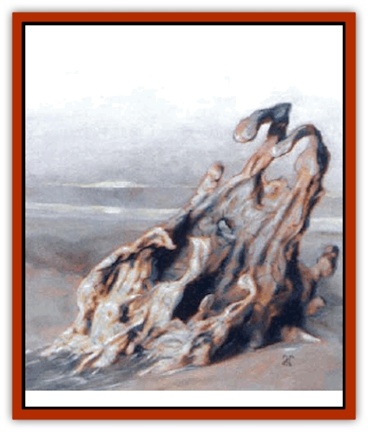

# Darklore

| Statistic | **Darklore** |
| --- | --- |
| **Activity Cycle:** | Any |
| **Alignment:** | Neutral evil |
| **Armor Class:** | 0 |
| **Climate/Terrain:** | Lower Planes |
| **Damage/Attack:** | 1d6 per attack |
| **Diet:** | Knowledge |
| **Frequency:** | Very rare |
| **Hit Dice:** | 6+2 |
| **Intelligence:** | Average (8-10) |
| **Magic Resistance:** | 20% |
| **Morale:** | Steady (11) |
| **Movement:** | 3 |
| **No. Appearing:** | 1 |
| **No. of Attacks:** | 1d6 |
| **Organization:** | Solitary |
| **Size:** | L (10' wide) |
| **Special Attacks:** | Absorb or bestow knowledge |
| **Special Defenses:** | +1 or better weapons to hit, half damage from edged weapons |
| **THAC0:** | 15 |
| **Treasure:** | Nil |
| **XP Value:** | 6,000 |

A darklore is a puddlelike beast that feeds on tainted knowledge, craving the taste of wicked secrets and foul truths. To sate its hunger, it stalks out the evil to drain them of their accumulated dark knowledge. In appearance, it is a wriggling, blue-gray mass of amorphous flesh, with dark green veins pulsing just below the surface of its entire body. It can form one to six tentaclelike pseudopods that can stretch to eight feet. The creature has no apparent eyes or other features.

**Combat:** Any creature struck by one of the darklore's pseudopods suffers 1d6 points of damage. A creature of evil alignment must make a successful saving throw vs. spell or lose one point of Intelligence. A creature of neutral alignment must make a similar saving throw only 50% of the time, while a good-aligned creature is affected only 25% of the time. The only creatures immune to the darklore's draining are those with no knowledge of evil, those too pure to possess dark secrets - most likely, creatures from the Upper Planes (these still suffer the 1d6 points of damage.)

Those completely sappes of Intelligence fall into a coma. Drained Intelligence returns at a rate of one point per week, to a maximum of the creature's previous total minus 1d4-1. In other words, 0-3 points of Intelligence are permanently lost.

A darklore can bestow knowledge upon a creature rather than steal it, but does so only when fighting foes of good or neutral alignment. During such a battle, a non-evil creature struck by a pseudopod must make a successful saving throw vs. spell or suddenly become aware of a dark secret (Intelligence points are *not* gained). The knowledge is so foul that good-aligned creatures who fail a saving throw are stunned for 1d2 rounds, unable to perforn any action. Neutral creatures are stunned only 50% of the time. Paladins who receive dark knowledge lose their status 1% of the time (an *atonement* spell can restore paladinhood lost in this way).

A DM can use a darklore to make a player character aware of certain secrets - or to rob him of facts he shouldn't know. Such tainted knowledge can include the location or key of a gate leading to the Lower Planes, the true name of a fiend, a wrongful deed committed (or planned) by others, details about an evil item or place, and so on. The character can then act on the knowledge gained (or must carry on with no memory of the stolen secret unless he learns it anew).

A darklore has the following spell-like abilities, each usable once per round: *darknesss 15' radius*, *detect good/evil*, *detect invisibility*, *clairaudience*, *clairvoyance*, *infravision*, and *teleport without error*. A darklore generally uses its spell-like powers to find prey. Because of its almost liquid nature, a darklore ran ooze through openings as small as 1 inch in diameter. A darklore can be harmed only by weapons of +1 or better enchantment. Of those, piercing and slashing weapons (types P and S) inflict only half damage.

**Habitat/Society:** Originally spawned in the first layer of the Gray Waste, darklores have since wormed their way across the entire Lower Planes. They seem to retain a link to their source of creation, preferring to stick close to the banks of the River Styx. Nevertheless, they're free to roam wherever they please.

Because the darklores feed on knowledge, they pose little threat to the less intelligent residents of the Lower Planes. Even most lesser fiends are just a light snack for them, and are often passed over in favor of more intelligent prey. Greater fiends fear the darklores, but they prize the creatures as well, for two reasons. First, a charmed or controlled darklore can be commanded to drain others of evil knowledege and then impart those secrets to its master; powerful fiends use darklores as insidious, information-gathering spies. Second, a darklore can teleport any creature whose name it knows. Thus, a mightly fiend can force a charmed darklore to absorb its name, and then can use *teleport without error* at will. (As a darklore can drain only wicked knowledge, the name must be an evil secret, or part of one. A fiend who surrenders his name to a darklore loses one point of Intelligence - permanently - and has to arrange to relearn his own name, perhaps simply by writing it down before it's sucked away, commanding a lackey to repeat it, and so on,.) The [[Yugoloth_General_Information|yugoloths]] have been ordered to kill or capture darklores on sight.

**Ecology:** Even by lower-planar standards, the darklore is an abomination - a fluke. They formed when the Maeldur Et Kavurik, an ancient creation of the yugoloths, plunged into the River Styx. The size of the behemoth splashed much of the foul water onto the shores - water that had absorbed all of the Maeldur's dark secrets and forbidden knowledge. Not even the canniest arcanaloth could have predicted that the puddles would congeal and gain sapience. The behemoth's strange essence somehow reacted with the foul waters and the nature of the Gray Wastes to create the darklores. No one knows how many were created by the Maeldur's splash, or whether they can reproduce. Those who know of them hope the answers are few and no.

---
## Discovery & Documentation

**Source Publication:** Monstrous Compendium, 1997 Annual, Volume 4 (1995)
**Campaign Setting:** Advanced Dungeons & Dragons 2nd Edition
**Author(s):** Jon Pickens

### Other Creatures Found in This Source Book
   * [[Anemone_Giant_Sea|Anemone, Giant Sea]]
   * [[Asperii|Asperii]]
   * [[Bainligor|Bainligor]]
   * [[Beast_of_Chaos|Beast of Chaos]]
   * [[Blindheim|Blindheim]]
   * [[Bloodsipper_Far_Realm|Bloodsipper (Far Realm)]]
   * [[Bulette_Gohlbrorn|Bulette, Gohlbrorn]]
   * [[Child_of_the_Sea|Child of the Sea]]
   * [[Clockwork_Horror|Clockwork Horror]]
   * [[Clockwork_Swordsman|Clockwork Swordsman]]
   * [[Coral|Coral]]
   * [[Dharculus|Dharculus]]
   * [[Dolphin_Athas|Dolphin (Athas)]]
   * [[Dragon_Neutral_Moonstone|Dragon, Neutral, Moonstone]]
   * [[Dragon_Prismatic|Dragon, Prismatic]]
   * [[Dream_Stalker|Dream Stalker]]
   * [[Dragon-kin_Albino_Wyrm|Dragon-kin, Albino Wyrm]]
   * [[Echyan|Echyan]]
   * [[Firestar|Firestar]]
   * [[Firetail|Firetail]]
   * [[Fish_Ascallion|Fish, Ascallion]]
   * [[Fish_Deep_Ocean|Fish, Deep Ocean]]
   * [[Fish_Tropical|Fish, Tropical]]
   * [[Fish_Vurgens|Fish, Vurgens]]
   * [[Fogwarden|Fogwarden]]
   * [[Fraal|Fraal]]
   * [[Giant_Crag|Giant, Crag]]
   * [[Gibberling_Brood|Gibberling, Brood]]
   * [[Glutton_Sea|Glutton, Sea]]
   * [[Golden_Ammonite|Golden Ammonite]]
   * [[Golem_Brass_Minotaur|Golem, Brass Minotaur]]
   * [[Golem_Gemstone|Golem, Gemstone]]
   * [[Golem_Maggot|Golem, Maggot]]
   * [[Groundling|Groundling]]
   * [[Hermit_Sea|Hermit, Sea]]
   * [[Hound_of_Law|Hound of Law]]
   * [[Human_Amazon|Human, Amazon]]
   * [[Human_Pygmy|Human, Pygmy]]
   * [[Inquisitor|Inquisitor]]
   * [[Kercpa|Kercpa]]
   * [[Kreel|Kreel]]
   * [[Lycanthrope_Lythari|Lycanthrope, Lythari]]
   * [[Mercurial|Mercurial]]
   * [[Mold_Chromatic|Mold, Chromatic]]
   * [[Mummy_Bog|Mummy, Bog]]
   * [[Neh-thalggu|Neh-thalggu]]
   * [[Nymph_Grain|Nymph, Grain]]
   * [[Nymph_Unseelie|Nymph, Unseelie]]
   * [[Octopus_Octo-Jelly|Octopus, Octo-Jelly]]
   * [[Puddingfish|Puddingfish]]
   * [[Sea_Demon|Sea Demon]]
   * [[Shade|Shade]]
   * [[Shadowrath|Shadowrath]]
   * [[Shark_Athas|Shark (Athas)]]
   * [[Siren_Ravenloft|Siren (Ravenloft)]]
   * [[Skeleton_Variant|Skeleton, Variant]]
   * [[Skyfish|Skyfish]]
   * [[Spectral_Scion|Spectral Scion]]
   * [[Spyder_Fiend|Spyder Fiend]]
   * [[Squid_Squark|Squid, Squark]]
   * [[Tanar'ri_Lesser_Uridezu|Tanar'ri, Lesser, Uridezu]]
   * [[Troll_Mutate|Troll Mutate]]
   * [[Vaati|Vaati]]
   * [[Vampire_Cerebral|Vampire, Cerebral]]
   * [[Varkha|Varkha]]
   * [[Wizshade|Wizshade]]
   * [[Worm_Lukhorn|Worm, Lukhorn]]
   * [[Wyste|Wyste]]
   * [[Yugoloth_Lesser_Gacholoth|Yugoloth, Lesser, Gacholoth]]
   * [[Zombie_Mud|Zombie, Mud]]
