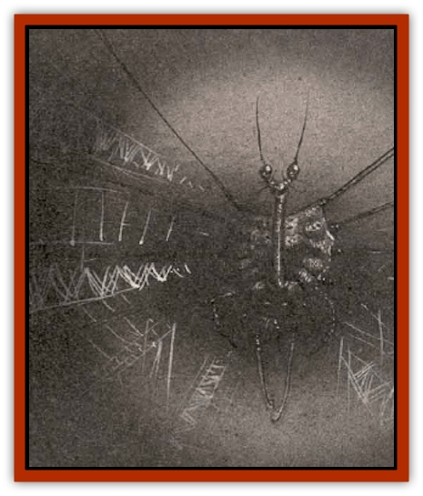

# Darkweaver

| Statistic | **Darkweaver** |
| --- | --- |
| **Activity Cycle:** | Night |
| **Alignment:** | Chaotic evil |
| **Armor Class:** | -4 (4) |
| **Climate/Terrain:** | Abyss, Limbo, Pandemonium |
| **Damage/Attack:** | 1d2 + Special |
| **Diet:** | Carnivore |
| **Frequency:** | Very rare |
| **Hit Dice:** | 6+2 |
| **Intelligence:** | Exceptional (15-16) |
| **Magic Resistance:** | 50% (10%) |
| **Morale:** | Elite (13-14) |
| **Movement:** | 9 |
| **No. Appearing:** | 1 |
| **No. of Attacks:** | 6 tentacles |
| **Organization:** | Solitary |
| **Size:** | M (4' body, 10' tentacles) |
| **Special Attacks:** | Web, magic use |
| **Special Defenses:** | Shadow |
| **THAC0:** | 15 |
| **Treasure:** | D |
| **XP Value:** | 8,000 |

The darkweaver's a strange and frightening creature, partly real and partly shadow. It dwells in the caves and grottos of some of the chaotic planes, particularly Pandemonium. Some cutters say the thing's native to the Demiplane of Shadow, and that it settled in this corner of the planes because it found conditions in the Abyss and Pandemonium to its liking. Not many sods've ever gotten a chance to question a darkweaver about its origins, and few of these even survived the experience.

The darkweaver creates webs of gloom and shadow just like a [[Spider|spider]] casts webs of silk. Its snares aren't easily detected, since it prefers to air in places where daylight never comes. A darkweaver's net an stretch for miles through twisted tunnels and dank caverns, trapping luckless sds onestradat a time until they've hopelessly cpught in its shadow. In its web, the darkweaver can manipulate the thoughts and emotions of its vitims until thes willingly walk into its dark embrace.

The darkweaver's form is amorphous and menacing, gliding like black oil over a cavern wall or pooling in  places where the shadow is deepest. Folds of darkness cling to ir like a cloak or a second skin. If the darkness surrounding it can be dispelled, the darkweaver's body is revealed to be a rubbery, spherical thing with strong wiry tentacles and shorter, thicker feeding proboscises. It's said that a body'd rather meet the Lady of Pain than see a darkweaver in the light.

**Combat:** The darkweaver tries to lure its victims into its web of shadow, or failing that, to weaver its web around them and prevent their escape. If the darkweaver's removed from its surrounding shadows, it flees as quickly as possible. The creature can't abide the touch of bright light.

The darkweaver's web can extend for hundred of yards. The outermost strands appear to be insubstantial at first; a basher can brush his hand right through one and feel only an eerie, oily chill. Shining a light on the web makes the strands fade into mere shadows, but they don't fade right - they seem to slither away like snakes. The weaver blends the edges of its web into surrounding natural shadows perfectly; there's only a 10% chance that a character notices the outer strands beforehe enters the web. (Rangers, experienced guides, or creatures with unusual acute senses have a 30% chance to detect the darkweaver's web).

Inside the outer layers of the web, vision drops to half normal. The shadowy strads easily give way to a creature moving toward the center, but a sod trying to get out finds that the shadowy strands don't retreat from his lihgt anymore; they cling to him and prevent his escape. Any creature trying to leave the web is reduced to half its normal movement and must successfully make a saving throw vs. spell to force its way through the shadowy strands.

If a sod enters the inner part of the web (usually an area about 100 yards across), he's caught for sure. Again, he's free to move toward the web's center, but to move back out he must successfully make a saving throw vs. spell or become *disoriented* and *slowed*. No matter which way e turns, he travels deeper toward the center. Even if the character makes a successful saving throw, he's still *slowed*. The darkweaver's web is thick enough to swallow any normal light, and vision's reduced to one-quarter normal. A lantern that casts a beam 60 feet illuminates a path only 15 feet long in the inner part of the web.

At the web's center, victims must successfully save vs. spell or become held. Even if they do succeed, they are still *slowed* and can't escape the center without killing the darkweaver or dispelling its web. The darkweaver's lair is here, and the web's center is as dark as the blackness of a *darkness* spell.

If the weaver can't entice a sod into entering its web, it may try to misdirect him into a passage it can close behind him, or get ahead of him and web the path he's using. A darkweaver can create one 10' cube of gloomweb per round; if it webs the same area twice, the thickness is equal to the inner part of its web, and a third time results in webbing as thick as what lies at the center of the darkeaver's web.

Once per round, the darkweaver can use the spell-like powers of *confusion*, *sleep*, or *suggestion* with a range of 60 feet. In any area of shadow or darkness, the darkweaver can become *invisible*, create 2 to 5 *mirror images*, or *teleport* up to 200 feet to another area of shadow. In addition, the creature can create *shades*, *solid fog*, or a *symbol of despair* once per day while it's in its own web. Darkweavers communicate by means of a limited form of *telepathy* with a 60-foot range; humans and demihumans perceive the creature's thoughts as sibiliant whisperings in the shadows.

The darkweaver uses its powers to immobilize its victims before drawing them near enough to feed. If possible, it attacks physically only when its victims arehopelessly entangled in the center of its web. The weaver attacks by lashing at its victims with its tentacles for 1d2 points of damage each; if it can hit a victim with at least four tentacles, it draws near enough to insert its feeding proboscises. These automatically inflict 2d4 points of damage per round, and the victim must successfully save versus spell or permanently lose 1 point of Constitution in each round of feeding. The darkweaver's victim can fight back only by trying to break free or attacking with a Type S weapon.

A weaver's forced to release a victim it has grasped of ot takes more than 15 points of damage, if the victim succeeds in a bend bars/lift gates roll, or if the darkweaver is struck with magical *light* of some kind.

The darkweaver's vulnerable to light-based attacks. A *light* spell destroy a 10' cube of its web and inflicts 1d3 points of damage on the creature before dissipating. A *continual light* destroys 1d6 10' cubes of the creature's web, dispels its shadow protection for 1 rpund, and inflicts 1d6 points of damage. Very powerful light effects such as a *sunray* or the *sunburst* effect of a *wand of illumination* inflict 2d10 points of damage, destroy 2d6 10' cubes of the web, and dispel the darkweaver's shadow for 1d6 hours. (The Armor Class and magic resistance in parentheses note the darkweaver's defenses without its shadow protection.)

**Habitat/Society:** The darkweaver haunts subterranean passageways, gloomy forests, and dismal swamps throughout the Abyss, Pandemonium, and Limbo. It's also been rumored that great numbers of the creatures dwell on the Demiplane of Shadow. The darkweaver is asexual and reproduces by division, although this is a very rare occurence. A sod who runs across a darkweaver that's just divided should be aware that the young creature's a 3 HS version of its parent.

Darkeavers're diabolical creatures that use any means available to lure potential pery into their webs. When dealing with intelligent creatures, the weaver's likely to say or promise anything to get its prey to come nearer. They're clever enough to leave formidable prey such as greater tanar'ri alone, and may strike deals with more powerful neighbors. Darkweavers are patient and calculating creatures, and may let a meal go today if it means having two meals tomorrow.

**Ecology:** The darkweaver preys on anything that comes near its web, but has the sense to leave very tough creatures alone. If anything strong enough to kill it enters its web, the darkweaver is likely to use its powers of illusion and deceit to hide from its attacker until it's safe again. As a result, there's nothing known that makes a regular meal of a darkweaver.

Despite the weaver's alien appearance, it's a subtle creature that enjoys its mastery of suggestion and illusion. Nothing pleases a darkweaver more than tricking its foes into placing themselves at its mercy.

---
## Discovery & Documentation

**Source Publication:** Planescape II (1996)
**Campaign Setting:** Planescape
**Author(s):** Rich Baker, Karen S. Boomgarden

### Other Creatures Found in This Source Book
   * [[Aasimar|Aasimar]]
   * [[Abrian|Abrian]]
   * [[Arcane|Arcane]]
   * [[Balaena|Balaena]]
   * [[Beholder-kin_Observer|Beholder-kin, Observer]]
   * [[Bloodthorn|Bloodthorn]]
   * [[Bonespear|Bonespear]]
   * [[Demarax|Demarax]]
   * [[Dhour|Dhour]]
   * [[Eater_of_Knowledge|Eater of Knowledge]]
   * [[Eladrin_Greater_Firre|Eladrin, Greater, Firre]]
   * [[Eladrin_Greater_Ghaele|Eladrin, Greater, Ghaele]]
   * [[Eladrin_Greater_Tulani|Eladrin, Greater, Tulani]]
   * [[Eladrin_Lesser_Bralani|Eladrin, Lesser, Bralani]]
   * [[Eladrin_Lesser_Coure|Eladrin, Lesser, Coure]]
   * [[Eladrin_Lesser_Noviere|Eladrin, Lesser, Noviere]]
   * [[Eladrin_Lesser_Shiere|Eladrin, Lesser, Shiere]]
   * [[Fhorge|Fhorge]]
   * [[Ghostlight|Ghostlight]]
   * [[Guardinal_Avoral|Guardinal, Avoral]]
   * [[Guardinal_Cervidal|Guardinal, Cervidal]]
   * [[Guardinal_General_Information|Guardinal, General Information]]
   * [[Guardinal_Equinal|Guardinal, Equinal]]
   * [[Guardinal_Leonal|Guardinal, Leonal]]
   * [[Guardinal_Lupinal|Guardinal, Lupinal]]
   * [[Guardinal_Ursinal|Guardinal, Ursinal]]
   * [[Hollyphant|Hollyphant]]
   * [[Incantifer|Incantifer]]
   * [[Ironmaw|Ironmaw]]
   * [[Keeper|Keeper]]
   * [[Khaasta|Khaasta]]
   * [[Leomarh|Leomarh]]
   * [[Monster_of_Legend|Monster of Legend]]
   * [[Mortai|Mortai]]
   * [[Noctral|Noctral]]
   * [[Quill|Quill]]
   * [[Razorvine|Razorvine]]
   * [[Reave|Reave]]
   * [[Retriever|Retriever]]
   * [[Rilmani_Abiorach|Rilmani, Abiorach]]
   * [[Rilmani_General_Information|Rilmani, General Information]]
   * [[Rilmani_Argenach|Rilmani, Argenach]]
   * [[Rilmani_Aurumach|Rilmani, Aurumach]]
   * [[Rilmani_Cuprilach|Rilmani, Cuprilach]]
   * [[Rilmani_Ferrumach|Rilmani, Ferrumach]]
   * [[Rilmani_Plumach|Rilmani, Plumach]]
   * [[Shadowdrake|Shadowdrake]]
   * [[Spellhaunt|Spellhaunt]]
   * [[Spider_Hook|Spider, Hook]]
   * [[Sunfly|Sunfly]]
   * [[Sword_Spirit|Sword Spirit]]
   * [[Tanar'ri_Lesser_Bulezau|Tanar'ri, Lesser, Bulezau]]
   * [[Tanar'ri_Lesser_Maurezhi|Tanar'ri, Lesser, Maurezhi]]
   * [[Tanar'ri_Lesser_Yochlol|Tanar'ri, Lesser, Yochlol]]
   * [[Tanar'ri_General_Information|Tanar'ri, General Information]]
   * [[Tanar'ri_True_Alkilith|Tanar'ri, True, Alkilith]]
   * [[Terlen|Terlen]]
   * [[Tso|Tso]]
   * [[T'uen-rin|T'uen-rin]]
   * [[Vaporighu|Vaporighu]]
   * [[Vorr|Vorr]]
   * [[Wastrel|Wastrel]]
   * [[Wraithworm|Wraithworm]]
   * [[Yugoloth_Lesser_Canoloth|Yugoloth, Lesser, Canoloth]]
   * [[Zoveri|Zoveri]]
