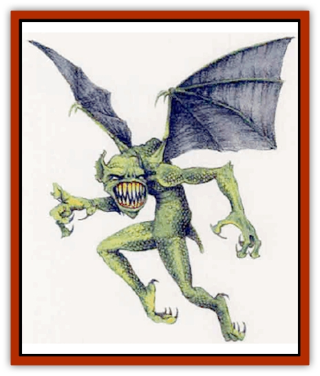

# Darkwing

| Statistic | **Darkwing** |
| --- | --- |
| **Activity Cycle:** | Night |
| **Alignment:** | Neutral evil |
| **Armor Class:** | 5 |
| **Climate/Terrain:** | Any cavern, mountain, hills, plains (night only) |
| **Damage/Attack:** | 1d4 (claws)/1d4 (claws)/1d6 (bite) |
| **Diet:** | Carnivore |
| **Frequency:** | Very rare |
| **Hit Dice:** | 3 |
| **Intelligence:** | Low (7) |
| **Magic Resistance:** | Nil |
| **Morale:** | Steady (11) |
| **Movement:** | 6, Fl 18 (D) |
| **No. Appearing:** | 10d3 |
| **No. of Attacks:** | 3 |
| **Organization:** | Flock |
| **Size:** | M (5' tall) |
| **Special Attacks:** | Nil |
| **Special Defenses:** | Nil |
| **THAC0:** | 17 |
| **Treasure:** | (B) |
| **XP Value:** | 65 |

The bane of all who raise livestock, darkwings are flying humanoids that flock together and attack at night, often decimating entire herds of cattle or sheep. Many scholars believe they are related to [[Deep_Glaurant|deep glaurants]].

Darkwings have scaly green bodies and leathery black wings. Their daws are long and sharp, and their mouths are filled with vicious, sharp teeth.

All darkwings speak a simple language of their own. Most of their words concem hunting and status in the flock. A very few darkwings have learned human tongues. More frequently, the top darkwing of a flock may leam the languages of humanoids who might be persuaded to join the flock in raids on livestock.

**Combat:** With their dark coloration and gliding flight, darkwings can readily surprise opponents at night (-4 to victims' smprise rolls). They attack with their claws and bite. Two darkwings acting in unison can swoop down and carry off a human-sized creature, provided both make an attack roll of 18 or more. Larger creatures, such as horses or cattle, are killed and dismembered before being taken back to the lair.

Darkwings dislike bright light and never leave their cave when the moon is full. A *light* spell causes them to fight with penalty of -1 to morale, attack, and damage rolls. A *continual light* spell causes them to immediately make a morale check with a -2 penalty or flee to their lair. If they stay, they fight with a -2 penalty to their attack and damage rolls (though each hit will inflict a minimum of 1 point of damage). The effects of *light* are not cumulative (darkwings subject to both a *light* and a *continual light* spell fight at -2, not -3). Darkwings that make successful morale checks fight to the death, but still suffer the other penalties listed.

**Habitat/Society:** Darkwings gather in flocks, taking full advantage of their numbers and flying ability to terrify and corner their prey. Each flock has a "pecking order" by which a sing1e leader - the largest and smartest - keeps the lesser individuals in line. The leader also chooses where to fly for the hunt, selects the best mates, and so forth. Either a male or a female may lead the pecking order. It is a dangerous and precarious position, as the lesser darkwings are always vying to elevate their own status in the flock at the expense of their superiors.

Dark caves, high in harsh mountain ranges, are the preferred abode of darkwings. A darkwing lair is a foul and unsettling place, covered in the creatures' filth and the bones of their victims. There are alwavs 2d6 young roosting on ledges around the caves; they fight only if threatened or attacked (AC 8; HD 1-1; #AT 1 [bite only]; D 1d3).

**Ecology:** Darkwings are nocturnal, and never come out of their dark, eerie caves during the day. At night, they flock to the lowlands to hunt. They prefer easy prey, naturally, and so are drawn to the flocks and herds of human farmers.

Few farmers have the wherewithal to confront and drive off these vicious predators, and the darkwings have few natural enemies. If a flock of darkwings makes trouble over an extended period of time in a region, it won't be long before they are challenged. It may he a group of irate farmers, or the local knight with his henchmen (whose rents and taxes are threatened if their tenants or serfs are impoverished), or even a party of adventurous champions that will set out to drive off or slay darkwings. Because of this, the winged humanoids, rare to begin with, dwindle as civilization spreads.

In the absence of human livestock to raid, darkwings tend to subsist on smaller wild mammals, such as rabbits and young deer. Like [[Wolf|wolves]], they prefer the young, the aged, and the sickly over large and healthy individuals that might prove troublesome to overcome. These pickings are not as easy as humans' livestock, and so the numbers of darkwings remain modest even in the wilds.

---
## Discovery & Documentation

**Source Publication:** Mystara Appendix (1994)
**Campaign Setting:** Mystara
**Author(s):** John Nephew, Teeuwynn Woodruff, John Terra, Skip Williams

### Other Creatures Found in This Source Book
   * [[Actaeon|Actaeon]]
   * [[Agarat|Agarat]]
   * [[Ash_Crawler|Ash Crawler]]
   * [[Baldandar|Baldandar]]
   * [[Bargda|Bargda]]
   * [[Bhut|Bhut]]
   * [[Bird_Mystara|Bird (Mystara)]]
   * [[Blackball|Blackball]]
   * [[Choker|Choker]]
   * [[Coltpixie|Coltpixie]]
   * [[Crone_of_Chaos|Crone of Chaos]]
   * [[Darkhood|Darkhood]]
   * [[Decapus|Decapus]]
   * [[Deep_Glaurant|Deep Glaurant]]
   * [[Diabolus|Diabolus]]
   * [[Dimensional_Warper|Dimensional Warper]]
   * [[Dragon_Mystara_Crystalline|Dragon (Mystara), Crystalline]]
   * [[Dragon_Mystara_Jade|Dragon (Mystara), Jade]]
   * [[Dragon_Mystara_Onyx|Dragon (Mystara), Onyx]]
   * [[Dragon_Mystara_Ruby|Dragon (Mystara), Ruby]]
   * [[Drake_Mystara|Drake (Mystara)]]
   * [[Dragonfly|Dragonfly]]
   * [[Dusanu|Dusanu]]
   * [[Elemental_of_Chaos_Air_Earth|Elemental of Chaos, Air/Earth]]
   * [[Elemental_of_Chaos_Fire_Water|Elemental of Chaos, Fire/Water]]
   * [[Elemental_of_Law_Air_Earth|Elemental of Law, Air/Earth]]
   * [[Elemental_of_Law_Fire_Water|Elemental of Law, Fire/Water]]
   * [[Familiar_Mystara|Familiar (Mystara)]]
   * [[Frost_Salamander|Frost Salamander]]
   * [[Fundamental_Air_Earth|Fundamental, Air/Earth]]
   * [[Fundamental_Fire_Water|Fundamental, Fire/Water]]
   * [[Gargantua_Mystara|Gargantua (Mystara)]]
   * [[Geonid|Geonid]]
   * [[Ghostly_Horde|Ghostly Horde]]
   * [[Giant_Athach|Giant, Athach]]
   * [[Giant_Hephaeston|Giant, Hephaeston]]
   * [[Golem_Drolem|Golem, Drolem]]
   * [[Golem_Mystara_I|Golem (Mystara) I]]
   * [[Golem_Mystara_II|Golem (Mystara) II]]
   * [[Golem_Mystara_III|Golem (Mystara) III]]
   * [[Gray_Philosopher|Gray Philosopher]]
   * [[Guardian_Warrior|Guardian Warrior]]
   * [[Gyerian|Gyerian]]
   * [[Herex|Herex]]
   * [[Hivebrood|Hivebrood]]
   * [[Horde|Horde]]
   * [[Hsiao|Hsiao]]
   * [[Huptzeen|Huptzeen]]
   * [[Hutaakan|Hutaakan]]
   * [[Imp_Mystara|Imp (Mystara)]]
   * [[Jellyfish_Giant_Mystara|Jellyfish, Giant (Mystara)]]
   * [[Kna|Kna]]
   * [[Kopru|Kopru]]
   * [[Lizard_Mystara|Lizard (Mystara)]]
   * [[Lizard-kin_Mystara|Lizard-kin (Mystara)]]
   * [[Lupin|Lupin]]
   * [[Lycanthrope_Werejaguar_Mystara|Lycanthrope, Werejaguar (Mystara)]]
   * [[Lycanthrope_Wereswine|Lycanthrope, Wereswine]]
   * [[Magen|Magen]]
   * [[Manikin|Manikin]]
   * [[Mek|Mek]]
   * [[Mujina|Mujina]]
   * [[Nagpa|Nagpa]]
   * [[Neh-thalggu|Neh-thalggu]]
   * [[Nightshade_Mystara|Nightshade (Mystara)]]
   * [[Nuckalavee|Nuckalavee]]
   * [[Pegataur|Pegataur]]
   * [[Phanaton|Phanaton]]
   * [[Plant_Dangerous_Mystara|Plant, Dangerous (Mystara)]]
   * [[Plasm|Plasm]]
   * [[Rakasta|Rakasta]]
   * [[Rock_Man|Rock Man]]
   * [[Sabreclaw|Sabreclaw]]
   * [[Sacrol|Sacrol]]
   * [[Scamille|Scamille]]
   * [[Shapeshifter|Shapeshifter]]
   * [[Shargugh|Shargugh]]
   * [[Shark-kin|Shark-kin]]
   * [[Sollux|Sollux]]
   * [[Spectral_Death|Spectral Death]]
   * [[Spectral_Hound|Spectral Hound]]
   * [[Spider-kin|Spider-kin]]
   * [[Spirit_Mystara|Spirit (Mystara)]]
   * [[Statue_Living|Statue, Living]]
   * [[Surtaki|Surtaki]]
   * [[Tabi|Tabi]]
   * [[Thoul|Thoul]]
   * [[Thunderhead|Thunderhead]]
   * [[Tiger_Ebon|Tiger, Ebon]]
   * [[Topi|Topi]]
   * [[Tortle|Tortle]]
   * [[Vampire_Velya|Vampire, Velya]]
   * [[White_Fang|White Fang]]
   * [[Worm_Mystara|Worm (Mystara)]]
   * [[Wyrd|Wyrd]]
   * [[Yowler|Yowler]]
   * [[Zombie_Lightning|Zombie, Lightning]]
