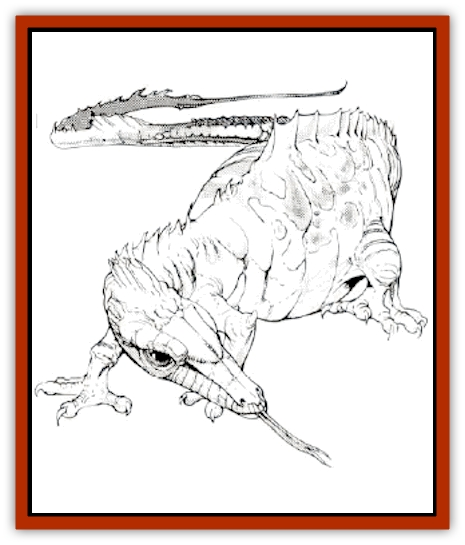

# Darter

| Statistic | **Darter** |
| --- | --- |
| **Activity Cycle:** | Day |
| **Alignment:** | Neutral |
| **Armor Class:** | 8 |
| **Climate/Terrain:** | Temperate or tropical swamp |
| **Damage/Attack:** | 1-2 |
| **Diet:** | Blood |
| **Frequency:** | Rare |
| **Hit Dice:** | 1 |
| **Intelligence:** | Animal (1) |
| **Magic Resistance:** | Nil |
| **Morale:** | Champion (16) |
| **Movement:** | 3 |
| **No. Appearing:** | 2-24 |
| **No. of Attacks:** | 1 |
| **Organization:** | Nest |
| **Size:** | T (1-2' long plus tail) |
| **Special Attacks:** | Paralyzation |
| **Special Defenses:** | Nil |
| **THAC0:** | 19 |
| **Treasure:** | Nil |
| **XP Value:** | 120 |

Darters are small [[Lizard|lizards]] with tubular snouts. The snouts are attached to tapered heads, from which two dark eyes protrude. Their bodies are rather pear-shaped, adding to the somewhat comical appearance of the creatures. Their heads are topped by short crests which stand erect whenever the lizards are alarmed. Their scaly skin ranges in color from brilliant emerald to dark jade. They have three short claws on each of their four feet. The tail of the darter is as long as its body.

Despite its name, the darter is an extremely lazy creature, generally moving only to feed.

**Combat:** The darter is ineffective in close combat, but possesses a dangerous missile weapon. Numerous slender fangs grow lengthwise in its tubular snout. At will, the creature can cause one of these fangs to loosen, and then may fire it as a natural dart. As the dart passes through the snout, a poison coats it. Any victim struck by such a dart must save vs. poison or be paralyzed for 1d4 rounds. The effective range of these darts is only 10'. Darts may actually travel farther, but they lose the ability to penetrate skin after traveling more than 10'. A darter's fangs grow fairly rapidly, and it can fire 1-6 of them per day.

After a victim has been immobilized by a poisoned dart, any darters in the area cautiously approach to feast. They use their weak front claws to make a hole in any exposed skin of the victim, causing one hit point of damage. Then, using their snouts to create a powerful suction, they suck blood from the victim. with each darter causing an additional 1d6 hit points of damage. The darter is satiated by one such drink from its prey, and will not need to feed for another day.

The darter's high morale score is not a reflection of its courage. Rather, it indicates that they are simply too lazy (and stupid) to run away, even if threatened.

Darters are easily startled, and will fire their darts at practically anything that moves within range. Fortunately for the little lizards, they are immune to the effects of the paralyzing poison.

**Habitat/Society:** Darters are peaceful creatures, attacking only those creatures which stumble into their territory. They cluster around the area where they were hatched. Darters mate once a year in the spring. The lethargic lizards show very little enthusiasm, and sages agree that they have one of the most boring courtship rituals in the Realms. In any case, about three weeks after mating, the female darter produces 1-6 eggs, laying them in a rough nest wherever she happens to be at the time. The eggs hatch in two weeks, and baby darters crawl forth into the world.

**Ecology:** The darter rarely hunts, preferring to wait for food to come to it. Only when faced with starvation will they move from their home territory to track food.

Darters serve as prey for many swamp predators, though only very hungry creatures will risk being hit by their darts and drained of blood.

Primitive swamp tribes, especially lizard men, often make use of the creatures. Once a darter is killed, it is fairly easy to remove the 1-6 darts in its snout. The darts are about two inches long, and are straight enough to be used in blowguns, or as tips for larger darts. The poison sacs are also easy to remove, and if carefully handled, will produce enough of the paralytic poison for 6-36 darts. The poison gradually becomes ineffective after exposure to the air. Victims' saving throws are made at +1 per day of the poison's exposure to the air. The poison becomes completely ineffective after a week of exposure.

Some primitive tribes actually use darters as guards, though the creatures have proved resistant to all attempts at training, and are as likely to attack their master as any intruder. Smarter tribes leave several of the lizards around their sacred areas as a trap.

Some swamp-dwellers are brave (or foolish) enough to carry the darters, pointing their snouts towards enemies and causing the creatures to fire a dart. Unless the bearer is cautious, however, his living dart gun will fire on him whenever he makes a sudden move.

---
## Discovery & Documentation

**Source Publication:** MC14 Fiend Folio Appendix (1992)
**Campaign Setting:** Fiends Folio
**Author(s):** Don Bingle, John Terra, Wes Nicholson, Tim Beach, Steve Hardinger, Kris Hardinger, Rob Nicholls, Greg Swedberg, Al Boyce, Vince Garcia, Norm Ritchie

### Other Creatures Found in This Source Book
   * [[Aballin|Aballin]]
   * [[Achaierai|Achaierai]]
   * [[Adherer|Adherer]]
   * [[Algoid|Algoid]]
   * [[Al-Mi'raj|Al-Mi'raj]]
   * [[Apparition|Apparition]]
   * [[Caterwaul|Caterwaul]]
   * [[Coffer_Corpse|Coffer Corpse]]
   * [[Crabman|Crabman]]
   * [[Dark_Creeper|Dark Creeper]]
   * [[Dark_Stalker|Dark Stalker]]
   * [[Denzelian|Denzelian]]
   * [[Dune_Stalker|Dune Stalker]]
   * [[Dwarf_Urdunnir|Dwarf, Urdunnir]]
   * [[Falcon_Fire|Falcon, Fire]]
   * [[Faux_Faerie|Faux Faerie]]
   * [[Flawder|Flawder]]
   * [[Fyrefly|Fyrefly]]
   * [[Gambado|Gambado]]
   * [[Garbug|Garbug]]
   * [[Giant_Fhoimorien|Giant, Fhoimorien]]
   * [[Gibberling|Gibberling]]
   * [[Gorbel|Gorbel]]
   * [[Grimlock|Grimlock]]
   * [[Hellcat|Hellcat]]
   * [[Ice_Lizard|Ice Lizard]]
   * [[Iron_Cobra|Iron Cobra]]
   * [[Khargra|Khargra]]
   * [[Mantari|Mantari]]
   * [[Penanggalan|Penanggalan]]
   * [[Pernicon|Pernicon]]
   * [[Phantom_Stalker|Phantom Stalker]]
   * [[Retriever|Retriever]]
   * [[Ruve|Ruve]]
   * [[Scathe|Scathe]]
   * [[Sheet_Ghoul_Sheet_Phantom|Sheet Ghoul/Sheet Phantom]]
   * [[Shocker|Shocker]]
   * [[Spanner|Spanner]]
   * [[Stwinger|Stwinger]]
   * [[Sussurus|Sussurus]]
   * [[Symbiotic_Jelly|Symbiotic Jelly]]
   * [[Terithran|Terithran]]
   * [[Thunder_Children|Thunder Children]]
   * [[Troll_Ice|Troll, Ice]]
   * [[Tween|Tween]]
   * [[Umpleby|Umpleby]]
   * [[Volt|Volt]]
   * [[Xill|Xill]]
   * [[Xvart|Xvart]]
   * [[Zygraat|Zygraat]]
