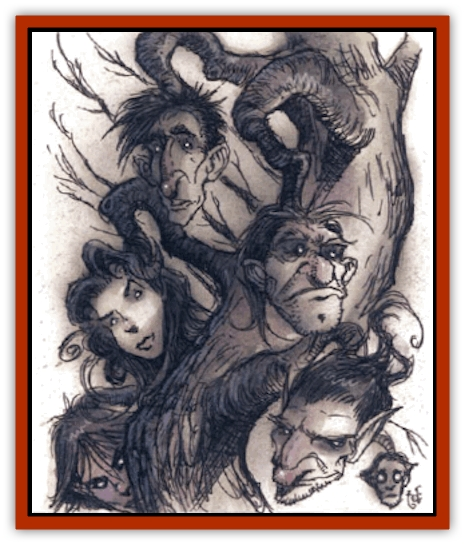
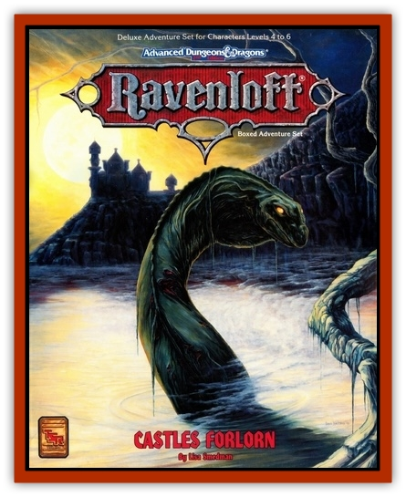

# Death's Head Tree

| Statistic | **Death's Head Tree** |
| --- | --- |
| **Activity Cycle:** | Any |
| **Alignment:** | Neutral evil |
| **Armor Class:** | 10 (trunk); 7 (branches/heads) |
| **Climate/Terrain:** | Temperate land |
| **Damage/Attack:** | 1 per seed (per head) or 1d4 per bite (per head) |
| **Diet:** | Special |
| **Frequency:** | Rare |
| **Hit Dice:** | 10 (plus 6 hp per head) |
| **Intelligence:** | Semi- (2-4) |
| **Magic Resistance:** | 10% |
| **Morale:** | Fearless (19-20) |
| **Movement:** | 0 (tree), Fl 6 (E) (heads) |
| **No. Appearing:** | Special |
| **No. of Attacks:** | 1 per head |
| **Organization:** | Special |
| **Size:** | H (15-20' tall) |
| **Special Attacks:** | Seed spitting |
| **Special Defenses:** | Immune to fire |
| **THAC0:** | 11 |
| **Treasure:** | Special |
| **XP Value:** | 5,000 |

A death's head tree looks much like a weeping willow, except its branches are thicker. Its seeds need blood to germinate, so it grows most commonly in places where a great deal of blood has been spilled; battlefields and places of sacrifice are two areas where death's head trees thrive. In fact, these trees often mark places where ancient battles have been fought or where evil temples once stood.

A mature death's head tree bears a strange and terrible fruit: 4d4 rotten-smelling "death's heads". Each of these appears to be a severed head of any of the standard human and demihuman races, except for the fact that each head grows from a branch of the tree and is attached to the branch at the neck. In time, these heads ripen and "fall" from the tree, actually floating away on organic gases, seeking the bodies of warm-blooded creatures in which to plant their seeds.

**Combat:** Like most carnivorous plants, the death's head tree engages in combat primarily when potential victims come within its reach, but this plant has a unique lure: It grows heads that are distinctly humanoid in appearance and then, with its very limited intelligence, animates them just enough to enable the heads to softly call "help". While those who investigate the source of the pleas have few problems identifying the heads as monstrous, curiosity or repugnance (and a resulting urge to destroy the tree) frequently draws them in close enough for the tree to attack.

When physically attacked, the death's head tree uses its "fruit" to defend itself. Each head is capable of biting once per melee round, inflicting 1d4 points of damage and simultaneously inserting a seed into the wound (see below for the effects of harboring a death's head seed). While the death's head tree itself is not capable of locomotion, it can move its branches. Hence, the trunk has an Armor Class of 10, but the branches and heads have an effective Armor Class of 7. Due to this mobility and the flexibility of its branches, the tree is capable of making as many attacks against a target as it has death's heads. Each head will die upon sustaining 6 points of damage, and the branches may be hacked off upon sustaining 10 points of damage (from a slashing weapon only).

Each of the 4d4 death's heads on a mature tree contains 1d6 needle-sharp seeds that inflict minimal damage (just 1 point of damage per seed) upon a successful hit. The heads are capable of spitting these (one seed per head per melee round) at any warm-bloodee creature who ventures within 30 feet of the tree.

The seeds may be removed within 24 hours in much the same way as one would remove a sliver (inflicting another point of damage in the process). However, the points of the seeds excrete a low-grade natural anesthetic, which means that they don't bother the victim after the initial sting of penetration. Therefore, many victims forget about them after the battle is over, allowing the seeds to take root. If left in place for longer than a day, the seeds germinate and begin to grow, causing an ever-increasing amount of damage as sprouts spread through the victim's body. The shoots inflict 1d4 points of damage on day one, 2d4 damage on day two, 3d4 damage on day three, and so on, to a maximum of 10d4 points of damage per day.

Forcibly removing or cutting these new shoots out of a victim's body, once they have rooted, inflicts damage equal to half of what would otherwise be the growth damage for that day, and doing so has only a 50% chance to be completely effective. A slip of the plant may remain inside the victim's body and continue to grow. Any spell that will kill a plant, however, will immediately kill the growths (which at this stage have no immunity to magic or fire).

While most carnivorous plant life is largely anchored to a single spot, the fruit of the death's head tree becomes fully mobile, once it has ripened and broken from the branch. Buoyed by gases produced by their own rot, the fallen heads actually float off, seeking a warm-blooded creature in which to plant their seeds. The smell of blood can attract a death's head from as far away as a mile, and it can travel up to 20 miles in search of a host. Once a potential victim is located, the head spits until all of its 1d6 seeds are gone. Once its seeds are exhausted, it continues to attack by biting for 2d4 rounds, at which point it falls to the ground, dead.

Although the fruit of a death's head tree has the appearance of a waxy, slack-jawed corpse, a head is not considered undead as long as it is still attached to the tree. Only when it has fully matured and broken from the tree does it assume the characteristics of undead. At this point it can be turned as a zombie. Once fallen from the tree, the head is also vulnerable to fire, but it retains its magic resistance.

**Habitat/Society:** There is only one factor controlling the number of death's head trees that can grow in a given area, and that is how much blood has been spilled there. Theoretically, there could be one tree for every corpse. In fact, it is not uncommon to see an entire forest of tiny saplings springing up a few days after a large battle. Of course, until these reach maturity, they can be killed or uprooted as easily as any other plant. Also, they tend to sink their roots into each other, attempting to steal extra life's blood and grow stronger, so eventually only one tree is left within 50 or more feet. Thus, the fully mature death's head tree is a rare find.

**Ecology:** The average death's head tree takes 50 + 1d10 years to mature to the point where it can grow a crop of death's heads. Until the time when its branches thicken enough to bear the weight of its ghastly fruit, it looks much like a weeping willow. Only a knowledgeable observer can tell the difference.

Once it reaches maturity, a death's head tree is capable of living for thousands of years. A few sages have speculated that cutting down a specimen and counting its rings can establish the number of years that have passed since a battle was fought or a place of sacrifice was abandoned. The theory is a sound one, but few people who are aware of the tree's nature will volunteer to chop one down and prove it.

Once a death's head tree matures, it produces a crop of death's heads every other year. Within 1d6 days of budding, the death's heads grow from the size of walnuts to the size of normal humanoid heads. Having reached their full size, they take on a distinctive appearance (and foul odor) and then begin to softly call out the word "help" in a language appropriate to the race of the head. Within another 3d6 days, they ripen and begin to "fall".

Aside from its need for blood to germinate its seeds, the death's head tree takes its daily sustenance from the sun and soil like any other plant. It does not require any more blood to survive, once it has successfully germinated and rooted itself in the ground. Because there is no limit to the type of terrain on which blood is spilled, the death's head tree grows virtually anywhere. One may be found growing among the stones of a ruined temple or on an ancient battlefield that is littered with rusted weapons and the bleached bones of the soldiers who once fought there.

Since the fruit of a death's head tree is always humanoid in appearance, it is largely believed that the seeds can be germinated only in humanoid blood. A few experiments attempting to sprout a seed in animal blood have thus far been unsuccessful, but sages theorize that this should be possible, since the death's heads are known to spit their seeds at warm-blooded animals as well as humanoids.

Some say that the fruit of a death's head tree resembles the face of he or she whose blood nurtured it. Indeed, since the death's head fruit has been heard to whisper in many languages, some sages believe that each is an undead manifetation of a particular individual. Others insist that this is no more than mere mimicry, that there is no connection between those who have died and the fruit of a death's head tree.

Due to its magical nature, a mature death's head tree has a limited amount of magic resistance. It is also immune to fire and fire-based magical attacks. The wood of a mature death's head tree is prized for its natural magic resistance and immunity to fire, and it is an essential part of many magical devices, especially fire-resistant shields. It is also used as a component in fire-protection spells.

While a death's head tree has no treasure of its own, those it kills often carry treasure. There is a 15% chance that a corpse lies at the foot of a death's head tree. If so, it will have treasure type U, plus 1d10 of each type of coin. The body also will (90% of the time) have a death's head tree sapling growing out of it.

---
## Discovery & Documentation

**Source Publication:** Castles Forlorn (1993)
**Campaign Setting:** Ravenloft
**Author(s):** Lisa Smedman

### Other Creatures Found in This Source Book
   * [[Aggie|Aggie]]
   * [[Zombie_Wolf|Zombie Wolf]]
