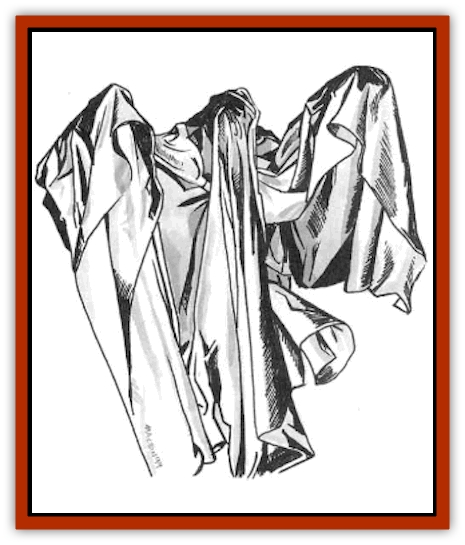

# Death Linnen - Sheet

| Statistic | **Death Linnen, Sheet** |
| --- | --- |
| **Activity Cycle:** | Any (mostly night) |
| **Alignment:** | Chaotic evil |
| **Armor Class:** | 9 |
| **Climate/Terrain:** | Any (mostly indoors) |
| **Damage/Attack:** | 1-4/1-4/1-2 |
| **Diet:** | None |
| **Frequency:** | Rare |
| **Hit Dice:** | 6 |
| **Intelligence:** | Average (8-10) |
| **Magic Resistance:** | Nil |
| **Morale:** | Elite (13-14) |
| **Movement:** | 12 |
| **No. Appearing:** | 1 |
| **No. of Attacks:** | 3 |
| **Organization:** | Solitary |
| **Size:** | M (6' tall) |
| **Special Attacks:** | Poison, suffocation |
| **Special Defenses:** | Nil |
| **THAC0:** | 13 |
| **Treasure:** | Nil |
| **XP Value:** | 1,400 |

When lying in bed at night, wondering what those strange creeks and pops are in the darkness, who hasn't felt just a little more secure by drawing up the covers? Even the security of bedclothes is taken from us by death linens.

Death linens are beings of living cloth, usually sheets, pillows, and other items associated with beds. They have been infected with latent psychic forces born of nightmares. They are normally active at night, but they can lurk in cupboards or laundries and assault people at any time. They come in a variety of shapes and sizes.

The sheet variety of the death linen takes on a disturbingly humanoid form when it strikes, moving at a surprisingly swift pace, and it gyrates and flops as it moves, a most disturbing spectacle. Anyone seeing a sheet must make a successful saving throw vs. paralyzation or flee in terror for 2-8 rounds. (In the *Ravenloft* campaign setting, use a fear check instead.) Sheets normally reside indoors, but they think nothing of chasing prey across the countryside.

**Combat:** The sheet strikes twice in combat with its ragged fists for 1-4 points of damage each. It can suffocate if it hits with an 18 or better. A successful Strength check is needed to free oneself from the sheet. It can also bite for 1-2 points of damage, and its fangs are poisonous (Type C; onset time 2-5 minutes; Dmg 25/2-8).

Blunt weapons inflict only 1 point of damage (plus any magical weapon and Strength bonuses) to a sheet per successful hit. Death linens are not undead and cannot be turned by priests or harmed by holy water.

Fire causes double damage to them. A gallon or more of water sloshed on a sheet affects it as the *slow* spell. If a character strikes it with a roll of 19 or 20, the creature is stunned for one round, and it flops to the floor in an inert pile. Any attacks made in the following round automatically hit.

Even after it is reduced to 0 hit points, a sheet's life force might enter another sheet in the next 1-12 months - a noncumulative 10% chance per month. After all, we all sleep, and we often have nightmares, which strengthen the strange beings. If a slain death linen does not reappear within one year, the life-force forever dissipates.

**Habitat/Society:** Sheets are apt to roam the countryside for prey, but they find greater comfort in houses, castles, and manors. They need no nourishment; they assault or avoid living creatures for reasons known only to themselves. They rarely tolerate the presence of others of their kind.

**Ecology:** Like other varieties of death linen, the sheet holds no place in the natural order. Certain magical items have been created to control such beings, especially whistles inscribed with magical runes. Bits of them can be used in rites to create [[Zombie|zombies]] and other undead beings.

---
## Discovery & Documentation

**Source Publication:** Dungeon #76 (1999)
**Campaign Setting:** Dungeon Magazine
**Author(s):** Raymond E. Dyer, Toren Atkinson

### Other Creatures Found in This Source Book
   * [[Chraal|Chraal]]
   * [[Living_Hair|Living Hair]]
   * [[Sawfly_Demonic|Sawfly, Demonic]]
