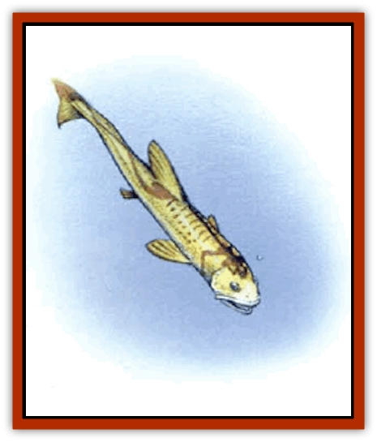
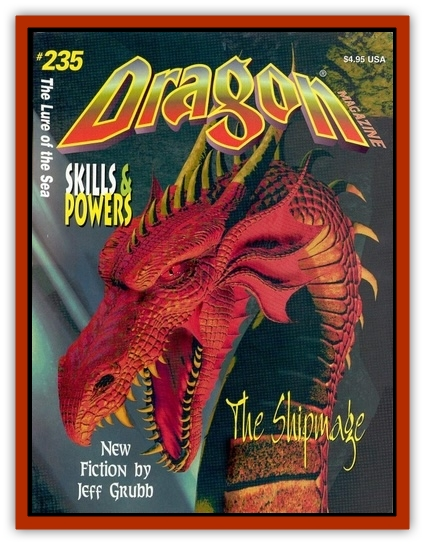

# Death Minnow

| Statistic | **Death Minnow** |
| --- | --- |
| **Activity Cycle:** | Any |
| **Alignment:** | Neutral |
| **Armor Class:** | 10 |
| **Climate/Terrain:** | Ocean depths |
| **Damage/Attack:** | Nil |
| **Diet:** | Carnivore |
| **Frequency:** | Very rare |
| **Hit Dice:** | 6 |
| **Intelligence:** | Animal (1) |
| **Magic Resistance:** | Nil |
| **Morale:** | Fearless (20) |
| **Movement:** | Sw 22 |
| **No. Appearing:** | 1-2 |
| **No. of Attacks:** | 1 |
| **Organization:** | Solitary |
| **Size:** | T to L (2&rdquo; to 8') |
| **Special Attacks:** | Swallow whole, magic |
| **Special Defenses:** | High agility |
| **THAC0:** | 15 |
| **Treasure:** | Nil |
| **XP Value:** | 2,000 |

The death minnow is a bright orange [[Fish|fish]] only 2" in length. It is a magical extrapolation of the normal fishes of the ocean depths, created by some powerful, but unknown undersea sorcerers. ([[Aboleth|Aboleth]]? <a href="sahuagin">Sahuagin</a>? The [[Elf_Aquatic|aquatic elf]] version of the <a href="elfdrow">drow</a>? Who knows?) A potent guardian of undersea lairs and treasure troves, this critter is guaranteed to drive your players crazy. It relies on lateral lines to detect its prey.

**Combat:** The death minnow's creators - whoever they were - incorporated into the fish an innate magical ability equivalent to the reversible spell *enlarge/reduce*. Simply put, this little fish can swim up to a creature of Size M or smaller, looking as innocuous as can be, then suddenly enlarge itself to the size of a giant [[Angler_Fish|angler fish]], swallow the surprised victim with a single gulp, and then reduce both itself and the victim to minute size again. If no one else in the party is looking in the victim's direction at the time (remember, there is apparently nothing large enough to be a threat in the vicinity), then the target will seem to have simply disappeared without a trace.

The act of swallowing itself causes no damage, as the victim is drawn into the fish's mouth by suction. Once inside, however, he suffers 1d6 hp damage from his captor's digestive juices until he either dies or is rescued. As always, striking weapons do full damage to the victim as well as their intended target. However, even bloated with prey, the death minnow can easily dodge most blows. Once the fish is slain (an ingrained magical instinct prevents it from releasing its prey under any circumstances), the victim instantly returns to normal size. And if any quick-witted mages are present in the party, casting *dispel magic* on the death minnow will cause it to grow back to its "monster size" of 8', making it a far easier target.

**Habitat/Society:** There are no "wild" populations of death minnows. These are magical guard beasts, nothing more, and as they are created magically, they do not need to breed. In fact, it is uncertain if they even have male and female sexes.

**Ecology:** The death minnow serves no role in a natural ecology, except to ensure that the immediate vicinity around the spot it is set to guard doesn't have any. If the party can kill one, its blood may be used as an ingredient in the ink used for penning *enlarge* or *reduce* spells on scrolls. If, instead, someone wants to return the swallowing favor by eating it, it tastes remarkably like kippered herring.

---
## Discovery & Documentation

**Source Publication:** Dragon235 (1996)
**Campaign Setting:** Dragon Magazine
**Author(s):** 

### Other Creatures Found in This Source Book
   * [[Angler_Fish|Angler Fish]]
   * [[Fish_Deep_Ocean|Fish, Deep Ocean]]
   * [[Gulper|Gulper]]
   * [[Hide|Hide]]
   * [[Octopus_Octo-Jelly|Octopus, Octo-Jelly]]
