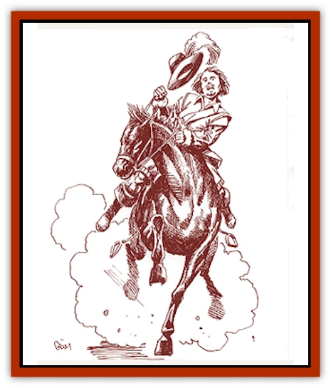

# Deathmare

| Statistic | **Deathmare** |
| --- | --- |
| **Activity Cycle:** | Night |
| **Alignment:** | Chaotic evil |
| **Armor Class:** | 7 |
| **Climate/Terrain:** | Any |
| **Damage/Attack:** | 1d3/1d3/1d6 |
| **Diet:** | Life forces |
| **Frequency:** | Very rare |
| **Hit Dice:** | 5+2 |
| **Intelligence:** | Low (5-7) |
| **Magic Resistance:** | Nil |
| **Morale:** | Fanatic (17-18) |
| **Movement:** | 24 |
| **No. Appearing:** | 1 |
| **No. of Attacks:** | 3 |
| **Organization:** | Solitary |
| **Size:** | L (8' long) |
| **Special Attacks:** | See below |
| **Special Defenses:** | Hit only by silver or magical weapons |
| **THAC0:** | 15 |
| **Treasure:** | O,R |
| **XP Value:** | 650 |

As undead creatures out for revenge against all living horsemen, deathmares present a fatal trap to the unwary.

A deathmare appears as a regular riding [[Horse|horse]] of average size. Their coats are always flawless black in color - a curious detail in itself, as *vermeil* causes a reddish tint in the coats of all other animals on the coast. However, because deathmares appear only at night or in the early evening, such a detail is hard to notice. These creatures normally stand idly by a roadside or field, patiently waiting to be approached or mounted, but sometimes one will walk up to a campsite as if wanting food. They appear completely docile, giving no outward sign of their undead status.

**Combat:** Any person who mounts a deathmare, whether bareback or using a saddle, will find it impossible to dismount. Only a *remove curse* allows the rider to jump from the deathmare's back.

 Also, the deathmare cannot be controlled. It immediately bolts for the nearest danger, seeking to kill the rider. It might throw itself off the nearest cliff or wade into deep water; deathmares have even been known to ride into a campsite and strike at people as if attacking, forcing them to kill its rider.

If the nature of a deathmare is discovered before a rider mounts, it will attack using its hooves and teeth. Deathmares are harmed only by magical or silver weapons, but even if confronted with these, it will remain and try to kill its potential victim.

**Habitat/Society:** Deathmares can be found in any land or climate. They will rarely be far from some sort of lethal danger, but have been known to range farther in a desperate search for victims.

A deathmare does not collect treasure, but the wealth of its latest victims can sometimes be discovered. Deathmares will often use a method of killing riders several times before moving on, so a search of local dangerous locations might turn up a few dead bodies and their personal belongings.

**Ecology:** A deathmares is the spirit of a horse that was abused and killed by an evil, sadistic owner. They return from the dead to exact revenge on all horsemen, regardless of alignment, feeding on the life forces of the riders they kill. The deathmare continues to search for victims until its previous owner dies, at which time it simply fades away.

---
## Discovery & Documentation

**Source Publication:** Monstrous Compendium Savage Coast Appendix (Online Exclusive) (1995)
**Campaign Setting:** Mystara
**Author(s):** Loren L Coleman, Ted James, Thomas Zuvich, Cindi M. Rice

### Other Creatures Found in This Source Book
   * [[Aranea_Savage_Coast|Aranea (Savage Coast)]]
   * [[Arashaeem|Arashaeem]]
   * [[Batracine|Batracine]]
   * [[Cat_Marine|Cat, Marine]]
   * [[Cinnavixen|Cinnavixen]]
   * [[Clockwork_Swordsman|Clockwork Swordsman]]
   * [[Critter_Temple|Critter, Temple]]
   * [[Cursed_One|Cursed One]]
   * [[Dragon_Savage_Coast_Crimson|Dragon (Savage Coast), Crimson]]
   * [[Dragon_Savage_Coast_Red_Hawk|Dragon (Savage Coast), Red Hawk]]
   * [[Echyan|Echyan]]
   * [[Ee'aar|Ee'aar]]
   * [[Enduk|Enduk]]
   * [[Fachan_Savage_Coast|Fachan (Savage Coast)]]
   * [[Feliquine|Feliquine]]
   * [[Fiend_Narvaezan|Fiend, Narvaezan]]
   * [[Frelôn|Frelôn]]
   * [[Ghriest|Ghriest]]
   * [[Glutton_Sea|Glutton, Sea]]
   * [[Goatman|Goatman]]
   * [[Golem_Naâruk|Golem, Naâruk]]
   * [[Golem_Savage_Coast|Golem (Savage Coast)]]
   * [[Grudgling|Grudgling]]
   * [[Heraldic_Servant_I|Heraldic Servant I]]
   * [[Heraldic_Servant_II|Heraldic Servant II]]
   * [[Heraldic_Servant_III|Heraldic Servant III]]
   * [[Heraldic_Servant_IV|Heraldic Servant IV]]
   * [[Heraldic_Servant_V|Heraldic Servant V]]
   * [[Heraldic_Servant_General_Information|Heraldic Servant, General Information]]
   * [[Hermit_Sea|Hermit, Sea]]
   * [[Jorri|Jorri]]
   * [[Juhrion|Juhrion]]
   * [[Kla'a-tah|Kla'a-tah]]
   * [[Leech_Legacy|Leech, Legacy]]
   * [[Lich_Inheritor|Lich, Inheritor]]
   * [[Lizard_Kin_Savage_Coast|Lizard Kin (Savage Coast)]]
   * [[Lupasus|Lupasus]]
   * [[Lupin|Lupin]]
   * [[Lyra_Bird_Saragón|Lyra Bird, Saragón]]
   * [[Malfera|Malfera]]
   * [[Manscorpion_Nimmurian|Manscorpion, Nimmurian]]
   * [[Mythuínn_Folk|Mythuínn Folk]]
   * [[Neshezu|Neshezu]]
   * [[Nikt'oo|Nikt'oo]]
   * [[Nosferatu|Nosferatu]]
   * [[Omm-wa|Omm-wa]]
   * [[Omshirim|Omshirim]]
   * [[Parasite_Savage_Coast|Parasite (Savage Coast)]]
   * [[Phanaton|Phanaton]]
   * [[Plant_Savage_Coast|Plant (Savage Coast)]]
   * [[Pudding_Vermilion|Pudding, Vermilion]]
   * [[Rakasta|Rakasta]]
   * [[Ray_Forest|Ray, Forest]]
   * [[Shedu_Greater_Savage_Coast|Shedu, Greater (Savage Coast)]]
   * [[Shimmerfish|Shimmerfish]]
   * [[Skinwing|Skinwing]]
   * [[Spawn_of_Nimmur|Spawn of Nimmur]]
   * [[Spider-spy|Spider-spy]]
   * [[Spirit_Heroic|Spirit, Heroic]]
   * [[Spirit_Walleran|Spirit, Walleran]]
   * [[Succulus|Succulus]]
   * [[Swampmare|Swampmare]]
   * [[Symbiont_Shadow|Symbiont, Shadow]]
   * [[Tortle|Tortle]]
   * [[Troll_Legacy|Troll, Legacy]]
   * [[Trosip|Trosip]]
   * [[Tyminid|Tyminid]]
   * [[Utukku|Utukku]]
   * [[Voat|Voat]]
   * [[Voat_Herathian|Voat, Herathian]]
   * [[Vulturehound|Vulturehound]]
   * [[Wallara|Wallara]]
   * [[Wurmling|Wurmling]]
   * [[Wynzet|Wynzet]]
   * [[Yeshom|Yeshom]]
   * [[Zombie_Red|Zombie, Red]]
