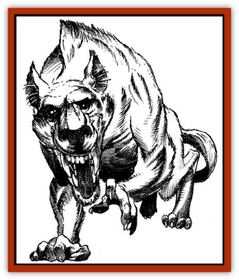

# Debbi

| Statistic | **Debbi** |
| --- | --- |
| **Activity Cycle:** | Day |
| **Alignment:** | Neutral evil |
| **Armor Class:** | 7 |
| **Climate/Terrain:** | Tropical and subtropical/desert |
| **Damage/Attack:** | 1-4 |
| **Diet:** | Scavenger |
| **Frequency:** | Uncommon |
| **Hit Dice:** | 1+1 |
| **Intelligence:** | Low (7) |
| **Magic Resistance:** | Nil |
| **Morale:** | Unsteady (5-7) |
| **Movement:** | 15, Cl 6 |
| **No. Appearing:** | 1-8 |
| **No. of Attacks:** | 1 |
| **Organization:** | Pack |
| **Size:** | S (2' tall) |
| **Special Attacks:** | Induce fear |
| **Special Defenses:** | Nil |
| **THAC0:** | 19 |
| **Treasure:** | Nil |
| **XP Value:** | 65 |

The debbi is an unusual breed of desert scavenger capable of forcing creatures much larger than itself into flight from watering holes and from their prey because of its ability to instill magical fear. They are hateful and selfish creatures with not an ounce of mercy in them.

Smaller than most useful [[Dog|dogs]], the two-foot tall debbi is a hairy creature halfway between a [[Baboon|baboon]] and a [[Hyena|hyena]]. It has the snout, head, and powerful jaws of a bone-cracking scavenger, with large ears and the body of a nimble monkey. They have sharp fangs but use them only for fierce grimacing displays, not for biting. Their small hands are capable of manipulating tools.

**Combat:** A debbi has the power to put all other animals and men around it to flight through its primitive magical abilities. The debbi can create fear by stamping its feet in a slow rhythm and calling down magical power which makes its fur crackle and spark. The chill in the air and the magical unease that it conjures up seep into all nearby animals. The result is that any creatures within 20 yards of a debbi when it begins its screeching and stamping are affected as per a *fear* spell once per turn. This fear lasts for two rounds per debbi in the pack. Usually all the debbi in a pack bring on their fear effects at the same time, forcing multiple saving throws by all nearby creatures and thus bettering their odds of driving every creature away. If a creature makes its saving throw versus a particular debbi, it will not be affected by its power for at least the next hour; thereafter, it must save again normally. The debbi uses this ability to drive other creatures away from recent kills and from watering holes so that it may eat and drink what they have worked for. All debbi are immune to all forms of magical fear, and they are very aware of when the effect of their magic wears off.

If forced into melee, a debbi uses a simple club, striking for 1-4 points of damage on a successful hit. Generally, however, they attempt to flee if faced with serious opposition. Almost all debbi are cowards at heart; their magic is bluster. They are excellent climbers and generally flee for the palms when in doubt. They throw rocks and other missile weapons from their treetop vantage point, but they don't have the strength to hurl anything large or dangerous enough to do damage to human-sized creatures. These missiles may distract a spell-caster, however.

**Habitat/Society:** All other desert creatures despise the debbi, for it takes what they have worked for and leaves them fleeing across the hot sands. Debbi live a precarious existence, however, because they have trouble defending themselves from predators at night, when the debbi rest. Although all might benefit from cooperation in watching for danger then, they are too selfish to look out for their fellow pack members, but they are also too weak to escape a determined stalker like a cheetah or lion. As a result, debbi are often slain at night, when they can be taken unawares by the predators they stole from during the day.

They will also harass campsites at dawn and dusk, trying to get mounts to scatter, searching packs for food, and even making off with meals left unattended for an instant when the campers flee the debbi's crackling magical fear aura. Even if there is no readily available food, the pack delights in tearing up anything it can before the owners return.

Debbi packs are regulated by a strict pecking order. The strong take what they want from the others and abuse them mercilessly. The young are often mistreated by their elders if their mothers are not constantly watchful.

Debbi are too barbaric to understand the value of treasure of any kind. They value nothing they can't eat. They can, however, sometimes be bribed with food.

Debbi who have taken over a rich hunting area or a clear watering hole then proceed to dirty their home with refuse, uneaten kills, and offal. Debbi always foul an oasis just before leaving. Drinking from these polluted waters forces characters to make a Constitution check at -4 or suffer from intestinal parasites.

**Ecology:** The hair of this creature may be made into a talisman and enchanted to cause others to fear the wielder as per a *fear* spell once per day. For this reason they are often hunted by desert shamans and even wizards from the great metropolises. The unblemished hide of a debbi can fetch up to 200 gp in the marketplace.

---
## Discovery & Documentation

**Source Publication:** MC13 Al-Qadim Appendix (1992)
**Campaign Setting:** Al-Qadim (Forgotten Realms)
**Author(s):** C. Terry Phillips

### Other Creatures Found in This Source Book
   * [[Ammut|Ammut]]
   * [[Ashira|Ashira]]
   * [[Asuras|Asuras]]
   * [[Black_Cloud_of_Vengeance|Black Cloud of Vengeance]]
   * [[Buraq|Buraq]]
   * [[Camel|Camel]]
   * [[Camel_of_the_Pearl|Camel of the Pearl]]
   * [[Centaur_Desert|Centaur, Desert]]
   * [[Copper_Automaton|Copper Automaton]]
   * [[Elephant_Bird|Elephant Bird]]
   * [[Gen|Gen]]
   * [[Genie_Noble_Dao|Genie, Noble Dao]]
   * [[Genie_Noble_Djinni|Genie, Noble Djinni]]
   * [[Genie_Noble_Efreeti|Genie, Noble Efreeti]]
   * [[Genie_Noble_Marid|Genie, Noble Marid]]
   * [[Genie_Tasked_Architect_Builder|Genie, Tasked, Architect/Builder]]
   * [[Genie_Tasked_Artist|Genie, Tasked, Artist]]
   * [[Genie_Tasked_Guardian|Genie, Tasked, Guardian]]
   * [[Genie_Tasked_Herdsman|Genie, Tasked, Herdsman]]
   * [[Genie_Tasked_Slayer|Genie, Tasked, Slayer]]
   * [[Genie_Tasked_Warmonger|Genie, Tasked, Warmonger]]
   * [[Genie_Tasked_Winemaker|Genie, Tasked, Winemaker]]
   * [[Ghost_Mount|Ghost Mount]]
   * [[Ghul|Ghul]]
   * [[Giant_Desert|Giant, Desert]]
   * [[Giant_Jungle|Giant, Jungle]]
   * [[Giant_Reef|Giant, Reef]]
   * [[Giant_Zakhara_General_Information|Giant (Zakhara), General Information]]
   * [[Hama|Hama]]
   * [[Heway|Heway]]
   * [[Living_Idol|Living Idol]]
   * [[Lycanthrope_Werehyena|Lycanthrope, Werehyena]]
   * [[Lycanthrope_Werelion|Lycanthrope, Werelion]]
   * [[Markeen|Markeen]]
   * [[Maskhi|Maskhi]]
   * [[Mason_Wasp_Giant|Mason Wasp, Giant]]
   * [[Nasnas|Nasnas]]
   * [[Pahari|Pahari]]
   * [[Rom|Rom]]
   * [[Sabu_Lord|Sabu Lord]]
   * [[Sakina|Sakina]]
   * [[Serpent_Lord|Serpent Lord]]
   * [[Serpent_Winged|Serpent, Winged]]
   * [[Silat|Silat]]
   * [[Simurgh|Simurgh]]
   * [[Stone_Maiden|Stone Maiden]]
   * [[Vishap|Vishap]]
   * [[Zaratan|Zaratan]]
   * [[Zin|Zin]]
