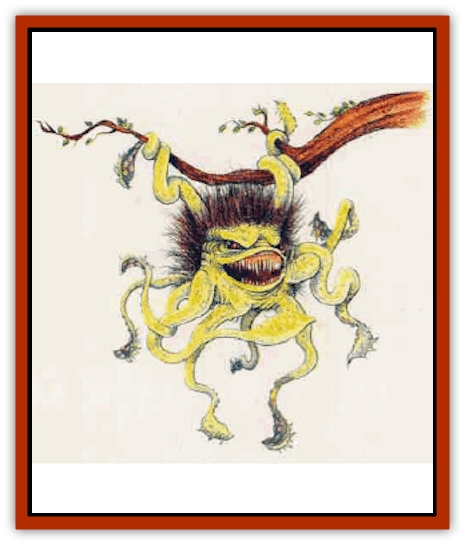

# Decapus

| Statistic | **Decapus** |
| --- | --- |
| **Activity Cycle:** | Night |
| **Alignment:** | Chaotic evil |
| **Armor Class:** | 5 |
| **Climate/Terrain:** | Any forest |
| **Damage/Attack:** | 1d6 each (tentacles) |
| **Diet:** | Carnivore |
| **Frequency:** | Rare |
| **Hit Dice:** | 4 |
| **Intelligence:** | Very (11) |
| **Magic Resistance:** | Nil |
| **Morale:** | Elite (13) |
| **Movement:** | 3, Cl 9 (in trees) |
| **No. Appearing:** | 1 |
| **No. of Attacks:** | 9 (hanging from tree) |
| **Organization:** | Solitary |
| **Size:** | M (4' across) |
| **Special Attacks:** | Nil |
| **Special Defenses:** | Nil |
| **THAC0:** | 17 |
| **Treasure:** | (C) |
| **XP Value:** | 175 |

The deacpus is a bizarre monster named for its ten limbs. There are two varieties: land and marine.

The land decapus looks like a hairy, bloated, 4-foot-wide globe sprouting ten long tentacles. The tentacles are 10' long and spaced over all parts of its body. The hair is usually brown or sometimes black, and the body is often green although purple and yellow examples have been found. In the center of the decapus's body lies its mouth, which s terrible to behold. It is very wide and has long yellow teeth, and exudes horribly foul breath.

The marine decapus looks just like the land version with two exceptions: it's less hairy, and coloration includes mainly greens and blues.

Decapuses communicate with one another using a complex language of clickng sounds and body movement.

**Combat:** The decapus has keen night vision, and a limited ability to see in the infrared spectrum (30-foot infravision). It usually hunts at night, when prey is vulnerable in the darkness; but these aggressive creatures have been seen hunting at all hours.

The decapus attacks with its tentacles, each of which ends in a sharp, hooklike protrusion of strong cartilage. Propelled by the momentum of the long limbs, these slashing "claws" inflict 1d6 points of damage each.

The tentacles are also covered on one side with suckers which the decapus can use not only to grasp its prey, but also to climb walls and ceilings. In combat, the decapus hangs from a ceiling or tree with one of its tentacles and attacks its unfortunate victim with the other nine.

On the ground, the decapus is much less fearsome. Its tentacles are not strong enough to support its weight upright for long periods of time, so the decapus can manage only six attacks, and these cause only half damage. When swinging from tree limbs, the decapus's movement rate is 9. On the ground the decapus moves much slower, crawling about at rate of 3.

**Habitat/Society:** These foul creatures are usually found in forests, where their many limbs are a great advantage in combat and locomotion among the trees. In colder climes decapuses tend to be much hairier; in the tropics, less. They are also found in swamps, and sometimes in wilderness ruins.

Decapuses usually livve alone, preferring to hunt by themselves. When hunting, they swing through the trees, scooping up any prey they encounter in their tentacles.

Only rarely do decapuses come together for the purpose of mating, and then for only a brief time. The female decapus gives birth to litters of six to a dozen infants, then abandons them in a protected place such as the hollow of a tree or an empty cave. The vicious little decapuses have ½ Hit Die and inflict 1d2 points of damage per limb. They grow rapidly. Their first prey is each other. Barring unusual circumstances, one decapus out of each litter will devour all of its siblings, gaining valuable practice in the skills of survival (and feeding on weaker and less aggressive individuals). It will also grow large enough to leave the birth-nest, and begin to hunt other creatures - starting with birds and small mammals, and eventually moving up to large predators.

**Ecology:** The decapus preys on other predators as well as herbivores. Its savagery is legendary, and even fierce wolves know enough to flee from it. It devours hapless humans and elves as willingly as it does its normal diet of squirrels, rabbits, or deer. Even when the monster is full, the decapus guards the remainder of a kill against scavengers, so that it may soon engorge itself again.

**Marine Decapus**

  This creature hunts by drifting slowly through the water, at a movement rate of 3, with its tentacles spread out around it in all directions. Since the water supports its weight and it has no need to anchor itself, the creature can attack with all ten tentacles at once.

Like its land-dwelling cousin, the marine decapus lurks as a dangerous, indigent predator, threatening even [[Shark|sharks]] for savage dominance of its waters.

---
## Discovery & Documentation

**Source Publication:** Mystara Appendix (1994)
**Campaign Setting:** Mystara
**Author(s):** John Nephew, Teeuwynn Woodruff, John Terra, Skip Williams

### Other Creatures Found in This Source Book
   * [[Actaeon|Actaeon]]
   * [[Agarat|Agarat]]
   * [[Ash_Crawler|Ash Crawler]]
   * [[Baldandar|Baldandar]]
   * [[Bargda|Bargda]]
   * [[Bhut|Bhut]]
   * [[Bird_Mystara|Bird (Mystara)]]
   * [[Blackball|Blackball]]
   * [[Choker|Choker]]
   * [[Coltpixie|Coltpixie]]
   * [[Crone_of_Chaos|Crone of Chaos]]
   * [[Darkhood|Darkhood]]
   * [[Darkwing|Darkwing]]
   * [[Deep_Glaurant|Deep Glaurant]]
   * [[Diabolus|Diabolus]]
   * [[Dimensional_Warper|Dimensional Warper]]
   * [[Dragon_Mystara_Crystalline|Dragon (Mystara), Crystalline]]
   * [[Dragon_Mystara_Jade|Dragon (Mystara), Jade]]
   * [[Dragon_Mystara_Onyx|Dragon (Mystara), Onyx]]
   * [[Dragon_Mystara_Ruby|Dragon (Mystara), Ruby]]
   * [[Drake_Mystara|Drake (Mystara)]]
   * [[Dragonfly|Dragonfly]]
   * [[Dusanu|Dusanu]]
   * [[Elemental_of_Chaos_Air_Earth|Elemental of Chaos, Air/Earth]]
   * [[Elemental_of_Chaos_Fire_Water|Elemental of Chaos, Fire/Water]]
   * [[Elemental_of_Law_Air_Earth|Elemental of Law, Air/Earth]]
   * [[Elemental_of_Law_Fire_Water|Elemental of Law, Fire/Water]]
   * [[Familiar_Mystara|Familiar (Mystara)]]
   * [[Frost_Salamander|Frost Salamander]]
   * [[Fundamental_Air_Earth|Fundamental, Air/Earth]]
   * [[Fundamental_Fire_Water|Fundamental, Fire/Water]]
   * [[Gargantua_Mystara|Gargantua (Mystara)]]
   * [[Geonid|Geonid]]
   * [[Ghostly_Horde|Ghostly Horde]]
   * [[Giant_Athach|Giant, Athach]]
   * [[Giant_Hephaeston|Giant, Hephaeston]]
   * [[Golem_Drolem|Golem, Drolem]]
   * [[Golem_Mystara_I|Golem (Mystara) I]]
   * [[Golem_Mystara_II|Golem (Mystara) II]]
   * [[Golem_Mystara_III|Golem (Mystara) III]]
   * [[Gray_Philosopher|Gray Philosopher]]
   * [[Guardian_Warrior|Guardian Warrior]]
   * [[Gyerian|Gyerian]]
   * [[Herex|Herex]]
   * [[Hivebrood|Hivebrood]]
   * [[Horde|Horde]]
   * [[Hsiao|Hsiao]]
   * [[Huptzeen|Huptzeen]]
   * [[Hutaakan|Hutaakan]]
   * [[Imp_Mystara|Imp (Mystara)]]
   * [[Jellyfish_Giant_Mystara|Jellyfish, Giant (Mystara)]]
   * [[Kna|Kna]]
   * [[Kopru|Kopru]]
   * [[Lizard_Mystara|Lizard (Mystara)]]
   * [[Lizard-kin_Mystara|Lizard-kin (Mystara)]]
   * [[Lupin|Lupin]]
   * [[Lycanthrope_Werejaguar_Mystara|Lycanthrope, Werejaguar (Mystara)]]
   * [[Lycanthrope_Wereswine|Lycanthrope, Wereswine]]
   * [[Magen|Magen]]
   * [[Manikin|Manikin]]
   * [[Mek|Mek]]
   * [[Mujina|Mujina]]
   * [[Nagpa|Nagpa]]
   * [[Neh-thalggu|Neh-thalggu]]
   * [[Nightshade_Mystara|Nightshade (Mystara)]]
   * [[Nuckalavee|Nuckalavee]]
   * [[Pegataur|Pegataur]]
   * [[Phanaton|Phanaton]]
   * [[Plant_Dangerous_Mystara|Plant, Dangerous (Mystara)]]
   * [[Plasm|Plasm]]
   * [[Rakasta|Rakasta]]
   * [[Rock_Man|Rock Man]]
   * [[Sabreclaw|Sabreclaw]]
   * [[Sacrol|Sacrol]]
   * [[Scamille|Scamille]]
   * [[Shapeshifter|Shapeshifter]]
   * [[Shargugh|Shargugh]]
   * [[Shark-kin|Shark-kin]]
   * [[Sollux|Sollux]]
   * [[Spectral_Death|Spectral Death]]
   * [[Spectral_Hound|Spectral Hound]]
   * [[Spider-kin|Spider-kin]]
   * [[Spirit_Mystara|Spirit (Mystara)]]
   * [[Statue_Living|Statue, Living]]
   * [[Surtaki|Surtaki]]
   * [[Tabi|Tabi]]
   * [[Thoul|Thoul]]
   * [[Thunderhead|Thunderhead]]
   * [[Tiger_Ebon|Tiger, Ebon]]
   * [[Topi|Topi]]
   * [[Tortle|Tortle]]
   * [[Vampire_Velya|Vampire, Velya]]
   * [[White_Fang|White Fang]]
   * [[Worm_Mystara|Worm (Mystara)]]
   * [[Wyrd|Wyrd]]
   * [[Yowler|Yowler]]
   * [[Zombie_Lightning|Zombie, Lightning]]
