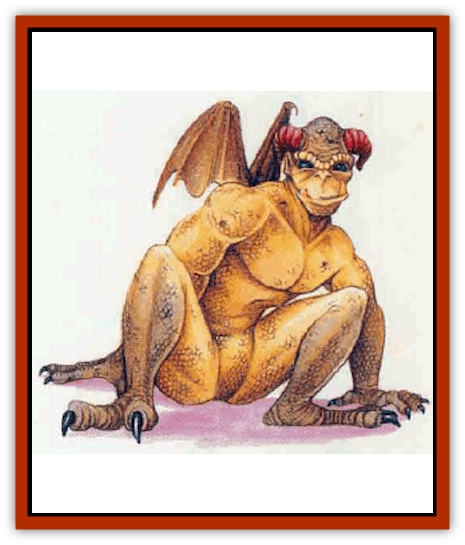

# Deep Glaurant

| Statistic | **Deep Glaurant** |
| --- | --- |
| **Activity Cycle:** | Night |
| **Alignment:** | Chaotic neutral |
| **Armor Class:** | 4 |
| **Climate/Terrain:** | Subterranean |
| **Damage/Attack:** | 2d4 (claw)/2d4 (claw)/1d4 (bite) or by weapon/by weapon/1d4 (bite) |
| **Diet:** | Carnivore |
| **Frequency:** | Very rare |
| **Hit Dice:** | 7 |
| **Intelligence:** | Low (5-7) |
| **Magic Resistance:** | Nil |
| **Morale:** | Champion (15) |
| **Movement:** | 9, Sw 9, Glide 12 (E) |
| **No. Appearing:** | 1d2 |
| **No. of Attacks:** | 3 |
| **Organization:** | Solitary or clan |
| **Size:** | L (8' tall) |
| **Special Attacks:** | Two rear claws (2d4 damage each) |
| **Special Defenses:** | Darkness |
| **THAC0:** | 13 |
| **Treasure:** | V (U) |
| **XP Value:** | 2,000 |

These rare, evil predators inhabit caverns deep beneath the world's surface. Deep glaurants are named for their strange gulping call, which they make deep in their throats when excited. If alone, or when stalking prey, they are eerily silent.

Glaurants are scaly, massively muscled humanoids, ocher to stony gray in color. They stand 8 feet tall, and their four limbs end in iron-strong, sharp-nailed claws which enable them to rake and rend flesh and climb over stones with equal ease. They are capable diggers and have little wings prouuding from their shoulders. These wings can be folded flat or sculled with great skill, and are used as aids in swimming, climbing, and turning falls into glides.

Glaurants have small, flexible horns on their heads which fold over their ears to protect against dust and to help them feel along crevices.

**Combat:** Silently, by act of will, deep glaurants can cause magical *darkness* about themselves once every third round (the effect lasts for tbe entire round). They can see up to 90 feet with infravision and are not bothered by normal or bright light.

Glaurants are intelligent enough to arrange rockfall traps and deadly ambushes. They often use magic gained from caches, tombs, and victims as weapons against foes, or trade such items when caught at a disadvantage. A favorite attack of a glaurant is to glide onto prey from above in silence and darkness.

In melee the deep glaurant slashes twice with its claws or strikes with two weapons, then delivers a vicious bite. Most favor weapon attacks. However, if the creature successfully rakes an opponent with its front claws and then bites, it gains a special "scrabbling" attack: both rear claws can strike too, inflicting 2d4 points of damage each. Each claw rake requires an attack roll.

A glaurant hunts anything and everything it sees. It fights until seriously wounded or threatened with death, or until its opponent is slain (whereupon it immediately feeds).

**Habitat/Society:** Encounters with these monsters come few and far between, ranging over vast underground regions. Their appetite is voracious and indiscriminately camivorous.

Deep glaurants are rumored to have cities and a civilisation far underground. However, there are no reliable records of encounters with more than two of them at any one time. Many scholars doubt the existence of such a civilization, citing the relatively low intelligence displayed by deep glaurants; others have suggested that only the less-intelligent outcasts may have been encountered so far by explorers. Adding confusion to the issue, no young glaurant specimen has ever been found. The creatures semm to have no goals more complex than finding food and eating it, although in pursuing that end they will go to elaborate and cunning lengths.

**Ecology:** In the cavems where glaurants roam, they are feared among sapient beings. In some subterranean cultures, they are the basis for tales meant to frighten youngsters into obedience.

The glaurant's ability to create magical *darkness* comes from a gland located in the creature's hindbrain. A talented alchemist or wizard may be able to carefully remove this gland with its contents intact. The oily gray fluid secreted by the glaurant can serve as a special material component in casting the spells *darkness*, *continual darkness*, and darkness 15' radius. So used, the fluid doubles either the duration or the radius of the spell.

While this fluid is obviously useful, it has never been so valuable as to encourage hunting of the glaurant. There are more valuable substances for adventurers to win from less challenging foes.

Deep glaurants have disdain for nearly all treasure except magical items. They especially favor weapons and other items with obvious practical applications, and they never keep magical items they cannot wield.

---
## Discovery & Documentation

**Source Publication:** Mystara Appendix (1994)
**Campaign Setting:** Mystara
**Author(s):** John Nephew, Teeuwynn Woodruff, John Terra, Skip Williams

### Other Creatures Found in This Source Book
   * [[Actaeon|Actaeon]]
   * [[Agarat|Agarat]]
   * [[Ash_Crawler|Ash Crawler]]
   * [[Baldandar|Baldandar]]
   * [[Bargda|Bargda]]
   * [[Bhut|Bhut]]
   * [[Bird_Mystara|Bird (Mystara)]]
   * [[Blackball|Blackball]]
   * [[Choker|Choker]]
   * [[Coltpixie|Coltpixie]]
   * [[Crone_of_Chaos|Crone of Chaos]]
   * [[Darkhood|Darkhood]]
   * [[Darkwing|Darkwing]]
   * [[Decapus|Decapus]]
   * [[Diabolus|Diabolus]]
   * [[Dimensional_Warper|Dimensional Warper]]
   * [[Dragon_Mystara_Crystalline|Dragon (Mystara), Crystalline]]
   * [[Dragon_Mystara_Jade|Dragon (Mystara), Jade]]
   * [[Dragon_Mystara_Onyx|Dragon (Mystara), Onyx]]
   * [[Dragon_Mystara_Ruby|Dragon (Mystara), Ruby]]
   * [[Drake_Mystara|Drake (Mystara)]]
   * [[Dragonfly|Dragonfly]]
   * [[Dusanu|Dusanu]]
   * [[Elemental_of_Chaos_Air_Earth|Elemental of Chaos, Air/Earth]]
   * [[Elemental_of_Chaos_Fire_Water|Elemental of Chaos, Fire/Water]]
   * [[Elemental_of_Law_Air_Earth|Elemental of Law, Air/Earth]]
   * [[Elemental_of_Law_Fire_Water|Elemental of Law, Fire/Water]]
   * [[Familiar_Mystara|Familiar (Mystara)]]
   * [[Frost_Salamander|Frost Salamander]]
   * [[Fundamental_Air_Earth|Fundamental, Air/Earth]]
   * [[Fundamental_Fire_Water|Fundamental, Fire/Water]]
   * [[Gargantua_Mystara|Gargantua (Mystara)]]
   * [[Geonid|Geonid]]
   * [[Ghostly_Horde|Ghostly Horde]]
   * [[Giant_Athach|Giant, Athach]]
   * [[Giant_Hephaeston|Giant, Hephaeston]]
   * [[Golem_Drolem|Golem, Drolem]]
   * [[Golem_Mystara_I|Golem (Mystara) I]]
   * [[Golem_Mystara_II|Golem (Mystara) II]]
   * [[Golem_Mystara_III|Golem (Mystara) III]]
   * [[Gray_Philosopher|Gray Philosopher]]
   * [[Guardian_Warrior|Guardian Warrior]]
   * [[Gyerian|Gyerian]]
   * [[Herex|Herex]]
   * [[Hivebrood|Hivebrood]]
   * [[Horde|Horde]]
   * [[Hsiao|Hsiao]]
   * [[Huptzeen|Huptzeen]]
   * [[Hutaakan|Hutaakan]]
   * [[Imp_Mystara|Imp (Mystara)]]
   * [[Jellyfish_Giant_Mystara|Jellyfish, Giant (Mystara)]]
   * [[Kna|Kna]]
   * [[Kopru|Kopru]]
   * [[Lizard_Mystara|Lizard (Mystara)]]
   * [[Lizard-kin_Mystara|Lizard-kin (Mystara)]]
   * [[Lupin|Lupin]]
   * [[Lycanthrope_Werejaguar_Mystara|Lycanthrope, Werejaguar (Mystara)]]
   * [[Lycanthrope_Wereswine|Lycanthrope, Wereswine]]
   * [[Magen|Magen]]
   * [[Manikin|Manikin]]
   * [[Mek|Mek]]
   * [[Mujina|Mujina]]
   * [[Nagpa|Nagpa]]
   * [[Neh-thalggu|Neh-thalggu]]
   * [[Nightshade_Mystara|Nightshade (Mystara)]]
   * [[Nuckalavee|Nuckalavee]]
   * [[Pegataur|Pegataur]]
   * [[Phanaton|Phanaton]]
   * [[Plant_Dangerous_Mystara|Plant, Dangerous (Mystara)]]
   * [[Plasm|Plasm]]
   * [[Rakasta|Rakasta]]
   * [[Rock_Man|Rock Man]]
   * [[Sabreclaw|Sabreclaw]]
   * [[Sacrol|Sacrol]]
   * [[Scamille|Scamille]]
   * [[Shapeshifter|Shapeshifter]]
   * [[Shargugh|Shargugh]]
   * [[Shark-kin|Shark-kin]]
   * [[Sollux|Sollux]]
   * [[Spectral_Death|Spectral Death]]
   * [[Spectral_Hound|Spectral Hound]]
   * [[Spider-kin|Spider-kin]]
   * [[Spirit_Mystara|Spirit (Mystara)]]
   * [[Statue_Living|Statue, Living]]
   * [[Surtaki|Surtaki]]
   * [[Tabi|Tabi]]
   * [[Thoul|Thoul]]
   * [[Thunderhead|Thunderhead]]
   * [[Tiger_Ebon|Tiger, Ebon]]
   * [[Topi|Topi]]
   * [[Tortle|Tortle]]
   * [[Vampire_Velya|Vampire, Velya]]
   * [[White_Fang|White Fang]]
   * [[Worm_Mystara|Worm (Mystara)]]
   * [[Wyrd|Wyrd]]
   * [[Yowler|Yowler]]
   * [[Zombie_Lightning|Zombie, Lightning]]
