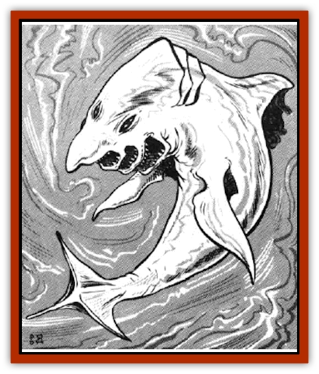

# Delphinid

| Statistic | **Delphinid** |
| --- | --- |
| **Activity Cycle:** | Any |
| **Alignment:** | Chaotic good |
| **Armor Class:** | 6 |
| **Climate/Terrain:** | Phlogiston flow |
| **Damage/Attack:** | 1-6 |
| **Diet:** | Omnivore |
| **Frequency:** | Uncommon |
| **Hit Dice:** | 3+3 |
| **Intelligence:** | Low (5-7) |
| **Magic Resistance:** | Nil |
| **Morale:** | Average (9) |
| **Movement:** | 21 |
| **No. Appearing:** | 2-12 |
| **No. of Attacks:** | 1 |
| **Organization:** | School |
| **Size:** | L (9' long) |
| **Special Attacks:** | Nil |
| **Special Defenses:** | Nil |
| **THAC0:** | 17 |
| **Treasure:** | Nil |
| **XP Value:** | 120 |

These friendly beasts swim harmlessly through the phlogiston. They have on occasion been known to help stranded travelers. A delphinid has a fish-shaped body with trilateral symmetry, with everything found in triplicate. The head tapers to a blunt nose. There are three eyes placed equidistantly around the head. The mouth has three jaws, all of which are hinged. There are three large dorsal fins equidistantly around the large, central part of the body. The tail has three fins as well.

Delphinids can change color to match the swirling phlogiston. They can make multi-colored swirls and streamers across their hide. A dead delphinid is a pale grey color. They have been known to intentionally turn grey, black, or white in order to be seen by passing sailors.

**Combat:** A delphinid can attack only by ramming (its teeth are too small to be used effectively as weapons). A delphinid can ram every other round. Each ram inflicts 1d6 points of damage. Any creature that weighs less than the delphinid must roll a successful Dexterity check or be knocked down (or off, or over, or whatever).

Delphinids rarely initiate combat. They attack only to protect themselves or their friends. They are smart enough to be creative in their strategies and tactics. They can be taught tricks or maneuvers quite easily.

**Habitat/Society:** Delphinids are found only in the phlogiston currents. They are usually found swimming with the current, not against it. Since they cannot travel at spelljamming speeds, they are encountered only by ships that are at rest or traveling at tactical speeds.

Delphinids are quite friendly. They will play and cavort with sailors. They are dexterous enough that they can dive into a ship's gravity, keep control of their trajectory, and make it back out. Any aggressive behavior or attempt to hurt or dominate a delphinid causes the entire school to vanish into the flow.

If a sailor falls off a deck, delphinids have been known to carry him back to the ship. If they are feeling particularly frisky, they may even give a sailor a joy ride. The sight of a school of delphinids can do wonders for the morale of a crew that has been in space too long.Each delphinid has its own personality. While they travel together in a school, there does not appear to be a leader. Each delphinid does as it pleases. The group tends to follow the one with the idea of the moment. They like [[Elf|elves]], humans, [[Gnome|gnomes]], [[Halfling|halflings]], <a href="">kender</a>, and other fun-loving races. They avoid [[Beholder_and_Beholder-kin_I|beholders]], [[Mind_Flayer|mind flayers]], [[Neogi|neogi]], [[Lizard_Man|lizard men]], and other aggressive races. They are neutral toward [[Dwarf|dwarves]], the [[Arcane|arcane]], [[Giff|giff]], [[Dracon|dracon]], and such.

**Ecology:** Delphinids somehow get their nourishment from phlogiston. They like various treats that sailors are fond of throwing to them. In particular they like fruit of any sort. Unfortunately for them, fruit is a rare commodity aboard a spelljamming ship.

Delphinid young are born live, with a single calf per birth. Both parents raise the calf until it is old enough to defend itself. Once the calf has left its parents, they part ways as well. Delphinids do not mate for life.

Delphinid flesh is sweet and tender. The neogi consider it a delicacy. Most good or neutrally aligned human sailors consider it bad luck to kill a delphinid.

---
## Discovery & Documentation

**Source Publication:** MC7 Spelljammer Appendix I (1990)
**Campaign Setting:** Advanced Dungeons & Dragons 2nd Edition
**Author(s):** various

### Other Creatures Found in This Source Book
   * [[Aartuk|Aartuk]]
   * [[Albari|Albari]]
   * [[Ancient_Mariner|Ancient Mariner]]
   * [[Argos|Argos]]
   * [[Beholder_Abomination_Astereater|Beholder (Abomination), Astereater]]
   * [[Blazozoid|Blazozoid]]
   * [[Chattur|Chattur]]
   * [[Chevall|Chevall]]
   * [[Clockwork_Horror|Clockwork Horror]]
   * [[Colossus|Colossus]]
   * [[Dizantar|Dizantar]]
   * [[Dog|Dog]]
   * [[Dog_Bog_Hound|Dog, Bog Hound]]
   * [[Esthetic|Esthetic]]
   * [[Focoid|Focoid]]
   * [[Fractine|Fractine]]
   * [[Giant_Spacesea|Giant, Spacesea]]
   * [[Golem_Furnace|Golem, Furnace]]
   * [[Golem_Radiant|Golem, Radiant]]
   * [[Gravislayer|Gravislayer]]
   * [[Grommam|Grommam]]
   * [[Hadozee|Hadozee]]
   * [[Hamster_Giant_Space|Hamster, Giant Space]]
   * [[Jammer_Leech|Jammer Leech]]
   * [[Lakshu|Lakshu]]
   * [[Lumineaux|Lumineaux]]
   * [[Lutum|Lutum]]
   * [[Mimic_Space|Mimic, Space]]
   * [[Misi|Misi]]
   * [[Moon_Rogue|Moon, Rogue]]
   * [[Mortiss|Mortiss]]
   * [[Murderoid|Murderoid]]
   * [[Nay-Churr|Nay-Churr]]
   * [[Phlog-Crawler|Phlog-Crawler]]
   * [[Plasman|Plasman]]
   * [[Plasmoid_DeGleash|Plasmoid, DeGleash]]
   * [[Plasmoid_DelNoric|Plasmoid, DelNoric]]
   * [[Plasmoid_General_Information|Plasmoid, General Information]]
   * [[Plasmoid_Ontalak|Plasmoid, Ontalak]]
   * [[Puffer|Puffer]]
   * [[Q'nidar|Q'nidar]]
   * [[Rastipede|Rastipede]]
   * [[Reigar|Reigar]]
   * [[Rock_Hopper|Rock Hopper]]
   * [[Slinker|Slinker]]
   * [[Spider_Asteroid|Spider, Asteroid]]
   * [[Spiritjam|Spiritjam]]
   * [[Survivor|Survivor]]
   * [[Syllix|Syllix]]
   * [[Symbiont_Power|Symbiont, Power]]
   * [[Vine_Infinity|Vine, Infinity]]
   * [[Wiggle|Wiggle]]
   * [[Wizshade|Wizshade]]
   * [[Wryback|Wryback]]
   * [[Zard|Zard]]
   * [[Zodar|Zodar]]
