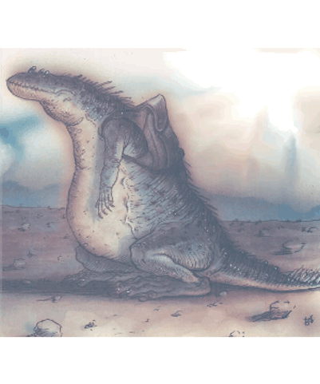

# Demarax

| Statistic | **Demarax** |
| --- | --- |
| **Activity Cycle:** | Any |
| **Alignment:** | Lawful neutral |
| **Armor Class:** | 0 |
| **Climate/Terrain:** | Outlands or any Lawful plane |
| **Damage/Attack:** | 1d8 |
| **Diet:** | Special |
| **Frequency:** | Very rare |
| **Hit Dice:** | 5+5 |
| **Intelligence:** | Low (5-7) |
| **Magic Resistance:** | 90% |
| **Morale:** | Average (8-10) |
| **Movement:** | 6 |
| **No. Appearing:** | 1-3 |
| **No. of Attacks:** | 1 |
| **Organization:** | Clutch |
| **Size:** | M (6' body) |
| **Special Attacks:** | <i>Magic missile</i> |
| **Special Defenses:** | Spell crystals |
| **THAC0:** | 15 |
| **Treasure:** | Nil |
| **XP Value:** | 2,000 |

There are some mighty strange creatures on the Great Road, and the demarax is one of the strangest. It looks like a jewelled [[Lizard|lizard]] or gem-covered [[Crocodile|crocodile]], with tiny crystals of a hundred different colors embedded in its dark hide. (The older it gets, the more obvious and profuse the gems become.) Its face is blunt and small-mouthed, and three jellow eyes are spaced evenly across its forehad. The demarax's movements are slow and deliberate, and it's often the butt of jokes about slow speed; the folk of Automata refer to a lazy basher as a "demarax walking uphill".

The truly unusual thing about the demarax is its diet - it eats spell crystals, the magical manifestations of summoning and contact other plane spells cast by wizard on prime-material worlds. A body could stick his hand in a demarax's mouth and it wouldn't bite him; spell crystals are the only things it eats. This means that a demarax doesn't pose a threat to the typical traveler on the planes, but if that traveler's got a trapped spell crystal, or one appears in the traveler's vicinity, the demarax'll single-mindedly try to get at its favorite food, no matter who or what gets in the way.

**Combat:** Demarax're highly magic resistant; in fact, they may be about the most magic-resistant creatures around. When one touches a spell crytal, it almost always fizzles. The demarax feeds on the spell's remains. Its gem-studded hide is renewed by the process of devouring a spell crystal; the rock-hard crystals provide the demarx with an exceptional natural Armor Class. The demarax's magic resistance extends to all other kinds of magic cast at it, so it's a rare event when a spell actually affects one.

The demarax is a generally inoffensive creature, and doesn't go out of its way to start a fight unless it's provoked or it senses a spell crystal on someone's person. The demarax can sense a crystal up to 200 yards away; it also has the unusual ability to deceive a crystal into believing that the demarax itself is the intended recipient of the spell. The crystal instantly diverts itself from its course and streaks to the demarax, who happily devours it. On rare occasions, when the creature fails its magic resistance roll, it can be *summoned* in place of whatever the casting wizard really wanted. The demarax is too stupid to do much of anything except stare at its new surroundings and slowly starve to death for lack of food.

If a demarax is provoked or attacked, it defends itself by lashing out with its powerful tail. The gems lining its tail are heavier and sharper than elsewhere on its body, and the demarax can deliver a serious blow. The creature can also fire *magic missiles* from its eyes, delivering a volley of three *magic missiles* up to three times a day. The demarax doesn't like to do this, since this rapidly depletes the spell energy that sustains it, and makes it hungry again in a hurry.

As a last-ditch defense, the demarax can release a whirling storm of partially-absorbed spell crystasl that scythe and spin around it to a range of 20 feet. Any creature in that area must make a successful saving throw versus paralyzation or be struck by a crystal, which inflicts one of the random effects below:

| d6 Roll | Effect |
| --- | --- |
| 1-2 | Target confused for 1d4 rounds by a barrage of questions |
| 3-4 | Target blinded for 2d4 rounds by images of another world |
| 5 | Spell energy causes target to blink for 2d4 rounds |
| 6 | Target transported to Prime Material Plane by a remnant of a summoning spell |

Creating the crystal storm exhausts the demarax's energy; if it does not feed on a crystal, it starves to death within 1d6 hours. Naturally, the demarax uses this ability only when its life's in immediate and dire peril.

**Habitat/Society:** Demaraxas travel alone or in small groups, roaming the Great Road in an endless search for the spell crystals they feed on. They're barely intelligent enough to speak a few crude phrases of the common trade jargon of the planes, but a body shouldn't expect lively repartee from a demarax. Their typical dialogue goes something along these lines: "S-s-seen crys-s-stals-s? Need crys-stals. Hun-gry. Hun-gry now."

Interestingly enough, the demarax possesses a perfect memory and a complete inability to lie. It may be dumb as astump, but it can repeat any conversation it's ever had word for word, even if it has no idea what the other party may've been talking about. The demarax isn't bright enough to understand the concepts of past, present, or future, so a cutter hoping to get some information from a demarax had better be ready to ask some stump-dumb questions, or he'll find the demarax abandoning the conversation and resuming its search for food.

One last thing about the demarax: Its hide is worth a lot to any cutter in need of some jink. The typical demarax is covered with the equivalent of 50 to 100 (1d6+4x10) gems worth 10 gp each. There're only a small fraction of the crystals studding the demarax's hide, but the rest are too small to be of any value.

**Ecology:** As noted above, the demarax feeds on spell crystals. Somehow, the creature's metabolism converts the magical energy contained in these crystals into the energy needed to sustain life. The demarax's unusual body processes result in an incredible life span; a body can talk to a demarax who recalls conversations thousands of years old.

Since the demarax's body works on different systems than most living creatures do, it's basically inedible. Nothing can digest the crystalline hide or flesh, so it's without natural predators. Unfortunately, there are any number of bloods who'll take a demarax for its hide.

It is said by the Guvners that the demaraxes were created by the Powers of Law to reduce the chaos caused by the uncontrollable appearance of spell crystals. By devouring all crystals they come across, the demaraxes prevent a lot of chaotic things from happening.

---
## Discovery & Documentation

**Source Publication:** Planescape II (1996)
**Campaign Setting:** Planescape
**Author(s):** Rich Baker, Karen S. Boomgarden

### Other Creatures Found in This Source Book
   * [[Aasimar|Aasimar]]
   * [[Abrian|Abrian]]
   * [[Arcane|Arcane]]
   * [[Balaena|Balaena]]
   * [[Beholder-kin_Observer|Beholder-kin, Observer]]
   * [[Bloodthorn|Bloodthorn]]
   * [[Bonespear|Bonespear]]
   * [[Darkweaver|Darkweaver]]
   * [[Dhour|Dhour]]
   * [[Eater_of_Knowledge|Eater of Knowledge]]
   * [[Eladrin_Greater_Firre|Eladrin, Greater, Firre]]
   * [[Eladrin_Greater_Ghaele|Eladrin, Greater, Ghaele]]
   * [[Eladrin_Greater_Tulani|Eladrin, Greater, Tulani]]
   * [[Eladrin_Lesser_Bralani|Eladrin, Lesser, Bralani]]
   * [[Eladrin_Lesser_Coure|Eladrin, Lesser, Coure]]
   * [[Eladrin_Lesser_Noviere|Eladrin, Lesser, Noviere]]
   * [[Eladrin_Lesser_Shiere|Eladrin, Lesser, Shiere]]
   * [[Fhorge|Fhorge]]
   * [[Ghostlight|Ghostlight]]
   * [[Guardinal_Avoral|Guardinal, Avoral]]
   * [[Guardinal_Cervidal|Guardinal, Cervidal]]
   * [[Guardinal_General_Information|Guardinal, General Information]]
   * [[Guardinal_Equinal|Guardinal, Equinal]]
   * [[Guardinal_Leonal|Guardinal, Leonal]]
   * [[Guardinal_Lupinal|Guardinal, Lupinal]]
   * [[Guardinal_Ursinal|Guardinal, Ursinal]]
   * [[Hollyphant|Hollyphant]]
   * [[Incantifer|Incantifer]]
   * [[Ironmaw|Ironmaw]]
   * [[Keeper|Keeper]]
   * [[Khaasta|Khaasta]]
   * [[Leomarh|Leomarh]]
   * [[Monster_of_Legend|Monster of Legend]]
   * [[Mortai|Mortai]]
   * [[Noctral|Noctral]]
   * [[Quill|Quill]]
   * [[Razorvine|Razorvine]]
   * [[Reave|Reave]]
   * [[Retriever|Retriever]]
   * [[Rilmani_Abiorach|Rilmani, Abiorach]]
   * [[Rilmani_General_Information|Rilmani, General Information]]
   * [[Rilmani_Argenach|Rilmani, Argenach]]
   * [[Rilmani_Aurumach|Rilmani, Aurumach]]
   * [[Rilmani_Cuprilach|Rilmani, Cuprilach]]
   * [[Rilmani_Ferrumach|Rilmani, Ferrumach]]
   * [[Rilmani_Plumach|Rilmani, Plumach]]
   * [[Shadowdrake|Shadowdrake]]
   * [[Spellhaunt|Spellhaunt]]
   * [[Spider_Hook|Spider, Hook]]
   * [[Sunfly|Sunfly]]
   * [[Sword_Spirit|Sword Spirit]]
   * [[Tanar'ri_Lesser_Bulezau|Tanar'ri, Lesser, Bulezau]]
   * [[Tanar'ri_Lesser_Maurezhi|Tanar'ri, Lesser, Maurezhi]]
   * [[Tanar'ri_Lesser_Yochlol|Tanar'ri, Lesser, Yochlol]]
   * [[Tanar'ri_General_Information|Tanar'ri, General Information]]
   * [[Tanar'ri_True_Alkilith|Tanar'ri, True, Alkilith]]
   * [[Terlen|Terlen]]
   * [[Tso|Tso]]
   * [[T'uen-rin|T'uen-rin]]
   * [[Vaporighu|Vaporighu]]
   * [[Vorr|Vorr]]
   * [[Wastrel|Wastrel]]
   * [[Wraithworm|Wraithworm]]
   * [[Yugoloth_Lesser_Canoloth|Yugoloth, Lesser, Canoloth]]
   * [[Zoveri|Zoveri]]
