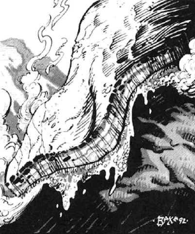

# Denzelian

| Statistic | **Denzelian** |
| --- | --- |
| **Activity Cycle:** | Any |
| **Alignment:** | Neutral |
| **Armor Class:** | 0 |
| **Climate/Terrain:** | Any subterranean |
| **Damage/Attack:** | 5-20 |
| **Diet:** | Rock |
| **Frequency:** | Very rare |
| **Hit Dice:** | 6 |
| **Intelligence:** | Semi- (2-4) |
| **Magic Resistance:** | Nil |
| **Morale:** | Average (8-10) |
| **Movement:** | 3, Br 12 |
| **No. Appearing:** | 1-2 |
| **No. of Attacks:** | 1 |
| **Organization:** | Solitary |
| **Size:** | L (10' diameter) |
| **Special Attacks:** | See below |
| **Special Defenses:** | Nil |
| **THAC0:** | 15 |
| **Treasure:** | Q |
| **XP Value:** | 420 |

A denzelian is a large, flat being, normally about 10' in diameter and 6" thick. It appears to be composed of smooth stone, but its thick skin is somewhat flexible, allowing it to squeeze through tight places and to travel up and down inclines. A denzelian may be of practically any color, depending upon the minerals it absorbs. Though browns and grays are most common, brilliant red or yellow denzelians have been seen.

Denzelians have no features. They seem to have a rudimentary form of language, consisting of vibrations sent through the rock. No member of any other species has been able to master this form of communication, though some denzelians may be trained to respond to taps on their surface.

**Combat:** These rock-eaters are normally peaceful and nonaggressive. They will fight back if attacked, at least briefly, and they will go to great lengths to drive off or kill anyone who threatens their young. They can sense the vibrations caused by movement and keep track of intruders in this manner. Denzelians secrete acid from their entire surfaces, normally using the acid to burrow through rock and break it down so it can be eaten. If it is frightened, a denzelian can greatly increase the amount of acid it produces, allowing it to escape by sinking into the rock, leaving a crumbly, blackish, sandlike residue behind. If it wishes to attack, the denzelian rushes towards its enemy at twice its normal movement rate, and attempts to trip the victim, causing him/her to fall on top of the denzelian and take 5-20 points of damage from the acid. A saving throw vs. breath weapon is allowed for half damage; if this fails, the victim's equipment and clothing may be affected as well.

A denzelian may also attack by burrowing through the rock until it is above its enemies, and then dropping on them. The creature is quite heavy, weighing almost 1,000 pounds. Any caught underneath it take 4-24 points of damage. A successful saving throw vs. paralyzation is needed to avoid the falling denzelian. Those caught under it automatically take acid damage in the next round, and in every subsequent round until the denzelian moves, is removed, or dies. Since the deuzelian is somewhat flexible, victims will not be without air. Creatures in the area of such a fall may also be affected by the sandy residue which falls through the hole created by the denzelian. This gritty substance fills the air, getting into the eyes, mouths, and noses of nearby creatures. Anyone within 10' of the falling denzelian must save vs. paralyzation or be at -2 to their attack rolls for 2-5 rounds, or until the substance is washed away.

**Habitat/Society:** Denzelians normally inhabit areas far away from civilization, travelling through the rock to find choice mineral deposits. Many minerals are absorbed through a denzelian's skin after its acid breaks them down sufficiently. However, denzelians do not like metals. Metal ores are often uncovered and left along the meandering trails created by the denzelian.

Denzelians seem to have gender, though no sage has ever determined how to tell them apart. Mating takes place only once in a decade, whenever two denzelians of the opposite sex meet, apparently at random. About a year later, the female lays 3-12 gemlike eggs, depositing them hundreds of yards apart over the course of a month. The eggs are quite beautiful. A denzelian egg is a fist-sized, faceted gem which looks much like smoky quartz. In the center of the gem is a milky, grayish liquid, the embryo of the new denzelian. If the egg is not moved too roughly, which will destroy the embryo, a baby denzelian will hatch in about a year. During this time, the mother stays near enough to the eggs to sense if anyone approaches.

**Ecology:** Denzelians do not eat animals or plants. They smell repulsive and are indigestible by animals and plants.

A denzelion egg can bring up to 1,000 gp from a collector. Still-viable eggs might bring the same amount from wealthy mine-owners. Just-hatched dandelions can be trained to seek out certain ores, but they are often very stubborn once they find a deposit to their liking.

Denzelian body parts may be worth a great deal to an alchemist, particularly if any of the acid-secreting glands are still intact. The body is composed of a very rich mix of minerals, and includes deposits of almost pure carbon, sulfur, magnesium, and more. Some of the deposits are formed into gemstones, and it is not unusual to find perfectly round diamonds inside the body of a denzelian.

---
## Discovery & Documentation

**Source Publication:** MC14 Fiend Folio Appendix (1992)
**Campaign Setting:** Fiends Folio
**Author(s):** Don Bingle, John Terra, Wes Nicholson, Tim Beach, Steve Hardinger, Kris Hardinger, Rob Nicholls, Greg Swedberg, Al Boyce, Vince Garcia, Norm Ritchie

### Other Creatures Found in This Source Book
   * [[Aballin|Aballin]]
   * [[Achaierai|Achaierai]]
   * [[Adherer|Adherer]]
   * [[Algoid|Algoid]]
   * [[Al-Mi'raj|Al-Mi'raj]]
   * [[Apparition|Apparition]]
   * [[Caterwaul|Caterwaul]]
   * [[Coffer_Corpse|Coffer Corpse]]
   * [[Crabman|Crabman]]
   * [[Dark_Creeper|Dark Creeper]]
   * [[Dark_Stalker|Dark Stalker]]
   * [[Darter|Darter]]
   * [[Dune_Stalker|Dune Stalker]]
   * [[Dwarf_Urdunnir|Dwarf, Urdunnir]]
   * [[Falcon_Fire|Falcon, Fire]]
   * [[Faux_Faerie|Faux Faerie]]
   * [[Flawder|Flawder]]
   * [[Fyrefly|Fyrefly]]
   * [[Gambado|Gambado]]
   * [[Garbug|Garbug]]
   * [[Giant_Fhoimorien|Giant, Fhoimorien]]
   * [[Gibberling|Gibberling]]
   * [[Gorbel|Gorbel]]
   * [[Grimlock|Grimlock]]
   * [[Hellcat|Hellcat]]
   * [[Ice_Lizard|Ice Lizard]]
   * [[Iron_Cobra|Iron Cobra]]
   * [[Khargra|Khargra]]
   * [[Mantari|Mantari]]
   * [[Penanggalan|Penanggalan]]
   * [[Pernicon|Pernicon]]
   * [[Phantom_Stalker|Phantom Stalker]]
   * [[Retriever|Retriever]]
   * [[Ruve|Ruve]]
   * [[Scathe|Scathe]]
   * [[Sheet_Ghoul_Sheet_Phantom|Sheet Ghoul/Sheet Phantom]]
   * [[Shocker|Shocker]]
   * [[Spanner|Spanner]]
   * [[Stwinger|Stwinger]]
   * [[Sussurus|Sussurus]]
   * [[Symbiotic_Jelly|Symbiotic Jelly]]
   * [[Terithran|Terithran]]
   * [[Thunder_Children|Thunder Children]]
   * [[Troll_Ice|Troll, Ice]]
   * [[Tween|Tween]]
   * [[Umpleby|Umpleby]]
   * [[Volt|Volt]]
   * [[Xill|Xill]]
   * [[Xvart|Xvart]]
   * [[Zygraat|Zygraat]]
