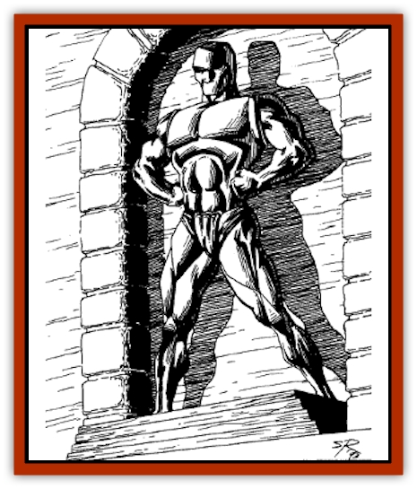

# Devourer - Lankhmar

| Statistic | **Devourer (Lankhmar)** |
| --- | --- |
| **Activity Cycle:** | Any |
| **Alignment:** | Lawful evil |
| **Armor Class:** | 0 |
| **Climate/Terrain:** | Unknown |
| **Damage/Attack:** | 1-8 or by weapon |
| **Diet:** | Omnivore |
| **Frequency:** | Very rare |
| **Hit Dice:** | 10 |
| **Intelligence:** | Exceptional - Genius (16-18) |
| **Magic Resistance:** | 15% |
| **Morale:** | Champion (16) |
| **Movement:** | 18 |
| **No. Appearing:** | 1 |
| **No. of Attacks:** | 1 |
| **Organization:** | Corporation or solitary |
| **Size:** | L (7'+ tall) |
| **Special Attacks:** | Enchanted weapons |
| **Special Defenses:** | Illusion |
| **THAC0:** | 11 |
| **Treasure:** | Q (&times;10),Z (D,F,H); (see below) |
| **XP Value:** | 5,000 |

The Devourers are a race of rapacious alien merchants whose only purpose is to sell trash and reap huge profits. They set up shop in large urban areas (such as Lankhmar) and, using their potent powers of illusion, persuade the populace that they are selling fabulous treasures at bargain rates.

In their true form, Devourers resemble large iron statues, something like [[Golem_I_Greater_Golem|iron golems]]. Their illusionary powers allow them to appear as anything and anyone they desire (usually the most inoffensive and naive salesman imaginable, for example). Their illusions cannot be dispelled, nor is there a saving throw. They can only be penetrated by magical means.

**Combat:** Devourers prefer not to fight, but they can be awesome enemies. Devourers are 75% likely to be armed with enchanted weapons (+2 to +4). They are intelligent and cunning, and they will withdraw from a fight they cannot win.

The Devourers are capable of disguising the true nature of any object within 100 feet. Illusory items can be seen truly only by using *true sight*, *Ningauble's magic blindfold*, or through similar magical means. Once disguised, items retain their illusory appearance until the last Devourer leaves the world.

**Habitat/Society:** The Devourers originate in a parallel universe, but they have spread to numerous other worlds, bankrupting them and ransacking their wealth. Devourers carry individual type Q and Z treasures. Note that their fabulous hoards (the D, F, H type treasures) are hidden on the Devourers' home plane (which remains undiscovered). The hoards are all extremely well guarded.

---
## Discovery & Documentation

**Source Publication:** Lankhmar: City of Adventure (2nd Ed.) (1993)
**Campaign Setting:** Lankhmar
**Author(s):** Bruce Nesmith, Douglas Niles, and Ken Rolston

### Other Creatures Found in This Source Book
   * [[Astral_Wolf|Astral Wolf]]
   * [[Behemoth|Behemoth]]
   * [[Bird_of_Tyaa|Bird of Tyaa]]
   * [[Cat_War|Cat, War]]
   * [[Cloaker_Sea|Cloaker, Sea]]
   * [[Cold_Woman|Cold Woman]]
   * [[Ghoul_Kleshite|Ghoul, Kleshite]]
   * [[Ghoul_Lankhmar|Ghoul (Lankhmar)]]
   * [[Gladiator_Lizard|Gladiator Lizard]]
   * [[Horag|Horag]]
   * [[Howler|Howler]]
   * [[Ice_Gnome|Ice Gnome]]
   * [[Invisible_of_Stardock|Invisible of Stardock]]
   * [[Lizard|Lizard]]
   * [[Ophidian|Ophidian]]
   * [[Ray_Invisible_Flying|Ray, Invisible Flying]]
   * [[Scorpion|Scorpion]]
   * [[Simorgyan|Simorgyan]]
   * [[Snow_Serpent|Snow Serpent]]
   * [[Thunder_Children|Thunder Children]]
   * [[Wraith-Spider|Wraith-Spider]]
   * [[Zombie_Sea|Zombie, Sea]]
