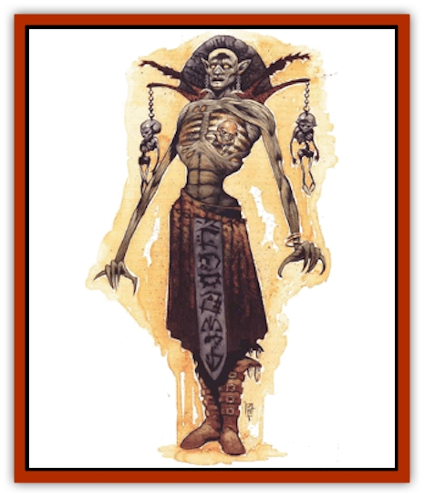

# Devourer - Planescape

| Statistic | **Devourer (Planescape)** |
| --- | --- |
| **Activity Cycle:** | Any |
| **Alignment:** | Neutral evil |
| **Armor Class:** | 2 |
| **Climate/Terrain:** | Ethereal or Astral Plane |
| **Damage/Attack:** | 2d6 |
| **Diet:** | Life energy |
| **Frequency:** | Very rare |
| **Hit Dice:** | 9+3 |
| **Intelligence:** | Exceptional (15-16) |
| **Magic Resistance:** | 45% |
| **Morale:** | Fanatic (17) |
| **Movement:** | 12 |
| **No. Appearing:** | 1 |
| **No. of Attacks:** | 1 |
| **Organization:** | Solitary |
| **Size:** | L (8' tall) |
| **Special Attacks:** | Level drain, spirit theft, spells |
| **Special Defenses:** | Hit point recovery, protection from spells |
| **THAC0:** | 11 |
| **Treasure:** | Nil |
| **XP Value:** | 13,000 |

Haunting the deep reaches of the Ethereal and Astral Planes, the creatures known as devourers have a reputation for being among the most fearsome and loathsome of foes. For many planewalkers, they embody the true nature of evil (despite the fact that they don't come from the Lower P1anes). See, Devourer have so little regard for anyone but themselves that they're willing to steal the life essence of other beings to power their own magic.

Nothing about a devourer's appearance gives the impression that it's anything other than a horrible monster. A gaunt, skeletal creature of great height, it usually has a tiny figure trapped within what appears to be the bones of its rib cage. This captive is obviously powerless and clearly suffers great distress and pain, though he often has a look about him that indicates that he's been imprisoned for a long, long time.

**Combat:** Most cutters fear the devourer, and with good reason. Sure, its large, crooked claws inflict 2d6 points of damage per strike, but even worse, its touch also drains one energy level. If wounded in battle, a devourer regains a number of hit points equal to those permanently lost by a victim from whom it drained a level.

What's more, the creature can capture a berk's entire life essence - truly a fate far worse than death. To steal a spirit, the devourer must roll a successful attack against its chosen victim. The sod must then make a successful saving throw vs. death magic to avoid the effect. If he fails the saving throw, he's slain, and his spirit becomes trapped within the devourer. Onlookers can see it appear within the rib cage of the skeletal horror.

A captive spirit is completely unable to act and can't be restored by a *raise dead* spell. Fact is, all it can do is serve as fuel for the devourer's spells and abilities. The greater the level or Hit Dice of the trapped spirit, the more power it provides to its "host". And because a devourer's rib cage can hold only one spirit at a time, the creature always seeks to prey upon the mightiest victims it can find. While it holds a trapped spirit, a devourer can use the following spell-like powers at will, once per round: *confusion*, *control undead*, *paralysis* (as the wand), *ray of enfeeblement*, *spectral hand* (which it can use to drain levels, but not steal spirits), *suggestion*, *summon shadow*, and *true seeing*. Each level or Hit Die of the captive gives the devourer a total of five power uses. Once it has completely consumed the spirit in this manner, the sod's life essence is destroyed forever and the devourer must find a new victim.

In addition to powering spell-like abilities, the captive spirit offers the devourer magical protection. If a cutter casts any of the following spells upon the creature (and if they penetrate its magic resistance), they affect the trapped spirit instead: *banishment*, *chaos*, *confusion*, *dispel evil*, *emotion*, *entrapment*, *ESP*, *fear*, *geas*, *holy word*, *imprisonment*, *magic jar*, *maze*, *quest*, *spirit wrack*, *trap the soul*, and any type of *charm*, *domination*, *hypnosis*, or *suggestion*.

Note that some of these spells (including *banishment*, *dispel evil*, and *entrapment*) get rid or the trapped spirit, leaving the devourer's rib cage empty. If this occurs, the creature can't use any of its spell-like powers - or protect itself from the above-named spells - until it finds a new victim. And what becomes of the spirit, once released from its skeletal prison? Well, the basher's still in the dead-book, but at least the spirit is free to go to the plane of its alignment (and can also be brought back to life with *raise dead*).

When encountered, a devourer will almost always have a captive spirit in its rib cage (85% change). The Dungeon Master should roll 3d4+3 to randomly determine how many Hit Dice or levels the victim has left for its captor to utilize.

**Habitat/Society:** Some folks believe that only one devourer exists, that it's a unique creature. Wishful thinking - it's very pretty well confirmed that that's not the case. However, exactly what the creatures *are* is still a mystery. Are they a predator race found only on the Silver Void and the Misty Shore? Are they the magical creations of a viciously evil wizard? Are they manifestations of something else entirely - perhaps the most despicable thoughts and emotions that end up on the Astral? No one's tumbled to the dark of it yet. Fact is, no one even knows if the things can communicate, though it's been theorized that they're telepathic.

When a planewalker stumbles across a devourer, the creature's always alone (except for its captive spirit, of course). Nothing alive seems to tolerate the monsters' presence; they even appear to abhor one another. Furthermore, devourers are encountered only when they're out hunting for victims from whom they can drain levels or steal spirits. If the creatures do make lairs on the Astral and the Ethereal, such places've never been found. Perhaps that's for the best.

**Ecology:** It's not known how (or if) devourers reproduce. They subsist totally on life energy, needing no actual food or drink. Despite their appearance and their requirements for existence, they're not undead.

Chant has it that a few bashers have encountered devourers on the Negative Energy Plane, but who'd believe the word of anyone who'd willingly go to such a horrible place? Others contend that while devourers spend most of their time on the Astral or the Ethereal, they do indeed make occasional trips to the Negative Energy Plane, for reasons unknown. Unlike undead, they have no direct connection to the plane (hence their ability to go to the Astral and even beyond, if they wished), but they do seem to make the odd "pilgrimage" now and then - no doubt because of their nature.

---
## Discovery & Documentation

**Source Publication:** Planescape III (1996)
**Campaign Setting:** Planescape
**Author(s):** Monte Cook

### Other Creatures Found in This Source Book
   * [[Animental|Animental]]
   * [[Archomental_Evil|Archomental, Evil]]
   * [[Archomental_Good|Archomental, Good]]
   * [[Belker|Belker]]
   * [[Bzastra|Bzastra]]
   * [[Chososion|Chososion]]
   * [[Darklight|Darklight]]
   * [[Devete|Devete]]
   * [[Dharum_Suhn|Dharum Suhn]]
   * [[Egarus|Egarus]]
   * [[Elemental_Athas_Lesser_Air_Earth|Elemental (Athas), Lesser, Air/Earth]]
   * [[Elemental_Athas_Lesser_Fire_Water|Elemental (Athas), Lesser, Fire/Water]]
   * [[Elemental_Fire_Kin_Salamander_II|Elemental, Fire Kin, Salamander II]]
   * [[Entrope|Entrope]]
   * [[Facet|Facet]]
   * [[Frost_Salamander|Frost Salamander]]
   * [[Fundamental_Air_Earth|Fundamental, Air/Earth]]
   * [[Fundamental_Fire_Water|Fundamental, Fire/Water]]
   * [[Fundamental_All_Elements|Fundamental, All Elements]]
   * [[Garmorm|Garmorm]]
   * [[Homunculus_Elemental|Homunculus, Elemental]]
   * [[Immoth|Immoth]]
   * [[Khargra|Khargra]]
   * [[Klyndes|Klyndes]]
   * [[Magran|Magran]]
   * [[Menglis|Menglis]]
   * [[Nathri|Nathri]]
   * [[Ooze_Sprite|Ooze Sprite]]
   * [[Paraelemental|Paraelemental]]
   * [[Phirblas|Phirblas]]
   * [[Psurlon|Psurlon]]
   * [[Quasielemental_Negative|Quasielemental, Negative]]
   * [[Quasielemental_Positive|Quasielemental, Positive]]
   * [[Rast|Rast]]
   * [[Ravid|Ravid]]
   * [[Ruvoka|Ruvoka]]
   * [[Scile|Scile]]
   * [[Shad|Shad]]
   * [[Shocker|Shocker]]
   * [[Sislan|Sislan]]
   * [[Suisseen|Suisseen]]
   * [[Terithran|Terithran]]
   * [[Thoqqua|Thoqqua]]
   * [[Trilloch|Trilloch]]
   * [[Tsnng|Tsnng]]
   * [[Ungulosin|Ungulosin]]
   * [[Vacuous|Vacuous]]
   * [[Wavefire|Wavefire]]
   * [[Xag-Ya_Xeg-Yi|Xag-Ya/Xeg-Yi]]
   * [[Xill|Xill]]
