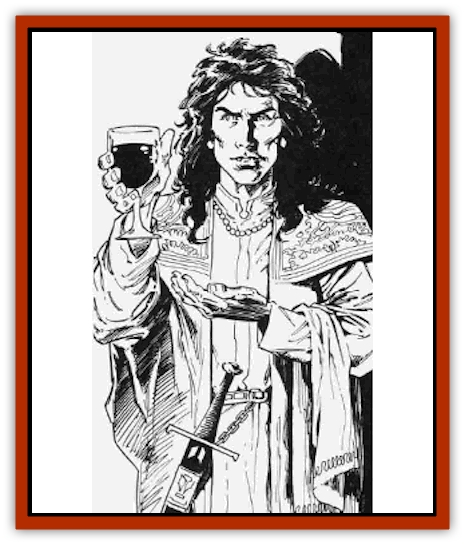
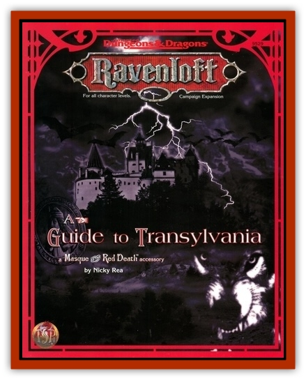

# Dhampir

| Statistic | **Dhampir** |
| --- | --- |
| **Activity Cycle:** | Any |
| **Alignment:** | Any |
| **Armor Class:** | 10 |
| **Climate/Terrain:** | Transylvania |
| **Damage/Attack:** | By weapon +4 |
| **Diet:** | Omnivore/Human blood |
| **Frequency:** | Rare |
| **Hit Dice:** | Varies |
| **Intelligence:** | High (14) |
| **Magic Resistance:** | Nil |
| **Morale:** | Champion (15-16) |
| **Movement:** | 12 |
| **No. Appearing:** | 1 |
| **No. of Attacks:** | 1 |
| **Organization:** | Solitary/Special |
| **Size:** | M |
| **Special Attacks:** | Confusion gaze |
| **Special Defenses:** | +1 or better to hit, resistance to vampiric <i>charm</i> ability |
| **THAC0:** | Varies |
| **Treasure:** | Varies |
| **XP Value:** | 475 + Hit Dice value |

Dhampir (singular and plural) are the offspring of [[Vampire_General_Information|vampires]] and human women. At night, they often betray their vampire heritage by their red eyes which glow after sundown and their fangs. If seen in the light after dark, they can appear normal, if a little pallid. They are tragic creatures who spend their lives torn between two natures - that of a blood-thirsty creature of the night and that of an innocent who is horrified by a facet of his nature.

Dhampir have supernatural powers, bestowed upon them by their vampiric fathers - such as great strength and the ability to control animals - but none of the vampiric weaknesses. They can abide holy objects and holy water and need not be invited in before they can enter other's homes.They are reputed to be seductive, being possessed of an uncanny attraction.

**Combat:** All of a dhampirs special abilities are only effective if the dhampir isn't in sunlight.

Dhampir have the ability to detect vampires within 40 feet of their location. If the dhampir makes a successful Wisdom check, he can identify vampires among crowds or can discover their hiding place if they are not visible.

Dhampir have no particular melee attacks that normal humans do not possess. They can use the wrestling and punching attacks outlined in the *Player's Handbook* or throw dangerous or heavy objects with their great strength. Otherwise, it must use weapons or spells.

However, when fighting vampires of any type, dhampir have several subtle, supernatural advantages. First, are resistant to a vampire's *charm* gaze, receiving a +4 bonus to saving throws. Dhampir save normally against *charm* attacks cast by non-vampires. Also, when any vampire locks eyes with a dhampir's eyes, *he* must make a successful saving throw vs. paralyzation at -2, or be paralyzed for Id4 rounds.

Dhampir have inherited the vampiric parent's ability to shrug off damage inflicted by normal weapons, and can only be injured by spells or magical weapons of + 1 or better. More importantly, however, they can use melee non-magical weapons against vampires as though they were striking with +1 magical weapons. They cannot do this with missile weapons. A vampire that has been wounded by a dhampir cannot regenerate the damage unless he can escape the dhampir and return to his coffin.

Finally, dhampir may exercise control over domesticated animals like [[Horse|horses]], [[Dog|dogs]], and [[Cat_Small|house cats]]. They can summon 2d20 of such creatures to attack an enemy. A logical mixture (DM's call) of these animals arrive within 2d4 rounds of the dhampir issuing a mental summons.

**Habitat/Society:** Dhampir live generally undetected among human society, although they invariably grow up motherless, as their mother dies giving birth to them. They can belong to any class, and may be found working in any profession, although they invariably gravitate to occupations that minimize contact with others.

Once a dhampir recognizes the supernatural abilities it possesses, many of them try to do good by hunting down and slaying vampires wherever they find them. This is particularly true of dhampir who have had contact with their vampiric parents. However, other dhampir find it just as easy to turn evil and adopt their father's predatory ways in exchange for power.

**Ecology:** Dhampir must feast on the blood of humans at least once a week or they become unable to use their powers. Many good dhampirs thus are powerless, unless they force themselves to drink the blood of humans when a vampiric threat becomes evident in their region. Dhampir can produce children, who may themselves become dhampir or who may be normal humans. (A 50% chance of either being the case.)

The tragedy of a dhampir's existence is that he is cursed from birth to enter the ranks of the Red Death's minions. Most find it easier to be evil to the core. At their deaths, dhampir rise as vampires and irredeemable servants of evil.

---
## Discovery & Documentation

**Source Publication:** A Guide to Transylvania (1996)
**Campaign Setting:** Masque of the Red Death (Ravenloft)
**Author(s):** Nicky Rea
