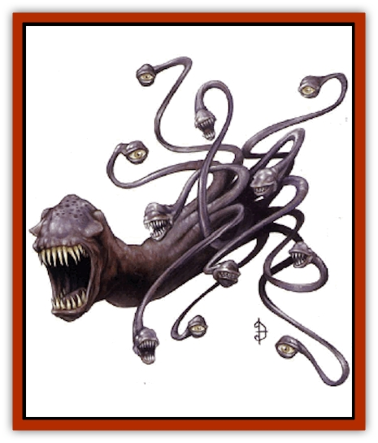

# Dharculus

| Statistic | **Dharculus** |
| --- | --- |
| **Activity Cycle:** | Any |
| **Alignment:** | Chaotic neutral |
| **Armor Class:** | 2 |
| **Climate/Terrain:** | Special |
| **Damage/Attack:** | 1d4&times;6 (tentacles) or 2d10 (maw) |
| **Diet:** | Carnivore |
| **Frequency:** | Very rare |
| **Hit Dice:** | 10 |
| **Intelligence:** | Very (11-12) |
| **Magic Resistance:** | Nil |
| **Morale:** | Elite (14) |
| **Movement:** | 9 |
| **No. Appearing:** | 1 |
| **No. of Attacks:** | 6 or 1 |
| **Organization:** | Solitary |
| **Size:** | H (30' long) |
| **Special Attacks:** | Nil |
| **Special Defenses:** | Ethereal attack |
| **THAC0:** | 11 |
| **Treasure:** | Nil |
| **XP Value:** | 3,000 |

The dharculi are swimmers of the Border Ethereal, inserting their mawed tentacles into the Prime Material Plane to feed. Their tentacles appear as a swarm of blind eel-like creatures gliding through the air in a deadly school. To those who can see into the Ethereal Plane, the [[Eel|eels]] are revealed to be protruding tentacle tips, some ending in small maws. The much longer tentacles are joined in the Ethereal Plane, in a fused wormlike braid that forms the main body of the creature. The posterior end of the cylindrical body loops back toward the front like a question mark. This end has a huge, drooling maw filled with razor-sharp teeth. The dharculus has five tentacles that end in eyes instead of maws, which the entity keeps safely tucked into the Ethereal Plane to search through the mists for its next victim.

**Combat:** Dharculi feed by dipping their tentacles into the Prime Material Plane and drawing prey into the Ethereal. Each of their half dozen mawed tentacles attacks individually, inflicting 1d4 points of damage and attaching to the prey. An attached tentacle causes no further damage, but a successfull Strength check at a penalty of -2 removes an attached tentacle, causing 1d4 points of damage as the teeth tear free (use a saving throw vs. paralysis for creatures with no Strength rating). If a dharculus attaches three or more tentacles to a single victim, only a successful saving throw vs. death prevents the victim from being drawn into the Ethereal Plane at the beginning of the next round. Here, the dharculus can bring its horrible primary maw to bear on the victim for 2d10 points of damage. The saving throw must be made each round that opens with three tentacles attached to the victim.

Each individual tentacle possesses the following statistics: AC 3; MV Fl 9; HD 2; hp 8 each; THAC0 11 (as the dharculus's HD); #AT 1; Dmg 1d4; SZ S (2-10' long); ML as dharculus. Tentacles that have taken 8 points of damage in full, and the last strike from an edged weapon, are severed. They fall to the ground, looking like dead eels out of water (the dharcmlus generates damaged tentacles at the rate of 2 points per tentacle for each 12 hours on the Ethereal Plane). A hit with a magical weapon has a 20% chance per magical plus to knock the appendage fully back into the Ethereal Plane, where it takes the dharculus four rounds to insert it back through the veil to the Prime Material Plane.

A victim drawn into the Ethereal Plane can fight the whole creature as the beast attacks with its devastating primary bite. Killing the dharculus leaves the victim drifting in the Border Ethereal, able to see his companions through the gray mist, but unable to contact them. A marooned individual without extraordinary resources is lost; however, a single chance still remains: The dharculus's tentacles that inserted into the Prime Material plane offer a brief lifeline before they receed into the ethereal deeps (up to four rounds). It is possible to use a flaccid tentacle as a rope, and physically pull oneself back into the Prime Material Plane. A successful Strength check indicates success.

**Habitat/Society:** Dharculi are creatures from an alternate reality far from the Prime Material Plane, and perhaps beyond the planar cosmology as well. So far, these creatures have congregated near the point of their entry into this reality. This may be because they are somehow dependent upon some element of their own Far Realm, or it may just be coincidence, in which case it seems inevitable that more will arrive, hunting the beaches of the Prime Material Plane in relative safety from the shallow sea of the Border Ethereal.

These creatures have an utterly alien psychology, but their underlying need seems to be to feed. A dharculus never passes up an easy meal. In fact, the creature is not above dragging creatures across thee ethereal veil just to save it for later snacking. They boldly hunt other creature that cross their paths without regard to rank or hierarchy.

**Ecology:** It is not known whether these creatures mate, or merely asexually bud or fission. If the latter is true, even a single creature could rapidly populace an area. Their currant rarity and tendency to gather near their point of entry into this reality may be because they are somehow dependent on some particular element of their own Far Realm and need to stay near the point where the cross-dimensional leakage of this influence occurs. If this is true, only creatures near the point of entry are in peril. However, if the zone of influence is slowly expanding into the Prime Material Plane, itself, then the situation would be most dangerous.

---
## Discovery & Documentation

**Source Publication:** Monstrous Compendium, 1997 Annual, Volume 4 (1995)
**Campaign Setting:** Advanced Dungeons & Dragons 2nd Edition
**Author(s):** Jon Pickens

### Other Creatures Found in This Source Book
   * [[Anemone_Giant_Sea|Anemone, Giant Sea]]
   * [[Asperii|Asperii]]
   * [[Bainligor|Bainligor]]
   * [[Beast_of_Chaos|Beast of Chaos]]
   * [[Blindheim|Blindheim]]
   * [[Bloodsipper_Far_Realm|Bloodsipper (Far Realm)]]
   * [[Bulette_Gohlbrorn|Bulette, Gohlbrorn]]
   * [[Child_of_the_Sea|Child of the Sea]]
   * [[Clockwork_Horror|Clockwork Horror]]
   * [[Clockwork_Swordsman|Clockwork Swordsman]]
   * [[Coral|Coral]]
   * [[Darklore|Darklore]]
   * [[Dolphin_Athas|Dolphin (Athas)]]
   * [[Dragon_Neutral_Moonstone|Dragon, Neutral, Moonstone]]
   * [[Dragon_Prismatic|Dragon, Prismatic]]
   * [[Dream_Stalker|Dream Stalker]]
   * [[Dragon-kin_Albino_Wyrm|Dragon-kin, Albino Wyrm]]
   * [[Echyan|Echyan]]
   * [[Firestar|Firestar]]
   * [[Firetail|Firetail]]
   * [[Fish_Ascallion|Fish, Ascallion]]
   * [[Fish_Deep_Ocean|Fish, Deep Ocean]]
   * [[Fish_Tropical|Fish, Tropical]]
   * [[Fish_Vurgens|Fish, Vurgens]]
   * [[Fogwarden|Fogwarden]]
   * [[Fraal|Fraal]]
   * [[Giant_Crag|Giant, Crag]]
   * [[Gibberling_Brood|Gibberling, Brood]]
   * [[Glutton_Sea|Glutton, Sea]]
   * [[Golden_Ammonite|Golden Ammonite]]
   * [[Golem_Brass_Minotaur|Golem, Brass Minotaur]]
   * [[Golem_Gemstone|Golem, Gemstone]]
   * [[Golem_Maggot|Golem, Maggot]]
   * [[Groundling|Groundling]]
   * [[Hermit_Sea|Hermit, Sea]]
   * [[Hound_of_Law|Hound of Law]]
   * [[Human_Amazon|Human, Amazon]]
   * [[Human_Pygmy|Human, Pygmy]]
   * [[Inquisitor|Inquisitor]]
   * [[Kercpa|Kercpa]]
   * [[Kreel|Kreel]]
   * [[Lycanthrope_Lythari|Lycanthrope, Lythari]]
   * [[Mercurial|Mercurial]]
   * [[Mold_Chromatic|Mold, Chromatic]]
   * [[Mummy_Bog|Mummy, Bog]]
   * [[Neh-thalggu|Neh-thalggu]]
   * [[Nymph_Grain|Nymph, Grain]]
   * [[Nymph_Unseelie|Nymph, Unseelie]]
   * [[Octopus_Octo-Jelly|Octopus, Octo-Jelly]]
   * [[Puddingfish|Puddingfish]]
   * [[Sea_Demon|Sea Demon]]
   * [[Shade|Shade]]
   * [[Shadowrath|Shadowrath]]
   * [[Shark_Athas|Shark (Athas)]]
   * [[Siren_Ravenloft|Siren (Ravenloft)]]
   * [[Skeleton_Variant|Skeleton, Variant]]
   * [[Skyfish|Skyfish]]
   * [[Spectral_Scion|Spectral Scion]]
   * [[Spyder_Fiend|Spyder Fiend]]
   * [[Squid_Squark|Squid, Squark]]
   * [[Tanar'ri_Lesser_Uridezu|Tanar'ri, Lesser, Uridezu]]
   * [[Troll_Mutate|Troll Mutate]]
   * [[Vaati|Vaati]]
   * [[Vampire_Cerebral|Vampire, Cerebral]]
   * [[Varkha|Varkha]]
   * [[Wizshade|Wizshade]]
   * [[Worm_Lukhorn|Worm, Lukhorn]]
   * [[Wyste|Wyste]]
   * [[Yugoloth_Lesser_Gacholoth|Yugoloth, Lesser, Gacholoth]]
   * [[Zombie_Mud|Zombie, Mud]]
