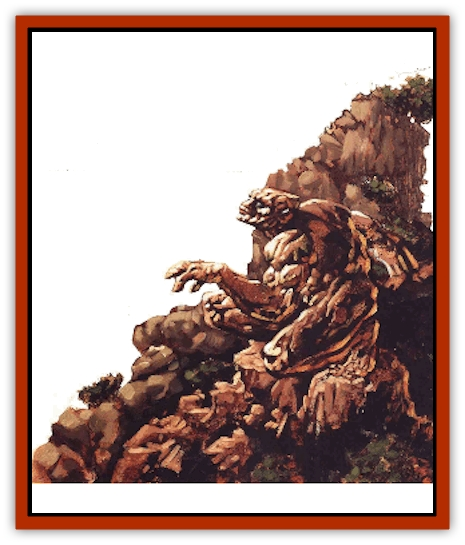

# Dharum Suhn

| Statistic | **Dharum Suhn** |
| --- | --- |
| **Activity Cycle:** | Any |
| **Alignment:** | Neutral (lawful) |
| **Armor Class:** | 0 |
| **Climate/Terrain:** | Elemental Plane of Earth |
| **Damage/Attack:** | 3d8/3d8 |
| **Diet:** | None |
| **Frequency:** | Uncommon |
| **Hit Dice:** | 24 |
| **Intelligence:** | Genius (17-18) |
| **Magic Resistance:** | 60% |
| **Morale:** | Fearless (20) |
| **Movement:** | 6 |
| **No. Appearing:** | 1d4 |
| **No. of Attacks:** | 2 |
| **Organization:** | Clan |
| **Size:** | H (20' tall) |
| **Special Attacks:** | Spells |
| **Special Defenses:** | Struck only by +1 or better weapons, immune to blunt weapons and impact attacks |
| **THAC0:** | 5 |
| **Treasure:** | Q (&times;20) |
| **XP Value:** | 32,000 |

Beyond the [[Elemental_Air_Earth|elementals]], which fall under the purview of [[Archomental_Good|Sunnis]] or her eternal foe [[Archomental_Evil|Ogremoch]], and beyond the powers of earth and stone, wait the dharum suhn. To some, they are known as the Lords of Stone or the Rockfathers and Rockmothers. Others call them the Old Men of the Mountains. A few even name them the Hearts of Steadfast Stone.

The dharum suhn are spiritual creatures that inhabit the element of earth. But unlike earth elementals (which could be described in the same way), the dharum suhn embody not just earth and rock, but the steadfastness and unchanging support of stone. The dharum suhn epitomize the qualities of stability, strength, endurance, wisdom, contemplation, and immovability.

Usually an invisible spirit, a dharum suhn only rarely assumes a physical form. When one needs to act physically, it animates a 20-foot-tall mass of rock that takes on a vaguely humanoid form. Until it moves, this manifestation is nearly indistinguishable from the inanimate rocks and stone of the Elemental Plane of Earth. Dharum suhn speak the language of Earth common only to earth elementals, [[Galeb_Duhr|galeb duhr]], and the most studied earth genasi.

**Combat:** Woe to those who anger this massive master of earthpower! The dharum suhn's rocky manifestation has the strength or a cloud giant (Strength 23), inflicting 3d8 points of damage with each of its huge, mattocklike fists. Moreover, a dharum suhn can use the following spell-like abilities at will, once per round: *animate rock*, *conjure earth elemental*, *disintegrate* (rock only), *flesh to stone*, *hold monster*, *hold person*, *Maximilian's stony grasp*, *move earth*, *plane shift*, *spike stones*, *stone shape*, *transmute rock to mud*, *transmute water to dust*, and *wall of stone*. Once per day, a dharum suhn can call for an *earthquake* or invoke a *time stop*.

Additionally, a dharum suhn can cast the following spells upon itself or for the benefit of others, once per round, at will: *cure critical wounds*, *meld into stone*, *passwall*, *statue*, *stoneskin*, *stone tell*, *stone to flesh*, and *strength*. These powers may also be given to others, although a recipient can cast the bestowed magic only once. The dharum suhn grants the recipient a chip or ordinary-appearing stone that contains the spell or spells; the spells are released by will alone. Once the spells have been cast, the stone chip crumbles into dust.

Dharum suhn are immune to blunt weapons and all impact-related attacks such as thrown boulder, collapsing ceilings, and so on. Blade weapons inflict only half their normal damage when used against dharum suhn, and the weapons must be magical to be effective at all (+1 or better). Spells that harm or alter stone and earth such as disintegrate or transmute rock to mud do not affect dharum suhn, and in fact cannot be cast within 100 feet of these spirits against their will.

If the stone manifestation created by the dharum suhn is destroyed, the spirit itself is not slain. Only a spell like *destruction*, *power word: kill*, or *slay living*, cast after the death of the stone body, can truly end the life of this elemental spirit.

**Habitat/Society:** Though native to the Elemental Plane of Earth, dharum suhn have been encountered on many planes, always manifesting within great mountains or plateaus.

Travelers usually find them alone, but it is said that dharum suhn each belong to a small clan. These clans exhibit ties of great strength and fidelity. An opinion held by one individual often reflects the opinion held by all in its clan; a canny planewalker takes great pains not to anger one dharum suhn, for then he has angered many.

Even in comparison with the archomentals Ogremoch and Sunnis - the Elemental Prince and Princess of Earth - the dharum suhn possess vast power. They do not, however, become involved in the petty conflicts of these feuding lords. In fact, they don't get involved in much of anything. These contemplative beings simply watch and wait, as slow to anger or action as stone itself. The Hearts of Steadfast Stone are masters of knowledge, for they observe all that is - or at least all that takes place on or near stone. (Chant is they have little idea about events in places like the plane of Air or the Ethereal Plane.)

Because of their contemplative nature, the dharum suhn are not only knowledgeable, but extremely wise. Sometimes those who respect and revere the merits of earth and stone undertake great pilgrimages to ask questions of these elemental spirits. If the supplicants sincerely respect the nature of what the dharum suhn represent, the stone spirits might even actually answer the questions. In great epic tales, mighty heroes travel to the plane of Earth and ask the dharum suhn for aid - and receive it. Some say that such stories are just so much screed, but a persuasive, persistant, and forthright blood might be able to convince the dharum suhn that it was worth a pause in their contemplation and observation to actually take action. Obviously, coming up with an argument that might convince the dharum suhn would be an epic undertaking of its own.

**Ecology:** Chant has it that the dharum suhn actually begot thc earth elementals and all the creatures native to the plane of Earth. This would mean, then, that they are the first and truest elementals. If that's the real dark of it, then the theory of parallelism would suggest that similar beings exist (or did, at one time) on the planes or Air, Fire, and Water.

Dharum suhn do not eat, sleep, or procreate. On the verge or being demipowers, they are beyond such mortal concepts. Virtually immortal unless killed, no one knows if a fixed number of dharum suhn exist (no one's ever counted) or if they somehow restore those who die. The galeb duhr are said to be related to them, but most likely in the same way that the lowliest apes mock the forms of the most powerful human wizards.

Many tales characterize the dharum suhn as Those Who Wait, although few or none truly describe what they're waiting for. The idea implies, however, that the steadfast, unchanging creatures may indeed change when a special set of conditions occurs. Or perhaps the dharum suhn simply wait - not for a specific time or condition, but just to wait for waiting's sake. After all, patience is a true virtue in their eyes.

---
## Discovery & Documentation

**Source Publication:** Planescape III (1996)
**Campaign Setting:** Planescape
**Author(s):** Monte Cook

### Other Creatures Found in This Source Book
   * [[Animental|Animental]]
   * [[Archomental_Evil|Archomental, Evil]]
   * [[Archomental_Good|Archomental, Good]]
   * [[Belker|Belker]]
   * [[Bzastra|Bzastra]]
   * [[Chososion|Chososion]]
   * [[Darklight|Darklight]]
   * [[Devete|Devete]]
   * [[Devourer_Planescape|Devourer (Planescape)]]
   * [[Egarus|Egarus]]
   * [[Elemental_Athas_Lesser_Air_Earth|Elemental (Athas), Lesser, Air/Earth]]
   * [[Elemental_Athas_Lesser_Fire_Water|Elemental (Athas), Lesser, Fire/Water]]
   * [[Elemental_Fire_Kin_Salamander_II|Elemental, Fire Kin, Salamander II]]
   * [[Entrope|Entrope]]
   * [[Facet|Facet]]
   * [[Frost_Salamander|Frost Salamander]]
   * [[Fundamental_Air_Earth|Fundamental, Air/Earth]]
   * [[Fundamental_Fire_Water|Fundamental, Fire/Water]]
   * [[Fundamental_All_Elements|Fundamental, All Elements]]
   * [[Garmorm|Garmorm]]
   * [[Homunculus_Elemental|Homunculus, Elemental]]
   * [[Immoth|Immoth]]
   * [[Khargra|Khargra]]
   * [[Klyndes|Klyndes]]
   * [[Magran|Magran]]
   * [[Menglis|Menglis]]
   * [[Nathri|Nathri]]
   * [[Ooze_Sprite|Ooze Sprite]]
   * [[Paraelemental|Paraelemental]]
   * [[Phirblas|Phirblas]]
   * [[Psurlon|Psurlon]]
   * [[Quasielemental_Negative|Quasielemental, Negative]]
   * [[Quasielemental_Positive|Quasielemental, Positive]]
   * [[Rast|Rast]]
   * [[Ravid|Ravid]]
   * [[Ruvoka|Ruvoka]]
   * [[Scile|Scile]]
   * [[Shad|Shad]]
   * [[Shocker|Shocker]]
   * [[Sislan|Sislan]]
   * [[Suisseen|Suisseen]]
   * [[Terithran|Terithran]]
   * [[Thoqqua|Thoqqua]]
   * [[Trilloch|Trilloch]]
   * [[Tsnng|Tsnng]]
   * [[Ungulosin|Ungulosin]]
   * [[Vacuous|Vacuous]]
   * [[Wavefire|Wavefire]]
   * [[Xag-Ya_Xeg-Yi|Xag-Ya/Xeg-Yi]]
   * [[Xill|Xill]]
