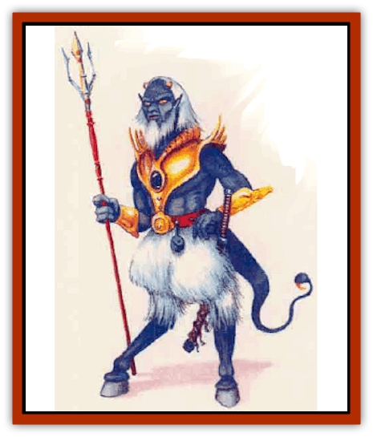

# Diabolus

| Statistic | **Diabolus** |
| --- | --- |
| **Activity Cycle:** | Any |
| **Alignment:** | Any (usually chaotic good) |
| **Armor Class:** | Varies (base 9) |
| **Climate/Terrain:** | Any |
| **Damage/Attack:** | By weapon or 1d6 (bite) or 1d4 (tail) |
| **Diet:** | Omnivore |
| **Frequency:** | Very rare |
| **Hit Dice:** | 1 (see below) |
| **Intelligence:** | Average (8-10) |
| **Magic Resistance:** | 100% (see below) |
| **Morale:** | Average (10) (see below) |
| **Movement:** | 12 (see below) |
| **No. Appearing:** | Any |
| **No. of Attacks:** | 1 |
| **Organization:** | Anarchy |
| **Size:** | M (average 6' tall) |
| **Special Attacks:** | Poison |
| **Special Defenses:** | Nil |
| **THAC0:** | 20 (see below) |
| **Treasure:** | M (A) |
| **XP Value:** | Varies with Hit Dice and abilities |

Diaboli come from a mysterious realm Mystarans called the Demiplane of Nightmares. Creatures from this realm are the stuff of nightmares for humans and similar beings - though most diaboli are in fact cheerful and well-meaning. Conversely, the diaboli and other intelligent beings of the Demiplane of Nightmares regard humans and demihumans as "nightmares incarnate".

Adventurous diaboli discovered gateways to other planes several centuries ago; since then, many have explored and even settled the worlds beyond their home. Because they feel revulsion toward humans and most "normal" creatures, diaboli avoid contact with other life forms.

Diaboli are similar in size to humans. Their well-muscled bodies are mauve or lavender. Their feet have hooves like a pig's and their hands have only three fingers with an opposable thumb; otherwise the hands look very human. Their pupils are vertical reptilian slits. Most have prominent noses. Their long, forked tongues give them enhanced senses of smell, hearing, and heat detection. Two small horn protrude from the top of their heads, vestigial remains from early evolution. Each diabolus has a tail just slightly longer than its legs.

Diaboli come in at least three subraces, distinguished by overall hairiness. The *bare* diabolus is completely hairless. The *common* diabolus has hair like most humans, and wear beards as well. The *hirsute* diabolus also has thick, curly, goatlike hair over the lower half of its body.

All diaboli speak their own language. In addition, they can communicate with their tails, twirling and positioning them in a complex code.

**Combat:** The abilities of a diabolus mirror those of a human almost exactly. Adventurer diaboli advance in the same character classes available to humans, suffering the same restrictions and gaining the same abilities.

Diaboli boast two attacks that humans lack: their bite and their tail. The bite inflicts 1d6 points of damage. The tail inflicts 1d4 points of damage and injects a mild poison; a creature failing a saving throw vs. poison is paralyzed for 1d6 rounds. Diaboli are immune to this poison.

Diaboli can wield most weapons but prefer the trident. A trident also grants a diabolus speed. By using both its tail and its trident, the diabolus can turn cartwheels one after the other, doubling its normal movement rate. This maneuver requires concentration; no other action is possible at the same time. Cartwheeling is as fatiguing as running, and can be maintained for 30 rounds at the most. The diabolus cannot run normally, but cartwheeling enables it to charge an opponent (standard charge bonuses and penalties apply).

The base Armor Class of a diabolus is 9, better than a human's 10 (owing to the creature's natural defensive skills). Diaboli wear annor similar to that of humans; their AC is 1 point better than humans when wearing the same armor.

The magical effects of the Prime Material Plane have no effect on diaboli; similarly, magic cast by diaboli does not affect creatures native to the Prime Material Plane. Mystaran and diabolus wizards could trade *fireball* spells all day, and neither would take a single point of damage. Clever magic use may still be effective indirectly - for example, a wizard could use *telekinesis* to drop a boulder on a diabolus's head.

Note that diaboli are affected by spells cast by other diaboli and by the magic of other creatures found on the Demiplane of Nightmares ([[Neh-thalggu|brain collectors]], [[Feyr|feyrs]], [[Nagpa|nagpas]], [[Maelephant|maelephants]], etc.)

**Habitat/Society:** Most diaboli believe chaos is the natural disorder of all things, and they try to bring its joys to all who are receptive. They do not generally force their beliefs on those who disagree.

The diaboli have no set organizations or rulers but seem to manage quite well without them. They are an anarchist society where customs, a sense of fair play, and other practices keep their trade moving and society functioning.

The diaboli have little interest in violence, and follow a strict moral code of non-interference. Diabolus warriors become so to protect their communities and out of a spirit of adventure; few like to kill for killing' sake. Their technology level is primitive, but their philosophy, art, generosity, and tolerance tend exceed those of the human race.

**Ecology:** Diaboli and humans tend to regard one another with revulsion. However, worldly adventurers (usualy those of higher level) often overcome such innate prejudices.

---
## Discovery & Documentation

**Source Publication:** Mystara Appendix (1994)
**Campaign Setting:** Mystara
**Author(s):** John Nephew, Teeuwynn Woodruff, John Terra, Skip Williams

### Other Creatures Found in This Source Book
   * [[Actaeon|Actaeon]]
   * [[Agarat|Agarat]]
   * [[Ash_Crawler|Ash Crawler]]
   * [[Baldandar|Baldandar]]
   * [[Bargda|Bargda]]
   * [[Bhut|Bhut]]
   * [[Bird_Mystara|Bird (Mystara)]]
   * [[Blackball|Blackball]]
   * [[Choker|Choker]]
   * [[Coltpixie|Coltpixie]]
   * [[Crone_of_Chaos|Crone of Chaos]]
   * [[Darkhood|Darkhood]]
   * [[Darkwing|Darkwing]]
   * [[Decapus|Decapus]]
   * [[Deep_Glaurant|Deep Glaurant]]
   * [[Dimensional_Warper|Dimensional Warper]]
   * [[Dragon_Mystara_Crystalline|Dragon (Mystara), Crystalline]]
   * [[Dragon_Mystara_Jade|Dragon (Mystara), Jade]]
   * [[Dragon_Mystara_Onyx|Dragon (Mystara), Onyx]]
   * [[Dragon_Mystara_Ruby|Dragon (Mystara), Ruby]]
   * [[Drake_Mystara|Drake (Mystara)]]
   * [[Dragonfly|Dragonfly]]
   * [[Dusanu|Dusanu]]
   * [[Elemental_of_Chaos_Air_Earth|Elemental of Chaos, Air/Earth]]
   * [[Elemental_of_Chaos_Fire_Water|Elemental of Chaos, Fire/Water]]
   * [[Elemental_of_Law_Air_Earth|Elemental of Law, Air/Earth]]
   * [[Elemental_of_Law_Fire_Water|Elemental of Law, Fire/Water]]
   * [[Familiar_Mystara|Familiar (Mystara)]]
   * [[Frost_Salamander|Frost Salamander]]
   * [[Fundamental_Air_Earth|Fundamental, Air/Earth]]
   * [[Fundamental_Fire_Water|Fundamental, Fire/Water]]
   * [[Gargantua_Mystara|Gargantua (Mystara)]]
   * [[Geonid|Geonid]]
   * [[Ghostly_Horde|Ghostly Horde]]
   * [[Giant_Athach|Giant, Athach]]
   * [[Giant_Hephaeston|Giant, Hephaeston]]
   * [[Golem_Drolem|Golem, Drolem]]
   * [[Golem_Mystara_I|Golem (Mystara) I]]
   * [[Golem_Mystara_II|Golem (Mystara) II]]
   * [[Golem_Mystara_III|Golem (Mystara) III]]
   * [[Gray_Philosopher|Gray Philosopher]]
   * [[Guardian_Warrior|Guardian Warrior]]
   * [[Gyerian|Gyerian]]
   * [[Herex|Herex]]
   * [[Hivebrood|Hivebrood]]
   * [[Horde|Horde]]
   * [[Hsiao|Hsiao]]
   * [[Huptzeen|Huptzeen]]
   * [[Hutaakan|Hutaakan]]
   * [[Imp_Mystara|Imp (Mystara)]]
   * [[Jellyfish_Giant_Mystara|Jellyfish, Giant (Mystara)]]
   * [[Kna|Kna]]
   * [[Kopru|Kopru]]
   * [[Lizard_Mystara|Lizard (Mystara)]]
   * [[Lizard-kin_Mystara|Lizard-kin (Mystara)]]
   * [[Lupin|Lupin]]
   * [[Lycanthrope_Werejaguar_Mystara|Lycanthrope, Werejaguar (Mystara)]]
   * [[Lycanthrope_Wereswine|Lycanthrope, Wereswine]]
   * [[Magen|Magen]]
   * [[Manikin|Manikin]]
   * [[Mek|Mek]]
   * [[Mujina|Mujina]]
   * [[Nagpa|Nagpa]]
   * [[Neh-thalggu|Neh-thalggu]]
   * [[Nightshade_Mystara|Nightshade (Mystara)]]
   * [[Nuckalavee|Nuckalavee]]
   * [[Pegataur|Pegataur]]
   * [[Phanaton|Phanaton]]
   * [[Plant_Dangerous_Mystara|Plant, Dangerous (Mystara)]]
   * [[Plasm|Plasm]]
   * [[Rakasta|Rakasta]]
   * [[Rock_Man|Rock Man]]
   * [[Sabreclaw|Sabreclaw]]
   * [[Sacrol|Sacrol]]
   * [[Scamille|Scamille]]
   * [[Shapeshifter|Shapeshifter]]
   * [[Shargugh|Shargugh]]
   * [[Shark-kin|Shark-kin]]
   * [[Sollux|Sollux]]
   * [[Spectral_Death|Spectral Death]]
   * [[Spectral_Hound|Spectral Hound]]
   * [[Spider-kin|Spider-kin]]
   * [[Spirit_Mystara|Spirit (Mystara)]]
   * [[Statue_Living|Statue, Living]]
   * [[Surtaki|Surtaki]]
   * [[Tabi|Tabi]]
   * [[Thoul|Thoul]]
   * [[Thunderhead|Thunderhead]]
   * [[Tiger_Ebon|Tiger, Ebon]]
   * [[Topi|Topi]]
   * [[Tortle|Tortle]]
   * [[Vampire_Velya|Vampire, Velya]]
   * [[White_Fang|White Fang]]
   * [[Worm_Mystara|Worm (Mystara)]]
   * [[Wyrd|Wyrd]]
   * [[Yowler|Yowler]]
   * [[Zombie_Lightning|Zombie, Lightning]]
