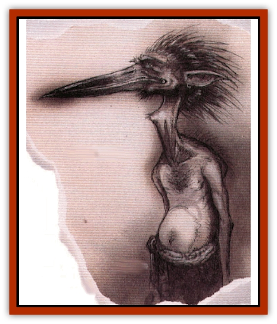
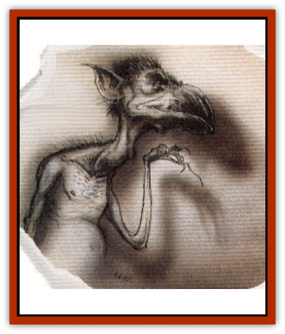
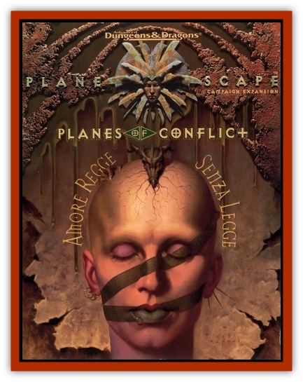

# Diakk

| Statistic | **Carcene** | **Varath** |
| --- | --- | --- |
| **Activity Cycle:** | Night | Any |
| **Alignment:** | Neutral evil | Neutral evil |
| **Armor Class:** | 3 | 0 |
| **Climate/Terrain:** | The Gray Waste | The Gray Waste |
| **Damage/Attack:** | 2d4/2d4 | 1d12 |
| **Diet:** | Carnivore | Carnivore |
| **Frequency:** | Common | Common |
| **Hit Dice:** | 8+8 | 6+6 |
| **Intelligence:** | Average (8-10) | Low (5-7) |
| **Magic Resistance:** | 30% | 30% |
| **Morale:** | Average (8-10) | Unsteady (5-7) |
| **Movement:** | 12 | 21 |
| **No. Appearing:** | 2d6 | 2d8 |
| **No. of Attacks:** | 2 | 1 |
| **Organization:** | Flock | Flock |
| **Size:** | M (5' tall) | L (8' tall) |
| **Special Attacks:** | Spells | Spells |
| **Special Defenses:** | Spells | Spells |
| **THAC0:** | 13 | 15 |
| **Treasure:** | Nil | Nil |
| **XP Value:** | 4,000 | 2,000 |

One of the most commonly found creatures in the glooms of the Gray Waste is the diakk. These large, flightness, [[Bird|birdlike]] beasts are hated predators.

Diakka come in two types, the varath and the carcene. The varath are taller and storklike, their vaguely human faces sporting long bills. The carcene are short and broad, more like squat pelicans with a shortened bill on a humanlike face. Both types have small, clawed human arms rather than wings. Their feathers are short and sickly colored, ranging from pea green to gray to rust. Their featherless faces are colored similarly to their oily plumage, while their legs, bills, and claws are black, dark green, or maroon.

Even when the diakka are not directly encountered, all three glooms of the Gray Waste are filled with the sharp cries of the varath and the burbling croak of the carcene. They speak their own tongue as well as that of [[Night_Hag|night hags]] and various other foul lower-planar inhabitants.

**Combat:** The varath use their long, sharp bills to stab at opponents for 1d12 points of damage. The squat carcene rely on their claws in melee, causing 2d4 points of damage per strike. Both types of diakka wield a number of spell-like powers, including *weakness* (by touch, once per day), *audible glamer* (once per day), and *jump* (twice per day). Additionally, if there are four or more diakka, they can encircle a foe and perform the *dance of weakening*. This hypnotic dance requires the diakka to screech and croak at their foes for at least four rounds. The victims are then affected similarly to a *ray of enfeeblement* - their Strength scores are lowered to 5 for 13 rounds. This power ignores magic resistance (although the victim gets a saving throw), making it useful against even [[Yugoloth_General_Information|yugoloths]] or other fiends.

Diakka are sneaky, devious, and cowardly in combat, using deception to their advantage when possible. They size up potential prey before going into battle, attacking only those they perceive as weaker than themselves. When their victims have been determined, the diakka attempt to circle around them, using their *audible glamer* power to make it sound as though their numbers are greater than they truly are. They then attack with their bills and claws, using *weakness* to supplement their savage strikes and *jumps* to bound in and out of combat.

**Habitat/Society:** The diakka live in flocks comprising both varieties of the creatures. There are generally equal numbers of varath and carcene in any given flock, although the varath are sometimes more numerous. The carcene, being slightly more powerful and certainly more intelligent, are likely to become leaders of their flock. Though these flocks are organized under a single (or sometimes two) dominant leaders, there is no mutual respect or care among diakka. They will not put themselves in jeopardy for each other. Likewise, the diakka flocks avoid each other for fear of attack. The Gray Waste is a place of gloom and hate, and these prevalent residents are no exception.

Sometimes night hags use diakka as guards or servants. This relationship is one of mutual hatred, but each believes it to be to their benefit. The dullwitted diakka don't realize that the hags never make permanent allies and most eventually end up in the night hag's stew pot.

[[Hordling|Hordlings]] consider diakka meat a staple in their diet, although not a few hordlings have ended up as meals for the diakka as well.

**Ecology:** Diakka feed off the flesh of anything weaker than them that wander too close.

---
## Discovery & Documentation

**Source Publication:** Planes of Conflict (1995)
**Campaign Setting:** Planescape
**Author(s):** Colin Mccomb, Dale Donovan

### Other Creatures Found in This Source Book
   * [[Aeserpent|Aeserpent]]
   * [[Asuras|Asuras]]
   * [[Buraq|Buraq]]
   * [[Delphon|Delphon]]
   * [[Ethyk|Ethyk]]
   * [[Gautiere|Gautiere]]
   * [[Linqua|Linqua]]
   * [[Ni'iath|Ni'iath]]
   * [[Phiuhl|Phiuhl]]
   * [[Quesar|Quesar]]
   * [[Slasrath|Slasrath]]
   * [[Warden_Beast|Warden Beast]]
   * [[Yugoloth_Greater_Baernaloth|Yugoloth, Greater, Baernaloth]]
