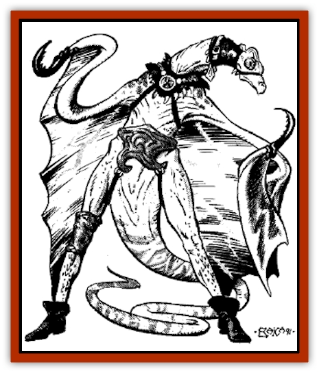

# Dimensional Warper

| Statistic | **Dimensional Warper** |
| --- | --- |
| **Activity Cycle:** | Any |
| **Alignment:** | Neutral |
| **Armor Class:** | 1 |
| **Climate/Terrain:** | Any |
| **Damage/Attack:** | 1-3/1-3/1-6 |
| **Diet:** | Omnivore |
| **Frequency:** | Very rare |
| **Hit Dice:** | 8-10 |
| **Intelligence:** | Supra to genius (19-20) |
| **Magic Resistance:** | Nil |
| **Morale:** | Elite (14) |
| **Movement:** | 12 |
| **No. Appearing:** | 1 |
| **No. of Attacks:** | 3 |
| **Organization:** | Solitary |
| **Size:** | M (6' tall) |
| **Special Attacks:** | See below |
| **Special Defenses:** | See below |
| **THAC0:** | 8 or 9 HD: 13 / 10 HD: 11 |
| **Treasure:** | Nil |
| **XP Value:** | 8 or 9 HD: 3,500 / 10 HD: 5,000 |

A dimensional warper has a snake-like body and stands on two long, thin legs. Its long, thin, flexible arms each end in one hooklike claw. There is a sturdy, wing-like membrane that stretches between the arms and legs ending at the claws and feet respectively. These "wings" are not used for flight. The warper's head is bald and earless. It has large, round eyes with cat-like pupils. The creature stands about 6 feet tall and has a wing span of about 5 feet. It is covered in a thick, leathery hide and has a long lizardlike tail. The dimensional warper has never been encountered on the Prime Material Plane.

Occasionally, for reasons of their own, dimensional warpers have communicated with humans and demihumans. These adventurers have reported that the warpers come to the Prime Material Plane to learn about the creatures native to the plane. However, only those warpers who are old and wise can visit this plane. If a dimensional warper is encountered, there is an 85% chance that it is a scholar; otherwise it is a master. A master is identified by the ring of symbols tattooed around its head and down its back which are a sign of its rank.

**Combat:** Dimensional warpers generally prefer to observe rather than fight. However, if it feels it has learned all it can from watching a group of adventurers, it probably attacks them to learn first-hand about their fighting skills. It only wants to learn about them, not kill them.

A warper attacks once with each of its claws and once with its long whip-like tail. If the warper cannot easily remain in control of the battle, it uses its abilities to warp the dimensions of height, width, depth, and time. It can *enlarge* itself, as per the spell, three times per day. It can *haste* itself or *slow* another being, as per the spells, three times per day. It can use *dimension door* once per turn. A dimensional warper can also make itself two-dimensional, as per the spell *duo-dimension*, at will.

A master also has the ability to *time stop* once per week. However, it does not use this ability to give itself the opportunity to kill its opponents. The master uses it only to leave the battle if it is in danger of being killed or if it is being forced to kill its subjects to avoid being killed.

**Habitat/Society:** The warper society is based entirely on seeking knowledge. Dimensional warpers are curious, knowledgeseeking beings. They spend most of their lives observing other creatures and learning as much as possible about them. Adult warpers are usually scholars. However, the oldest and mostlearned warpers earn the title master and are respected and honored by the others in the society.

Warpers prefer to live where they can observe other creatures without being seen. If possible they travel from place to place, finding hiding places in cities from which they can watch. They have also been known to hide along roads or trails or in dungeons where there are adventurers and monsters regularly passing by. It is possible for a dimensional warper to be able to speak almost any language, as they study their subjects intently. They are very interested in understanding any conversations they overhear.

**Ecology:** Dimensional warpers do not generally eat the creatures they observe as they do not approve of devouring intelligent creatures and non-intelligent animals do not make very interesting subjects for them. No one has ever seen the home of a warper or knows how old warpers live to be.

---
## Discovery & Documentation

**Source Publication:** Mystara Appendix (1994)
**Campaign Setting:** Mystara
**Author(s):** John Nephew, Teeuwynn Woodruff, John Terra, Skip Williams

### Other Creatures Found in This Source Book
   * [[Actaeon|Actaeon]]
   * [[Agarat|Agarat]]
   * [[Ash_Crawler|Ash Crawler]]
   * [[Baldandar|Baldandar]]
   * [[Bargda|Bargda]]
   * [[Bhut|Bhut]]
   * [[Bird_Mystara|Bird (Mystara)]]
   * [[Blackball|Blackball]]
   * [[Choker|Choker]]
   * [[Coltpixie|Coltpixie]]
   * [[Crone_of_Chaos|Crone of Chaos]]
   * [[Darkhood|Darkhood]]
   * [[Darkwing|Darkwing]]
   * [[Decapus|Decapus]]
   * [[Deep_Glaurant|Deep Glaurant]]
   * [[Diabolus|Diabolus]]
   * [[Dragon_Mystara_Crystalline|Dragon (Mystara), Crystalline]]
   * [[Dragon_Mystara_Jade|Dragon (Mystara), Jade]]
   * [[Dragon_Mystara_Onyx|Dragon (Mystara), Onyx]]
   * [[Dragon_Mystara_Ruby|Dragon (Mystara), Ruby]]
   * [[Drake_Mystara|Drake (Mystara)]]
   * [[Dragonfly|Dragonfly]]
   * [[Dusanu|Dusanu]]
   * [[Elemental_of_Chaos_Air_Earth|Elemental of Chaos, Air/Earth]]
   * [[Elemental_of_Chaos_Fire_Water|Elemental of Chaos, Fire/Water]]
   * [[Elemental_of_Law_Air_Earth|Elemental of Law, Air/Earth]]
   * [[Elemental_of_Law_Fire_Water|Elemental of Law, Fire/Water]]
   * [[Familiar_Mystara|Familiar (Mystara)]]
   * [[Frost_Salamander|Frost Salamander]]
   * [[Fundamental_Air_Earth|Fundamental, Air/Earth]]
   * [[Fundamental_Fire_Water|Fundamental, Fire/Water]]
   * [[Gargantua_Mystara|Gargantua (Mystara)]]
   * [[Geonid|Geonid]]
   * [[Ghostly_Horde|Ghostly Horde]]
   * [[Giant_Athach|Giant, Athach]]
   * [[Giant_Hephaeston|Giant, Hephaeston]]
   * [[Golem_Drolem|Golem, Drolem]]
   * [[Golem_Mystara_I|Golem (Mystara) I]]
   * [[Golem_Mystara_II|Golem (Mystara) II]]
   * [[Golem_Mystara_III|Golem (Mystara) III]]
   * [[Gray_Philosopher|Gray Philosopher]]
   * [[Guardian_Warrior|Guardian Warrior]]
   * [[Gyerian|Gyerian]]
   * [[Herex|Herex]]
   * [[Hivebrood|Hivebrood]]
   * [[Horde|Horde]]
   * [[Hsiao|Hsiao]]
   * [[Huptzeen|Huptzeen]]
   * [[Hutaakan|Hutaakan]]
   * [[Imp_Mystara|Imp (Mystara)]]
   * [[Jellyfish_Giant_Mystara|Jellyfish, Giant (Mystara)]]
   * [[Kna|Kna]]
   * [[Kopru|Kopru]]
   * [[Lizard_Mystara|Lizard (Mystara)]]
   * [[Lizard-kin_Mystara|Lizard-kin (Mystara)]]
   * [[Lupin|Lupin]]
   * [[Lycanthrope_Werejaguar_Mystara|Lycanthrope, Werejaguar (Mystara)]]
   * [[Lycanthrope_Wereswine|Lycanthrope, Wereswine]]
   * [[Magen|Magen]]
   * [[Manikin|Manikin]]
   * [[Mek|Mek]]
   * [[Mujina|Mujina]]
   * [[Nagpa|Nagpa]]
   * [[Neh-thalggu|Neh-thalggu]]
   * [[Nightshade_Mystara|Nightshade (Mystara)]]
   * [[Nuckalavee|Nuckalavee]]
   * [[Pegataur|Pegataur]]
   * [[Phanaton|Phanaton]]
   * [[Plant_Dangerous_Mystara|Plant, Dangerous (Mystara)]]
   * [[Plasm|Plasm]]
   * [[Rakasta|Rakasta]]
   * [[Rock_Man|Rock Man]]
   * [[Sabreclaw|Sabreclaw]]
   * [[Sacrol|Sacrol]]
   * [[Scamille|Scamille]]
   * [[Shapeshifter|Shapeshifter]]
   * [[Shargugh|Shargugh]]
   * [[Shark-kin|Shark-kin]]
   * [[Sollux|Sollux]]
   * [[Spectral_Death|Spectral Death]]
   * [[Spectral_Hound|Spectral Hound]]
   * [[Spider-kin|Spider-kin]]
   * [[Spirit_Mystara|Spirit (Mystara)]]
   * [[Statue_Living|Statue, Living]]
   * [[Surtaki|Surtaki]]
   * [[Tabi|Tabi]]
   * [[Thoul|Thoul]]
   * [[Thunderhead|Thunderhead]]
   * [[Tiger_Ebon|Tiger, Ebon]]
   * [[Topi|Topi]]
   * [[Tortle|Tortle]]
   * [[Vampire_Velya|Vampire, Velya]]
   * [[White_Fang|White Fang]]
   * [[Worm_Mystara|Worm (Mystara)]]
   * [[Wyrd|Wyrd]]
   * [[Yowler|Yowler]]
   * [[Zombie_Lightning|Zombie, Lightning]]
