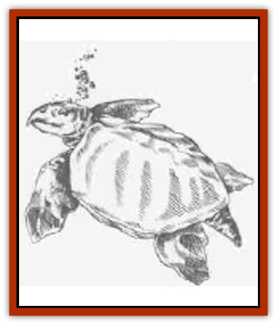
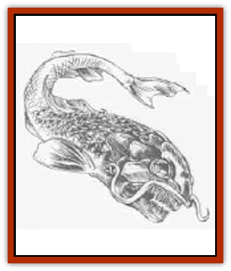
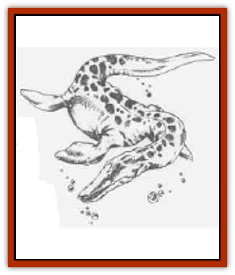
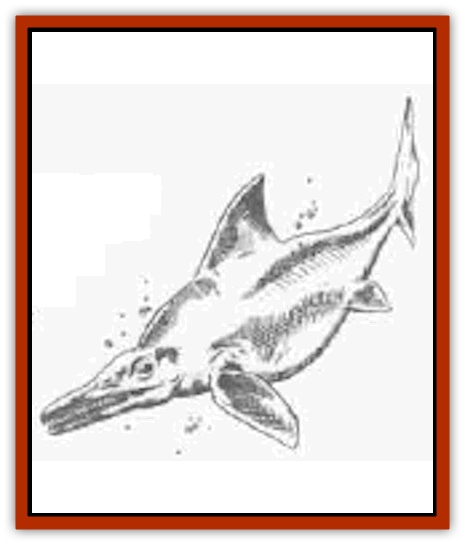
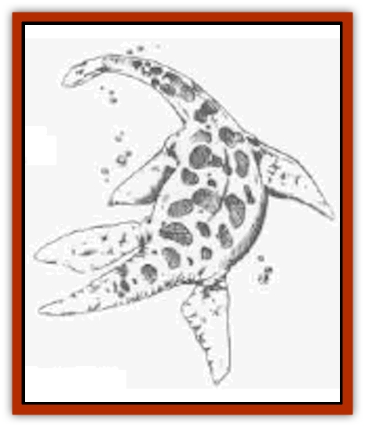
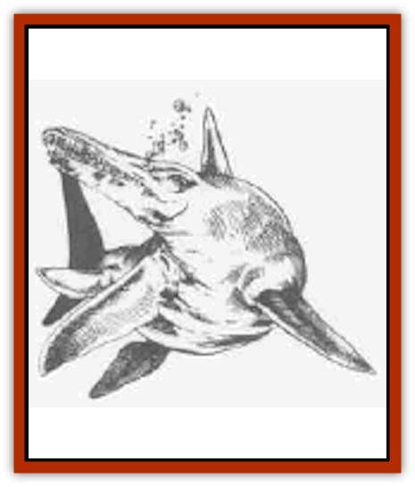

# Dinosaur - Aquatic

| Statistic | **Archelon** | **Dinichthys** | **Mosasaurus** | **Nothosaurus** | **Plesiosaurus** | **Temnodontosaurus** |
| --- | --- | --- | --- | --- | --- | --- |
| **Activity Cycle:** | Day | Day | Day | Day | Day | Day |
| **Alignment:** | Neutral | Neutral | Neutral | Neutral | Neutral | Neutral |
| **Armor Class:** | 3 | 7 | 7 | 6 | 7 | 4 |
| **Climate/Terrain:** | Any ocean | Any ocean | Any water | Any water | Any ocean | Any ocean |
| **Damage/Attack:** | 3d4 | 5d4 | 4d8 | 5d4 | 3d4 | 5d4 |
| **Diet:** | Carnivore | Carnivore | Carnivore | Carnivore | Carnivore | Carnivore |
| **Frequency:** | Uncommon | Common | Uncommon | Uncommon | Common | Rare |
| **Hit Dice:** | 7 | 10 | 12 | 6 | 20 | 10 |
| **Intelligence:** | Non- (0) | Non- (0) | Non- (0) | Non- (0) | Non- (0) | Non- (0) |
| **Magic Resistance:** | Nil | Nil | Nil | Nil | Nil | Nil |
| **Morale:** | Steady (11) | Steady (11) | Steady (11) | Average (10) | Average (10) | Steady (12) |
| **Movement:** | 3, Sw 15 | Sw 21 | 3, Sw 15 | 3, sw 18 | Sw 15 | Sw 24 |
| **No. Appearing:** | 1-4 | 1-4 | 1-3 | 1 | 1-3 | 1 (10% for 2) |
| **No. of Attacks:** | 1 | 1 | 1 | 1 | 1 | 1 |
| **Organization:** | Solitary | Solitary | Solitary | Solitary | Solitary | Solitary |
| **Size:** | L (12' dia.) | H (25'+ long) | G (50' long) | L (10'+ long) | H (18'+ long) | G (30' long) |
| **Special Attacks:** | Nil | Swallow | Nil | Frenzy | Flippers | Frenzy |
| **Special Defenses:** | Nil | Nil | Nil | Nil | Nil | Nil |
| **THAC0:** | 13 | 11 | 9 | 15 | 5 | 11 |
| **Treasure:** | Nil | Nil | Nil | Nil | Nil | Nil |
| **XP Value:** | 420 | 4,000 | 4,000 | 650 | 12,000 | 2,000 |

## 

Archelon (Ischyras)

This large marine turtle is not truly a [[Dinosaur_I|dinosaur]], but a reptile. Its shell is like that of a leatherback turtle - thick and rubbery rather than being formed of solid plates. With its powerful front flippers, the archelon is a fist swimmer; it seldom ventures on to dry land.

## 

Dinichthys

The name - "terrible fish" - reveals that this fearsome creature is not actually a dinosaur but a huge, primitive [[Fish|fish]]. Its great mouth can swallow man-sized prey on a natural attack roll of 20.

   ## 

Mosasaurus

The mosasaurus is a marine lizard, with species such as platecarpus and plotosaurus. This reptile breathes air like a [[Crocodile|crocodile]]. It travels very slowly on land, but its flippers move it with ease and grace through the water. The mosasaurus preys on all forms of marine animals - its powerful jaws can crack shell or bone easily.

Mzuch of the length of the mosasaurus is due to the larger number of its vertebrae, numbering over 100 in some species.

## 

Nothosaurus

The nothosaurus is a particularly aggressive marine dinosaur - another ichthyosaur. It dwells mostly in tropical seas, always seeking prey in the water when not sunning itself on rocks in between hunts. It lumbers on its flippers when on land but swims rapidly. When in a frenzy it can lash at its victim with huge fore flippers, but its usual attack is a darting bite, as its long neck moves its head at great speed.

## 

Plesiosaurus

The plesiosaurus strongly resembles a snake with a turtle's body (sans shell). It tends to be very aggressive, attacking anything it notices. While not as long overall as its relative, the [[Dinosaur_I|elasmosaurus]], the plesiosaurus has a neck that is about one-third of its total length. The creature is strong and fast, and highly maneuverable in the water - it can "turn on a silver piece" to lunge at its prey. In a marine battle it can strike with its powerful fore flippers, inflicting 2d6 points of damage with each.

## 

Temnodontosaurus

This monster is a huge ichthysaur or "fish lizard." Although it is not a dinosaur, it thrives in the same marine habitats as do mosasaurs, for example - its young are born live at sea, and the temnodontosaurus must come to the surface to breathe.

Its speed and ferocity allow it to compete fearlessly for choice prey with any creature. When in a feeding frenzy, a temnodontosaurus strikes with its powerful tail, inflicting damage on any creature behind it that is struck by this lashing.

---
## Discovery & Documentation

**Source Publication:** Monstrous Compendium, 1995 Annual, Volume 2 (1995)
**Campaign Setting:** Advanced Dungeons & Dragons 2nd Edition
**Author(s):** Jon Pickens

### Other Creatures Found in This Source Book
   * [[Aboleth_Savant|Aboleth, Savant]]
   * [[Addazahr|Addazahr]]
   * [[Amiq_Rasol|Amiq Rasol]]
   * [[Arch-Shadow|Arch-Shadow]]
   * [[Automaton_Scaladar|Automaton, Scaladar]]
   * [[Automaton_Trobriand's|Automaton, Trobriand's]]
   * [[Bat_Sporebat|Bat, Sporebat]]
   * [[Beetle_Dragon|Beetle, Dragon]]
   * [[Bi-nou|Bi-nou]]
   * [[Boggle|Boggle]]
   * [[Brownie_Dobie|Brownie, Dobie]]
   * [[Brownie_Quickling|Brownie, Quickling]]
   * [[Cat_Crypt|Cat, Crypt]]
   * [[Cat_Great_Cath_Shee|Cat, Great, Cath Shee]]
   * [[Centaur-kin_Dorvesh|Centaur-kin, Dorvesh]]
   * [[Centaur-kin_Gnoat|Centaur-kin, Gnoat]]
   * [[Centaur-kin_Ha'pony|Centaur-kin, Ha'pony]]
   * [[Centaur-kin_Zebranaur|Centaur-kin, Zebranaur]]
   * [[Chronolily|Chronolily]]
   * [[Curst|Curst]]
   * [[Darktentacles|Darktentacles]]
   * [[Dinosaur_II|Dinosaur II]]
   * [[Dinosaur_III|Dinosaur III]]
   * [[Doppelganger_Greater|Doppelganger, Greater]]
   * [[Dragon_Brine|Dragon, Brine]]
   * [[Dragon_Half-|Dragon, Half-]]
   * [[Dragon-kin_Sea_Wyrm|Dragon-kin, Sea Wyrm]]
   * [[Dwarf_Wild|Dwarf, Wild]]
   * [[Ekimmu|Ekimmu]]
   * [[Elemental_Nature|Elemental, Nature]]
   * [[Elf_Winged|Elf, Winged]]
   * [[Fish_Great_Glacier|Fish (Great Glacier)]]
   * [[Fish_Subterranean|Fish, Subterranean]]
   * [[Fish_Toril|Fish (Toril)]]
   * [[Flareater|Flareater]]
   * [[Flumph|Flumph]]
   * [[Froghemoth|Froghemoth]]
   * [[Ghost_Casurua|Ghost, Casurua]]
   * [[Ghost_Ker|Ghost, Ker]]
   * [[Ghul|Ghul]]
   * [[Ghul-Kin|Ghul-Kin]]
   * [[Giant_Half-giant|Giant, Half-giant]]
   * [[Golem_Burning_Man|Golem, Burning Man]]
   * [[Golem_Phantom_Flyer|Golem, Phantom Flyer]]
   * [[Gulguthhydra|Gulguthhydra]]
   * [[Hakeashar|Hakeashar]]
   * [[Horse_Moon-|Horse, Moon-]]
   * [[Human_Dragonslayer|Human, Dragonslayer]]
   * [[Human_Vistana|Human, Vistana]]
   * [[Jellyfish_Giant|Jellyfish, Giant]]
   * [[Kalin|Kalin]]
   * [[Kholiathra|Kholiathra]]
   * [[Laerti|Laerti]]
   * [[Leucrotta_Greater|Leucrotta, Greater]]
   * [[Lich_Suel|Lich, Suel]]
   * [[Lurker_Shadow|Lurker, Shadow]]
   * [[Lycanthrope_Werepanther|Lycanthrope, Werepanther]]
   * [[Lycanthrope_Wereshark|Lycanthrope, Wereshark]]
   * [[Mammal_Herd_II|Mammal, Herd II]]
   * [[Marl|Marl]]
   * [[Meenlock|Meenlock]]
   * [[Mimic_Greater|Mimic, Greater]]
   * [[Mold_II|Mold II]]
   * [[Mummy_Creature|Mummy, Creature]]
   * [[Nyth|Nyth]]
   * [[Ooze_Slime_Jelly_Ghaunadan|Ooze/Slime/Jelly, Ghaunadan]]
   * [[Palimpsest|Palimpsest]]
   * [[Peltast|Peltast]]
   * [[Plant_Dangerous_II|Plant, Dangerous II]]
   * [[Pleistocene_Animal|Pleistocene Animal]]
   * [[Pudding_Subterranean|Pudding, Subterranean]]
   * [[Raggamoffyn|Raggamoffyn]]
   * [[Snake_Serpent|Snake, Serpent]]
   * [[Snake_Serpent_Vine|Snake, Serpent Vine]]
   * [[Sphinx_Draco-|Sphinx, Draco-]]
   * [[Sprite_Seelie_Faerie|Sprite, Seelie Faerie]]
   * [[Sprite_Unseelie_Faerie|Sprite, Unseelie Faerie]]
   * [[Squealer|Squealer]]
   * [[Turtle_Giant|Turtle, Giant]]
   * [[Umpleby|Umpleby]]
   * [[Vizier's_Turban|Vizier's Turban]]
   * [[Wall_Walker|Wall Walker]]
   * [[Webbird|Webbird]]
   * [[Yak-Man|Yak-Man]]
   * [[Zorbo|Zorbo]]
