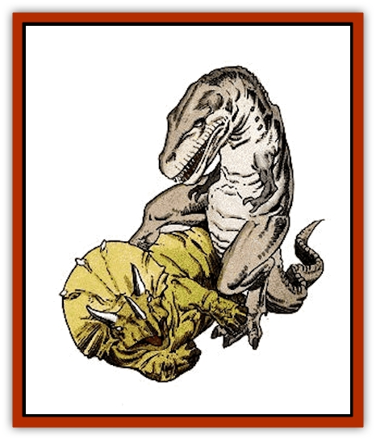

# Dinosaur I

| Statistic | **Ankylosaurus** | **Deinonychus** | **Diplodocus** | **Elasmosaurus** | **Lambeosaurus** | **Pteranodon** | **Stegosaurus** | **Triceratops** | **Tyrannosaurus** |
| --- | --- | --- | --- | --- | --- | --- | --- | --- | --- |
| **Activity Cycle:** | Day | Day | Day | Day | Day | Day | Day | Day | Day |
| **Alignment:** | Neutral | Neutral | Neutral | Neutral | Neutral | Neutral | Neutral | Neutral | Neutral |
| **Armor Class:** | 0 | 4 | 6 | 7 | 6 | 7 | 5 | 2/6 | 5 |
| **Climate/Terrain:** | Any land | Any land | Any swamp | Any ocean | Any land | Any | Any land | Any land | Any land |
| **Damage/Attack:** | 3-18 | 1-3/1-3/2-8 | 3-18 | 4-24 | 2-12 | 2-8 | 5-20 | 1-8/1-12/ / 1-12 | 1-6/1-6/5-40 |
| **Diet:** | Herbivore | Carnivore | Herbivore | Carnivore | Herbivore | Carnivore | Herbivore | Herbivore | Carnivore |
| **Frequency:** | Uncommon | Rare | Common | Uncommon | Common | Common | Common | Common | Uncommon |
| **Hit Dice:** | 9 | 4+1 | 24 | 15 | 12 | 3+3 | 18 | 16 | 18 |
| **Intelligence:** | Animal (1) | Animal (1) | Animal (1) | Animal (1) | Animal (1) | Animal (1) | Animal (1) | Animal (1) | Animal (1) |
| **Magic Resistance:** | Nil | Nil | Nil | Nil | Nil | Nil | Nil | Nil | Nil |
| **Morale:** | Elite (13) | Steady (11) | Steady (12) | Steady (12) | Steady (11) | Average (9) | Elite (13) | Elite (13) | Steady (12) |
| **Movement:** | 6 | 21 | 6 | 3, Sw 15 | 12 | 3, Fl 15 | 6 | 9 | 15 |
| **No. Appearing:** | 2-5 | 1-6 | 1-6 | 1-2 | 2-16 | 3-18 | 2-8 | 2-8 | 1-2 |
| **No. of Attacks:** | 1 | 3 | 1 | 1 | 1 | 1 | 1 | 3 | 3 |
| **Organization:** | Solitary | Pack | Family | Solitary | Herd | Flock | Herd | Herd | Solitary |
| **Size:** | H (15' long) | L (12' long) | G (80' long) | G (50' long) | H (20' long) | L (30' wingspan) | H (25' long) | H (24'+ long) | G (50' long) |
| **Special Attacks:** | Nil | Jump, rake | See below | Nil | Nil | Nil | Nil | Trampling | See below |
| **Special Defenses:** | Nil | Nil | Nil | Nil | Nil | Nil | Nil | Nil | Nil |
| **THAC0:** | 11 | 17 | 5 | 5 | 9 | 17 | 5 | 5 | 5 |
| **Treasure:** | Nil | Nil | Nil | Nil | Nil | Nil | Nil | Nil | Nil |
| **XP Value:** | 1,400 | 270 | 16,000 | 6,000 | 2,000 | 175 | 9,000 | 8,000 | 12,000 |

Dinosaurs are found on alternate planes of existence, or even on lost continents. The frequency figures given are for areas where dinosaurs are normally found; in all other places, they are very rare at best. Dinosaurs, or "terrible lizards", are reptiles descended from ancestral reptiles called thecodonts. The two types of dinosaurs are saurischians ("lizard-hipped") and ornithischians ("bird-hipped"), named for terms describing their pelvic structures. Within the saurischia are the carnivorous therapods, represented here by tyrannosaurus, and the herbivorous sauropods, represented here by diplodocus. Saurischians also include ornithomimosaurs and the related dromaeosaurs, represented here by deinonychus.

Many ornithischians have armor, horns, or both. They include ceratopsians, represented by triceratops; ornithopods, such as the hadrosaurs, represented by the lambeosaurus; ankylosaurus; and stegosaurus.

Dinosaurs come in many sizes and shapes. Those presented here are generally large. Bigger species have drab colors, while smaller dinosaurs have a wide variety of markings. Most dinosaurs have a skin which is pebbly in texture; some closely related species of reptile have fur, and some may have feathers.

**Combat:** Dinosaurs seem to be a mixture of endothermic ("warm-blooded") and exothermic ("cold-blooded"). They regulate body temperature internally, but also depend on external heat somewhat. Though they may be slow on a cold morning, they may not be as slow as a typical reptile.

Most of these huge reptiles have comparatively small brains, but many of the predators are quite cunning.

All must eat large amounts of food to maintain their huge bodies. As a result, sauropods eat almost constantly, and carnivores hunt almost constantly and also eat carrion.

Though the carnivores are both voracious and ferocious, certain plant eaters are very aggressive in their defense, usually with armor or horns. Just because they do not eat meat does not mean they will not kill other animals.

**Habitat/Society:** Dinosaurs can be found in almost any type of environment, except desert, high mountains, and frozen wastes. They have no society and little family life, with most species abandoning eggs before they hatch.

**Ecology:** Sages do not understand what has made dinosaurs extinct on certain worlds, but they do exist in the "lost lands" on several worlds. There may be places where dinosaurs have continued to evolve into different forms; they may be ancestors of modern [[Lizard_Man|lizard men]].

## Ankylosaurus

This armadillo-like ornithischian weighs four or five tons, most of this weight being its armor plating, side spines, and great, knobbed tail. If attacked or threatened, this creature lashes out with its tail, delivering blows of considerable force.

A related species is the paleocinthus, which has better plating (AC -3) and a spiked, rather than club-like, tail.

## Deinonychus

This fast carnivore uses its speed, its long, grasping forearms, large teeth, and hind legs with their ripping talons in terrible combination. It hunts by running at prey, leaping, and raking with its rear claws as it claws and bites. The jump is a charge, so the creature gains a +2 on attack rolls. The rear talons count as only one attack, and cause a total of 2d6 damage. When attacking a larger creature, the deinonychus often jumps on top of it, and holds on with its front claws while continuing to rake with the rear claws.

The deinonychus has a relatively large brain for a dinosaur, and its pack hunts with cunning tactics. Despite being 12 feet long, this dinosaur is only about 6 feet tall. Its tail extends straight out behind it, held aloft by an intricate structure of bony supports, thus allowing its 150 pounds of weight to be carried entirely by the back legs.

The deinonychus is a dromaeosaur, dinosaurs which are related to ornithomimosaurs; its distant relatives include the chicken-sized night hunter, compsognathus, and the ostrich-like struthiomimus. Neither is as formidable as the deinonychus.

## Diplodocus

This sauropod lives primarily on water plants, so is often found in or near lakes and marshes. It and related species can also be found on fern prairies and in open forests. It weighs about 10 tons. Though it usually ignores small things, it can step on anything in its way, or even rear up and come down on threatening creatures; this trampling causes 3d10 damage. The diplodocus can also whip with its tail for 2d8 damage.

Related species include the huge brachiosaurus, which weighs about 90 tons and averages 75 feet in length. It causes 8d10 damage when trampling.

## Elasmosaurus

The elasmosaurus looks like a snake with fins and a thick body. It is aggressive, attacking anything it notices. Its neck makes up one-half its total length. The creature is strong, fast, and highly maneuverable, able to turn quickly and lunge at prey. When hunting, the elasmosaurus travels with its head out of the water, snapping down quickly to seize prey.

This creature's relatives include many other types of plesiosaurs and pliosaurs. Females travel onto sandy beaches to lay their eggs in shallow depressions.

## Lambeosaurus

This is a very common "duck-billed" dinosaur, bipedal, with a flat snout, and crests on its head. A peaceful herbivore, this hadrosaur prefers to run from attack; its only defense is its lashing tail. It has excellent senses, used to detect predators.

Its enemies include most carnivores. Related species include many other species of duck-billed dinosaurs, as well as the [[Dinosaur_III|iguanodon]]. The latter has sharp thumb spikes which can cause 1-3 damage each, in addition to its tail attack.

## Pteranodon

Although this flying reptile typically dives for marine prey, it attacks any creature that appears to be vulnerable. The pteranodon has no teeth, but spears victims with its beak if they are too large to swallow at a gulp. The beak of a typical pteranodon is about 4 feet long.

Despite the creature's huge wingspan, its wings are very light, and its furred body is only a little larger than a human being; the whole weighs only about 50 pounds. A pteranodon can carry off prey up to four times its own weight.

There are all sizes of related species; close relatives have crests on their heads to balance their long beak for flight.

## Stegosaurus

Another of the ornithischians, the stegosaurus, or "plated lizard", is a large, stupid, herbivorous dinosaur with aggressive defenses. It thrives nearly anywhere and is often found on plains or in jungles.

A stegosaurus is about 8 feet tall at the middle of its back; its humped spine is lined with a double row of leaf-shaped plates which help the creature absorb and dissipate heat. The creature has a spiked tail, with four or more bony spikes of up to 3 feet in length. An enlarged spinal node helps relay commands to the tail and rear legs. The stegosaurus continually turns its posterior towards an enemy, while tucking its head low. It reacts in the same manner if anything near seems threatening.

Similar species include the dacentrus, which has spikes along its backbone instead of plates, and the kentrosaurus, which has bony plates along the front half of its spine, and spikes along the rear half. All have spiked tails.

## Triceratops

The largest of the ceratopsians, or horn-faced dinosaurs, and by far the most aggressive, this beaked herbivore is a plains-dweller. It has a huge front plate of bone protecting its 6-foot-long head, from which project two great horns (each over 3 feet long), while a shorter horn juts from its nose. The head and neck are AC 2; its body is not armored, so is AC 6. The triceratops weighs just over 10 tons.

Any creature that infringes on the territory of these reptiles is likely to be charged and skewered. Smaller creatures are trampled, suffering 2d12 points of damage. The triceratops also uses its horns in fights for dominance within the herd, so it is not unusual to find specimens with past injuries on their heads.

Related species have the same bony plate which protects their necks, as well as different numbers of horns. The [[Dinosaur_III|monoclonius]] has a single nose-horn; the pentaceratops has three true horns, like the triceratops, plus horn-like protrusions jutting from its cheeks; and the styracosaurus has a frill of horns located around the edge of its neck-plate.

## Tyrannosaurus

This ravenous creature is one of the most fearsome and terrible of all carnivorous dinosaurs. Despite its huge size and eight-ton weight, the monster is a swift runner. Its huge head is nearly 6 feet long, and its teeth are from 3 to 6 inches in length.

Tyrannosaurus rex, the "tyrant lizard king", is a plains dweller, and so relentlessly and stupidly fierce that it will attack a small triceratops, kill it, and swallow its head in one gulp - thus killing itself in a matter of hours as the horns of the victim pierce the stomach of the victor.

This dinosaur's favorite food is any hadrosaur, such as the trachodon. The monster pursues and eats nearly anything; creatures of man-size or smaller are swallowed whole on a natural attack roll of 18 or higher. The tyrannosaurus also eats carrion, chasing away any smaller creatures to steal a meal found with its keen sense of smell.

There are many other species of carnosaur, some smaller and faster than tyrannosaurus. Some have stronger arms and more dangerous upper claws.

---
## Discovery & Documentation

**Source Publication:** Monstrous Manual (1995)
**Campaign Setting:** Advanced Dungeons & Dragons 2nd Edition
**Author(s):** Tim Beach

### Other Creatures Found in This Source Book
   * [[Aarakocra|Aarakocra]]
   * [[Aboleth|Aboleth]]
   * [[Ankheg|Ankheg]]
   * [[Arcane|Arcane]]
   * [[Argos|Argos]]
   * [[Aurumvorax|Aurumvorax]]
   * [[Baatezu_Lesser_Abishai|Baatezu, Lesser, Abishai]]
   * [[Baatezu_General_Information|Baatezu, General Information]]
   * [[Baatezu_Greater_Pit_Fiend|Baatezu, Greater, Pit Fiend]]
   * [[Banshee|Banshee]]
   * [[Basilisk|Basilisk]]
   * [[Bat|Bat]]
   * [[Bear|Bear]]
   * [[Beetle_Giant|Beetle, Giant]]
   * [[Behir|Behir]]
   * [[Beholder_and_Beholder-kin_I|Beholder and Beholder-kin I]]
   * [[Beholder_and_Beholder-kin_II|Beholder and Beholder-kin II]]
   * [[Bird|Bird]]
   * [[Brain_Mole|Brain Mole]]
   * [[Broken_One|Broken One]]
   * [[Brownie|Brownie]]
   * [[Bugbear|Bugbear]]
   * [[Bulette|Bulette]]
   * [[Bullywug|Bullywug]]
   * [[Carrion_Crawler|Carrion Crawler]]
   * [[Cat_Great|Cat, Great]]
   * [[Catoblepas|Catoblepas]]
   * [[Cat_Small|Cat, Small]]
   * [[Cave_Fisher|Cave Fisher]]
   * [[Centaur|Centaur]]
   * [[Centipede|Centipede]]
   * [[Chimera|Chimera]]
   * [[Cloaker|Cloaker]]
   * [[Cockatrice|Cockatrice]]
   * [[Couatl|Couatl]]
   * [[Crabman|Crabman]]
   * [[Crawling_Claw|Crawling Claw]]
   * [[Crocodile|Crocodile]]
   * [[Crustacean_Giant|Crustacean, Giant]]
   * [[Crypt_Thing|Crypt Thing]]
   * [[Death_Knight|Death Knight]]
   * [[Deepspawn|Deepspawn]]
   * [[Displacer_Beast|Displacer Beast]]
   * [[Dog|Dog]]
   * [[Dog_Moon|Dog, Moon]]
   * [[Dolphin|Dolphin]]
   * [[Doppelganger|Doppelganger]]
   * [[Dracolich|Dracolich]]
   * [[Dragon_Brown|Dragon, Brown]]
   * [[Dragon_Chromatic_Black|Dragon, Chromatic, Black]]
   * [[Dragon_Chromatic_Blue|Dragon, Chromatic, Blue]]
   * [[Dragon_Chromatic_Green|Dragon, Chromatic, Green]]
   * [[Dragon_Cloud|Dragon, Cloud]]
   * [[Dragon_Chromatic_Red|Dragon, Chromatic, Red]]
   * [[Dragon_Chromatic_White|Dragon, Chromatic, White]]
   * [[Dragon_Deep|Dragon, Deep]]
   * [[Dragon_Gem_Amethyst|Dragon, Gem, Amethyst]]
   * [[Dragon_Gem_Crystal|Dragon, Gem, Crystal]]
   * [[Dragon_Gem_Emerald|Dragon, Gem, Emerald]]
   * [[Dragon_Gem_Sapphire|Dragon, Gem, Sapphire]]
   * [[Dragon_Gem_Topaz|Dragon, Gem, Topaz]]
   * [[Dragon_Metallic_Brass|Dragon, Metallic, Brass]]
   * [[Dragon_Metallic_Bronze|Dragon, Metallic, Bronze]]
   * [[Dragon_Metallic_Copper|Dragon, Metallic, Copper]]
   * [[Dragon_Mercury|Dragon, Mercury]]
   * [[Dragon_Metallic_Gold|Dragon, Metallic, Gold]]
   * [[Dragon_Mist|Dragon, Mist]]
   * [[Dragon_Metallic_Silver|Dragon, Metallic, Silver]]
   * [[Dragon_General_Information|Dragon, General Information]]
   * [[Dragon_Shadow|Dragon, Shadow]]
   * [[Dragon_Steel|Dragon, Steel]]
   * [[Dragon_Yellow|Dragon, Yellow]]
   * [[Dragonne|Dragonne]]
   * [[Dragon_Turtle|Dragon Turtle]]
   * [[Dragonet_Faerie_Dragon|Dragonet, Faerie Dragon]]
   * [[Dragonet_Fire_Drake|Dragonet, Fire Drake]]
   * [[Dragonet_Pseudodragon|Dragonet, Pseudodragon]]
   * [[Dryad|Dryad]]
   * [[Dwarf_Derro|Dwarf, Derro]]
   * [[Dwarf|Dwarf]]
   * [[Elemental_Athas_General_Information|Elemental (Athas), General Information]]
   * [[Elemental_Air_Kin|Elemental, Air Kin]]
   * [[Elemental_Earth_Kin|Elemental, Earth Kin]]
   * [[Elemental_Fire_Kin|Elemental, Fire Kin]]
   * [[Elemental_Water_Kin|Elemental, Water Kin]]
   * [[Elemental_of_Chaos_Air_Earth|Elemental of Chaos, Air/Earth]]
   * [[Elemental_of_Chaos_Fire_Water|Elemental of Chaos, Fire/Water]]
   * [[Elemental_Composite|Elemental, Composite]]
   * [[Elemental_Air_Earth|Elemental, Air/Earth]]
   * [[Elemental_Fire_Water|Elemental, Fire/Water]]
   * [[Elemental_General_Information|Elemental, General Information]]
   * [[Elephant|Elephant]]
   * [[Elf|Elf]]
   * [[Elf_Aquatic|Elf, Aquatic]]
   * [[Elf_Drow|Elf, Drow]]
   * [[Ettercap|Ettercap]]
   * [[Eyewing|Eyewing]]
   * [[Feyr|Feyr]]
   * [[Fish|Fish]]
   * [[Frog|Frog]]
   * [[Fungus|Fungus]]
   * [[Galeb_Duhr|Galeb Duhr]]
   * [[Gargantua|Gargantua]]
   * [[Gargoyle_I|Gargoyle I]]
   * [[Genie|Genie]]
   * [[Ghost|Ghost]]
   * [[Ghoul|Ghoul]]
   * [[Giant_Cloud|Giant, Cloud]]
   * [[Giant_Cyclops|Giant, Cyclops]]
   * [[Giant_Desert|Giant, Desert]]
   * [[Giant_Ettin|Giant, Ettin]]
   * [[Giant_Firbolg|Giant, Firbolg]]
   * [[Giant_Fire|Giant, Fire]]
   * [[Giant_Fog|Giant, Fog]]
   * [[Giant_Fomorian|Giant, Fomorian]]
   * [[Giant_Frost|Giant, Frost]]
   * [[Giant_Hill|Giant, Hill]]
   * [[Giant_Jungle|Giant, Jungle]]
   * [[Giant_Mountain|Giant, Mountain]]
   * [[Giant_Reef|Giant, Reef]]
   * [[Giant_Stone|Giant, Stone]]
   * [[Giant_Storm|Giant, Storm]]
   * [[Giant_Verbeeg|Giant, Verbeeg]]
   * [[Giant_Wood|Giant, Wood]]
   * [[Gibberling|Gibberling]]
   * [[Giff|Giff]]
   * [[Gith|Gith]]
   * [[Gith_Pirate_of|Gith, Pirate of]]
   * [[Githyanki|Githyanki]]
   * [[Githzerai|Githzerai]]
   * [[Gloomwing|Gloomwing]]
   * [[Gnoll|Gnoll]]
   * [[Gnome|Gnome]]
   * [[Gnome_Spriggan|Gnome, Spriggan]]
   * [[Goblin|Goblin]]
   * [[Golem_General_Information|Golem, General Information]]
   * [[Golem_I_Greater_Golem|Golem I (Greater Golem)]]
   * [[Golem_II_Lesser_Golem|Golem II (Lesser Golem)]]
   * [[Golem_III|Golem III]]
   * [[Golem_IV|Golem IV]]
   * [[Golem_V|Golem V]]
   * [[Golem_VI_Stone_Variants|Golem VI (Stone Variants)]]
   * [[Gorgon|Gorgon]]
   * [[Grell_Colonial|Grell, Colonial]]
   * [[Gremlin_Jermlaine|Gremlin, Jermlaine]]
   * [[Gremlin|Gremlin]]
   * [[Griffon|Griffon]]
   * [[Grimlock|Grimlock]]
   * [[Grippli|Grippli]]
   * [[Hag|Hag]]
   * [[Halfling|Halfling]]
   * [[Harpy|Harpy]]
   * [[Hatori|Hatori]]
   * [[Haunt|Haunt]]
   * [[Hell_Hound|Hell Hound]]
   * [[Heucuva|Heucuva]]
   * [[Hippocampus|Hippocampus]]
   * [[Hippogriff|Hippogriff]]
   * [[Hobgoblin|Hobgoblin]]
   * [[Homunculus|Homunculus]]
   * [[Hook_Horror|Hook Horror]]
   * [[Horse|Horse]]
   * [[Human|Human]]
   * [[Hydra|Hydra]]
   * [[Imp|Imp]]
   * [[Insect_Giant|Insect, Giant]]
   * [[Insect_Swarm|Insect Swarm]]
   * [[Intellect_Devourer|Intellect Devourer]]
   * [[Invisible_Stalker|Invisible Stalker]]
   * [[Ixitxachitl|Ixitxachitl]]
   * [[Jackalwere|Jackalwere]]
   * [[Kenku|Kenku]]
   * [[Ki-rin|Ki-rin]]
   * [[Kirre|Kirre]]
   * [[Kobold|Kobold]]
   * [[Kuo-Toa|Kuo-Toa]]
   * [[Lamia|Lamia]]
   * [[Lammasu|Lammasu]]
   * [[Leech|Leech]]
   * [[Leprechaun|Leprechaun]]
   * [[Leucrotta|Leucrotta]]
   * [[Lich|Lich]]
   * [[Living_Wall|Living Wall]]
   * [[Lizard|Lizard]]
   * [[Lizard_Man|Lizard Man]]
   * [[Locathah|Locathah]]
   * [[Lurker|Lurker]]
   * [[Lycanthrope_General_Information|Lycanthrope, General Information]]
   * [[Lycanthrope_Seawolf|Lycanthrope, Seawolf]]
   * [[Lycanthrope_Werebear|Lycanthrope, Werebear]]
   * [[Lycanthrope_Wereboar|Lycanthrope, Wereboar]]
   * [[Lycanthrope_Werebat|Lycanthrope, Werebat]]
   * [[Lycanthrope_Werefox|Lycanthrope, Werefox]]
   * [[Lycanthrope_Wererat|Lycanthrope, Wererat]]
   * [[Lycanthrope_Wereraven|Lycanthrope, Wereraven]]
   * [[Lycanthrope_Weretiger|Lycanthrope, Weretiger]]
   * [[Lycanthrope_Werewolf|Lycanthrope, Werewolf]]
   * [[Mammal|Mammal]]
   * [[Mammal_Giant|Mammal, Giant]]
   * [[Mammal_Herd_I|Mammal, Herd I]]
   * [[Mammal_Small|Mammal, Small]]
   * [[Manscorpion|Manscorpion]]
   * [[Manticore|Manticore]]
   * [[Medusa_Maedar|Medusa, Maedar]]
   * [[Medusa|Medusa]]
   * [[Mephit_General_Information|Mephit, General Information]]
   * [[Merman|Merman]]
   * [[Mimic|Mimic]]
   * [[Mind_Flayer|Mind Flayer]]
   * [[Minotaur|Minotaur]]
   * [[Mist_Crimson_Death|Mist, Crimson Death]]
   * [[Mist_Vampiric|Mist, Vampiric]]
   * [[Mold_I|Mold I]]
   * [[Moldman|Moldman]]
   * [[Mongrelman|Mongrelman]]
   * [[Morkoth|Morkoth]]
   * [[Muckdweller|Muckdweller]]
   * [[Mudman|Mudman]]
   * [[Mummy_Greater|Mummy, Greater]]
   * [[Mummy|Mummy]]
   * [[Myconid|Myconid]]
   * [[Naga|Naga]]
   * [[Naga_Dark|Naga, Dark]]
   * [[Neogi|Neogi]]
   * [[Nightmare|Nightmare]]
   * [[Nymph|Nymph]]
   * [[Octopus_Giant|Octopus, Giant]]
   * [[Ogre|Ogre]]
   * [[Ogre_Half-|Ogre, Half-]]
   * [[Ooze_Slime_Jelly_I|Ooze/Slime/Jelly I]]
   * [[Ooze_Slime_Jelly_II|Ooze/Slime/Jelly II]]
   * [[Ooze_Slime_Jelly_Slithering_Tracker|Ooze/Slime/Jelly, Slithering Tracker]]
   * [[Orc|Orc]]
   * [[Otyugh|Otyugh]]
   * [[Owlbear_I|Owlbear I]]
   * [[Pegasus|Pegasus]]
   * [[Peryton|Peryton]]
   * [[Phantom|Phantom]]
   * [[Phoenix|Phoenix]]
   * [[Piercer|Piercer]]
   * [[Plant_Dangerous_I|Plant, Dangerous I]]
   * [[Plant_Intelligent|Plant, Intelligent]]
   * [[Poltergeist|Poltergeist]]
   * [[Pudding_Deadly|Pudding, Deadly]]
   * [[Quaggoth|Quaggoth]]
   * [[Rakshasa|Rakshasa]]
   * [[Rat|Rat]]
   * [[Rat_Osquip|Rat, Osquip]]
   * [[Remorhaz|Remorhaz]]
   * [[Revenant|Revenant]]
   * [[Roc|Roc]]
   * [[Roper|Roper]]
   * [[Rust_Monster|Rust Monster]]
   * [[Sahuagin|Sahuagin]]
   * [[Satyr|Satyr]]
   * [[Scorpion|Scorpion]]
   * [[Sea_Lion|Sea Lion]]
   * [[Selkie|Selkie]]
   * [[Shadow|Shadow]]
   * [[Shedu|Shedu]]
   * [[Sirine|Sirine]]
   * [[Skeleton|Skeleton]]
   * [[Skeleton_Giant|Skeleton, Giant]]
   * [[Skeleton_Warrior|Skeleton, Warrior]]
   * [[Slaad|Slaad]]
   * [[Slug_Giant|Slug, Giant]]
   * [[Snake|Snake]]
   * [[Snake_Winged|Snake, Winged]]
   * [[Spectre|Spectre]]
   * [[Sphinx|Sphinx]]
   * [[Spider|Spider]]
   * [[Sprite|Sprite]]
   * [[Squid_Giant|Squid, Giant]]
   * [[Stirge|Stirge]]
   * [[Su-Monster|Su-Monster]]
   * [[Swanmay|Swanmay]]
   * [[Tabaxi|Tabaxi]]
   * [[Tako|Tako]]
   * [[Tanar'ri_True_Balor|Tanar'ri, True, Balor]]
   * [[Tanar'ri_True_Marilith|Tanar'ri, True, Marilith]]
   * [[Tarrasque|Tarrasque]]
   * [[Tasloi|Tasloi]]
   * [[Thought_Eater|Thought Eater]]
   * [[Thri-kreen|Thri-kreen]]
   * [[Titan|Titan]]
   * [[Toad_Giant|Toad, Giant]]
   * [[Treant|Treant]]
   * [[Triton|Triton]]
   * [[Troglodyte|Troglodyte]]
   * [[Troll|Troll]]
   * [[Umber_Hulk|Umber Hulk]]
   * [[Unicorn|Unicorn]]
   * [[Urchin|Urchin]]
   * [[Vampire|Vampire]]
   * [[Wemic|Wemic]]
   * [[Whale|Whale]]
   * [[Wight|Wight]]
   * [[Will_O'Wisp|Will O'Wisp]]
   * [[Wolf|Wolf]]
   * [[Wolfwere|Wolfwere]]
   * [[Worm|Worm]]
   * [[Wraith|Wraith]]
   * [[Wyvern|Wyvern]]
   * [[Xorn|Xorn]]
   * [[Yeti|Yeti]]
   * [[Yuan-ti_Histachii|Yuan-ti, Histachii]]
   * [[Yuan-ti|Yuan-ti]]
   * [[Yugoloth_Guardian|Yugoloth, Guardian]]
   * [[Zaratan|Zaratan]]
   * [[Zombie|Zombie]]
