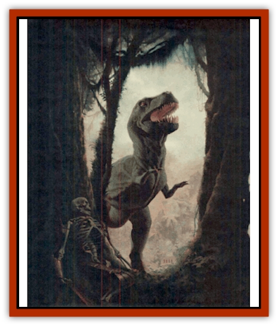
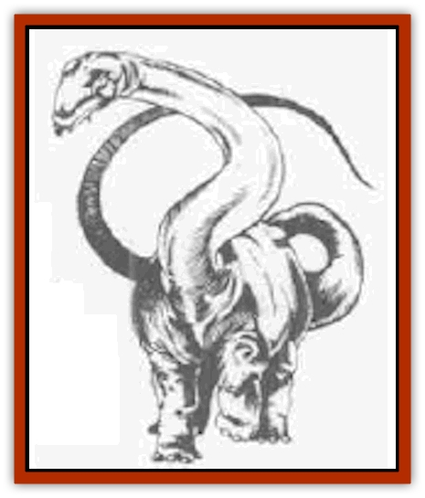
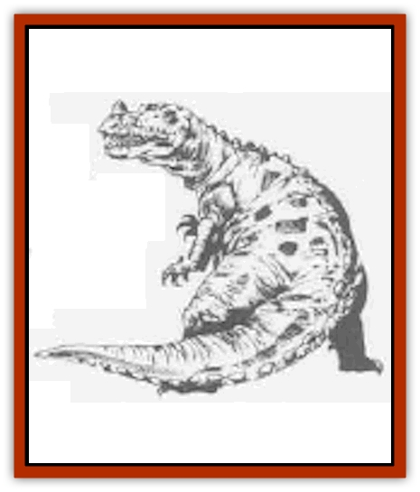
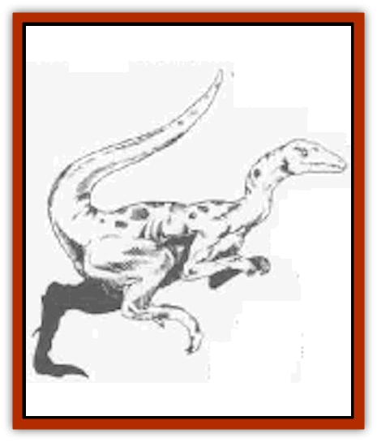
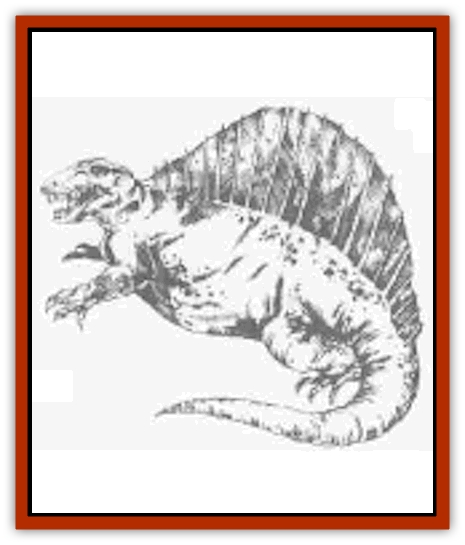
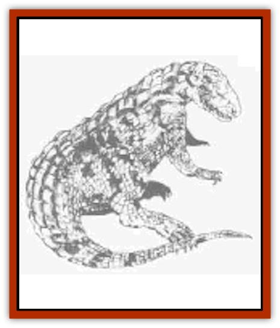
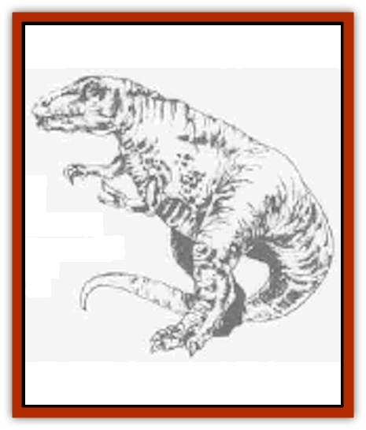

# Dinosaur II

| Statistic | **Allosaurus** | **Brontosaurus** | **Ceratosaurus** | **Compsognathus** | **Dimetrodon** | **Euparkeria** | **Gorgosaurus** |
| --- | --- | --- | --- | --- | --- | --- | --- |
| **Activity Cycle:** | Day | Day | Day | Night | Day | Day | Day |
| **Alignment:** | Neutral | Neutral | Neutral | Neutral | Neutral | Neutral good | Neutral |
| **Armor Class:** | 5 | 5 | 5 | 5 | 4 | 5 | 5 |
| **Climate/Terrain:** | Any land | Swamp | Any land | Any land | Any land | Any land | Any land |
| **Damage/Attack:** | 1d4/1d4/6d4 | 1d6/3d6 | 1d6/1d6/4d4 | 1d3 | 3d4+3 | 1d4+1 | 1d3/1d3/7d4 |
| **Diet:** | Carnivore | Herbivore | Carnivore | Carnivore | Carnivore | None | Carnivore |
| **Frequency:** | Uncommon | Common | Uncommon | Common | Uncommon | Common | Uncommon |
| **Hit Dice:** | 15 | 30 | 8 | 1-1 | 3 to 5 | 1+1 | 13 |
| **Intelligence:** | Non- (0) | Non- (0) | Non- (0) | Non- (0) | Non- (0) | Non- (0) | Non- (0) |
| **Magic Resistance:** | Nil | Nil | Nil | Nil | Nil | Nil | Nil |
| **Morale:** | Steady (12) | Steady (12) | Average (10) | Average (8) | Steady (11) | Average (8) | Steady (11) |
| **Movement:** | 15 | 6 | 15 | 10 | 12, Sw 6 | 15 | 15 |
| **No. Appearing:** | 1-2 | 1-6 | 1-4 | 1-12 | 1-2 | 2-8 | 1-2 |
| **No. of Attacks:** | 3 | 2 | 3 | 1 | 1 | 1 | 3 |
| **Organization:** | Solitary | Solitary | Pack | Pack | Solitary | Pack | Solitary |
| **Size:** | G (40' long) | G (70' long) | H (17' long) | T (1½' long) | L (9' long) | S (3' long) | G (30' long) |
| **Special Attacks:** | Nil | Crush (4d10 or 5d10) | Nil | Surprise (-3) | Nil | Nil | Nil |
| **Special Defenses:** | Nil | Nil | Nil | Nil | Nil | Nil | Nil |
| **THAC0:** | 8 | 5 | 13 | 20 | 3-4 HD: 17 / 5 HD: 15 | 19 | 7 |
| **Treasure:** | Nil | Nil | Nil | Nil | Nil | 4 | Nil |
| **XP Value:** | 9,000 | 22,000 | 650 | 35 | 65-175 | 35 | 5,000 |

## Allosaurus

One of the most vicious of predators, this monster can run across hard ground at great speed. In size, the allosaurus is between its two relatives, the smaller megalosaurus and the larger [[Dinosaur_I|tyrannosaurus rex]]. It weighs about 1½ tons.

The allosaurus has a massive skull, formed of bony plates that give it strength. The design of these plates is such that the head is still light enough to snap quickly at its prey. Besides feeding on the occasional brontosaurus and [[Dinosaur_I|diplodocus]], this "flesh lizard" is known to eat carrion. Few other creatures are foolish enough to fight the allosaurus for a share of its meal.

## Brontosaurus

The "thunder lizard" (also called the apatosaurus) is a 40-ton planteater found near marshes and lakes. The creature spends much of its time in shallow water to support its bulk (and because food is plentiful there), but never moves to deep water because the increase in pressure makes it impossible for the tremendous dinosaur to breathe.

The creature ignores small things, but it is prone to step on anything in its way (causing 4d10 points of damage).

The body of the brontosaur is 65 feet long, but the tiny head is less than two feet long - a man with the same dimensions would stand six feet tall, but have a head only two inches long! The brontosaurus tips the scale at a mere 30 tons - rather light for a sauropod.

The front legs of the brontosaurus are shorter than those in the rear, like all sauropods except the brachiosaurus. This configuration enables sauropods to get up on their back feet to reach the topmost leaves of a tree. The brontosaurus could also use this ability to fight against its principal enemy, the allosaurus. The thunder lizard could tilt itself up on its long back legs, then come crashing down onto its enemy to inflict 5d10 points of damage.

The brontosaurus's tail can be whipped, causine 1d6 points of damage to any foe close enough.

## Ceratosaurus

The ceratosaurus, or "horn lizard", is a carnosaur, related to the allosaurus and tyrannosaurus rex, but smaller. Both heavy (about a ton) and fast, the ceratosaurus can move on all fours or on its hind legs.

This carnivore is unusual in that it has a horn on its nose, but it does not use the horn for attacking - in fact, only males have this horn. (Those who have trouble telling dinosaurs apart have no trouble with the ceritosaurus.) The back of this creature also distinguishes it from other carnosaurs, for a thin line of bony plates runs from the top of the ceratosaurus's head down to the end of its tail, making the dinosaur's back look like a giant saw blade.

Also unlike the larger carnosaurs, the ceratosaurus hunts in packs, and is thus able to bring down creatures much larger than itself.

## Composognathus

This very small carnivorous dinosaur is about the size of a chicken. (In fact, compsognathus is related to the earliest known birds - if it had wings and feathers, it might be a chicken.) These creatures often hunt in groups. Their small size allows them to hide, even in packs, and surprise prey - others suffer -3 penalties to their surprise roll. Attacks at night might occur on sleeping prey, as the compsognathus tends to be nocturnal.

When hunting alone, the compsognathus usually eats small lizards and insects.

## Dimetrodon

The sail-backed dimetrodon is a fierce predator and an example of the mammal-like reptiles. Its large fin works like a solar heater, allowing the dimetrodon to heat up to active temperature hours before its prey. Its ability to swim is questionable but likely. The dimetrodon's alligator-like jaws give it a powerful bite (3d4+3 points of damage), more than making up for its lack of a claw attacks.

## Euparkeria

A small dinosaur, probably ancestor to the larger carnosaurs, such as tyrannosaurus rex and allosaurus, the carnivorous euparkeria is about the size of a small dog.

The euparkeria is found in groups of 2d4, which attack 1-2 figures of small size or a single man-sized if the odds seem to be with the pack. If sufficiently hungry a pack will stalk and attack even a large group of prey, especially of one of the intended victim is wounded.

While the euparkeria normally walks on all fours, if threatened it is able to stand up on its hind legs and run a short distance

## Gorgosaurus

This horrid creature, also known as the albertosaurus, is probably an ancestor of tyrannosaurus rex. It is physically similar but smaller, with a longer-snouted head and more backward-pointing teeth. The gorgosaurus is a fleet, carnivorous dinosaur of very aggressive instincts. It might weigh as much as two tons.

---
## Discovery & Documentation

**Source Publication:** Monstrous Compendium, 1995 Annual, Volume 2 (1995)
**Campaign Setting:** Advanced Dungeons & Dragons 2nd Edition
**Author(s):** Jon Pickens

### Other Creatures Found in This Source Book
   * [[Aboleth_Savant|Aboleth, Savant]]
   * [[Addazahr|Addazahr]]
   * [[Amiq_Rasol|Amiq Rasol]]
   * [[Arch-Shadow|Arch-Shadow]]
   * [[Automaton_Scaladar|Automaton, Scaladar]]
   * [[Automaton_Trobriand's|Automaton, Trobriand's]]
   * [[Bat_Sporebat|Bat, Sporebat]]
   * [[Beetle_Dragon|Beetle, Dragon]]
   * [[Bi-nou|Bi-nou]]
   * [[Boggle|Boggle]]
   * [[Brownie_Dobie|Brownie, Dobie]]
   * [[Brownie_Quickling|Brownie, Quickling]]
   * [[Cat_Crypt|Cat, Crypt]]
   * [[Cat_Great_Cath_Shee|Cat, Great, Cath Shee]]
   * [[Centaur-kin_Dorvesh|Centaur-kin, Dorvesh]]
   * [[Centaur-kin_Gnoat|Centaur-kin, Gnoat]]
   * [[Centaur-kin_Ha'pony|Centaur-kin, Ha'pony]]
   * [[Centaur-kin_Zebranaur|Centaur-kin, Zebranaur]]
   * [[Chronolily|Chronolily]]
   * [[Curst|Curst]]
   * [[Darktentacles|Darktentacles]]
   * [[Dinosaur_Aquatic|Dinosaur, Aquatic]]
   * [[Dinosaur_III|Dinosaur III]]
   * [[Doppelganger_Greater|Doppelganger, Greater]]
   * [[Dragon_Brine|Dragon, Brine]]
   * [[Dragon_Half-|Dragon, Half-]]
   * [[Dragon-kin_Sea_Wyrm|Dragon-kin, Sea Wyrm]]
   * [[Dwarf_Wild|Dwarf, Wild]]
   * [[Ekimmu|Ekimmu]]
   * [[Elemental_Nature|Elemental, Nature]]
   * [[Elf_Winged|Elf, Winged]]
   * [[Fish_Great_Glacier|Fish (Great Glacier)]]
   * [[Fish_Subterranean|Fish, Subterranean]]
   * [[Fish_Toril|Fish (Toril)]]
   * [[Flareater|Flareater]]
   * [[Flumph|Flumph]]
   * [[Froghemoth|Froghemoth]]
   * [[Ghost_Casurua|Ghost, Casurua]]
   * [[Ghost_Ker|Ghost, Ker]]
   * [[Ghul|Ghul]]
   * [[Ghul-Kin|Ghul-Kin]]
   * [[Giant_Half-giant|Giant, Half-giant]]
   * [[Golem_Burning_Man|Golem, Burning Man]]
   * [[Golem_Phantom_Flyer|Golem, Phantom Flyer]]
   * [[Gulguthhydra|Gulguthhydra]]
   * [[Hakeashar|Hakeashar]]
   * [[Horse_Moon-|Horse, Moon-]]
   * [[Human_Dragonslayer|Human, Dragonslayer]]
   * [[Human_Vistana|Human, Vistana]]
   * [[Jellyfish_Giant|Jellyfish, Giant]]
   * [[Kalin|Kalin]]
   * [[Kholiathra|Kholiathra]]
   * [[Laerti|Laerti]]
   * [[Leucrotta_Greater|Leucrotta, Greater]]
   * [[Lich_Suel|Lich, Suel]]
   * [[Lurker_Shadow|Lurker, Shadow]]
   * [[Lycanthrope_Werepanther|Lycanthrope, Werepanther]]
   * [[Lycanthrope_Wereshark|Lycanthrope, Wereshark]]
   * [[Mammal_Herd_II|Mammal, Herd II]]
   * [[Marl|Marl]]
   * [[Meenlock|Meenlock]]
   * [[Mimic_Greater|Mimic, Greater]]
   * [[Mold_II|Mold II]]
   * [[Mummy_Creature|Mummy, Creature]]
   * [[Nyth|Nyth]]
   * [[Ooze_Slime_Jelly_Ghaunadan|Ooze/Slime/Jelly, Ghaunadan]]
   * [[Palimpsest|Palimpsest]]
   * [[Peltast|Peltast]]
   * [[Plant_Dangerous_II|Plant, Dangerous II]]
   * [[Pleistocene_Animal|Pleistocene Animal]]
   * [[Pudding_Subterranean|Pudding, Subterranean]]
   * [[Raggamoffyn|Raggamoffyn]]
   * [[Snake_Serpent|Snake, Serpent]]
   * [[Snake_Serpent_Vine|Snake, Serpent Vine]]
   * [[Sphinx_Draco-|Sphinx, Draco-]]
   * [[Sprite_Seelie_Faerie|Sprite, Seelie Faerie]]
   * [[Sprite_Unseelie_Faerie|Sprite, Unseelie Faerie]]
   * [[Squealer|Squealer]]
   * [[Turtle_Giant|Turtle, Giant]]
   * [[Umpleby|Umpleby]]
   * [[Vizier's_Turban|Vizier's Turban]]
   * [[Wall_Walker|Wall Walker]]
   * [[Webbird|Webbird]]
   * [[Yak-Man|Yak-Man]]
   * [[Zorbo|Zorbo]]
